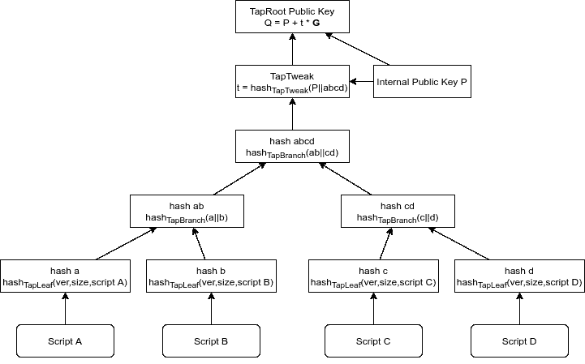

# 比特币交易内部解释

> 原文：<https://medium.com/coinmonks/bitcoin-transaction-internals-explained-8fd6d4e77eaa?source=collection_archive---------5----------------------->


Picture by my daughter, Polina ©

# 介绍

从工程的角度来看，所有的事务最初都有相同的单一结构。所有的比特币交易都有输入和输出。输入是指其他事务的输出。产出管理资金分配。就是这样。资金被分配给每个交易的一个或多个输出，下一个交易的输入花费前一个交易的资金。如果一个输出在另一个花费输出资金的交易中没有相应的输入，那么这就是[未用交易输出(UTXO)](https://en.wikipedia.org/wiki/Unspent_transaction_output) 。UTXO 是所谓的基于 UTXO 的电子货币区块链协议的基石。当创建下一个事务时，它总是有与前一个事务的一些未用完的输出相对应的输入。一个输入恰好对应于前一个事务的一个输出。交易输入所涉及的金额总和必须略大于交易输出的总和。两者之差构成了赢得区块的矿工的交易费。如果比特币接受了新的交易，那么之前交易的相应产出就失效了，资金现在对应于新的 UTXO。因此，任何由共识协议负责的资产总是对应于 UTXO 集，比特币节点跟踪和枚举该集。

为了接受交易并将资金分配给新的产出，比特币需要执行一个脚本。这个脚本在前一个事务的输出和下一个事务的输入之间进行分割。通常，它们被命名为 scriptPubKey 和 scriptSig(或 witness)。这就是诀窍:前一个事务的输出包含第一个脚本部分，该部分包含一些用于认证事务的值；并且下一个事务的输入包含第二脚本部分。只有当第二个脚本部分与第一个脚本部分匹配，并且脚本成功执行时，比特币才可以接受交易。简而言之，scriptPubKey 包含带有公钥的脚本部分(可能还有一些逻辑)，scriptSig 包含签名，签名由公钥验证。事实上，scriptPubKey 和 scriptSig 要么根本不包含密钥或签名，要么通常包含一些更复杂的数据，如公钥散列、秘密散列及其相应的前图像。

现在让我们来看看最流行的事务类型，它们可以用所描述的方式来构造。

# 传统格式

## P2PKH —支付给公钥哈希

支付公钥哈希是比特币中最受欢迎的交易类型，其中 scriptPubKey 包含验证公钥哈希的说明。这种输出可用于提供对应于散列的公钥和匹配公钥的签名:

```
scriptPubKey:
OP_DUP OP_HASH160 <pubKeyHash> OP_EQUALVERIFY OP_CHECKSIGscriptSig:
<sig> <pubKey>
```

P2PKH 交易取代“支付给公钥”交易，其中没有通过在 scriptPubKey 中散列的公钥盲化:

```
scriptPubKey:
<pubKey> OP_CHECKSIGscriptSig:
<sig>
```

比特币钱包支持使用标准比特币地址的支付到公钥哈希交易。该地址是由前缀为“1”的 [Base58Check](https://en.bitcoin.it/wiki/Base58Check_encoding) 编码的 160 位公钥散列。这种交易是将资金从一只手转移到另一只手的常见方式。这种事务和地址目前已被弃用，取而代之的是 SegWit 事务和地址。

## 其他有用的交易类型

使用类似 P2PKH 的[比特币脚本](https://en.bitcoin.it/wiki/Script)操作码，可以构建更复杂的逻辑来控制比特币的转移。

例如，可以创建 MultiSig 输出，这需要两个或更多签名来花费资金。甚至可以利用阈值多重签名逻辑，如 3 选 2 签名:

```
scriptPubKey:
OP_3 <pubKey1> <pubKey2> <pubKey3> OP_2 OP_CHECKMULTISIGscriptSig:
0 <sig1> <sig2>
```

另一个广泛使用的例子是使用 OP_RETURN 操作码的[非消耗性输出。使用这种 scriptPubKey 的交易创建了一个可证明不可描述的输出，任何比特币节点或钱包都会跳过添加到 UTXO 集。它有存储其他任意数据或焚烧比特币的特殊含义。这样的输出永远不会有相应的 scriptSig，因为它永远不会被使用。](https://en.bitcoin.it/wiki/OP_RETURN)

```
scriptPubKey:
OP_RETURN <data>
```

## P2SH —支付给脚本哈希

尽管事实上比特币正是以这种方式允许创建复杂的智能合约，但它被弃用，取而代之的是[支付给脚本哈希(P2SH)交易](https://en.bitcoin.it/wiki/Pay_to_script_hash)，后者在消费前提供更多隐私。与常见的 scriptPubKey/ScriptSig 相比，比特币节点将这种类型的交易视为一种独特的形式，并分两个阶段执行:

1.  用 scriptSig 执行 common scriptPubKey，实际上是对照作为最后一个 scriptSig 元素提供的 redempte 脚本来检查 scriptPubKey 中提供的脚本哈希；
2.  如果这些匹配，则执行兑换脚本

```
scriptPubKey:
OP_HASH160 <scriptHash> OP_EQUALscriptSig:
<scriptParam>… <redeemScript>
```

例如，与先前的 MultiSig 相同将如下所示:

```
scriptPubKey:
OP_HASH160 <multisig_scriptHash> OP_EQUALscriptSig:
0 <sig1> <sig2>
<OP_3 <pubKey1> <pubKey2> <pubKey3> OP_2 OP_CHECKMULTISIG>
```

比特币钱包支持此类交易，使用类似 P2PKH 的带前缀“3”的地址，意味着该地址是由带前缀“3”的 [Base58Check](https://en.bitcoin.it/wiki/Base58Check_encoding) 编码的脚本的 160 位哈希。

# SegWit v0 —隔离证人

[SegWit](https://github.com/bitcoin/bips/blob/master/bip-0141.mediawiki) 是 2017 年激活的比特币软叉。它尤其旨在克服块大小问题和其他问题，如交易延展性，并降低交易费用。隔离见证的想法是将见证数据或简单见证(以前称为 redeemScript)与普通比特币块数据分离。

由于 SegWit 是一个软分叉，遗留的前 SegWit 交易和 SegWit 交易可能会在比特币中同时共存。有两种方法可以告诉比特币节点在精确交易验证期间激活 SegWit 逻辑:

SegWit 版本 0 定义了两种“本地”事务类型:

*   向见证人支付公钥哈希(P2WPKH)
*   支付给见证脚本哈希(P2WSH)

这些交易格式取代了前 SegWit P2PKH 和 P2SH。此外，为了与比特币钱包兼容，定义了两种交易类型，目前尚不支持 SegWit:

*   嵌套在 P2SH 中的 pay-to-Witness-Public-Key-Hash(P2WPKH-P2SH)
*   嵌套在 P2SH 中的 pay-to-Witness-Script-Hash(P2WSH-P2SH)

在新规范中，scriptPubKey 中的本机 SegWit 输出包含两个元素:

*   SegWit 版本:0；
*   见证程序:20 字节的公钥散列或 32 字节的脚本散列。

重要的是，见证程序的大小是区分比特币传输类型的唯一方式:公钥哈希或脚本哈希。同样的原理也适用于钱包使用的 SegWit Bech32 编码地址。

## P2WPKH —支付见证公钥哈希

P2WPKH 见证程序的大小为 20 个字节，包含一个公钥哈希。

对应的 scriptSig 为空，见证恰好包含两个元素:签名和公钥。

见证元素放在执行堆栈上。然后，在堆栈上评估用于 P2PKH 事务的相同脚本，首先导致对照来自见证程序的公钥散列来验证公钥，然后对照公钥和事务来验证签名。

```
scriptPubKey:
0 <pubKeyHash>scriptSig:
-empty-Witness:
<sig> <pubKey>
```

比特币钱包支持使用 [segwit 地址](https://github.com/bitcoin/bips/blob/master/bip-0173.mediawiki)的 P2WPKH 交易，见证程序由 Bech32 编码，并以“BC”HRP 前缀为前缀，与编码部分用“1”隔开。对于 P2WPKH，它是

```
bc1||<Bech32(<0>||<PubKeyHash>)>
```

## P2WPKH-P2SH —向嵌套在 P2SH 中的见证公钥哈希付款

与 P2WPKH 相同，但

*   scriptPubKey 包含标准的 P2SH 脚本
*   scriptSig 包含 0 和 20 字节的公钥哈希作为单个元素
*   对应的见证元素与普通 P2WPKH 相同

单个 scriptSig 元素由 160 位哈希进行哈希处理，应该等于 scriptPubKey 中的 scriptHash。

```
scriptPubKey:
OP_HASH160 <scriptHash> OP_EQUALscriptSig:
<0 <pubKeyHash>>Witness:
<sig> <pubKey>
```

这种见证事务(与 P2WSH-P2SH 一起)用于从不兼容 SegWit 的 wallet 发送 SegWit 事务。

## P2WSH —支付给见证脚本哈希

见证程序的大小为 32 字节，包含一个脚本哈希。哈希算法是 double Sha256，而不是通常的比特币 160 位哈希。

对应的 scriptSig 为空，见证包含脚本和脚本本身的参数，就像 P2SH 的 scriptSig 一样。

与 P2SH 交易处理类似，比特币节点首先加载一个通用 P2SH 脚本，以验证脚本哈希是否与来自最后一个见证元素的脚本相匹配。然后脚本本身执行，见证元素(除了最后一个元素)放在执行堆栈上。

```
scriptPubKey:
0 <scriptHash>scriptSig:
-empty-Witness:
<scriptParam>… <redeemScript>
```

让我们以 MultiSig 交易为例:

```
scriptPubKey:
0 <multisig_scriptHash>scriptSig:
-empty-Witness:
0 <sig1> <sig2>
<OP_3 <pubKey1> <pubKey2> <pubKey3> OP_2 OP_CHECKMULTISIG>
```

由于 P2WPKH 比特币钱包支持使用 SegWit 地址的 P2WSH 交易:

```
bc1||<Bech32(<0>||<scriptHash>)>.
```

P2WPKH 和 P2WSH 地址通过地址内编码的哈希长度来区分。

## P2WSH -P2SH —向嵌套在 P2SH 中的见证脚本哈希付款

与 P2WSH 相同，但

*   scriptPubKey 包含标准的 P2SH 脚本和
*   scriptSig 包含 0 和 32 字节的脚本哈希作为单个元素
*   对应的见证元素与普通 P2WSH 相同

单个 scriptSig 元素由 160 位哈希进行哈希处理，应该等于 scriptPubKey 中的 scriptHash。

```
scriptPubKey:
OP_HASH160 <scriptHash> OP_EQUALscriptSig:
<0 <redeemScriptHash>>Witness:
<scriptParam>… <redeemScript>
```

让我们再次以 MultiSig 交易为例:

```
scriptPubKey:
OP_HASH160 <scriptHash> OP_EQUALscriptSig:
<0 <multisig_scriptHash>>Witness:
0 <sig1> <sig2>
<OP_3 <pubKey1> <pubKey2> <pubKey3> OP_2 OP_CHECKMULTISIG>
```

# SegWit v1 —主根

TapRoot 是 2021 年推出的比特币的最新更新。它包含一些针对比特币交易(但不仅限于交易)的重大改进，例如

*   [施诺尔签名](https://github.com/bitcoin/bips/blob/master/bip-0340.mediawiki)
*   [TapScript](https://github.com/bitcoin/bips/blob/master/bip-0342) ，引入了比特币脚本操作码的一些变化
*   [新的隔离见证格式和消费路径编码](https://github.com/bitcoin/bips/blob/master/bip-0341.mediawiki)

公开的关于 Schnorr 签名方案的信息很多。就本条而言，至关重要的是:

*   Schorr 签名允许将基于同一消息的多个公钥和签名聚合成单个公钥和签名。生成的公钥和签名与公共公钥和签名无法区分。换句话说，第三方观察者无法区分由单个签名人用单个密钥对创建的签名和由多个签名人用他们各自的密钥聚合和创建的签名。事实上，任何人都可以使用聚合公钥来验证聚合签名，聚合公钥在顺序上与普通公钥没有区别。TapRoot 使用的 MuSig 签名方案利用了 Schnorr 签名的这一特性。
*   容易注入到 Schnorr 签名中的适配器或调整允许将附加信息编码到签名中。TapTweak 作为 TapRoot 的核心机制之一，利用这一点来屏蔽由 Merkle 树中组织的脚本编码的高级事务逻辑的 TapRoot 公钥存在性。

与以前的比特币交易格式相反，Taproot 输出不区分公钥花费路径和脚本花费路径。它总是像一个公钥路径:scriptPubKey 包含一个由两个元素组成的见证程序:

*   SegWit 版本:1；
*   32 字节见证程序，根据 [BIP340](https://github.com/bitcoin/bips/blob/master/bip-0340.mediawiki#design) 规则编码的主根公钥。

因此，任何直根交易都是支付到直根(P2TR)。比特币钱包支持 P2TR 交易，使用独立于消费路径的更新的 SegWit 地址:

```
bc1||<Bech32m(<1>||<PubKey>)
```

地址格式的更新是关于更新编码 [Bech32m](https://github.com/bitcoin/bips/blob/master/bip-0350.mediawiki) 。

有许多合法的方式来使用直根产品，如下所述。

## 公钥路径开销

如果只有一方控制主根输出，则可以使用公钥花费路径。这是花费主根产出的最简单的方法。

公钥花费路径的另一个例子是所有控制方的相互协作协议。在这种情况下，所有各方使用他们的独立私钥协作创建事务聚合签名，这些私钥先前用于创建在输出的见证程序中定义的聚合公钥。

见证应该包含一个元素，它是对来自见证程序的公钥有效的事务签名

```
scriptPubKey:
1 <pubKey>scriptSig:
-empty-Witness:
<sig>
```

## 脚本路径开销

不考虑使用公钥路径花费 P2TR 输出的可能性，它可能有另一种花费方式:脚本路径。当合作消费是不可能的时候，它可以作为一个后备方案。Merkle 树中组织的单个脚本或多个脚本可以用于涵盖许多不同的场景。

使用相同的 UTXO 的 scriptPubKey，见证看起来如下:

```
scriptPubKey:
1 <pubKey>scriptSig:
-empty-Witness:
<script> <controlBlock>
```

控制块的结构如下:

*   第一个字节编码一个叶版本(总是偶数)和抽头调整奇偶标志(见 [BIP-340](https://github.com/bitcoin/bips/blob/master/bip-0340.mediawiki) 的`has_even_y(P)`函数定义):

```
leafVersion = controlBlock[0] & 0xfe
tweakParity = controlBlock[0] & 0x1
```

> 目前的比特币实现允许唯一唯一的叶子版本:`0xc0`；

*   接下来的 32 个字节编码内部公钥`P`；
*   所有剩余的数据都是 Merkle 树中脚本的路径

为了创建或解释控制块，TapRoot 规范运行所谓的标记散列函数

```
hash_{tag}(x) = Sha256(Sha256(tag)||Sha256(tag)||x)
```

下图显示了脚本 Merkle 树的示意性示例:



Taproot transaction script Merkle tree example

让我们从图片上看一下`Script B`的验证过程。

1.  计算`Script B`的 TapLeaf 哈希:

```
b = hash_{TapLeaf}(0xc0||compactSize(Script B)||Script B)
```

2.遍历 Merkle 树从叶 b 到根的分支`abcd`:Merkle 树路径中每接下来的 32 个字节是先前计算的节点散列的邻居节点散列。

*   这里，前 32 个字节是`hash a`的值，它是本例中`Script B`或`hash b`的散列的邻居。然后

```
ab = hash_{TapBranch}(a||b)
```

3.注意，每个`hash_{TapBranch}(…)`下的连接顺序取决于`hash a`和`hash b`的词典比较。因此，它们必须按照词典的排序顺序连接起来。

*   后面 32 个字节是 ab 的邻居，也就是`hash cd`。然后散列

```
abcd = hash_{TapBranch}(ab||cd)
```

这是 Merkle 分支的根。不要忘记词典的顺序。

4.现在是计算 TapTweak 的时候了，该 tap tweak 用于根据前面输出的公钥`Q`验证整个构造。

```
t = hash_{TapTweak}(P||abcd)
```

5.最后一步是将 TapTweak 应用到内部公钥`P`。结果应该是公钥`Q = P + t·G`。如果不是这样，那么就会出错，并且 TapRoot 事务无效，并且`Script B`永远不会执行。

> *加入 Coinmonks* [*电报频道*](https://t.me/coincodecap) *和* [*Youtube 频道*](https://www.youtube.com/c/coinmonks/videos) *了解加密交易和投资*

# 另外，阅读

*   [Bookmap 评论](https://coincodecap.com/bookmap-review-2021-best-trading-software) | [美国 5 大最佳加密交易所](https://coincodecap.com/crypto-exchange-usa)
*   最佳加密[硬件钱包](/coinmonks/hardware-wallets-dfa1211730c6) | [Bitbns 评论](/coinmonks/bitbns-review-38256a07e161)
*   [新加坡十大最佳加密交易所](https://coincodecap.com/crypto-exchange-in-singapore) | [收购 AXS](https://coincodecap.com/buy-axs-token)
*   [红狗赌场评论](https://coincodecap.com/red-dog-casino-review) | [Swyftx 评论](https://coincodecap.com/swyftx-review) | [CoinGate 评论](https://coincodecap.com/coingate-review)
*   [投资印度的最佳加密软件](https://coincodecap.com/best-crypto-to-invest-in-india-in-2021)|[WazirX P2P](https://coincodecap.com/wazirx-p2p)|[Hi Dollar Review](https://coincodecap.com/hi-dollar-review)