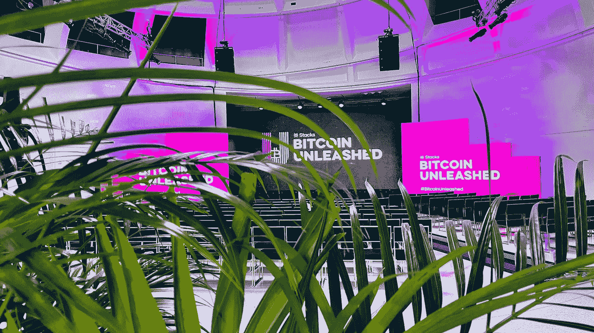

# 比特币被释放。

> 原文：<https://medium.com/coinmonks/bitcoin-unleashed-d10bb7bdeeff?source=collection_archive---------57----------------------->

Bitcoin Unleashed 2022 — Miami, FL

【2022 年 4 月

随着春季的开始，四月的第一周通常会有大量的变化。然而，今年与以往不同，它的第一天可能会成为多个行业和 3 万多人最具变革性和洞察力的一周——至少对我来说是如此。本周以 4 月 5 日至 6 日举行的[比特币解放](https://bitcoinunleashed.org/)大会开始，接下来将是在佛罗里达州迈阿密举行的[比特币 2022](https://b.tc/conference/) 大会。

《比特币解放》挤满了杰出的演讲者，以及以比特币为中心的节目，从主题演讲和小组讨论到现场演示和技术研讨会，涉及从分散金融(DeFi)到游戏(GameFi)、不可替代代币(NFT)和加密城市(CityCoins)、DAOs、基础设施改善、堆叠、风险投资(+ [比特币奥德赛](https://www.okcoin.com/bitcoinodyssey))、&等等。

活动期间的对话分为四个核心主题:

1.  *在筹码上省钱和赚钱(STX)*
2.  *投资&在堆栈上启动(STX)*
3.  *在堆栈上花费和共享(STX)*
4.  *交易&栈上融资(STX)*

该活动有助于为任何人提供一个令人难以置信的协作环境，无论是行业、教育还是生态系统，都有能力走到一起，为比特币创新的未来奠定基础。仅仅过了几天，我还在回味那两天的兴奋和创新。幸运的是，我不仅有幸在活动期间发言(“[a Odyssey Begins:Cash to Create on bit coin](https://youtu.be/0ru-vWH34bg)”)，还有幸主持了整整两天的活动——这两天我都很感激，并充当了灵感的迷你跳板。

如果你正在寻找灵感或指导，从哪里开始你的 web3 之旅或建立在比特币& [栈](https://stacks.co/)上，看看这个[播放列表](https://youtube.com/playlist?list=PLXS8JJHIn4nEDFYbA5jRoCzAECuS993uy)就知道了，它包含了活动的大部分内容。

Bitcoin Unleashed — On Youtube

> 加入 Coinmonks [电报频道](https://t.me/coincodecap)和 [Youtube 频道](https://www.youtube.com/c/coinmonks/videos)了解加密交易和投资

# 另外，阅读

*   [最佳网上赌场](https://coincodecap.com/best-online-casinos) | [币安评论](/coinmonks/binance-review-ee10d3bf3b6e) | [BitMEX 评论](https://coincodecap.com/bitmex-review)
*   [麻雀交换评论](https://coincodecap.com/sparrow-exchange-review) | [纳什交换评论](https://coincodecap.com/nash-exchange-review)
*   [美国最佳加密交易机器人](https://coincodecap.com/crypto-trading-bots-in-the-us) | [经常性回顾](https://coincodecap.com/changelly-review)
*   [在印度利用加密套利赚取被动收入](https://coincodecap.com/crypto-arbitrage-in-india)
*   [Godex.io 审核](/coinmonks/godex-io-review-7366086519fb) | [邀请审核](/coinmonks/invity-review-70f3030c0502) | [BitForex 审核](https://coincodecap.com/bitforex-review)
*   [最佳比特币保证金交易](/coinmonks/bitcoin-margin-trading-exchange-bcbfcbf7b8e3) | [萝莉点评](/coinmonks/lolli-review-e6ddc7895ad8) | [比特币保证金交易](https://coincodecap.com/bityard-margin-trading)