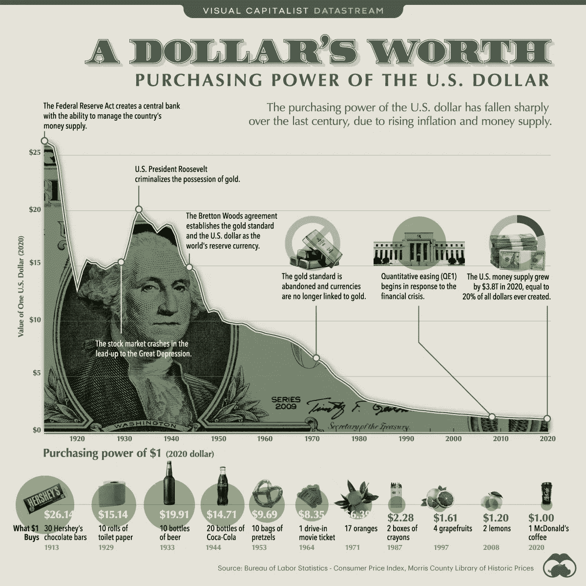
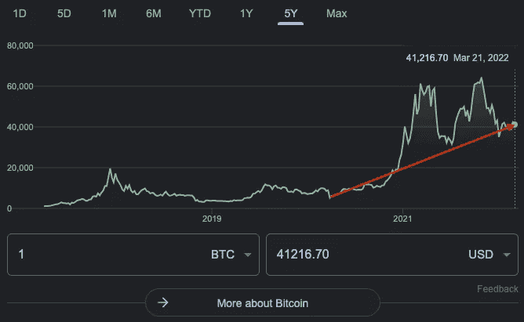
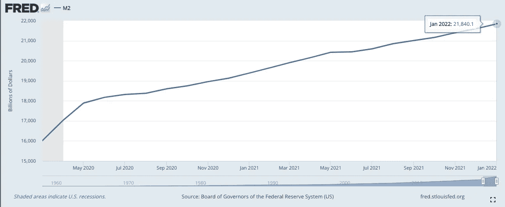

# 比特币的波动性和你的小企业

> 原文：<https://medium.com/coinmonks/bitcoin-volatility-and-your-small-business-99533ebf24fb?source=collection_archive---------31----------------------->

我有一个坦白，我是一个比特币极大主义者。那是什么意思？这意味着，我认为所有法定货币，如美元和所有其他加密货币，有朝一日将价值为零，而比特币将成为点对点交易价值的真正赢家。我妻子将比特币最大化者定义为“一个不会闭嘴谈论比特币的人。”这两个定义并不相互排斥。

在我看来，**现在**永远是用你的法定美元货币【字面意思是“法令规定的货币”】交易比特币的最佳时机，比特币非常不稳定，但非常稀缺。

但是，一个仅仅是为了收支平衡的小企业为什么要从美元转向比特币呢？

## 菲亚特是可预测的，这并不好

A chart of a dollar’s value over time

> 一美元价值随时间变化的图表**来源:**[https://www . visual capitalist . com/purchasing-power-of-the-u-s-dollar-over-time/](https://www.visualcapitalist.com/purchasing-power-of-the-u-s-dollar-over-time/)

1.  每一种法定货币都被稀释为零。掌管金钱的人常常无法抑制想赚更多钱的冲动。创造出来的货币和其他所有项目一样遵循同样的规律:**边际收益递减**。也就是说，随着钱赚得越来越多，它变得越来越没有价值和意义。一杯淡水在沙漠中是救命的，当你在湖中踩水时，它会危及你的生命。美元正变得像湖中央的淡水一样有意义:

> 一项对 775 种法定货币的研究表明，法定货币的平均寿命为 27 年，一些法定货币在一个月后崩溃，而另一些法定货币则存活了数百年【**来源**:[https://www . business insider . com/the-failure-of-money-2012-9 #:~:text = Fiat % 20 currency % 20 has % 20 wandered % 20 in，and % 20 others % 20 survivor % 20 centuries](https://www.businessinsider.com/the-failure-of-money-2012-9#:~:text=Fiat%20currency%20has%20reigned%20in,and%20others%20surviving%20for%20centuries)。]

我们的货币——美元——在 1971 年，也就是 52 年前成为“法定货币”。虽然由于美元目前作为世界储备货币的角色，美元的地位略有不同，但这一角色正受到中国和俄罗斯等国家的威胁，这些国家试图用不同形式的货币购买石油。[ **来源**:[https://www . wsj . com/articles/Saudi-Arabia-consides-accepting-RMB-而不是-美元-用于中国石油销售-11647351541](https://www.wsj.com/articles/saudi-arabia-considers-accepting-yuan-instead-of-dollars-for-chinese-oil-sales-11647351541) ]

2.货币供应被稀释了，这对你的小企业很少有好处。自疫情开始以来颁布的 5.8 万亿美元中，你的小企业看到了多少？假设美国有 3170 万家小企业，每个小企业本来可以获得 18.3 万美元。[ **来源:**[https://cdn . advocation . SBA . gov/WP-content/uploads/2020/11/05122043/Small-Business-FAQ-2020 . pdf](https://cdn.advocacy.sba.gov/wp-content/uploads/2020/11/05122043/Small-Business-FAQ-2020.pdf)]即使每个企业只有 8 万，其中 10 万用于道路、个人和其他项目，你的企业也可以使用这些钱，远远超过那些得到这些钱的人，例如全球疫情创造的 24%的美国新百万富翁。[ **来源**:[https://www . investopedia . com/news/number-millionaires-continues-increase/]](https://www.investopedia.com/news/number-millionaires-continues-increase/%5D)对于许多小企业主来说，他们的梦想不得不结束，因为百万富翁到处涌现，因为金钱的创造者不喜欢小企业。

## 比特币不稳定，但可以预测:

1.  **比特币价格波动**。自全球新冠肺炎疫情开始以来，比特币的价格一直在 3000 至 60000 英镑之间。波动性是可怕的，如果我说拥有比特币没有风险，那我是在撒谎。从政府试图关闭比特币，到一些“新的和改进的”东西出现，到全球“系统”崩溃到一个没有互联网或货币的地方。我不认为这些可能性会让我远离比特币领域。总的来说，在一个足够长的时间里，比特币的美元价格逐年大幅上涨。挑战在于将你的时间范围扩大到足够“缩小”，并收获这种波动的回报。

Bitcoin Price Movement from beginning of pandemic to now

> 从新冠肺炎开始到 3/21/22(作者日期)的价格变动[ **来源**:谷歌财经 5 年图表]

1.  **比特币不能以损害你的业务的方式被稀释**。虽然比特币的价格波动很大，但系统背后的规则却不一样。不需要什么研究，我就可以告诉你未来 100 万年每分钟存在的比特币数量。永远只会有 2100 万个比特币。截至发稿时，大约有 1900 万个比特币被挖掘出来，还有 200 万个可用，并将按照每 10 分钟 6.25 个的固定时间表释放(很快就会是每 10 分钟 3.125 个，然后是 1.5625 个，然后是 0.78125 个，等等)。由于比特币遵循减半时间表),相比之下，美元已经从 2020 年 3 月的 16 万亿美元扩张到 2022 年 1 月的 21.8 万亿美元，这意味着每秒增加 **10 万美元**。

M2 Money Supply (Available money in checking/savings accounts) from beginning of pandemic to now

> 从新冠肺炎年初到 2012 年 1 月 1 日(最近的数据点)的 M2 货币供应量[ **来源**:[https://fred.stlouisfed.org/series/M2SL】](https://fred.stlouisfed.org/series/M2SL%5D)

每 10 分钟就有 6.125 个比特币发行，6000 万美元发行。供求定律表明，随着供给上升，需求下降，价格在那个交叉点相遇。美元的需求(无限扩大)相对于比特币的供应(完全稀缺)将会贬值，即使价格发现目前并不完美。

你可能声称你的生意**做/卖 X，而不是投资神奇的互联网货币**，但是我向你保证，如果你坚持把美元作为你的主要和唯一的货币，**你的生意将慢慢地无法做 X，因为你的钱的价值衰减不是因为你自己的过错**。不要把所有的鸡蛋放在一个篮子里。开始接受比特币，今天很少有人会用它支付，但即使你只有 0.01%的交易收到比特币，你获得的比特币也不会被稀释，如果它仍然是数字空间的主导货币形式(我个人对此押注很多)，你将能够继续支付员工，创造价值，并继续做生意，即使美元因为稀释而变得一文不值。

开始接受比特币就像在手机上创建一个钱包(2 分钟的过程)并在你的商店里放一个牌子，上面写着“此处接受比特币”一样简单成本几乎为零，风险很低，回报，我相信，会很大。

你甚至可以在这里注册罢工并获得 10 美元:[https://invite.strike.me/FRRFM0](https://invite.strike.me/FRRFM0)(注意这是一个附属链接)

你阅读这篇文章所花的时间占世界上增加的不到 5 个比特币和超过 3000 万美元。

*你更信任哪个系统？*

> 加入 Coinmonks [电报频道](https://t.me/coincodecap)和 [Youtube 频道](https://www.youtube.com/c/coinmonks/videos)了解加密交易和投资

# 另外，阅读

*   [CBET 点评](https://coincodecap.com/cbet-casino-review) | [库币 vs 比特币基地](https://coincodecap.com/kucoin-vs-coinbase)
*   [折叠 App 审核](https://coincodecap.com/fold-app-review) | [Kucoin 交易机器人](/coinmonks/kucoin-trading-bot-automate-your-trades-8cf0ca2138e0) | [Probit 审核](https://coincodecap.com/probit-review)
*   [如何匿名购买比特币](https://coincodecap.com/buy-bitcoin-anonymously) | [比特币现金钱包](https://coincodecap.com/bitcoin-cash-wallets)
*   [币安 vs FTX](https://coincodecap.com/binance-vs-ftx) | [最佳(索尔)索拉纳钱包](https://coincodecap.com/solana-wallets)