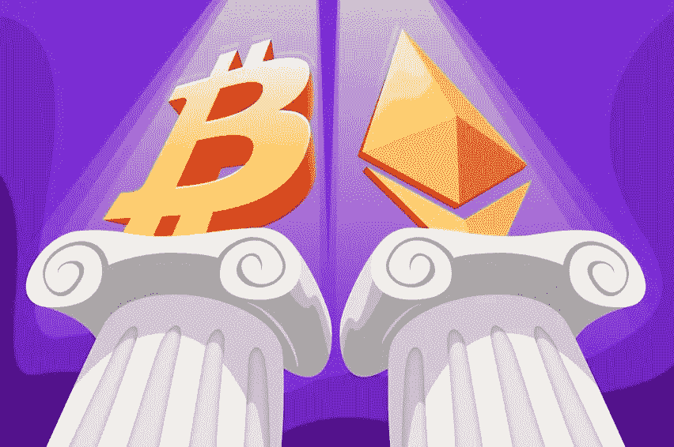

# 比特币 VS 以太坊，神 VS 王

> 原文：<https://medium.com/coinmonks/bitcoin-vs-ethereum-the-god-vs-the-king-63a376045daf?source=collection_archive---------48----------------------->

## 我们有比特币 maxi 和以太坊 maxi，都认为他们的区块链和密码是最好的。但是哪一个，或者说哪一个更好呢？在这篇文章中，我们将讨论两者的一些事实，我们将权衡哪一个实际上更好。

# 两个链的摘要

## 比特币

首先，比特币。中本聪创造了一个健全的货币，完全分散，点对点，数字现金系统。他通过在不可改变的证明和验证的基础上制造比特币，消除了交易时通常需要的信任。网络中的每一个成员都必须接受每一笔交易，这样每个人都可以共享同一个账本。事务在块内部，矿工解决困难的数学问题来验证这些块。这是工作证明系统。随着时间的推移，难度增加，需要更多的计算能力。随着时间的推移，这将始终保持网络安全。中本聪创造了一些让 BTC 非常有价值的东西(不包括它背后所有其他惊人的技术) ***数字稀缺*** 。除了数字稀缺之外，BTC 也是绝对稀缺的 T4，这是第一个绝对稀缺的流动性商品。黄金是稀缺的，但当黄金价格上涨时，它会激励人们以更大的动力和更多的设备来开采更多的黄金。比特币的供应量是固定的，永远不会超过 2100 万个比特币。这可能是一个诅咒，也可能是一个祝福，取决于你的观点。从矿工的角度来看，这并不好，因为随着时间的推移，他们的报酬会下降，而难度会不断增加。但是，对于买家和持有者来说，这是惊人的，固定供应永远不会使其膨胀，当大多数比特币被开采和持有时，它基本上只会随着时间的推移而上涨。保持比特币网络的安全性和可验证性是每个人都可以实现的。比特币是完全公开透明的。每个人都能够在任何计算机上运行完整的节点，并验证每个硬币的供应和有效性。编写新的升级或变更的开发人员小组不认可他们自己的想法。节点共同决定它们是否运行新的更新。这使得比特币有别于许多其他链条。根据你所测量的价格数据，比特币已经上涨了大约 400，000，000%,这使得比特币成为有史以来增长最快的资产。现在让我们谈谈 ETH…

## 以太坊

以太坊是作为比特币的替代品而产生的，其理念和未来与比特币完全不同。如果比特币是一种货币和价值储存手段，以太坊可以更好地被视为允许人们执行金融智能合同的区块链。以太坊是许多使用本地货币以太支付交易费用的项目的所在地。以太坊区块链的链条上运行着复杂且大量的智能合约。ETH 的开发者所做的所有决定都是以增加复杂性和失去真正的去中心化为代价的。真正去中心化的丧失带来了明显的好处，灵活性。以太坊的灵活性是惊人的，可以有这么多不同类型的项目建立在链条之上。每个人都可以用自己的想法做一个 DeFi 项目，为以太坊生态圈创造惊人的价值。每天我都看到令人惊叹的新项目被创造出来，其中一些可能在未来仍然存在，因为它们解决了实际问题。可悲的是，由于不同的意识形态，以太坊的货币供应在其生命周期中一直在变化。这并没有使它听起来像钱，这就是为什么我认为它不应该被用作价值储存。它更应该被用作它想要成为的平台。以太坊的总供应量不好核实，因为网络的一些成员计算的不一样。最重要的是，运行一个节点是很昂贵的，所以你将不得不依靠其他人来验证硬币和供应。新想法的升级过程和实现主要掌握在一小群开发人员手中。目前，ETH 仍然是工作验证，但几年后他们计划转向利益验证。这将使它更加分散和不安全。他们也有稳定的积分运行在他们的区块链之上，这也增加了连锁的中心化，但我会在另一篇文章中对此进行更多的讨论。在我看来，以太坊是 DeFi 的最佳平台。与提供“相同”产品的其他连锁店和从事项目的大多数开发人员相比，它有很长的正常运行时间。如果你正在寻找好的 DeFi，你不必看其他连锁店，因为以太坊是这个地方。

# **对比两个**

Source: BAKKT

比特币是去中心化的健全货币。以太坊是一个有很多金融应用的平台。你可以清楚地看到，网络是不可比的，因为它们背后有不同的意识形态和技术。以太坊和其上托管的项目是对未来的伟大投资，就像比特币一样。以太坊比比特币更灵活，变化也更快。比特币具有真正的去中心化、不合时宜的安全性以及固定的货币政策。我认为人们不应该抛弃这个或那个。以太坊的存在是为了补充比特币，而不是与之竞争。比特币是对以太坊的补充。如果你想在两者之间做出选择，你需要看看锁链后面的意识形态以及你感兴趣的是什么。

> 加入 Coinmonks [电报频道](https://t.me/coincodecap)和 [Youtube 频道](https://www.youtube.com/c/coinmonks/videos)了解加密交易和投资

# 另外，阅读

*   [最佳密码交换平台](https://coincodecap.com/best-crypto-swap-platforms) | [最佳密码交易所](https://coincodecap.com/crypto-exchange)
*   [购买比特币印度](/coinmonks/buy-bitcoin-in-india-feb50ddfef94) | [Pionex 评论](/coinmonks/pionex-review-exchange-with-crypto-trading-bot-1e459d0191ea) | [加密交易机器人](/coinmonks/crypto-trading-bot-c2ffce8acb2a)
*   [n rave ZERO Review](/coinmonks/ngrave-zero-review-c465cf8307fc)|[phe MEX Review](/coinmonks/phemex-review-4cfba0b49e28)|[PrimeXBT Review](/coinmonks/primexbt-review-88e0815be858)
*   最佳[区块链分析](https://bitquery.io/blog/best-blockchain-analysis-tools-and-software)工具| [赚比特币](/coinmonks/earn-bitcoin-6e8bd3c592d9)
*   [Cloudbet 赌场评论](https://coincodecap.com/cloudbet-casino-review) | [点火赌场评论](https://coincodecap.com/ignition-casino-review)
*   [加密套利](/coinmonks/crypto-arbitrage-guide-how-to-make-money-as-a-beginner-62bfe5c868f6)指南| [如何做空比特币](/coinmonks/how-to-short-bitcoin-568a2d0b4ae5)