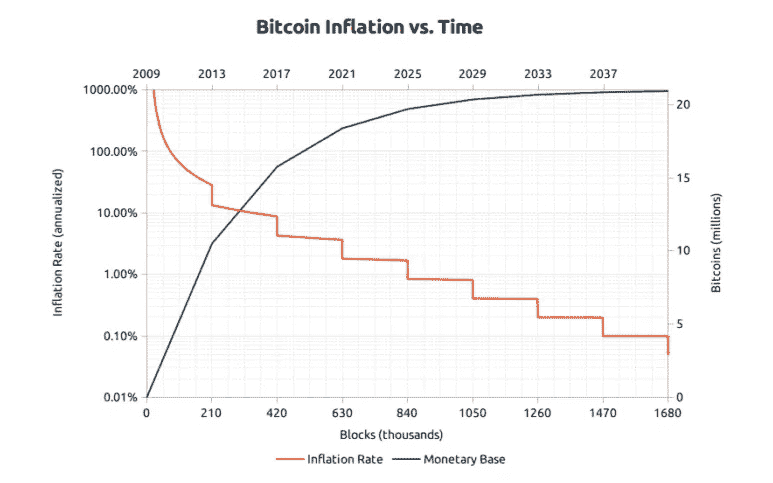

# 比特币 vs 黄金

> 原文：<https://medium.com/coinmonks/bitcoin-vs-gold-57eafb8d5f9c?source=collection_archive---------29----------------------->

首先，我想说，感谢所有订阅我的媒体频道和阅读我的帖子的人。我会尽我所能提供价值，为你写有用的文章。

今天的文章将对被称为“数字黄金”的比特币和已经存在了数千年的实物黄金进行比较。

> 加入 Coinmonks [电报集团](https://t.me/joinchat/Trz8jaxd6xEsBI4p)，了解加密交易和投资

**金色**

自从黄金被发现以来，它就成了美丽、力量和成就的象征。除了黄金的美丽，它也是世界上使用最多的金属之一。黄金被用作电导体，具有极强的延展性，这反过来允许黄金被捣碎、成型而不断裂，并且它不会失去光泽或氧化。

由于黄金在市场上存在了数千年，它确实起到了交换媒介的作用，并往往随着时间的推移相对较好地保持他的价值(价值储存)。当衰退即将到来时，它通常表现更好，因为投资者从风险较高的投资转向另类/更安全的投资——在低迷的市场中保持其价值——而黄金就扮演了这些角色之一。有些人可能会说，黄金价格是由同等重量的投机和供求驱动的。事实上，黄金已经在经济不确定时期证明了其价值，这使其对投资者具有吸引力，尤其是那些以财富保值为目标的投资者。

尽管人们普遍认为，那些投资黄金的人，主要是为了保护他们的财富，如果我们看看下面的 100 年图表，我会不同意这种说法，并重新考虑这个观点。

Gold price chart 1915–2022

对于在 20 世纪 30 年代投资黄金的人来说，如果他们目睹了他们的财富在 20 世纪 70 年代损失了 65 %,可能会对黄金产生相反的看法，黄金被认为是财富保护的主要资产。我们可以看到，整体趋势是上涨的，然而和其他商品一样，黄金也有自己的周期，建议谨慎考虑投资组合配置。

我对黄金的另一个问题是其稀缺性，仍有大量黄金可供开采，随着价格飙升，矿工可能会加大开采力度，这将导致供应增加，从而降低价格。目前黄金供应的年平均增长率约为 1-2%。

**比特币**

比特币是作为一种数字货币而产生的，它的运行不需要银行或政府等第三方的控制。值可以对等发送，因为它依赖于加密技术。多年来，比特币的叙事从电子现金系统转变为价值储存手段，即所谓的“数字黄金”。随着越来越多的机构采用比特币，并由于其稀缺性(只有 2100 万枚硬币被开采)，比特币价格在 2021 年 11 月达到近 69000 美元，市值超过 1 万亿美元。

当然，比特币没有黄金的历史记录，只有 13 年左右的历史。尽管是一种高度不稳定的资产，仍然让一些大投资者远离它的第一个原因是，自其存在以来，它远远超过了黄金和标准普尔 500 指数。见下表，标准普尔 500 10 年投资回报率为+277 %，然而，与 10 年比特币投资回报率+437，171 %相比，这一表现相形见绌。

比特币的通胀率目前约为 1.69 %。2024 年，当下一个减半发生时，通货膨胀率将进一步下降。

截至市值，比特币 vs 黄金，黄金的市值约为 12 万亿美元，而截至 06.05.2022 的比特币的市值仅为 5650 亿美元。看这个公制比特币看起来极其便宜。如果“数字黄金”的说法被证明是正确的，并被广泛采用，比特币在未来 10—20 年有很大的增长空间。

黄金已经证明经得起时间的考验，而考虑到当前的经济和政治形势，黄金的失败是没有机会的。尽管比特币自诞生以来的表现远超黄金，但它的确有更高的波动性，你需要为此做好准备。黄金的波动性大约是比特币的五分之一。因此，如果你更加保守，黄金可能会在你的投资组合中占据更高的比重。

比特币仍然伴随着更高的风险，也可能带来更高的回报。时间的考验仍有待证明，“数字黄金”的故事需要上演。我不认为政府或监管会对比特币构成很大威胁。有时让我夜不能寐的是未来的技术进步，它们可能会以某种方式破解密码…

综上所述，这两种资产都有其优点，或缺点。就我个人而言，我在投资组合中增加了比特币的权重，因为我已经为过山车和其他可能出现的风险做好了准备。我相信比特币的未来，以及区块链或加密货币带来的技术进步。

免责声明:我必须警告你，有些观点可能是我个人的偏见，但是我会尽我所能为你提供关于特定主题的客观观点。我不是理财顾问，所有文章只会有严格的教育目的。