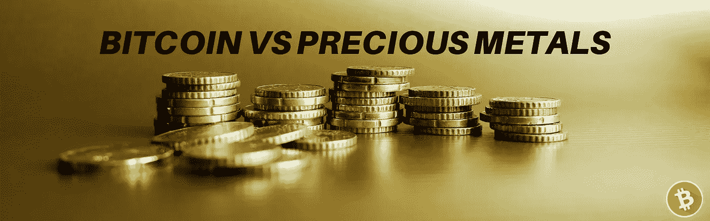
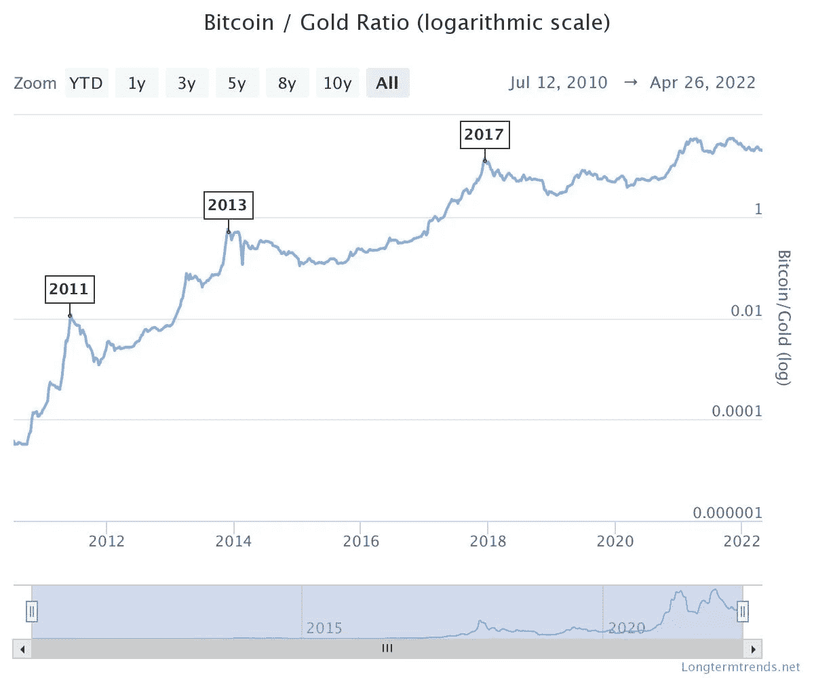

# 比特币 vs 贵金属

> 原文：<https://medium.com/coinmonks/bitcoin-vs-precious-metals-5c462866cea8?source=collection_archive---------24----------------------->

## 投资论文

在蓝色的角落里是一种闪亮的淡黄色，美观的岩石，具有很高的延展性，能够抵抗大多数酸，并且导电和导热非常好…

**黄金**需要耗费大量资源才能开采，而[的地上](https://en.wikipedia.org/wiki/Gold)黄金 20 万吨多一点，它很稀有，可以作为一个极好的*价值储存库*。如今，40%的黄金用于投资目的。

在红色角落，或者更确切地说是橙色角落，是一个看不见的物体*，*，它没有任何物理属性，因为它不存在于物理世界，而是存在于由数十亿美元的硬件和基础设施构成的虚拟世界*——包括现在就在你口袋里的一捆芯片和塑料。*

*因此，**比特币**只存在于互联网上，唯一的目的就是成为*可靠的货币*。它被*设计成*互联网上的本地货币，而不是银行和机构用来服务客户的互联网接口——这是我们所习惯的。*

*如今，比特币做着颠覆性技术最擅长的事情——它让我们问自己为什么要以某种方式做某些事情。这让我们思考如何通过创新来改善这些流程。*

*当将比特币与贵金属，特别是黄金进行比较时，我们开始质疑:为什么我们一致认为某些东西比其他东西更有价值？帮助我们得出这些结论的**属性**是什么？*

*对于一个投资者来说，最基本的是要理解，为什么数百万人涌向这种新的交易媒介和价值储存手段。*

**

*[Source](https://www.longtermtrends.net/bitcoin-vs-gold/)*

*也许，你会想在这个新的资产类别上全押。或者只是用你净资产的一小部分来分散投资。*

*通过检查这两种价值储存技术之间的一些相似之处和不同之处，你可以开始做出一个合乎逻辑的决定，为了获得最长期的收益，我们应该把辛苦赚来的资本投资在哪里。*

## *不记名资产*

*GLD 和 BTC 都是无记名资产，但是他们中的一个*。**

**想要收集有价值的东西是人类的天性。受在混乱的世界中茁壮成长和上升到等级制度顶端的愿望的驱使，我们积累东西来为自己争取未来。**

**不幸的是，拥有很多东西也有它的缺点。**

**理想情况下，我们希望拥有这些有价值的物品——放在零钱包里或地下室的保险箱里。尽管如此，当堆积继承数量的黄金时，这是一个巨大的障碍，因为它很重，占用大量空间，并且不容易运输。**

**显然，黄金并不是作为一种货币体系而设计的，而是作为一种货币体系而被采用的——因为它被人类认为是合适的。这样，就有人牺牲了它的 ***功能*** 作为金钱。**

**像黄金*这样的实物恰好*具有经济属性，这使得它非常适合持有和交易，但这也带来了看不见的限制。最终，这些限制导致它作为世界货币标准的消亡。**

**谢天谢地，人类又有机会创造一个健全的货币体系，其标准是围绕一个虚拟物体建立的。**

## **一个人如何承受一个虚拟物体？**

**在比特币网络中，拥有你的[私钥](https://en.bitcoin.it/wiki/Private_key)就相当于*承载了*你的比特币资产。比特币区块链使用牢不可破的加密技术，确保你所有的资金只能用特定的密钥解锁。既然互联网存在于我们身边，而比特币就在互联网上，知道了这个私钥就相当于*承载了*你的财富。**

**通过这种方式，每个私人密钥都可以控制自己的资金，而不会受到任何官僚机构的监督。**

**这也有它的缺点，因为抢劫一个地下室有 30 吨黄金的人比从他们身上偷出一长串模糊的数字要花更多的时间。这就是为什么 [Opsec](https://bitcoinmagazine.com/culture/james-bond-learning-bitcoin-opsec-tips) 是拥有比特币时需要学习的最重要的东西之一。**

## **价值储存**

**拥有一个虚拟物体非常方便，因为它没有物理物体的限制，因为它不占用任何空间，可以立即运输。**

**随着互联网的发明，这些*虚拟* *物体*无处不在。例如，你发送电子邮件和文本信息，而不需要邮件室和在宇宙中穿行的东西。你和你朋友交易的电子游戏物品会立即出现在他的库存中，而不需要气泡包装或快递系统。**

**在虚拟世界中，有服务器、电缆和电线为我们的便利提供各种类型的虚拟通信。**

**尽管如此，当涉及到价值的交流时，当 ***地段在*** 线上时，我们不能相信消息不会被篡改。我们不能相信便利实体，即拥有服务器-电缆-电线的人，不会为了自己的个人利益而更改数据。说到底，所有这些在互联网上传输的数据都是廉价的**。易于发送和接收。****

**我们如何让它们变得有价值？**

**比特币通过一个[去中心化的网络](https://www.coindesk.com/tech/2022/02/17/bitcoins-value-depends-on-its-decentralization/)和一个[不变的区块链](https://academy.binance.com/en/glossary/immutability)解决了所有这些问题——给世界一个**绝对**存在的物体，就像一个物理物体，拥有稀缺物理物体的所有经济属性，而没有任何*它们的限制。***

**它最精确地模拟了我把一根金条递到你手里的动作。**

## **结论**

**一个人可以花上几天的时间探索现存的各种价值网络。最近，作为一个研究价值储存的人，我的一个爱好是收集嵌有宝石的精雕细琢的珠宝，或者浏览安迪·沃霍尔的画。**

**无论是宝石、贵金属、股票、土地还是棒球卡，都有一个网络，人们一致认为价值将储存在其中。**

**各种各样的价值储存创造了社会凝聚力，并允许文明一起工作。最终，我们将抓住价值共享生态系统，这是最公平的*和最高效的*。****

**比特币通常被称为黄金 2.0，它与贵金属共享许多有用的经济属性，同时站在它的肩膀上，创造了货币的未来。**

> **加入 Coinmonks [电报频道](https://t.me/coincodecap)和 [Youtube 频道](https://www.youtube.com/c/coinmonks/videos)了解加密交易和投资**

# **另外，阅读**

*   **[BigONE 交易所评论](/coinmonks/bigone-exchange-review-64705d85a1d4) | [电网交易 Bot](https://coincodecap.com/grid-trading)**
*   **[氹欞侊贸易评论](https://coincodecap.com/anny-trade-review) | [货币现场评论](https://coincodecap.com/coinspot-review)**
*   **[新加坡十大最佳加密交易所](https://coincodecap.com/crypto-exchange-in-singapore) | [收购 AXS](https://coincodecap.com/buy-axs-token)**
*   **[投资印度的最佳加密软件](https://coincodecap.com/best-crypto-to-invest-in-india-in-2021) | [WazirX P2P](https://coincodecap.com/wazirx-p2p)**
*   **[7 个最佳零费用加密交易平台](https://coincodecap.com/zero-fee-crypto-exchanges)**
*   **[最佳网上赌场](https://coincodecap.com/best-online-casinos) | [期货交易机器人](/coinmonks/futures-trading-bots-5a282ccee3f5)**