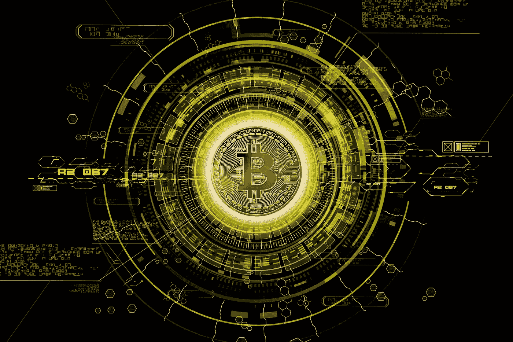

# 比特币 vs 美联储，谁赢得控制权之战？

> 原文：<https://medium.com/coinmonks/bitcoin-vs-the-feds-who-wins-the-control-battle-931cafeb704b?source=collection_archive---------18----------------------->

[Image by The Digital Artist on Pixabay](https://cdn.pixabay.com/photo/2018/02/04/17/39/crypto-currency-3130381_1280.jpg)

随着比特币和其他加密货币的采用和普及，政府是否可以对比特币施加控制的争论已经提出。

有两个问题为本次讨论奠定了基础:

1.比特币充当替代货币，以避免政府制裁。
2。它为洗钱行为服务的威胁

甚至有可能监管比特币吗？

比特币能否在第一时间被监管？

创造比特币的主要目的是让它去中心化。

由于是去中心化的，比特币没有单一的实体来控制它。比特币的控制权由世界各地的几个独立实体分享，使得单个实体无法完全控制网络并随心所欲地操纵它。

话虽如此，但政府可以影响的一些领域可能会阻碍比特币的应用

1.目标是集中的实体，如交易所和钱包。

2.通过钱包上的 KYC(了解你的客户)协议锁定个人用户。

结论

对比特币实施任何重大的全球监管都需要付出很大努力，其中最重要的因素是集中化。

简而言之，比特币可以受到监管，因为政府正在执行 KYC 法律。

但是，它无法关闭。在没有集中交易所的情况下，仍然有购买、出售和交易比特币 P2P 的方式。任何政府都需要付出巨大努力才能彻底关闭比特币。

> *加入 Coinmonks* [*电报频道*](https://t.me/coincodecap) *和* [*Youtube 频道*](https://www.youtube.com/c/coinmonks/videos) *了解加密交易和投资*

# 另外，阅读

*   [Remitano 审查](https://coincodecap.com/remitano-review)|[1 英寸协议指南](https://coincodecap.com/1inch) | [购买 Floki](https://coincodecap.com/buy-floki-inu-token)
*   [MoonXBT vs Bybit vs 币安](https://coincodecap.com/bybit-binance-moonxbt) | [Arbitrum:第二层解决方案](https://coincodecap.com/arbitrum)
*   [买 PancakeSwap(蛋糕)](https://coincodecap.com/buy-pancakeswap)|[matrix export Review](https://coincodecap.com/matrixport-review)
*   [最佳免费加密信号](https://coincodecap.com/free-crypto-signals) | [YoBit 评论](/coinmonks/yobit-review-175464162c62) | [Bitbns 评论](/coinmonks/bitbns-review-38256a07e161)
*   [OKEx 回顾](/coinmonks/okex-review-6b369304110f) | [Kucoin 交易机器人](/coinmonks/kucoin-trading-bot-automate-your-trades-8cf0ca2138e0) | [期货交易机器人](/coinmonks/futures-trading-bots-5a282ccee3f5)
*   [AscendEx Staking](https://coincodecap.com/ascendex-staking)|[Bot Ocean Review](https://coincodecap.com/bot-ocean-review)|[最佳比特币钱包](https://coincodecap.com/bitcoin-wallets-india)
*   [霍比评论](https://coincodecap.com/huobi-review) | [OKEx 保证金交易](https://coincodecap.com/okex-margin-trading) | [期货交易](https://coincodecap.com/futures-trading)
*   [比特币基地跑马圈地](https://coincodecap.com/coinbase-staking) | [Hotbit 评论](/coinmonks/hotbit-review-cd5bec41dafb) | [KuCoin 评论](https://coincodecap.com/kucoin-review)