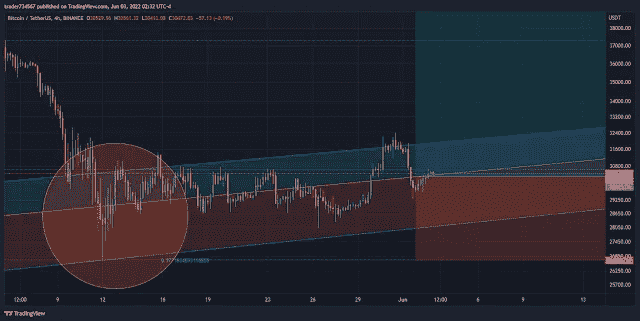

# 比特币周 22/2022，期刊#1

> 原文：<https://medium.com/coinmonks/bitcoin-week-22-2022-journal-1-c0d8222a6b33?source=collection_archive---------62----------------------->

**2022 年 5 月 25 日；**

两名俄罗斯居民从一名男子那里勒索了超过 5500 万卢布(近 100 万美元)的数字资产和 500 万卢布(近 9 万美元)的现金，这一案件导致人们被动接受加密作为支付手段。据俄罗斯商业新闻门户网站 RBC 报道，圣彼得堡市法院已经批准加密货币作为一种支付形式。在为客户或国家辩护时，检察官通常会首先看法院判决，但莫斯科政府尚未就比特币的法律地位做出决定。

**2022 年 5 月 26 日；**

根据彭博的数据，比特币期权市场的看跌期权比率已经达到 0.72，为一年来的最高水平。瓦尔基里投资公司的研究主管乔希·奥尔谢维奇认为，当前的宏观经济情绪是熊市加剧的原因。由于美国美联储旨在管理极高通胀的鹰派方针，比特币和其他加密货币未能在 2021 年实现崇高的价格目标。今天早些时候，比特币和股票双双跌破 28000 美元，随后收复部分失地。

海曼资本管理公司(Hayman Capital Management)的凯尔巴斯(Kyle Bass)今天早些时候接受美国消费者新闻与商业频道采访时表示，美联储最有可能在 2023 年降息。对衰退的担忧将迫使美联储改变方针。本月早些时候，中央银行 22 年来首次提高了利率。鉴于比特币缺乏加息经验，一些人认为它在这种情况下的表现可能会令人失望。

社区驱动的区块链数据分析平台 CryptoQuant 的首席执行官 Ki Young Ju 表示，能源公司和传统金融机构将推动下一轮比特币牛市。尽管世界各地的官员继续实施旨在监管加密采矿行业的立法，但这位分析师在一系列推特上发布了他的预测。“我们将注意到的第一个变化是，比特币网络将由太阳能和风能供电，而太阳能和风能最近已成为最具成本效益的电力来源。”周一，杨写道。

就在上个月，Blockstream 和杰克·多西的 Block 与特斯拉合作，在得克萨斯州建立了一个太阳能和电池供电的比特币矿场。该工厂将使用 100%的可再生能源为比特币采矿提供燃料，预计将促进 BTC 与可再生能源的协同作用。总部位于休斯顿的 IT 公司 Lancium 等公司已经在建设旨在使用可再生能源为比特币采矿业务提供动力的设施。

**2022 年 5 月 27 日；**

由于避险情绪占据中心舞台，以太坊自年初以来对其最大对手的跌幅超过 22%。在牛市期间，替代硬币的表现通常优于比特币，但在市场下跌期间，投资者往往会转向更安全、更成熟的资产，从而导致大幅下跌。由于以太坊的急剧下降，比特币的市场份额增加了 46%。根据交易员斯科特·梅尔克(Scott Melker)的报告，其图表最近否定了熊市背离，表明替代硬币可能会继续表现不佳。

然而，在这样的形势下，比特币远非避风港。自今年年初以来，最大的加密货币已经贬值 57.90%。根据联合创始人 Vitalik Buterin 的说法，以太坊灯塔链经历了七个街区的深度重新设计，可能最早在 8 月份与主要的工作证明链合并。根据开发商的说法，这一事件被归咎于“非琐碎的分割”，而不是证据链中的根本问题。引入了本地 staking 的 Beacon Chain 于 12 月下旬发布。引发看跌的主要因素之一是即将到来的月度期权到期日，该日期定于本周五，看跌者希望抓住这个机会兑现。

剑桥替代金融中心(CCAF)公布了全球比特币采矿的新数据，显示该行业正在增长，但 Mainland China 采矿统计数据的回归引起了专家的兴趣。在政府决定取缔比特币挖矿活动后，中国的比特币挖矿活动在上一期《CCAF 报告》中已经跌出排行榜。采矿企业去了哈萨克斯坦，而其他企业去了加拿大和美国。

剑桥大学贾奇商学院声称，中国矿工只是从网络上消失了，并没有离开这个国家。相反，他们使用 VPN 和代理设备来掩盖他们的数字痕迹，使当局无法追踪他们。根据贾奇商学院(Judge Business School)的一份报告，“随着禁令的实施和时间的推移，地下矿工似乎变得更加自信，似乎对当地代理服务提供的保护感到满意。”“获得离网电力和地理上分散的小规模运营是地下矿工最常用的两种方法，用以向当局隐瞒他们的活动并规避禁令。”

**2022 年 5 月 28 日；**

根据权威人士的说法，在经历了长达 7 个月的严重市场抛售后，加密市场似乎即将回归。在 12 月下旬 BTC 价格暴跌至 50，000 美元以下后，密码世界充斥着市场即将进入秘密冬天的预测。自那以来的几个月里，市场一直在大出血，在上周前所未有的抛售中达到高潮，整个加密货币市场跌至 10 个月来的低点。

然而，专家们推测，加密的冬天可能已经结束，理由是大量的清算，特别是在上周的抛售之后，这种抛售因稳定币的崩溃而加剧。据雅虎报道，被称为“加拿大鲸鱼”的伊夫·拉穆勒克斯(Yves Lamoureux)在最近的一篇文章中大胆地鼓吹新的“必然牛市”。如果一切顺利，这位还在美国经营 Lamoureux & Co .宏观经济研究公司的权威人士认为，比特币和其他加密货币最近的投降足以将价格推升至历史最高水平。“密码持有者的态度非常消极，”拉穆勒在推特上说，“就像我们在以前的底部看到的一样。”

20222 年 5 月 30 日；

在每日和每周的时间框架内，比特币变得看涨，但价格运动尚未赶上这一趋势逆转。在 5 月 23 日至 30 日的一周，比特币形成了另一个温和的熊市烛台。这是自 3 月 28 日至 4 月 5 日以来连续第九周看跌。一个长期上升的平行通道也因此被打破。尽管如此，价格仍未能跌破 5 月 12 日创下的 26，700 美元的低点。

目前，价格徘徊在 0.618 Fib 回撤支撑位 28，700 美元上方。BTC 已经跌破 30，000 美元的水平支撑位，尽管这是一个关键的 Fib 支撑位。因此，除非价格跌破 20000 美元，否则没有进一步的横向支撑。周线 RSI 目前在 34，值得注意。这与 2020 年 3 月的崩盘值相同。自 2017 年以来，RSI 唯一一次产生较低的读数是在 2018 年 12 月底部 3300 美元期间。

总的来说，周线图似乎是不确定的。RSI 达到了通常与底部相关的水平，价格在 Fib 支撑上方交易，这是积极的。价格已经从一个上升的平行通道和负面的水平支撑区域向下突破。价格走势看跌，但 RSI 看涨。周线概览，价格从水平支撑位向下突破，得到日线图的支持。在这个时间范围内，现在已经转化为阻力的水平是 30，500 美元。

尽管如此，日线 RSI 依然非常看涨。首先，它创造了一个明显的看涨背离，这通常是看涨趋势反转的前兆。此外，该指标已经突破了下降趋势线。如果这一事件引发上涨，BTC 的下一个最接近的阻力区域是在 37，500 美元和 40，000 美元之间。0.5–0.618 Fib 回撤阻力区域是目标区间。因此，日线图比周线图稍微乐观一些。尽管价格在水平阻力位下方交易，但 RSI 仍为正值。

BTC 波计数的分析:长期计数支持每周 RSI 读数，这表明 BTC 正在接近或已经到达底部。这意味着价格已经完成了 2018 年 12 月开始的五波长期上涨中的第四波。

由纽特拉德撰写

*原载于 2022 年 6 月 3 日*[*【https://cryptoverse2.blogspot.com】*](https://cryptoverse2.blogspot.com/2022/06/bitcoin-week-222022-journal-1.html)*。*

> 加入 Coinmonks [电报频道](https://t.me/coincodecap)和 [Youtube 频道](https://www.youtube.com/c/coinmonks/videos)了解加密交易和投资

# 另外，阅读

*   [3 商业评论](/coinmonks/3commas-review-an-excellent-crypto-trading-bot-2020-1313a58bec92) | [Pionex 评论](https://coincodecap.com/pionex-review-exchange-with-crypto-trading-bot) | [Coinrule 评论](/coinmonks/coinrule-review-2021-a-beginner-friendly-crypto-trading-bot-daf0504848ba)
*   [莱杰 vs Ngrave](/coinmonks/ledger-vs-ngrave-zero-7e40f0c1d694) | [莱杰 nano s vs x](/coinmonks/ledger-nano-s-vs-x-battery-hardware-price-storage-59a6663fe3b0) | [币安评论](/coinmonks/binance-review-ee10d3bf3b6e)
*   [Bybit Exchange 审查](/coinmonks/bybit-exchange-review-dbd570019b71) | [Bityard 审查](https://coincodecap.com/bityard-reivew) | [Jet-Bot 审查](https://coincodecap.com/jet-bot-review)
*   [3 commas vs crypto hopper](/coinmonks/3commas-vs-pionex-vs-cryptohopper-best-crypto-bot-6a98d2baa203)|[赚取加密利息](/coinmonks/earn-crypto-interest-b10b810fdda3)
*   最好的比特币[硬件钱包](/coinmonks/hardware-wallets-dfa1211730c6) | [BitBox02 回顾](/coinmonks/bitbox02-review-your-swiss-bitcoin-hardware-wallet-c36c88fff29)
*   [BlockFi vs Celsius](/coinmonks/blockfi-vs-celsius-vs-hodlnaut-8a1cc8c26630)|[Hodlnaut 点评](/coinmonks/hodlnaut-review-best-way-to-hodl-is-to-earn-interest-on-your-bitcoin-6658a8c19edf) | [KuCoin 点评](https://coincodecap.com/kucoin-review)
*   [Bitsgap 评审](/coinmonks/bitsgap-review-a-crypto-trading-bot-that-makes-easy-money-a5d88a336df2) | [Quadency 评审](/coinmonks/quadency-review-a-crypto-trading-automation-platform-3068eaa374e1) | [Bitbns 评审](/coinmonks/bitbns-review-38256a07e161)