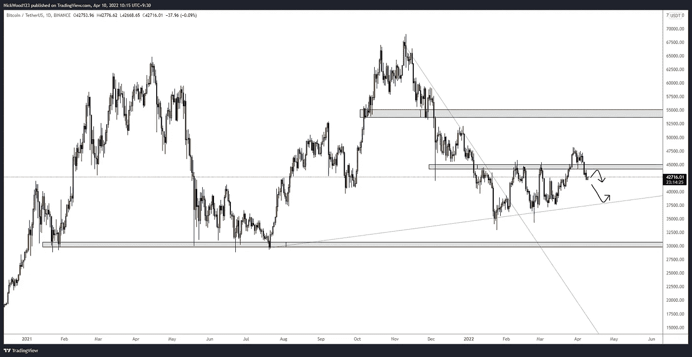
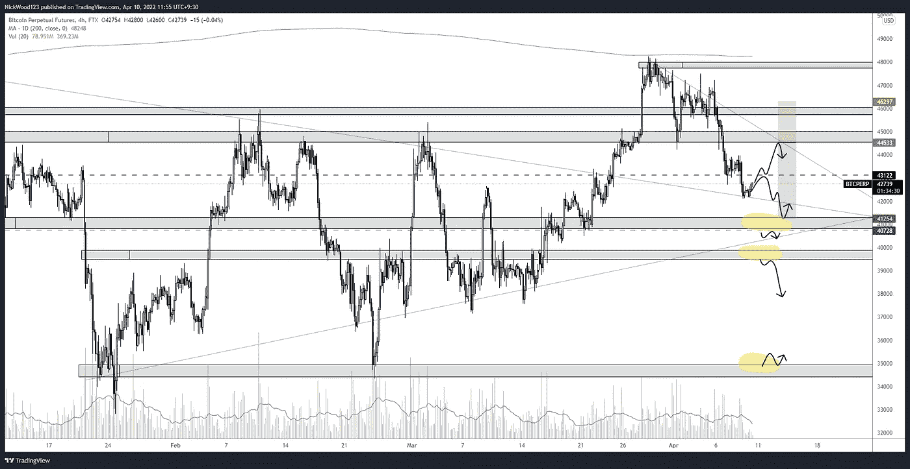
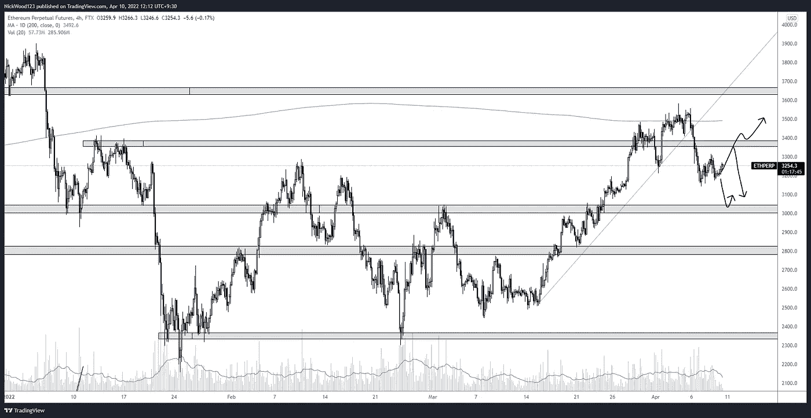
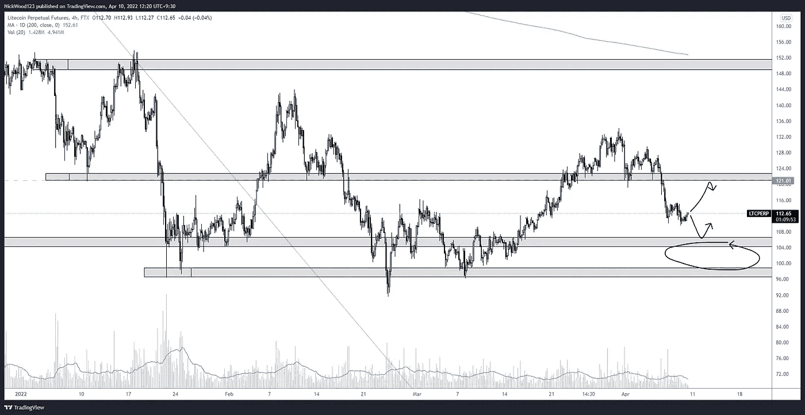

# 比特币周报

> 原文：<https://medium.com/coinmonks/bitcoin-weekly-report-10th-april-2022-eb4d1388177?source=collection_archive---------65----------------------->

## 比特币报告(2022 年 4 月 10 日)

## 比特币——随着 BTC 未能继续看涨并重新进入区间，市场出现担忧。下一步去哪里，买入机会和卖出机会。

在我们之前的报告中，我们提到了 BTC 可能已经突破了过去两个月的区间。日线图看起来是积极的，4 小时看起来还好，当时看涨是有道理的。

过去的一周彻底改变了这一观点。

# BTC 日报

BTC/USD DAILY

[https://www.tradingview.com/x/oscQLXYf/](https://www.tradingview.com/x/oscQLXYf/)

日线图清楚地显示，停留在 45，000 美元阻力位上方的尝试是短暂的。我记得有一句话一直萦绕在我的脑海中。

> 当价格重新进入一个区间时，价格倾向于再次指向相反的方向

一个简单的事实是，价格回落到 45k 水平以下是很重要的，因为我们不能诚实地看多，直到它再次收回或移动到一个新的价值区域。这并不是说 BTC 在劫难逃，我们将会 0。但市场目前告诉我，在目前的价格区域，没有理由看涨。

> 区间顶部是卖出，区间底部是买入，区间中间是等待

为什么要强迫一个不存在的交易？我们可以简单地等着看价格走向，交易的最好之处是我们不需要采取行动。等待市场向你摊牌，然后根据新的信息做出决定。

# 4 小时时间范围

BTC/USD 4HR

https://www.tradingview.com/x/j1qJpuNW/

我知道你在想什么，这看起来很乱，很难理解。去掉噪音，看看箭头。接下来你会说，当然其中一件事会发生，你有五个或更多不同的选择，我怎么知道是哪一个？耐心等待以下情况之一发生。

让我们快速浏览一下它们以及它们为什么重要。

41K 水平可能看起来像是经过了多次清洗，但在左边的图表中，我认为这个水平对价格保持仍然很重要。

如果这失败了，39k 水平对某种反弹是有意义的。如果没有，价格将在阻力下重新进入，如果出现破位和再次测试，可能会有一个短暂的机会。

在 35k 的水平上，我们可以预期会有很大的买入压力，很难说会是什么样子。在我看来，下跌到那个水平看起来很糟糕，而且不稳定，但在那个水平下单是有意义的。

# 主要替代硬币

在 BTC 回调期间，alt 硬币受到影响，但有些表现比其他硬币好，关键水平略有不同。

## 瑞士法郎/美元

ETH/USD 4HR

[https://www.tradingview.com/x/deTIILef/](https://www.tradingview.com/x/deTIILef/)

瑞士联邦理工学院的表现实际上比我预期的要好，尽管这和 BTC 的情况相似。我们已经跌破了 3380 美元的阻力。请记住，对于突破和重新测试，我们希望看到该水平的明显突破，并且在很长一段时间内，如果价格回到该水平，并且没有跌破阻力，我们可以将其视为支撑，并寻找长期机会。

对 3330 美元区域的再次测试和拒绝对我来说意味着价格没有回到这个区域，现在准备向下移动，这意味着做空的机会。

## LTC/美元

LTC/USD 4HR

【https://www.tradingview.com/x/K0P7yJ3v/ 号

LTC 与此类似，但我们更接近潜在购买压力可能出现的支撑区域。

圈起来的区域显示了我们可能期望 LTC 触及的水平。回到 108 美元以上才能收回，可能会给多头机会再次瞄准该区间高点。

收复 121 美元将是看涨，或者测试 108 美元并明确拒绝也将是看涨。止损设置在一个合理的区域，允许波动，没有止损。试图回到 121 美元以上的水平和失败，对我来说是一个短暂的机会。然而，我不会在 104 美元至 108 美元的价格区域做空，96 美元的明显突破和拒绝对于做空来说是必要的。

我倾向于将整体趋势偏差带入我的交易决策中，因此从目前情况来看，我对 4 小时的时间框架更倾向于看跌而不是看涨。

这就是本周的比特币报告，请在下面随意评论你对未来几周和几个月比特币走向的看法。请随意询问你感兴趣的其他硬币，我会尽我所能把它们包含在下一篇报道中。

感谢您的阅读，并一如既往地遵循您的交易计划和管理风险。

如果你想和我联系，请跟着我

推特:@NickWoodFX

电子邮件:nw.forex@outlook.com

缺口

*这不是财务建议。本文包含的信息是一般性的，没有考虑到您的个人情况。你应该考虑这些信息是否适合你的需要，如果合适的话，向理财顾问寻求专业建议。你并且只有你对你的交易和投资决定负责。我不是专业人士。我对你可能遭受的任何损失或损害不承担任何责任。*

> 加入 Coinmonks [电报频道](https://t.me/coincodecap)和 [Youtube 频道](https://www.youtube.com/c/coinmonks/videos)了解加密交易和投资

# 另外，阅读

*   如何在 Uniswap 上交换加密？ | [A-Ads 审查](https://coincodecap.com/a-ads-review)
*   [WazirX vs coin dcx vs bit bns](/coinmonks/wazirx-vs-coindcx-vs-bitbns-149f4f19a2f1)|[block fi vs coin loan vs Nexo](/coinmonks/blockfi-vs-coinloan-vs-nexo-cb624635230d)
*   [本地比特币评论](/coinmonks/localbitcoins-review-6cc001c6ed56) | [加密货币储蓄账户](https://coincodecap.com/cryptocurrency-savings-accounts)
*   [什么是融资融券交易](https://coincodecap.com/margin-trading) | [成本平均法](https://coincodecap.com/dca)
*   [支持卡审核](https://coincodecap.com/uphold-card-review) | [信任钱包 vs 元掩码](https://coincodecap.com/trust-wallet-vs-metamask)