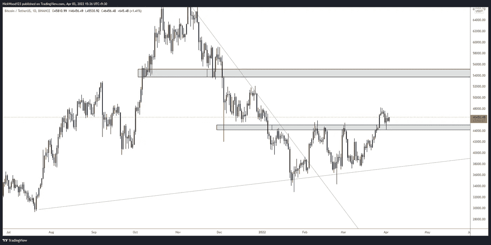
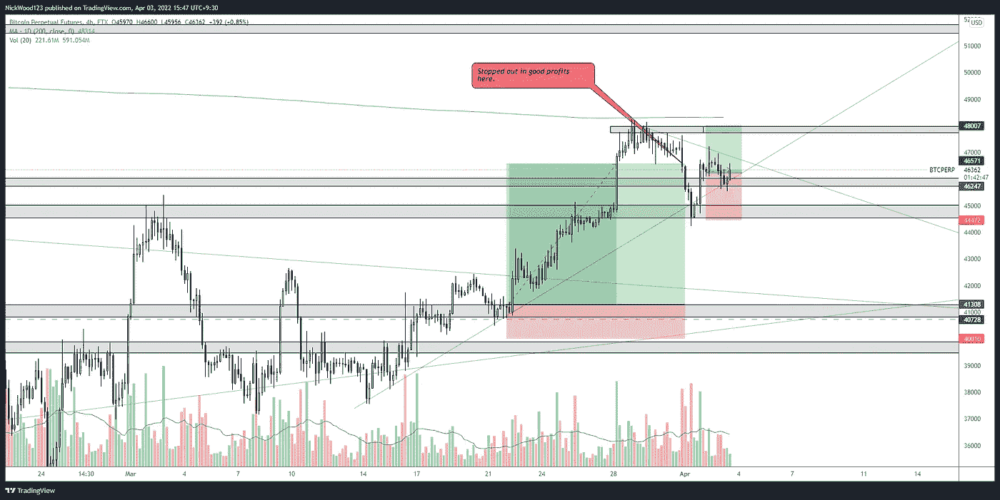
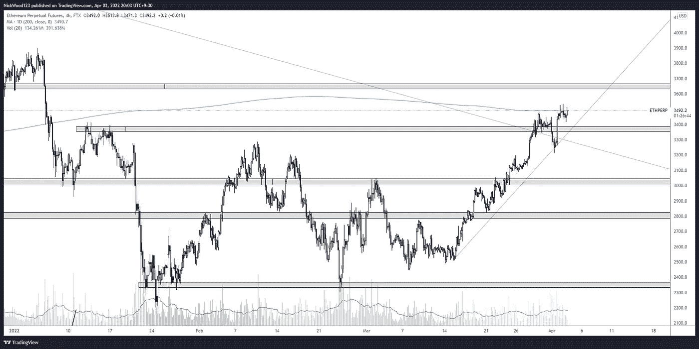
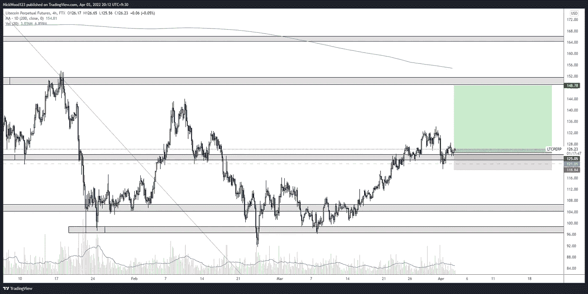

# 比特币周报

> 原文：<https://medium.com/coinmonks/bitcoin-weekly-report-23be05102205?source=collection_archive---------31----------------------->

## **比特币报告(2022 年 4 月 4 日)**

## 比特币——失败的爆发或延续的潜力

对于比特币的价格走势来说，过去的一周是非常重要的一周。我们已经看到了试图超过水平，也试图让价格回落到范围内。

在这份报告中，我们将讨论比特币是否未能突破其一直处于的区间，或者是否可能从当前的价格结构继续下去。

BTC DAILY

【https://www.tradingview.com/x/33Y0tZk2/ 号

# BTC 日报

日线图非常清晰地描绘了我们目前所处的位置。已经多次尝试将价格推回到 45k 价位以下，但都失败了。4 月 1 日的拒绝蜡烛线是看涨压力介入的明确信号，以阻止跌破之前的阻力位。我们可以把这根蜡烛看作是对阻力位的一个声明和一个再测试。

我们越是在这个水平之上收盘，而没有回落到 44k 区域之下，我就越有信心，价格可能最终会开始下一次向 52 到 54k 价位移动。这表明突破已经被确认，可能会在接下来的几周或几个月继续。

# 4 小时时间范围

BTC 4HR

【https://www.tradingview.com/x/hBvjdYiw/ 

我们之前的交易是用跟踪止损止盈止损的，我们抓住了大部分波动，当价格最终回撤时，我们的跟踪止损被执行，利润被实现。

在撰写本文时，我们可以看到 BTC 在较低的时间框架中处于一个有趣的位置。用灰色突出显示的级别都是我感兴趣的领域，因为它们是以前作为支撑或阻力的级别。

一个新的交易在 4 月 2 日进行，因为我们打破并重新测试了一个较小的 4 小时级别。这使我们能够继续暴露于 BTC 的潜在上涨空间，同时也有足够大的止损位，如果价格下跌并收于 45k 水平以下，我们可以提前退出。

趋势线对我来说是一个较弱的信号，因为它们更加主观，但肯定仍然是相关的，必须考虑。阻力趋势线的突破将增加我继续做多的理由。

长期上升趋势的破裂开始向我表明，也许这个交易不会结束，最好是小亏一点，等待市场给我们更多的信息。

# 主要替代硬币

ETH/USD 4HR

[https://www.tradingview.com/x/Ltq2khDz/](https://www.tradingview.com/x/Ltq2khDz/)

## 瑞士法郎/美元

以太坊表现非常好，虽然价格在 4 月 1 日短暂跌破该区域，但在 3400 美元以上的任何地方，我都会解读为短期看涨。价格是感人的，拒绝每日 MA200 告诉我们要稍微谨慎。然而，MA 不应该只用于交易决策，而应该作为长期趋势的价格指标。

一个重要的阻力趋势线被打破。价格短暂回落到它下方，但很快被收回，价格回到趋势线和水平线上，声称有两个阻力。

LTC/USD 4HR

[https://www.tradingview.com/x/B4BgVEVZ/](https://www.tradingview.com/x/B4BgVEVZ/)

## LTC/美元

我对 LTC 非常感兴趣，因为我认为它的表现区域非常重要，未来几周似乎很有可能上涨。

我在上一份报告中指出，BTC 和 alt 之间的相关性非常高，所以最终如果 BTC 不能继续，其他人也会继续。我仍然坚持我的观点，LTC 是前面“麻烦区域”较少的图表之一，因为下一个主要阻力是之前的高点 141 美元，然后是 150 美元水平。这给了 LTC 大量的潜在收益，同时又将风险降至最低。

这是本周的比特币报告，我希望你喜欢它，并让我知道你的想法。一如既往地保持耐心，做自己的研究，相信自己。建立一个策略，测试它，优化它，然后重复这个过程。随着时间的推移，你会获得信心，并确切地知道你在寻找什么来进入交易。

缺口

*这不是财务建议。本文包含的信息是一般性的，没有考虑到您的个人情况。你应该考虑这些信息是否适合你的需要，如果合适的话，向理财顾问寻求专业建议。你并且只有你对你的交易和投资决定负责。我不是专业人士。我对你可能遭受的任何损失或损害不承担任何责任。*

> 加入 Coinmonks [电报频道](https://t.me/coincodecap)和 [Youtube 频道](https://www.youtube.com/c/coinmonks/videos)了解加密交易和投资

# 另外，阅读

*   [瓦济克斯 NFT 评论](https://coincodecap.com/wazirx-nft-review)|[Bitsgap vs Pionex](https://coincodecap.com/bitsgap-vs-pionex)|[Tangem 评论](https://coincodecap.com/tangem-wallet-review)
*   [如何使用 Solidity 在以太坊上创建 DApp？](https://coincodecap.com/create-a-dapp-on-ethereum-using-solidity)
*   [币安 vs FTX](https://coincodecap.com/binance-vs-ftx) | [最佳(SOL)索拉纳钱包](https://coincodecap.com/solana-wallets)
*   [如何在 Uniswap 上交换加密？](https://coincodecap.com/swap-crypto-on-uniswap) | [A-Ads 评论](https://coincodecap.com/a-ads-review)
*   [加密货币储蓄账户](/coinmonks/cryptocurrency-savings-accounts-be3bc0feffbf) | [YoBit 审核](/coinmonks/yobit-review-175464162c62)