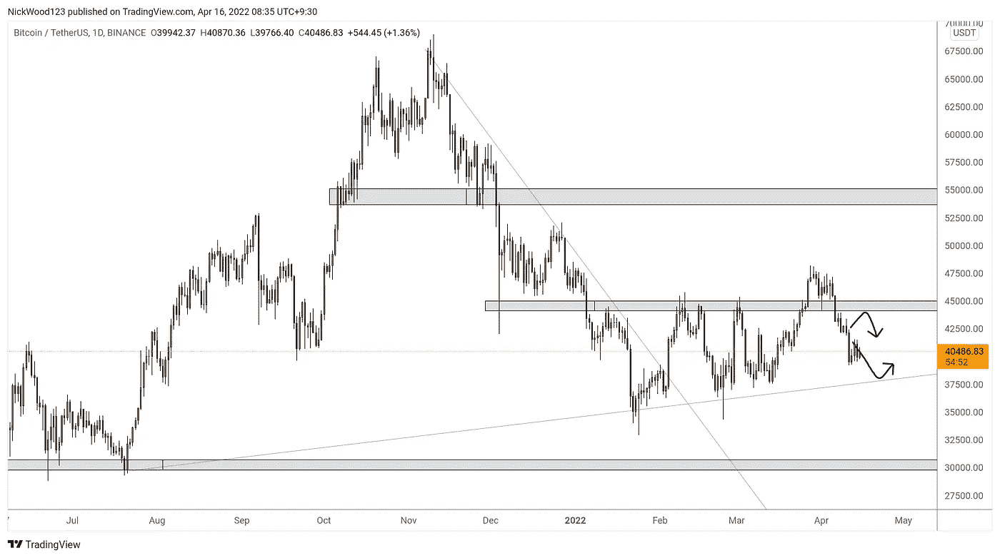
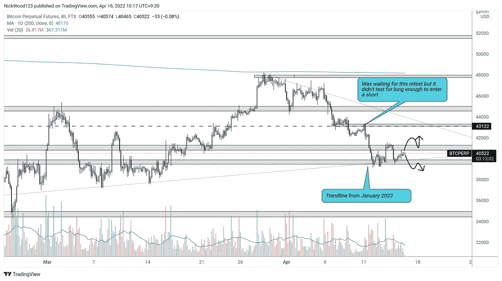
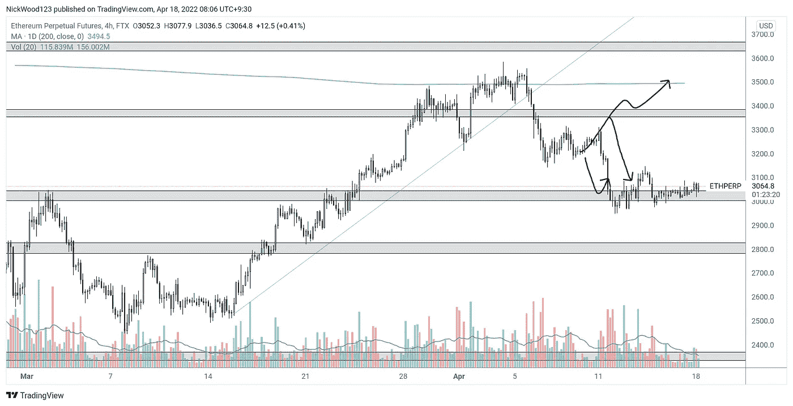
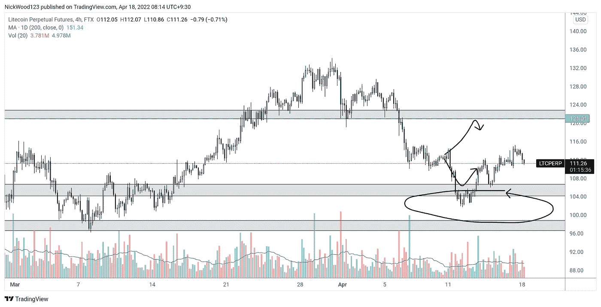

# 比特币周报

> 原文：<https://medium.com/coinmonks/bitcoin-weekly-report-9bb5ebed22d8?source=collection_archive---------56----------------------->

## 比特币报告(2022 年 4 月 18 日)

比特币——随着价格向关键趋势线移动，价格继续下跌。哪里有好的购买机会，应该寻找什么。

在我们之前的报告中，我们谈到了价格在重新进入区间时从区间高点向区间低点移动的可能性。价格从来没有明确地测试过日线的高点，但是已经下降到趋势线支撑，或者可能下降到 35，000 美元的水平日线支撑。

# BTC 日报

BTC/USD DAILY

[https://www.tradingview.com/x/ozw6VaWY](https://www.tradingview.com/x/ozw6VaWY)

在日线图上，我们可以看到价格可能会继续下降到 37，700 美元的水平，并试图在该区域找到更高的低点。这将是一个关键水平，我们可以预期购买压力会介入并保持价格。

跌破这一水平，收盘低于这一水平将是非常悲观的，因为这将表明趋势线不再有效，水平支撑将很快受到考验，如果不能保持，可能会导致未来几周的波动。

在当前价格 40，000 点有一个水平，从 2022 年 1 月下旬的低点可以画出一条趋势线，但我将在 4 小时时间框架部分更多地讨论这个区域。

# 4 小时时间范围

4HR BTC/USD

【https://www.tradingview.com/x/YrcytYCY 号

虽然日线图显示了价格可能反弹的两个主要区域，但 4 小时的时间框架让我们对我们目前所处的位置有了更多的了解。如果这条趋势线被打破，一个关键的水平将被打破，一月底的对角线趋势也将被打破。我寻找突破和重新测试的原因是，有时趋势被打破，或者水平水平被打破，但相关性很快恢复，导致假出局。如果你等待突破并再次测试，你会得到更多的价格确认，试图回到水平之上，但没有成功。

很明显，有时复试永远不会发生，交易机会可能会错过，所以这完全取决于你自己的交易计划和你想要多少交易信息。

在短期内，如果价格收复图表上显示的 41k 价格区域，我们可能会看到一些短期上涨。如前所述，如果较低的水平下降，35k 不会很难下降到相对较快。

# 主要替代硬币

低价竞标将价格维持在关键水平，上周表现略好于 BTC，但 BTC 也保持在关键水平，当价格下跌时，我认为我们会看到低价竞标的同样走势。

# 瑞士法郎/美元

ETH/USD 4HR

【https://www.tradingview.com/x/LRfeatcV 

ETH 一直在磨砺，守住 3100 的关键水平。价格不反弹的时间越长，我就越担心。我觉得 ETH 正在等待 BTC 采取行动，但只要它保持这一水平，我们就可以保持对 3400 点的长期偏见。

跌破 3000 点和熊市重新测试将允许移动到 2800 点甚至 2400 点。3000 点显然是一个非常重要的关口。

# LTC/美元

LTC/USD 4HR

[https://www.tradingview.com/x/eGMm5JeQ](https://www.tradingview.com/x/eGMm5JeQ)

到目前为止，我们上周报道的内容进展顺利。我们等待价格进入该区域，在 108 重新测试该区域。重新测试发生了，价格离开了这个区域。缓慢上涨到 121 是可能的，但我认为谨慎并在此时止损获利是明智的，因为价格可能会形成反向头肩底形态。

如果价格突破 116 并再次测试该水平，这将是反向头肩顶颈线，我认为 121 水平可能会延续。

这就是本周的比特币报告，请在下面随意评论你对未来几周和几个月比特币走向的看法。请随意询问你感兴趣的其他硬币，我会尽我所能把它们包含在下一篇报道中。

感谢您的阅读，并一如既往地遵循您的交易计划和管理风险。

如果你想和我联系，请跟着我

推特:@NickWoodFX

电子邮件:nw.forex@outlook.com

缺口

*这不是财务建议。本文包含的信息是一般性的，没有考虑到您的个人情况。你应该考虑这些信息是否适合你的需要，如果合适的话，向理财顾问寻求专业建议。你并且只有你对你的交易和投资决定负责。我不是专业人士。我对你可能遭受的任何损失或损害不承担任何责任。*

> 加入 Coinmonks [电报频道](https://t.me/coincodecap)和 [Youtube 频道](https://www.youtube.com/c/coinmonks/videos)了解加密交易和投资

# 另外，阅读

*   [Bookmap 评论](https://coincodecap.com/bookmap-review-2021-best-trading-software) | [美国 5 大最佳加密交易所](https://coincodecap.com/crypto-exchange-usa)
*   最佳加密[硬件钱包](/coinmonks/hardware-wallets-dfa1211730c6) | [Bitbns 评论](/coinmonks/bitbns-review-38256a07e161)
*   [新加坡十大最佳加密交易所](https://coincodecap.com/crypto-exchange-in-singapore) | [收购 AXS](https://coincodecap.com/buy-axs-token)
*   [红狗赌场评论](https://coincodecap.com/red-dog-casino-review) | [Swyftx 评论](https://coincodecap.com/swyftx-review) | [CoinGate 评论](https://coincodecap.com/coingate-review)
*   [投资印度的最佳加密软件](https://coincodecap.com/best-crypto-to-invest-in-india-in-2021)|[WazirX P2P](https://coincodecap.com/wazirx-p2p)|[Hi Dollar Review](https://coincodecap.com/hi-dollar-review)