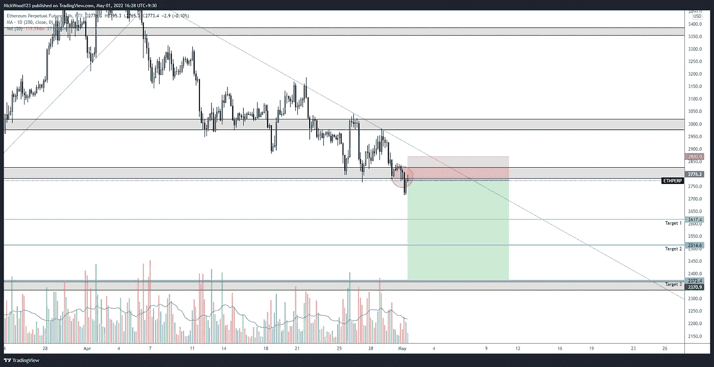

# 比特币周报——比特币破关键支撑，多头陷入困境。

> 原文：<https://medium.com/coinmonks/bitcoin-weekly-report-bitcoin-breaks-key-support-bulls-in-trouble-b14ab3a88efe?source=collection_archive---------49----------------------->

比特币报告(2022 年 5 月 1 日)

价格已经突破了关键的支撑位，看起来会进一步下跌。在这份报告中，我们将涵盖我们预计 BTC 和 alts 反弹的地方，并查看潜在的买入和卖出机会。我还着重教育读者，我究竟在寻找什么来预测上周价格进一步下跌的可能性。

上周的预测再次完美上演。我们知道对角线趋势的熊市测试是可能的，如果失败，进一步下跌是可以预期的。

# BTC 日报

BTC/USD Daily

[https://www.tradingview.com/x/Lkv1lSbs/](https://www.tradingview.com/x/Lkv1lSbs/)

前一周的日线图不需要太多的调整，因为价格仍在我们预期的区域内运行。我认为，周一上午价格在哪里，对于预测接下来可能会发生什么至关重要。虽然价格接近每日低点，但在没有看到短期看涨结构的情况下，我会非常谨慎地盲目买入。

# 4 小时时间范围

4HR Potential Short Entries

【https://www.tradingview.com/x/7J8Jgdfw/ 号

我真的想在这里重点解释潜在的条目，这样你就可以更好地理解我在寻找什么，以及我是如何预测向下移动的。

参考上面的图表，我们有 3 个潜在的条目，我们可能会有所欠缺，没有一个必然比另一个更错或更对，但一些有稍微更多的汇合点和进入的理由。

第一次测试是我预测价格反弹的水平，如果你参考日线图，你会看到我预计价格会小幅上升，以测试上升趋势线的底部，价格可能会拒绝并向下移动。这正是所发生的事情，尽管比预期的要快得多，也更尖锐。

第二次复试可能实际上已经停止了，但仍然是有意义的条目。价格已经跌破一个关键水平，并拒绝了相当长的时间。

第三种可能是当价格回到关键水平以下时。拒绝的时间很短，但当价格相对较快地回到某个水平以下，并且试图收回价格却失败时，这可能是价格将继续下跌的良好迹象。

## 本周条目

4hr BTC/USD potential entries

【https://www.tradingview.com/x/4KK3BMFg/ 

这是我接下来几周要寻找的东西。对 39，500 美元上方的阻力进行一次干净的测试，并拒绝一段时间将是一个很好的做空机会。

进入虚线区域和结构的变化可能会带来长期机会，我预计会跌入该区域，然后收复 37600 点并保持住。那么我会考虑做多，但是这种交易伴随着试图接住落下的刀的风险。

一个很好的设定是当或如果价格移动到 40，000 水平。然后，我们将期待价格下跌测试 39，000 点，但未能跌破可能触发多头入场的位置。

# 主要替代硬币

我想让替代硬币部分非常简短。这就是我要找的，有潜在的条目取决于周日晚上的蜡烛和潜在的周一早上的蜡烛关闭

# 瑞士法郎/美元

ETH/USD Short opportunity

[https://www.tradingview.com/x/zTyPkN3B/](https://www.tradingview.com/x/zTyPkN3B/)

联邦理工学院是在支持区下行动的，我希望在进入之前在这里看到一段时间的拒绝，但这取决于你想要多少风险暴露。止损位置可以和上图一样紧，也可以更宽，这样交易更安全。

# LTC/美元

LTC/USD 4hr

https://www.tradingview.com/x/Qw1rx0K5/

上周，我们看到了黄色的例子，现在我们正在等待，看看是否红色的水平发挥出来。我想进一步下跌，但如果价格在这个水平以下停留一段时间，并试图在 99 水平以上，只会遇到失败，我会考虑做空。

感谢您的阅读，并一如既往地遵循您的交易计划和管理风险。

如果你想和我联系，请跟着我

推特:@NickWoodFX

电子邮件:nw.forex@outlook.com

缺口

*这不是财务建议。本文包含的信息是一般性的，没有考虑到您的个人情况。你应该考虑这些信息是否适合你的需要，如果合适的话，向理财顾问寻求专业建议。你并且只有你对你的交易和投资决定负责。我不是专业人士。我对你可能遭受的任何损失或损害不承担任何责任。*

> 加入 Coinmonks [电报频道](https://t.me/coincodecap)和 [Youtube 频道](https://www.youtube.com/c/coinmonks/videos)了解加密交易和投资

# 另外，阅读

*   [最好的卡达诺钱包](https://coincodecap.com/best-cardano-wallets) | [Bingbon 副本交易](https://coincodecap.com/bingbon-copy-trading)
*   [印度最佳 P2P 加密交易所](https://coincodecap.com/p2p-crypto-exchanges-in-india) | [柴犬钱包](https://coincodecap.com/baby-shiba-inu-wallets)
*   [8 大加密联盟项目](https://coincodecap.com/crypto-affiliate-programs) | [eToro vs 比特币基地](https://coincodecap.com/etoro-vs-coinbase)
*   [最佳以太坊钱包](https://coincodecap.com/best-ethereum-wallets) | [电报上的加密货币机器人](https://coincodecap.com/telegram-crypto-bots)
*   [交易杠杆代币的最佳交易所](https://coincodecap.com/leveraged-token-exchanges) | [购买 Floki](https://coincodecap.com/buy-floki-inu-token)