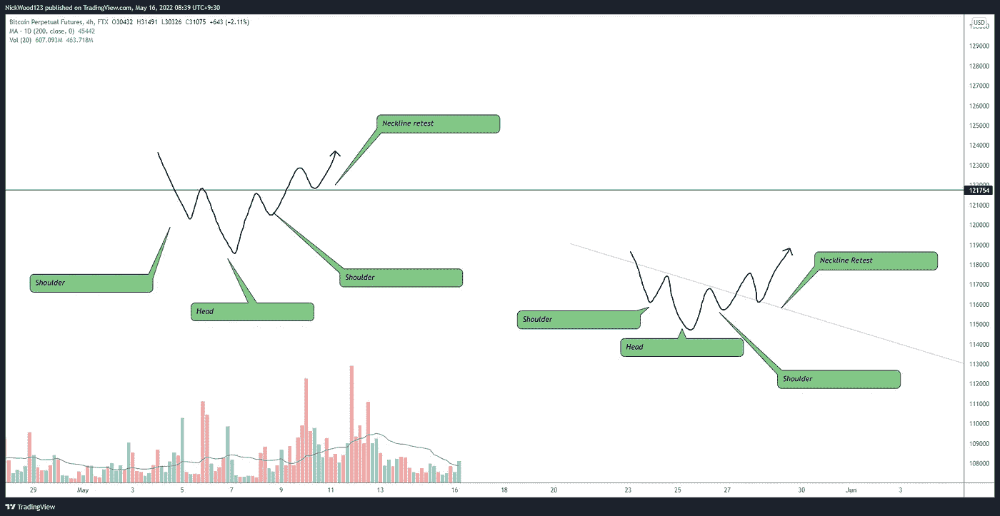

# 比特币周报-极度恐惧导致市场混乱。

> 原文：<https://medium.com/coinmonks/bitcoin-weekly-report-extreme-fear-causes-chaos-in-market-756f0ad7e582?source=collection_archive---------35----------------------->

# Luna 下跌 100%,加密市场遭受损失

## 比特币报告(2022 年 5 月 16 日)

对一些人来说，过去的一周极其艰难。我想以这样一句话开始这篇报道:我希望所有读到这篇文章的人都没事。在我从事加密交易的这些年里，我从来没有见过我本周所看到的，这表明，你必须随时做好准备。如果您需要帮助和支持，请随时向我们寻求帮助和建议。

请记住这句话，记住生命中真正重要的是什么。

> 一个好人完全可以全军覆没，另谋高就。他可以这样做几次。即使我们的家被烧毁，我们也可以重建它。但是我们不劳而获的东西，我们永远无法替代。—厄尔·南丁格尔

在这份报告中，我们将涵盖 BTC 和露娜。为了使报告简短，我们将跳过本周其他主要的替代硬币。

# BTC 日报

BTC/USD Daily

[https://www.tradingview.com/x/7J5ENgQp/](https://www.tradingview.com/x/1nHq7bTR/)

上周我们预测比特币价格需要守住**3 万美元**区域。我很高兴地说，尽管价格跌至 **$28，000** 水平，但对我来说，日线上方即将发生的收盘实际上是一个非常积极的迹象。

我可能期望看到的是上升到 **$36，000** 水平，在那里它可能拒绝并回落到 **$32，000** 重新测试并继续上升。这些情景将在 4hr 部分中介绍。

如果 BTC 不能守住 30，000 美元的区域，我担心市场会继续下跌。我将寻求支持的区域是 **$25，000、$19，700、$12，572、$6093。**请记住，这些并不是我们盲目买入的确切价位，而是我们等待市场反应并做出具有可能结果的良好交易决策的价位。

# 4 小时时间范围

4hr Current Situation

[https://www.tradingview.com/x/8GOhpUCa/](https://www.tradingview.com/x/8GOhpUCa/)

市场结构**开始**转变，收回**29，500 美元**水平，价格开始形成 4 小时 TF 的更高低点。我想说清楚的是，这个**可以很容易地在几天甚至几个小时内翻转。**所以当 29，500 美元再次下跌时，我会寻求确保利润或消除风险。

正如我在每日专栏中所说，收复 29，500 美元的关口对短期来说确实是积极的。我们获得了支持，尽管市场上出现了各种波动，围绕加密的疑问也层出不穷，但比特币仍然成功守住了这个关键领域。

Options for next movements

[https://www.tradingview.com/x/i5EIpcYg/](https://www.tradingview.com/x/i5EIpcYg/)

如上所示，我们预计可能会出现多种情况。这就像耐心观察会发生什么一样简单。如果你目前没有做多，那么等待我所说的反向头肩顶颈线的回调。下面是一个反向的头肩底形态。

https://www.tradingview.com/x/w99CDTMG/

反转头肩底是一个非常简单但有效的趋势底部形态。它包含左肩、头部和右肩。颈线是形态中的一个关键点，如果它被打破或声称它可以增加趋势可能反转的额外确认。简单来说，当价格结构开始从持续的低低点和低高点向高低点和高高点转变时，就会出现反向头肩顶。

分解如下——下低**(左肩)** —下高**(颈线点 1)** —下低**(头部)** —等高或下高**(颈线点 2)** —然后是更高的低**(右肩)** —更高的高**(颈线突破)** —更高的低**(颈线复试)。**

## 所有人都在谈论的唯一一个替代硬币

## 卢纳/美元

[https://www.tradingview.com/x/83xSmsGb/](https://www.tradingview.com/x/83xSmsGb/)

我在这里不是为了谈论为什么会发生一些事情，或者卢娜的基本理论、故事或新闻。我只是想说，你不会仅仅因为价格下降了 **30%、40%、80%、90 %或几乎 100%** 就去买看起来像这样的东西

我在这个市场中多次拯救我的头号法则是 ***“不要接住掉下来的刀！!"很抱歉，但是在什么样的世界里可以试着买一张像那样的图表呢？***

在过去的几个报告中，我希望你已经理解了我为什么寻找一个突破和重新测试的结构。当你得到休息和重新测试结构时，有一件事是可以达成一致的。 ***“事情发生了变化”。*** 如果我们正在形成更低的低点和更低的高点，为什么不**等到**我们得到第一个更高的高点或更高的低点？

当然，这并不是每次都管用，在金融市场上也没什么管用，但它能让你在 55 美元、30 美元、10 美元或其他价位买入。$0.0002.社交媒体本周让我有点恶心，到处流传的建议是在**10 美元**买入 Luna，因为如果它达到以前的高点，你就会有 **1100%** 的回报，这充其量只是**一厢情愿的想法**。

如果你陷入其中，我很抱歉，但你要从中吸取教训。等待市场结构改变，如果改变了，你至少可以知道你为什么要进入，而不是因为一场赌博而盲目进入。为了在市场中生存，你必须不惜一切代价保护你的资本。这是关于风险管理，永远不要假设市场能做什么或不能做什么。阅读图表上的内容，并基于此做出客观的决定，而不是脸书或推特上的谣言。我当然会密切关注露娜，但它很可能已经死了，我很乐意判断错误，但上面的图表告诉了我一件事..是**死了**。

我想在报告的最后提醒你，如果 Luna 坠机事件对你造成了重大影响，最重要的是你没事！从中吸取教训，重塑自我，没有什么能阻止一个男人或女人去实现他或她真正想实现的目标，只要他/她相信自己。有时候走开，重新设定并想出一个新的攻击计划是最好的办法。我的目标是每个月消除一个错误，如果几年后我做到了，我会比现在好很多。错误意味着你在挑战自己，这是一件好事！所以犯错吧，从中吸取教训，成长为一个更好的人。

如果您需要什么，请随时联系我们！

这就是本周的比特币报告。感谢阅读

> 交易你的交易计划和管理风险。

如果你想和我联系，请跟着我

推特:@NickWoodFX

电子邮件:nw.forex@outlook.com

缺口

这不是财务建议。本文包含的信息是一般性的，没有考虑到您的个人情况。你应该考虑这些信息是否适合你的需要，如果合适的话，向理财顾问寻求专业建议。你并且只有你对你的交易和投资决定负责。我不是专业人士。我对你可能遭受的任何损失或损害不承担任何责任。

> 加入 Coinmonks [电报频道](https://t.me/coincodecap)和 [Youtube 频道](https://www.youtube.com/c/coinmonks/videos)了解加密交易和投资

# 另外，阅读

*   [币安期货交易](https://coincodecap.com/binance-futures-trading)|[3 commas vs Mudrex vs eToro](https://coincodecap.com/mudrex-3commas-etoro)
*   [如何购买 Monero](https://coincodecap.com/buy-monero) | [IDEX 评论](https://coincodecap.com/idex-review) | [BitKan 交易机器人](https://coincodecap.com/bitkan-trading-bot)
*   [CoinDCX 评论](/coinmonks/coindcx-review-8444db3621a2) | [加密保证金交易交易所](https://coincodecap.com/crypto-margin-trading-exchanges)
*   [红狗赌场评论](https://coincodecap.com/red-dog-casino-review) | [Swyftx 评论](https://coincodecap.com/swyftx-review) | [CoinGate 评论](https://coincodecap.com/coingate-review)
*   [Bookmap 评论](https://coincodecap.com/bookmap-review-2021-best-trading-software) | [美国 5 大最佳加密交易所](https://coincodecap.com/crypto-exchange-usa)