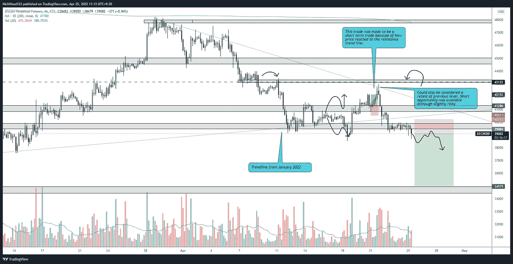

# 比特币周报——比特币为什么会下跌？

> 原文：<https://medium.com/coinmonks/bitcoin-weekly-report-why-is-bitcoins-price-falling-1afb28ed6531?source=collection_archive---------68----------------------->

## 比特币报告(2022 年 4 月 25 日)

比特币——随着价格波动开始变得令人厌恶，比特币无法保持关键水平，价格持续下跌。

我们上周的预测是正确的，它预测了价格可能下跌。比特币未能守住关键支撑位，悲观的重新测试阻力导致市场不确定性。在这篇文章中，我们将触及价格可能反弹，拒绝，关键水平是至关重要的持有。

# BTC 日报

BTC/USD Daily

[https://www.tradingview.com/x/RS6J0LFw/](https://www.tradingview.com/x/RS6J0LFw/)

日线图除了大部分本地支撑趋势线被打破之外，没有太大的变化。这当然不理想，但我们仍然认为有反弹和下一个趋势线的潜力。我认为这种情况是否会持续，将完全取决于价格在到达价值区时的表现。

我有点看跌，因为价格在日线上形成了一个较低的高点，未能守住 40，000 美元的次要支撑位。

# 4 小时时间范围

下面是两张图片，一张是上周的预测，另一张是当前的价格，你会看到这种确切的情况发生了，并为我们提供了几个交易选项。

Last Week 4hr Analysis

Present BTC/USD 4hr

在进行交易时，记住持有哪种偏见总是很重要的。做多是好的，但是了解当前的市场形势和价格变动可以让你知道什么时候获利，等待更多的信息。当在 4 小时图上整体看跌时，趋势线被拒绝。这是一个伟大的迹象，以采取利润和等待更多的信息。

我们现在已经突破了一个关键的水平，正如你所看到的，价格在 18 日下跌至 38，500，然后回升，所以我希望向下移动到这个水平，甚至超过这个水平，然后在再次做空之前再次测试。我正在寻找的东西的类型由箭头表示。

# 主要替代硬币

随着 BTC 的价格下降，alt 也受到影响，alt 没有太大变化。

## 瑞士法郎/美元

ETH/USD 4hr

https://www.tradingview.com/x/xLN4GTX5/

ETH 未能守住支撑位，关键级别的拒绝导致了短暂的机会。寻找价格保持的下一个水平是在 2820 水平附近，我希望看到一些订单在这里被执行，至少暂时保持在这个区域。

如果这个水平不举行，我会非常担心主要替代硬币。

## LTC/美元

上周我们成功预测了 LTC 的反弹区域。本周，LTC 给出了大量警告信号，表明反弹将是短暂的。

LTC/USD 4hr

【https://www.tradingview.com/x/bgM7r9ZG/ 

红色区域是明确的看跌信号，而黄色区域代表可能的多头，但我对此没有信心，绿色区域代表我希望 LTC 在再次做多之前收回的区域。

我在寻找三种情况。在收复 107.5 区域之前，价格可能会回到这个区域一段时间，并继续上升到先前的高点

另一个是价格跌破 96 水平，但很快收回 100 区域，这将是一个积极的迹象，但我仍将期待更多的确认。

最后，价格可能会跌破 92.50 的前期水平，并再次测试 97 区域，未能认领并继续下跌。这可能会导致 LTC 价格跌至 90 英镑、78 英镑甚至 66 英镑

感谢您的阅读，并一如既往地遵循您的交易计划和管理风险。

如果你想和我联系，请跟着我

推特:@NickWoodFX

电子邮件:nw.forex@outlook.com

缺口

这不是财务建议。本文包含的信息是一般性的，没有考虑到您的个人情况。你应该考虑这些信息是否适合你的需要，如果合适的话，向理财顾问寻求专业建议。你并且只有你对你的交易和投资决定负责。我不是专业人士。我对你可能遭受的任何损失或损害不承担任何责任。

> 加入 Coinmonks [电报频道](https://t.me/coincodecap)和 [Youtube 频道](https://www.youtube.com/c/coinmonks/videos)了解加密交易和投资

# 另外，阅读

*   [如何在 FTX 交易所交易期货](https://coincodecap.com/ftx-futures-trading) | [OKEx vs 币安](https://coincodecap.com/okex-vs-binance)
*   [OKEx vs KuCoin](https://coincodecap.com/okex-kucoin) | [摄氏替代品](https://coincodecap.com/celsius-alternatives) | [如何购买 VeChain](https://coincodecap.com/buy-vechain)
*   [ProfitFarmers 点评](https://coincodecap.com/profitfarmers-review) | [如何使用 Cornix Trading Bot](https://coincodecap.com/cornix-trading-bot)
*   [如何匿名购买比特币](https://coincodecap.com/buy-bitcoin-anonymously) | [比特币现金钱包](https://coincodecap.com/bitcoin-cash-wallets)
*   [瓦济里克斯 NFT 评论](https://coincodecap.com/wazirx-nft-review) | [比茨盖普 vs 皮奥克斯](https://coincodecap.com/bitsgap-vs-pionex) | [坦吉姆评论](https://coincodecap.com/tangem-wallet-review)