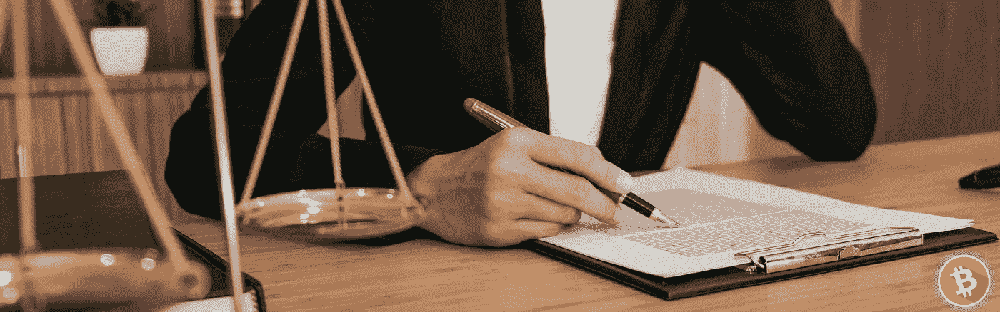
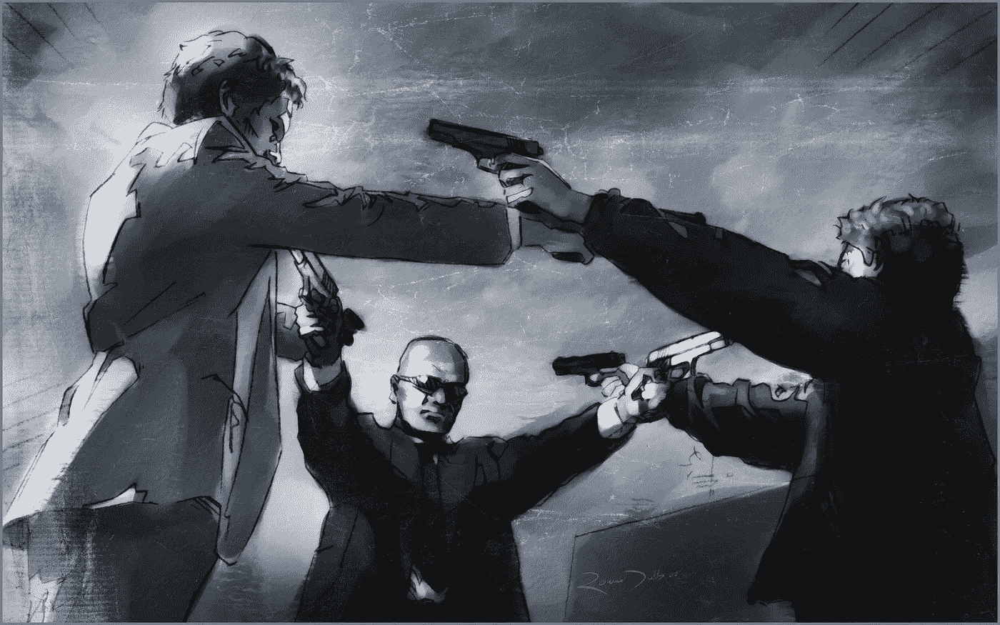
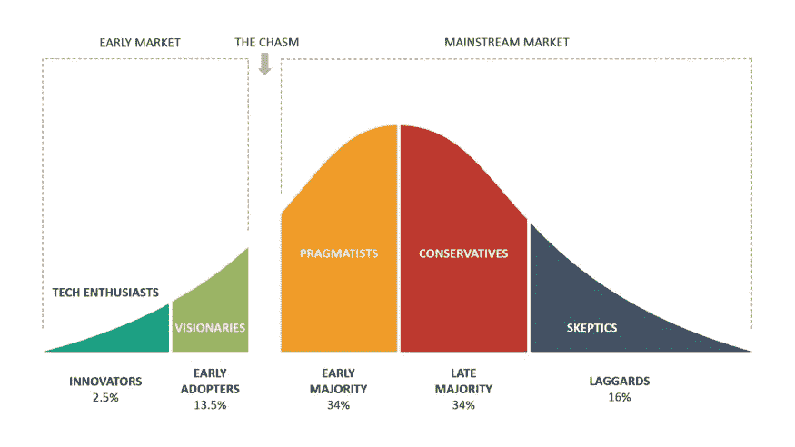

# 比特币:你在涉足什么？

> 原文：<https://medium.com/coinmonks/bitcoin-what-are-you-getting-into-a847372eca8?source=collection_archive---------39----------------------->

## 比特币社会契约

所以，你刚刚*买了一些比特币*，现在它正舒舒服服地躺在你交易所账户的投资组合标签下。每天，旁边都会有一个新的加号或减号，告诉你 BTC 在一定时间内的升值或贬值。

虽然这些数字在正数时很有趣，在负数时令人担忧，但为了从你的比特币中获得最**的**，重要的是不断了解你刚刚*让自己进入了什么*。

一般来说，不断加深对你所投资行业的理解是一个很好的做法。成为一名受过教育的投资者会让你做好应对骗局和阴谋的准备——当你拥有抢手的资本时，你不可避免地会遇到这类事情。

你看，比特币不同于你做过的任何其他投资。

它被称为阴谋、泡沫或虚拟的互联网货币，但它不是这些东西中的任何一种——比特币是一种社会契约。

## 论社会契约

你属于*许多*社会契约。社会是一群人之间的一堆社会契约——全都编织在一起。

虽然通常没有明说，但社会契约决定了你在日常生活中如何对待每个人。它们是你人际关系背后的*代码*——界限和期望——当我们与他人互动时下意识地写下的，有时是希望在未来再次与*互动*。有时候，为了眼前的满足。

通过肢体语言、口头暗示和成文法，我们启动了这些社会契约。

例如，你对待你的兄弟*和对待餐馆服务员*的方式非常不同。当你很自在地和你的兄弟谈论敏感的私人问题时，服务员只会得到一些客套话和菜单询问。

你与牙医的社会契约是，他给你合理的牙科建议并清洁你的牙齿，而你听着并付钱给他。你与朋友的社会契约是，他们支持你，同时也确保你时刻准备着，尽力而为。

假设你的兄弟在餐馆找到了一份工作，碰巧今天是你的服务员。在职业环境中，你和你兄弟的社会契约会改变——他会做他的工作为你服务。如果他像对待他的兄弟一样对待你，他会破坏他和餐馆的社会契约。他可能会被解雇。

你每时每刻都在各种社会契约网络中进进出出，当你购买*比特币、*或将比特币发送给某人，无论是供应商、家人、朋友还是你的牙医，你都进入了一个 ***非常强大的*** 社会契约——一个将颠覆制度的社会契约。

## 论制度

当涉及到处理超敏感问题的社会契约时，人类需要司法和金融机构。

把一个*机构*想象成两方之间的社会契约，它充满了细微差别和复杂性。最终，一个官僚机构将合同逐字逐句写出来，并以暴力强制执行。

当然，这是必要的，因为属于这种特殊社会契约的双方都有很多利害关系。

比如你属于一个国家的管辖范围，你就遵循*法*的社会契约。想象一下，如果联邦调查局以欺诈罪起诉鲍勃。因为联邦调查局威胁要剥夺他的自由——这是一件大事——他们需要绝对确定有证据向陪审团和法官证明 T21。事实上，他们有一个要求清单，可以正式起诉鲍勃——否则他们不允许执行他们的法律——他们与鲍勃的社会契约。

他们的法律是由其他实体执行的其他法律来执行的。

Mexican Standoff by [Rowan Dodds](https://www.artstation.com/rowandodds)

人们常说，与家人或朋友一起经商不是一个好主意。社会契约的变化——从家庭到制度——改变了一切。

## 货币机构

我们当前的政治经济体系是一种社会契约，我们都是出于需要而签订的。你需要用货币来买东西，并计算每样东西相对于其他东西的价值。

简单来说，这个社会契约就是他们维护和保管我们的货币价值，而我们继续参与其中，并为他们的工作提供一些利润。

由于没有其他选择，社会一直处于少数官僚的支配之下，这些官僚有特权接触这个货币网络的开关。不可避免的是，他们违反了社会契约，却没有任何后果。事实证明，这个机构的执法部门被政府垄断，容易受到特殊利益集团的影响。

正因为如此，通货膨胀使得数百万人无法参与经济活动。[货币泡沫](https://en.wikipedia.org/wiki/Financial_crisis_of_2007%E2%80%932008)毁灭了中产阶级，而特权精英们却不用面对任何后果。

也正因为如此，数百万人决定进入一个完全初生的*社会契约*与 [**比特币**](https://bitcoin.org/bitcoin.pdf) 货币网络。

每天，越来越多的人决定将高度敏感的*货币*外包给一种完全去中心化、高度安全且不可改变的虚拟货币。

## 工程货币

当依赖工程解决方案而不是人类的客观性时，会有一种内心的平静。想象一下，如果你每次踩刹车的时候都必须依靠人类。如果他上班迟到了怎么办？如果他那天心情不好是因为睡眠不足呢？

比特币已经证明，一个货币网络是可以设计的——供应[和结算](https://en.bitcoin.it/wiki/Controlled_supply)[可以在没有中央实体的情况下完成。](https://www.bitcoinmining.com/)

没有回头路了。

随着时间的推移，效率更高的系统将最终占据上风。百视达被网飞淘汰了。脸书关闭了 Myspace。播客已经取代了网络脱口秀。

在一个自由市场中，参与一个给予每一方完全透明和合法性的社会契约将永远比一个本质上片面和欺骗性的契约更受欢迎。

你会看到采用曲线将发挥出来。大多数人会将一部分辛苦挣来的钱转移到更安全、更有价值的货币体系中。

Source: [Michael Levin](https://michael-levin.medium.com/)

> 加入 Coinmonks [电报频道](https://t.me/coincodecap)和 [Youtube 频道](https://www.youtube.com/c/coinmonks/videos)了解加密交易和投资

# 另外，阅读

*   [去中心化交易所](https://coincodecap.com/what-are-decentralized-exchanges)|[Bitbns FIP](https://coincodecap.com/bitbns-fip)|[Bingbon 评论](https://coincodecap.com/bingbon-review)
*   [用信用卡购买密码的 10 个最佳地点](https://coincodecap.com/buy-crypto-with-credit-card)
*   [加拿大最佳加密交易机器人](https://coincodecap.com/5-best-crypto-trading-bots-in-canada) | [Bybit vs 币安](https://coincodecap.com/bybit-binance-moonxbt)
*   [阿联酋 5 大最佳加密交易所](https://coincodecap.com/best-crypto-exchanges-in-uae) | [SimpleSwap 评论](https://coincodecap.com/simpleswap-review)
*   购买 Dogecoin 的 7 种最佳方式
*   [最佳期货交易信号](https://coincodecap.com/futures-trading-signals) | [流动性交易所评论](https://coincodecap.com/liquid-exchange-review)
*   [用于 Huobi 的加密交易信号](https://coincodecap.com/huobi-crypto-trading-signals) | [Swapzone 审查](/coinmonks/swapzone-review-crypto-exchange-data-aggregator-e0ad78e55ed7)