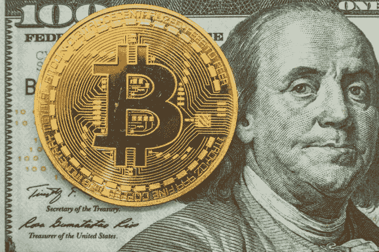
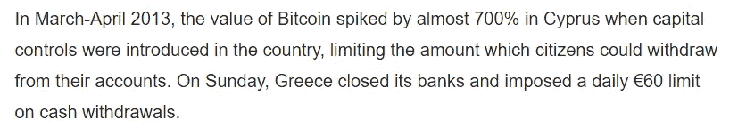
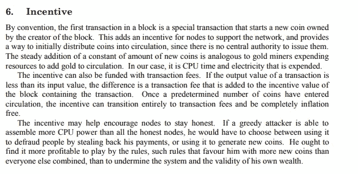
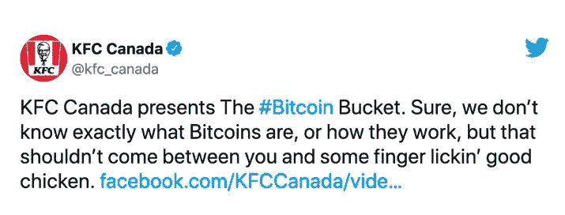
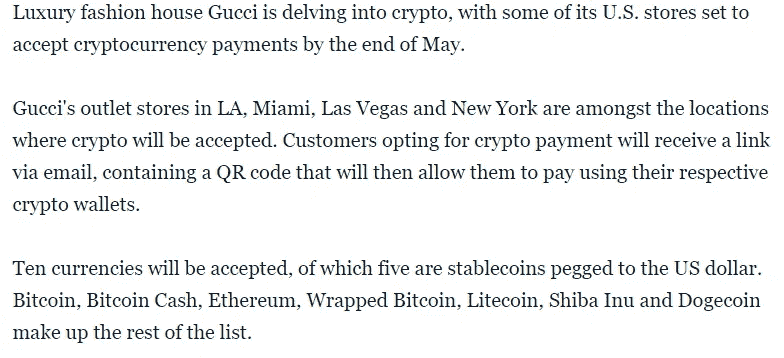
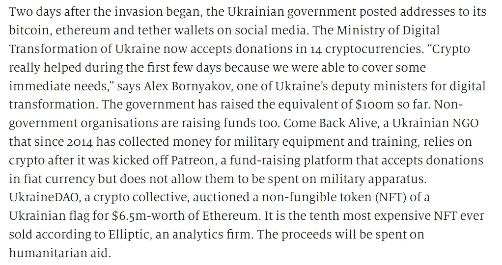
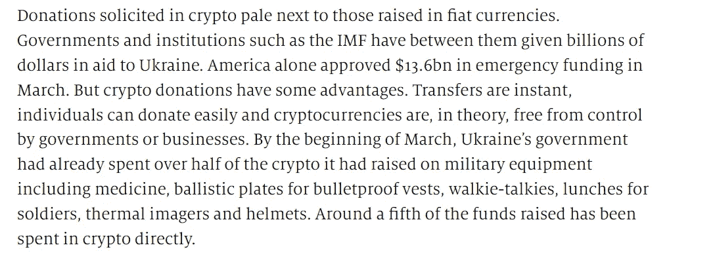
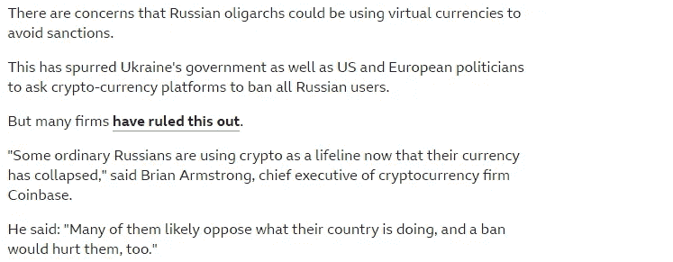
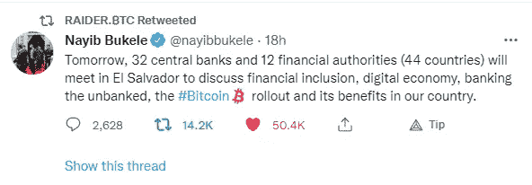
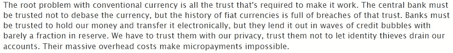

# 比特币:我能用它做什么？

> 原文：<https://medium.com/coinmonks/bitcoin-what-can-i-do-with-it-e95402eeb385?source=collection_archive---------31----------------------->

[自 2008 年金融危机](https://ncrc.org/research-brief-bank-branch-closure-update-2017-2020/#:~:text=Between%202008%20and%202020%2C%20over,commercial%20tenants%20for%20local%20communities.)以来，14%的银行分支机构已经关闭，总计 13，400 家，严重影响了农村和低收入群体。

中本聪关于无银行支付系统的愿景在希腊金融危机期间变成了现实。

[希腊实施资本管制](https://www.newsweek.com/greeks-turn-bitcoin-amid-bank-closures-329554)限制每日取款 60 美元，如果客户的支出超过每日取款限额，就会出现问题。希腊人开始使用比特币进行交易，以避免限制。希腊政府或银行无法对比特币区块链施加限制，因为它是分散的。

Conor Gaffey. Newsweek. 6.30.2015

人们通常认为比特币是一种不稳定的资产、价值储存手段、交换媒介、通货紧缩的硬币、神奇的互联网货币或骗局，但很少有人将比特币描述为一种激励。

中本聪没有将比特币描述为一种投机工具，而是一种支持网络的[激励](https://bitcoin.org/bitcoin.pdf)作为当前金融系统的替代方案。

Bitcoin.org

在伯克希尔·哈撒韦公司最近的投资者会议上，沃伦·巴菲特将比特币描述为一种非生产性资产。他是正确的。比特币本身就是一种不生产的生产。同样，中本聪没有将比特币描述为一种生产性资产，而是一种支持比特币网络的激励。

允许人们在几分钟内而不是几天内在世界各地以低费用无缝地发送资金是有价值的。比特币的批评者往往忽略了这一点。

巴菲特还提到，“如果你告诉我你拥有世界上所有的比特币，并以 25 美元的价格卖给我，我不会接受，因为我会拿它做什么？”巴菲特继续说，“我必须以某种方式把它卖回给你。”此外，巴菲特说，“它不会做任何事情。”

生产性资产不是比特币，而是通过挖掘产生比特币的比特币区块链，这是一种激励作用的最终产品。

巴菲特购买生产糖果、软饮料或剃须刀片的公司的股票；比特币不是以上任何一种。一家公司不发行比特币作为股票。

比特币是分散的，没有所有者，通过采矿产生，这是有争议的，因为如果足够多的矿工整合他们的资产，它可以变得集中。

那么你能用比特币做什么呢？2010 年 5 月 22 日，拉兹洛·汉耶茨用比特币支付了 10，000 英镑，让棒约翰披萨外卖到了。比特币区块链没有生产披萨，但它产生了比特币，为披萨的交付提供了便利。

比特币可能是一种普遍接受的交易媒介。除了披萨，人们还可以用比特币**购买肯德基。**

古驰的一些商店将接受 T4 比特币和其他加密货币 T5。

Meera Navlakha. Mashable. 5.06.2022

如何处理比特币的问题可以用现实世界的案例来回答。比特币不是一个有待检验的假设，而是一种活跃用于交易的数字资产。

俄罗斯入侵乌克兰成为全世界的头条新闻。[乌克兰政府开始使用比特币、以太坊、](https://www.economist.com/the-economist-explains/2022/04/05/how-is-ukraine-using-crypto-to-fund-the-war)和其他加密货币为其部分战争努力提供资金。

The Economist. 4.5.2022\. Updated: 4.19.2022

加密货币捐赠更容易发送到乌克兰，因为区块链网络是点对点的，资金在几分钟内收到。

The Economist. 4.5.2022\. Updated: 4.19.2022

乌克兰的克星俄罗斯可能会考虑接受比特币进行石油和天然气交易，自卢布崩溃以来，俄罗斯公民一直在使用比特币进行交易。

[俄罗斯寡头](https://www.bbc.com/news/business-60870100)也可能利用比特币来逃避制裁。

BBC. 3.25.2022

政府开始理解比特币和区块链技术的效用。2022 年 5 月 16 日，萨尔瓦多总统在推特上发布了一个关于比特币的有趣会议。

中本聪对银行系统持批评态度，现在各国央行正在开会讨论他/她的创造。

[Satoshi Nakamoto](http://p2pfoundation.ning.com/profile/SatoshiNakamoto) on February 11, 2009 at 22:27

我担心在未来的几年里，收养可能会悄悄地成为控制的同义词。

> 加入 Coinmonks [电报频道](https://t.me/coincodecap)和 [Youtube 频道](https://www.youtube.com/c/coinmonks/videos)了解加密交易和投资

# 另外，阅读

*   [币安期货交易](https://coincodecap.com/binance-futures-trading)|[3 comas vs Mudrex vs eToro](https://coincodecap.com/mudrex-3commas-etoro)
*   [如何购买 Monero](https://coincodecap.com/buy-monero) | [IDEX 评论](https://coincodecap.com/idex-review) | [BitKan 交易机器人](https://coincodecap.com/bitkan-trading-bot)
*   [CoinDCX 评论](/coinmonks/coindcx-review-8444db3621a2) | [加密保证金交易交易所](https://coincodecap.com/crypto-margin-trading-exchanges)
*   [红狗赌场评论](https://coincodecap.com/red-dog-casino-review) | [Swyftx 评论](https://coincodecap.com/swyftx-review) | [CoinGate 评论](https://coincodecap.com/coingate-review)
*   [Bookmap 评论](https://coincodecap.com/bookmap-review-2021-best-trading-software) | [美国 5 大最佳加密交易所](https://coincodecap.com/crypto-exchange-usa)
*   [如何在 FTX 交易所交易期货](https://coincodecap.com/ftx-futures-trading) | [OKEx vs 币安](https://coincodecap.com/okex-vs-binance)