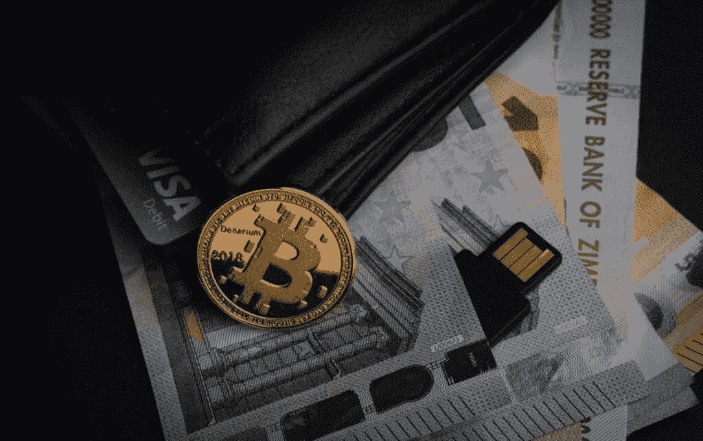

# 比特币——它是什么，它是如何工作的？

> 原文：<https://medium.com/coinmonks/bitcoin-what-is-it-and-how-does-it-work-ca85b6ae9e9b?source=collection_archive---------66----------------------->

创建于 2009 年的比特币仍然是最受欢迎的加密货币。它有时甚至被称为第一种基于区块链技术的分散货币。它多年来的巨大增长已经被越来越多想要了解什么是比特币以及如何使用比特币的人所注意到。

比特币——第一种共享的加密货币

分散支付系统的概念最早出现在 20 世纪 90 年代。2008 年 10 月 31 日，为了应对美国市场的崩溃，一个名叫中本聪(一个人或一群人)的人**发布了一份题为《比特币:一种点对点的电子现金系统》的宣言报告。**

2009 年 1 月 3 日，第一枚比特币发行，为在线交易引入了一个全新的去中心化数字货币系统。**什么是比特币挖矿，它是如何工作的？**

比特币有一个预先确定的可开采的 2100 万个硬币的最大数量。之后，更多的比特币基于“挖掘”以设定的间隔被创造出来。它涉及计算机执行复杂的操作。据估计，比特币挖矿的结束将发生在 2140 年左右。

# 比特币和区块链有什么关系？

我们已经知道了什么是比特币以及它是如何工作的，所以现在是时候继续讨论它与区块链的关系了。与其他加密货币一样，比特币基于区块链技术。它构成了一个不断被覆盖的、无止境的注册表，用于存储和传输使用给定网络进行的所有交易。注册通过对等网络分散在所有参与者中。

自数字货币发布以来，区块链一直在存储比特币交易的所有信息。每笔后续比特币交易都会被其他交易覆盖，从而降低欺诈、撤销或丢失交易的风险。由于先进的加密技术，比特币解决了所谓的双重消费问题，即在网上两次消费数字存储的商品。它不使用任何中介，如银行或在线支付系统。

基于区块链技术，比特币为这种虚拟资产的普及和其他加密货币的创造做出了贡献，**其数量现已超过 10，000 种，并在不断增长。**

# 比特币——你如何使用它？

比特币主要被用作一种投资资产——它被买入，以便在未来以更高的价格卖出。此外，世界上最大的加密货币可以用来进行支付。**萨尔瓦多成为首个接受比特币作为官方支付手段的国家**，比特币与美元一同有效。

# 比特币是什么，如何获取？

加密货币市场吸引了大量投资者，比特币是最受欢迎的选择，其价值随着时间的推移出现了惊人的增长。

对巨额利润的憧憬诱使新的加密投资者通过使用特殊的交易所和加密货币交易所来获得比特币，这些交易所提供不同级别的安全和交易条款。最受欢迎的加密货币交易所包括*币安、比特币基地、Zonda* (前 BitBay)和 *eToro* 。

**然而，购买比特币还不够。**安全存放也很重要。独特的外部钱包，如网站提供的浏览器钱包、桌面钱包和类似于经典 USB 闪存驱动器的安全离线或硬件钱包，可用于此目的。

问问我们吧！ [ir@blufol.io](http://ir@blufol.io)

[www.blufol.io](http://www.blufol.io)

> 加入 Coinmonks [电报频道](https://t.me/coincodecap)和 [Youtube 频道](https://www.youtube.com/c/coinmonks/videos)了解加密交易和投资

# 另外，阅读

*   [MXC 交易所评论](/coinmonks/mxc-exchange-review-3af0ec1cba8c) | [Pionex vs 币安](https://coincodecap.com/pionex-vs-binance) | [Pionex 套利机器人](https://coincodecap.com/pionex-arbitrage-bot)
*   [如何在印度购买比特币？](/coinmonks/buy-bitcoin-in-india-feb50ddfef94) | [瓦济克斯评论](/coinmonks/wazirx-review-5c811b074f5b)
*   [联合国硬币评论](https://coincodecap.com/unocoin-review) | [最佳加密赌注硬币](https://coincodecap.com/best-crypto-staking-coins)
*   如何使用 MetaMask Wallet 获得 KCC 地址？
*   [如何获得自己的。XYZ 领域？](https://coincodecap.com/xyz-domain)
*   [最佳加密交换平台](https://coincodecap.com/best-crypto-swap-platforms) | [最佳加密交易所](https://coincodecap.com/crypto-exchange)