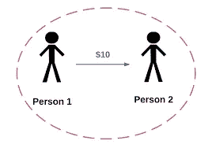

# 比特币白皮书摘要

> 原文：<https://medium.com/coinmonks/bitcoin-white-paper-summary-afd6e5642254?source=collection_archive---------56----------------------->

What is this all about?

他建议使用无信任系统(这意味着不应该涉及任何第三方，只有代码是法律，它将处理交易，而不是一个实际的人或组织)。他如何实现它首先，如果交易发生，它将是不可逆转的，这意味着如果交易被批准，没有人可以阻止它，甚至代码也是如此。因此，它将向卖方保证，如果交易发生，他将得到支付，它使用常规的托管机制，这意味着买方将资金发送到交易所(编码多签名钱包)，只有当买方签署并对卖方的工作感到满意时，资金才会被释放。还有一个重复支出的问题，即如何证明你现在汇的钱确实是你的，而不是已经花在其他事情上。这可以通过一个记录一切并可以向任何人展示任何东西的点对点网络来实现。他提到的问题:

现在发生的所有交易都依赖于第三方(银行),当我们通过第三方汇款时，我们将钱托付给一个未知的实体，并给予该实体完全的权力。现在，我们希望撤销银行必须考虑的任何交易，这是通过访问我们的个人信息并支付高额交易费来完成的。因此，基本上你无法控制你的钱将被处理的方式，他提到，如果我们在两个人之间直接汇款，没有第三方参与，这个问题就可以解决。

Trustless System

他提议使用**一个不可信的系统**(这意味着不应该涉及任何第三方，只有代码才是法律，它将处理交易，而不是一个实际的人或组织)。他如何实现它首先，如果交易发生，它将是不可逆转的，这意味着如果交易被批准，没有人可以阻止它，甚至代码也是如此。因此，它将向卖方保证，如果交易发生，他将得到支付，并且它使用**例行托管机制**，这意味着买方将资金发送到交易所(编码多签名钱包)，只有当买方签署并对卖方的工作感到满意时，资金才会被释放。还有一个问题是**重复消费**意味着如何证明你现在发送的钱实际上是你的，而不是已经花在其他事情上。这可以通过一个记录一切并可以向任何人展示任何东西的点对点网络来实现。

交易和共识机制:

对于交易，发送一个数字硬币，散列将由一个密钥(只有发送者知道，称为私钥)签名，并与另一个密钥(公钥)一起发送签名的硬币，以便接收者可以识别发送者。

问题是建立硬币的所有权(发送者是当前的发送者，并且在交易之后，所有权应该被改变，因此签名的硬币将被送到铸造场所，在那里可以确定所有者，并且他们将铸造新的硬币，并且该硬币将被发送到接收者，并且最早的交易将被认为是真实的交易

唯一的问题是，造币机构将拥有这样的权力，即公开他们和网络团体处理的所有交易，人们需要验证和接受它

时间戳和工作证明

How Proof of work works?

使用当前时间发布块的散列，现在问题是我们应该在哪里发布以及如何发布。如何通过工作证明来回答零件，因此每个矿工必须解决一个复杂的问题，这个复杂的问题可以使用 CPU 能力来解决，并且这个花费的 CPU 能力就是工作，第一个解决问题的人显示其工作证明，并且链越长，计算越多，工作证明越好，如果有人想要改变一个事务，则必须在之后改变一系列块，并且赶上他们是极其困难的

网络

在论文中是不言自明的:

运行网络的步骤如下:

1.  新事务被广播到所有节点。
2.  每个节点将新事务收集到一个块中。
3.  每个节点都致力于为它的块找到一个困难的工作证明。
4.  当一个节点找到工作证明时，它会将该块广播给所有节点。
5.  只有当块中的所有事务都是有效的并且还没有用完时，节点才接受该块。
6.  节点通过创建链中的下一个块来表达它们对该块的接受，使用被接受的块的散列作为前一个散列。节点总是认为最长的链是正确的，并将继续努力延长它。如果两个节点同时广播下一个块的不同版本，一些节点可能首先接收一个或另一个。在这种情况下，他们处理收到的第一个分支，但是保存另一个分支以防它变长。当找到下一个工作证明并且一个分支变得更长时，该联系将被打破；在另一个分支上工作的节点将切换到更长的分支。

新的事务广播不一定需要到达所有节点。只要到达很多节点，用不了多久就会进入一个街区。块广播也允许丢弃消息。如果一个节点没有接收到一个块，当它接收到下一个块并意识到它错过了一个块时，它将请求它。

动机

这是比特币如此成功的一个关键原因，所以每增加一个区块都会产生一个新的硬币，而且他们还可以保留交易费。这是对 CPU 能力和电力的激励，这将有助于矿工诚实。假设有人想使用这种强大的 CPU 来入侵链，那么将会出现取回交易或只通过硬币赚取(这更有利可图)的困境，所以诚实的工作比黑客工作有更好的回报。

节省磁盘空间

为了保存事务，我们使用 Merkel 树，它有一个包含所有事务的根节点。点击此处阅读[默克尔树](https://www.notion.so/Merkel-Tree-1409ccb3d3fc4e25b576c635794e03c8)有助于验证交易是否是该树的一部分

隐私:

使公钥匿名

> 加入 Coinmonks [电报频道](https://t.me/coincodecap)和 [Youtube 频道](https://www.youtube.com/c/coinmonks/videos)了解加密交易和投资