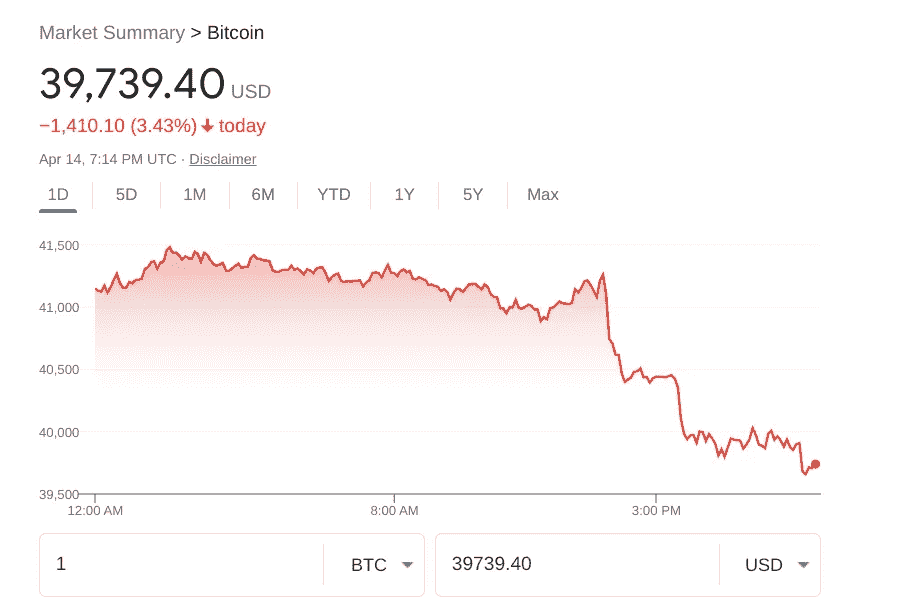

# 到 2024 年，比特币将成为受监管的证券

> 原文：<https://medium.com/coinmonks/bitcoin-will-be-a-regulated-security-by-2024-7e158da0c420?source=collection_archive---------16----------------------->

Image Credit: [BTC Keychain](https://www.flickr.com/photos/100239928@N08/14861107819)

白宫最近发布了一项行政命令，实质上是说，联邦政府将在未来几个月内研究如何解决分散的、因此不受监管的加密货币市场。那 EO 本质上就像小说里的伏笔。如果你投资于加密，小心。政府会来分一杯羹，而且会在比特币实现涅槃之前拿到；预测的每枚硬币 10 万美元的价格。

我怀疑我们可以在 2022 年底前看到加密集中化的开端，并在 2024 年前实现完全集中化。在这一点上，持有是一个被误导的狂妄自大的游戏。

尽管有这一警告和其他警告，许多加密货币爱好者在加密货币发生时会表现得震惊，并参与社交媒体的崩溃，向天空尖叫说集中化是不公平的，是对他们自由的攻击。一个新的 subreddit 将会出现，它可能会在网站受欢迎程度上超过著名的 [*华尔街赌注*](https://www.reddit.com/r/wallstreetbets/) ，因为“不知情的加密者”会从伪专家和长期加密爱好者那里获得信息，他们都在世界上最好的回音室中表达他们的建议、蛇油和愤怒。这丝毫不会影响政府的中央集权计划。

今天比特币的价格接近每枚 40000 美元，如下图所示。

假设你在 2011 年秋天心血来潮投资了 30 个比特币[30 美元。今天你的硬币价值 1200 万美元，你也不会读到这篇文章。你会忙着决定是去玩四季高尔夫球场还是去玛雅丛林滑索之旅。另外，FOMO 的例子用得太多了，可能已经厌倦了。因此，假设你在 2013 年初投资 1000 美元，买了一个比特币，现在价值是你投资的 40 倍。即使是很小的投资金额，回报却是 40 倍，这是闻所未闻的！最初的投资很少，我会兑现它，感谢我的幸运星。正如我上面所说的，持有只是一种傲慢的行为。](https://www.sofi.com/learn/content/bitcoin-price-history/)

## **加密货币，美国证交会&豪威测试**

当美国政府开始集中化进程时，我认为它已经开始了，考虑到现在在北美安装了超过 35，000 台加密专用 ATM 机，我预计比特币和以太坊的市值将大幅下降，而 Doge tank 等其他硬币将在互联网的黑市中找到自己的位置。这些暗网操作如何使其从洗钱过程中运作，将需要在知道如何从政府的窥探中隐藏非法活动方面的巨大飞跃。[搅拌器、平底玻璃杯](/coinmonks/why-are-bitcoin-mixers-legal-9dcd73380564)和类似的技术现在在分散的市场上对洗钱有神奇的作用，但是它们在集中的市场上有用吗？

至于你的比特币和以太币(可能只有硬币存活下来)，中央化过程将把它们变成证券，它们将像任何其他金融支持的证券一样受到监管和征税。不久前的情况并非如此，当时 SEC 将比特币严格视为法定货币的替代货币。前证券交易委员会主席杰伊·克莱顿[说](https://www.reuters.com/legal/transactional/are-cryptocurrencies-securities-sec-is-answering-question-2022-03-21/)“有不同类型的加密资产。让我试着把它们分成两个区域。最常被引用的纯交易媒介是比特币。作为货币的替代品，大多数人认为它不是一种证券。”

然而，根据现任 SEC 主席加里·詹斯勒(Gary Gensler)的说法，SEC 现在认为加密货币硬币是豪威测试下的证券，并已[声明](https://www.reuters.com/legal/transactional/are-cryptocurrencies-securities-sec-is-answering-question-2022-03-21/)“如果有人正在通过出售代币筹集资金，而买方预计会因该团体赞助卖方的努力而获利，这符合某种证券”(“SEC 主席加里·詹斯勒关于他对加密货币监管的愿景”2021 年 8 月 4 日)。

[豪威测试](https://en.wikipedia.org/wiki/SEC_v._W._J._Howey_Co.)到底是什么？从技术上讲,“豪威标准”是一项法律，它产生于最高法院“证交会诉 W.J .豪威公司”案,《美国最高法院判例汇编》第 328 卷，第 293 页(1946)。为了使一项投资成为合格的证券，豪威测试需要以下特征:

*—金钱的投入*

*—在普通企业*

*——合理期望从他人的努力中获得利润*

那是简单的、老生常谈的语言，对吗？加密货币硬币和代币之前未能通过豪威测试(前白宫 EO)，现在在测试中获得了及格分数，因此很快将被列为需要全面监管和披露的证券。对于比特币爱好者来说，这是一个难以接受的消息，在我看来，这主要是因为它打破了他们最初成为爱好者的精神。

这不仅仅是为了他们的利润，更是为了开创一种新的经济，这种经济可以与法定货币并行存在，但也不受标准的政府监管和干预。如果没有能力按照他们想要的方式开展业务，那些定义密码市场的人将会叛变，并迅速找到另一种形式的去中心化来享受并最终从中获利。如果你想像他们一样，或者如果你有 2011 年不买 1 美元比特币的 FOMO，只要在加密集中化时跟随他们的行动就行了。你可能会无意中发现下一个很酷的、不受监管的金融事物。

在此期间，如果你持有的是比特币，至少要考虑到身边发生的伏笔。

*   结束

> 加入 Coinmonks [电报频道](https://t.me/coincodecap)和 [Youtube 频道](https://www.youtube.com/c/coinmonks/videos)了解加密交易和投资

# 另外，阅读

*   [交易信号是什么？](https://coincodecap.com/trading-signal) | [Bitstamp vs 比特币基地](https://coincodecap.com/bitstamp-coinbase) | [买索拉纳](https://coincodecap.com/buy-solana)
*   [ProfitFarmers 回顾](https://coincodecap.com/profitfarmers-review) | [如何使用 Cornix Trading Bot](https://coincodecap.com/cornix-trading-bot)
*   [十大最佳加密货币博客](https://coincodecap.com/best-cryptocurrency-blogs) | [YouHodler 评论](https://coincodecap.com/youhodler-review)
*   [my constant Review](https://coincodecap.com/myconstant-review)|[8 款最佳摇摆交易机器人](https://coincodecap.com/best-swing-trading-bots)
*   [MXC 交易所评论](/coinmonks/mxc-exchange-review-3af0ec1cba8c) | [Pionex vs 币安](https://coincodecap.com/pionex-vs-binance) | [Pionex 套利机器人](https://coincodecap.com/pionex-arbitrage-bot)