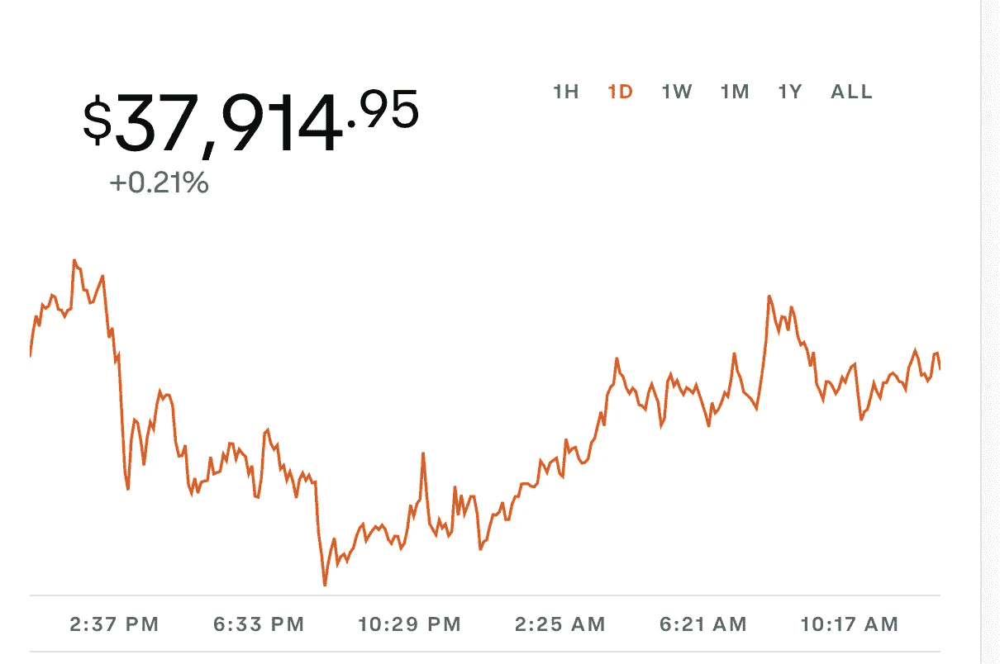

# 比特币 37500 美元:为什么我不担心

> 原文：<https://medium.com/coinmonks/bitcoins-37-500-why-im-not-concerned-663b9febb886?source=collection_archive---------45----------------------->

如果你去加密 YouTube 或加密 Twitter，人们似乎被打败了。

自 11 月 8 日以来，Ark Invest 的加密和股票等资产的“风险”下降了 50%。

 [## 比特币从历史高点下跌了约 50%，但专家警告称，这样的低迷是正常的

### 周一，加密货币市场的抛售仍在继续，其总价值在过去 24 小时内下降了 1300 亿美元…

www.cnbc.com](https://www.cnbc.com/2022/01/24/what-investors-should-know-as-bitcoin-drops-50percent-from-its-all-time-high.html) 

我不担心。对许多人来说，这是一个买入的机会，我也在其中。在 YouTube 或 Twitter 上谈论加密或方舟型股票和基金的大多数人都是动量交易者，他们在市场上的经验有限，职业经验更有限。不是所有人，而是大多数。

我认识一些人，他们在 2016/2017 年拥有 1000 个以太币，当时价格不到 100 美元，现在他们名下只有不到 50 个以太币，基本上从未盈利。在过去的 5 年里，他们“交易”的钱越来越少，更重要的是，花在交易上的时间给了他们什么吗？不，他们浪费了时间和金钱，而他们本可以做得更久。

互联网上的“人物”不在他们自己的互联网渠道之外建立任何东西是有原因的，因为他们所做的事情(大部分时间)只为他们自己。先令赞助交换链接，显示图表模式，没有任何意义，无论他们能做什么来获得一个观点。

今年我要为超过 16 万美元的资本收益缴税。听着，虽然不是几百万，但这是一大笔税金。我很感激这一年过得很好。当你交易资产时，你必须支付交易税，包括短期和长期资本利得税。如果你失去了交易，你就失去了钱，除非你在其他地方有很大的利润，否则它很少是正面的。

为什么我不担心 37500 美元？因为在我看来这是一个健康的修正。这个领域过去和现在都有太多的废话。Altcoins 和 NFTs 并不是一文不值，但大多数需要下跌 90%以上，并在那里呆上几个月。我们需要一次严厉的纠正，向人们表明这不仅仅是“股价上涨”。

一旦市场对人们的惩罚足够严厉，比特币和其他东西就会复苏。现在享受低买(不是财务建议)。多了解一下比特币，多了解一下以太坊，选几个其他的项目，了解一下。

不要听 Youtube 频道之外可信度为零的影响者的话。找到这个领域最优秀的头脑，并从中汲取精华。这会有回报的。甚至倾听那些有不同观点的人，如果他们有一个有效的观点。我的经验是，说到比特币，他们只是研究得不够。

试着将这些下跌、崩盘和熊市视为打折购物的机会。会有帮助的！

不是财务建议。

Cypto Zenn。

> *加入 Coinmonks* [*电报频道*](https://t.me/coincodecap) *和* [*Youtube 频道*](https://www.youtube.com/c/coinmonks/videos) *了解加密交易和投资*

# 另外，阅读

*   [Coldcard 评论](https://coincodecap.com/coldcard-review) | [BOXtradEX 评论](https://coincodecap.com/boxtradex-review)|[uni swap 指南](https://coincodecap.com/uniswap)
*   [比特币基地评论](/coinmonks/coinbase-review-6ef4e0f56064) | [德里比特评论](/coinmonks/deribit-review-options-fees-apis-and-testnet-2ca16c4bbdb2) | [FTX 评论](/coinmonks/ftx-crypto-exchange-review-53664ac1198f)
*   [n 零复习](/coinmonks/ngrave-zero-review-c465cf8307fc) | [Phemex 复习](/coinmonks/phemex-review-4cfba0b49e28) | [PrimeXBT 复习](/coinmonks/primexbt-review-88e0815be858)
*   最佳[区块链分析](https://bitquery.io/blog/best-blockchain-analysis-tools-and-software)工具| [赚比特币](/coinmonks/earn-bitcoin-6e8bd3c592d9)
*   [Cloudbet 赌场评论](https://coincodecap.com/cloudbet-casino-review) | [点火赌场评论](https://coincodecap.com/ignition-casino-review)
*   [加密套利](/coinmonks/crypto-arbitrage-guide-how-to-make-money-as-a-beginner-62bfe5c868f6)指南| [如何做空比特币](/coinmonks/how-to-short-bitcoin-568a2d0b4ae5)
*   [如何在加拿大购买加密货币？](https://coincodecap.com/how-to-buy-cryptocurrency-in-canada)
*   [无聊猿游艇俱乐部(BAYC)评论](https://coincodecap.com/bored-ape-yacht-club-bayc-review)