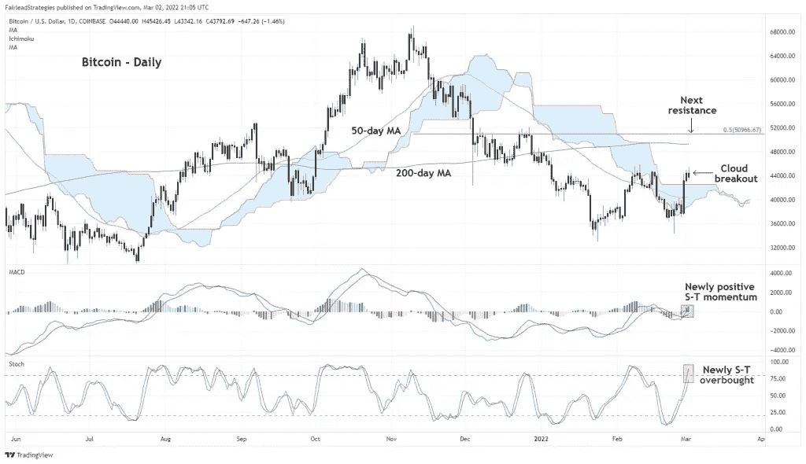

# 比特币突破“一片云”可能会导致持续的上升趋势

> 原文：<https://medium.com/coinmonks/bitcoins-breakout-from-the-ichimoku-cloud-could-result-in-a-continued-uptrend-fdc15a857136?source=collection_archive---------55----------------------->

**Visit our website:-** [**https://bitcoinsupports.com/**](https://bitcoinsupports.com/)

虽然比特币在云计算领域的突破表明未来还会有更多收益，但一位观察人士认为，地缘政治风险的增加使得所有加密投资都必须严格止损。根据 Fairlead Strategies 的数据，比特币似乎已经出现转机，并可能在短期内继续获得动力，理由是一种被广泛使用的技术工具称为 Ichimoku cloud。Fairlead Strategies 的创始人兼管理合伙人凯蒂·斯托克顿(Katie Stockton)表示，“比特币已经通过了每日云所概述的阻力，很可能会在今天收盘时确认其突破。”尽管周三交易小幅走低，但比特币在协调世界时设法收于云端之上，证实了看涨趋势的逆转。

“基于 200 天移动平均线(MA)和 50%回撤水平，突破逆转了中期下跌趋势，并在图表上的下一个大障碍是 50，000 美元至 51，000 美元的范围，”Stockton 指出。

市云是由日本记者细田五一在 20 世纪 60 年代末发明的，由两条线组成:领先跨度 A 和领先跨度 b。为了显示未来的支持或阻力，两条线都在最后一根蜡烛前 26 天显示。指示器使用复杂的公式绘制这些线条。另一方面，用户不需要理解指示器的内部工作，因为这是由图表提供者处理的，并且相反可以专注于解读指示器提供的信号。

当领先跨度 A 穿越领先跨度 B 上方时，云线变绿，表示多头偏向。当前导跨度 B 低于前导跨度 A 时，云的颜色变为红色。云线上方或下方的交叉点通常被视为看涨或看跌趋势变化的早期指标。

长期趋势和可能的支撑位和阻力位经常使用 200 日均线(MA)和斐波那契回撤线来确定。

**Visit our website:-** [**https://bitcoinsupports.com/**](https://bitcoinsupports.com/)

最近的突破得到了 MACD 柱状图的支持，柱状图的读数高于零或看涨。斯托克顿表示，“我们的短期指标指向更高。”迄今为止，突破尚未实现，加密货币目前的交易价格约为 43，400 美元，当日下跌 1%。日线图上的随机指标处于超买信号的边缘，表明在上涨之前可能会暂时整理。

“在这种情况下，我们会对任何加密货币交易持有严格的止损，”Stockton 说，并补充说每日云现在可以提供支持。据报道，由于俄罗斯和乌克兰的需求不断上升，比特币自一周前触及 34500 美元以下的低点以来，已经上涨了近 25%。据最新报道，俄罗斯人已经控制了乌克兰港口城市赫尔松，一个乌克兰代表团正在前往白俄罗斯与俄罗斯同行进行第二轮停火谈判的路上。

**访问我们的网站:-**[**https://bitcoinsupports.com/**](https://bitcoinsupports.com/)

**免责声明:以上为作者观点，不应视为投资建议。读者应该自己做研究。**

> 加入 Coinmonks [电报频道](https://t.me/coincodecap)和 [Youtube 频道](https://www.youtube.com/c/coinmonks/videos)了解加密交易和投资

# 另外，阅读

*   [3 商业评论](/coinmonks/3commas-review-an-excellent-crypto-trading-bot-2020-1313a58bec92) | [Pionex 评论](https://coincodecap.com/pionex-review-exchange-with-crypto-trading-bot) | [Coinrule 评论](/coinmonks/coinrule-review-2021-a-beginner-friendly-crypto-trading-bot-daf0504848ba)
*   [莱杰 vs n rave](/coinmonks/ledger-vs-ngrave-zero-7e40f0c1d694)|[莱杰 nano s vs x](/coinmonks/ledger-nano-s-vs-x-battery-hardware-price-storage-59a6663fe3b0) | [币安评论](/coinmonks/binance-review-ee10d3bf3b6e)
*   [Bybit Exchange 审查](/coinmonks/bybit-exchange-review-dbd570019b71) | [Bityard 审查](https://coincodecap.com/bityard-reivew) | [Jet-Bot 审查](https://coincodecap.com/jet-bot-review)
*   [3 commas vs Cryptohopper](/coinmonks/3commas-vs-pionex-vs-cryptohopper-best-crypto-bot-6a98d2baa203)|[赚取加密利息](/coinmonks/earn-crypto-interest-b10b810fdda3)
*   最好的比特币[硬件钱包](/coinmonks/hardware-wallets-dfa1211730c6) | [BitBox02 回顾](/coinmonks/bitbox02-review-your-swiss-bitcoin-hardware-wallet-c36c88fff29)
*   [block fi vs Celsius](/coinmonks/blockfi-vs-celsius-vs-hodlnaut-8a1cc8c26630)|[Hodlnaut 审核](/coinmonks/hodlnaut-review-best-way-to-hodl-is-to-earn-interest-on-your-bitcoin-6658a8c19edf) | [KuCoin 审核](https://coincodecap.com/kucoin-review)
*   [Bitsgap 审查](/coinmonks/bitsgap-review-a-crypto-trading-bot-that-makes-easy-money-a5d88a336df2) | [Quadency 审查](/coinmonks/quadency-review-a-crypto-trading-automation-platform-3068eaa374e1) | [Bitbns 审查](/coinmonks/bitbns-review-38256a07e161)
*   [加密复制交易平台](/coinmonks/top-10-crypto-copy-trading-platforms-for-beginners-d0c37c7d698c) | [Coinmama 评论](/coinmonks/coinmama-review-ace5641bde6e)