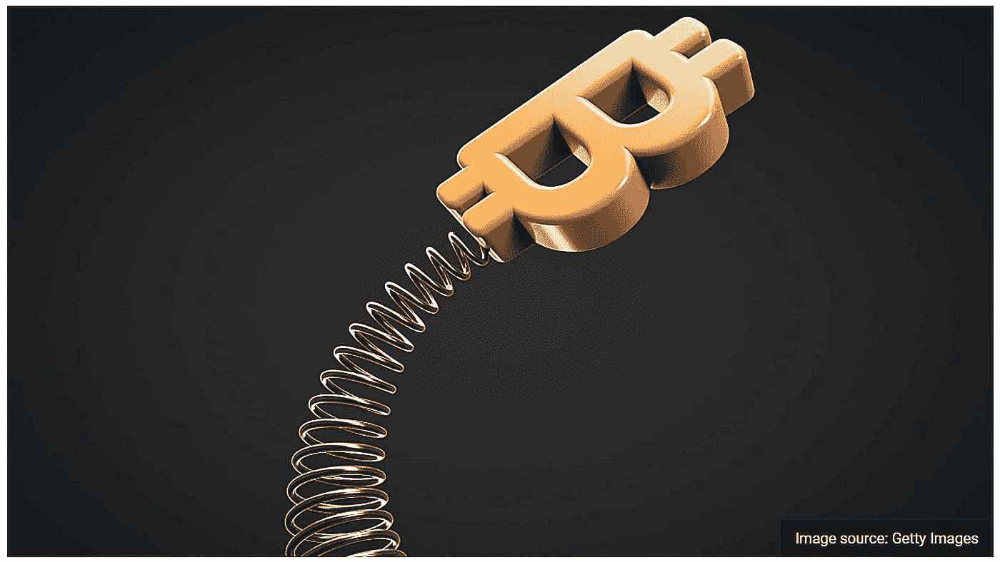
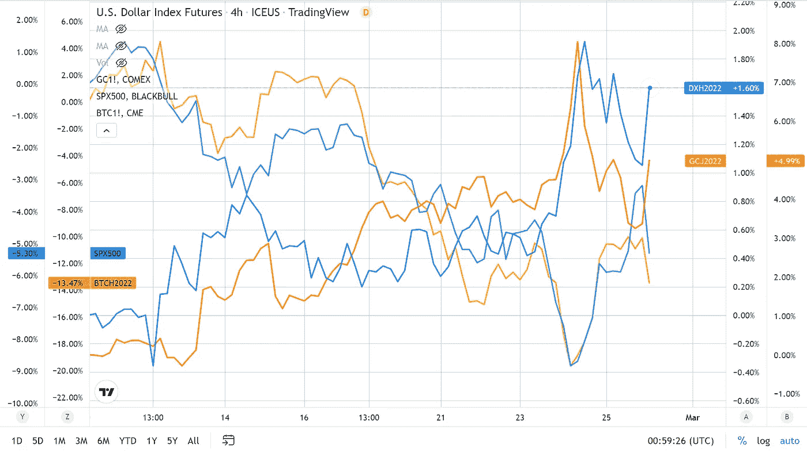
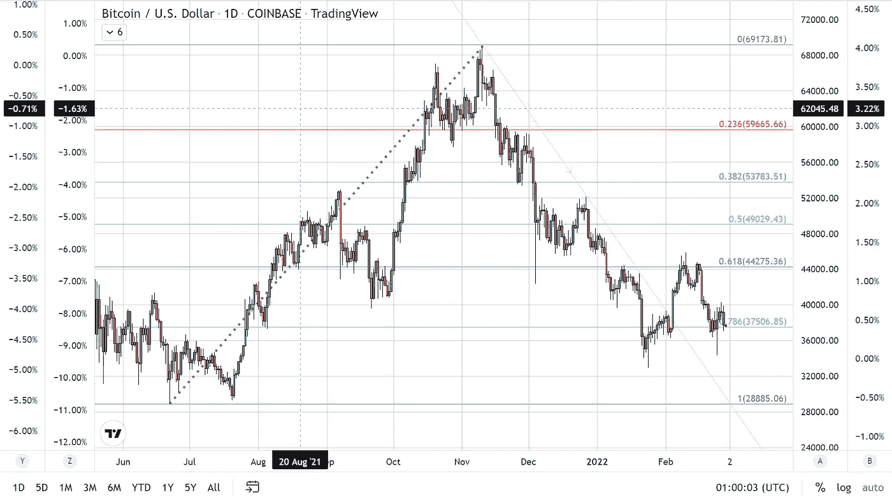

# 比特币的短暂反弹

> 原文：<https://medium.com/coinmonks/bitcoins-brief-bounce-38c181f88a3d?source=collection_archive---------32----------------------->

过去一周，尤其是过去两天，包括交易员在内的所有人都在思考的话题是东欧的形势，因此我甚至不必说出相关国家的名称，读者就能知道我指的是什么。

过去两周，乌克兰和俄罗斯边境的紧张局势在更广泛的市场上引发了强烈的避险情绪。我们看到主要指数下跌。例如，S&P 在 2 月 10 日至 2 月 24 日期间下跌了 9%。与此同时，比特币下跌了 15%以上，因为它与股票市场的相关性随着避险情绪的增强而显著增强。

这创造了对美元和黄金等避险资产的强劲需求。在 2 月 10 日开始的两周内，尽管黄金的价值是由其对美元的价值决定的，但这些传统的避险货币却一前一后地上涨。在同样的 14 天里，美元指数上涨了 2.26%，而黄金期货的价值增加了 5.64%。

今天，交易商们目睹了由俄罗斯——乌克兰的担忧所带来的普遍趋势的逆转。至少可以说，周五市场的转变令人困惑，因为它是基于俄罗斯入侵乌克兰的可能性越来越大。周四早上，当普京总统下令这样做并有效地夺取乌克兰东部一个地区的土地时，恐惧成为了现实。

与预期的结果相反，入侵似乎重新点燃了风险情绪，导致加密货币和主要指数今天上涨。自昨日触及预期低点以来，标准普尔 500 迅速飙升，昨日较盘中低点下跌 5%。比特币也是如此，实际上比 S&P 时间提前了大约 16 个小时，并超过了它，从昨天的盘中低点上涨了 11.70%。

风险资产(BTC、S&P)之间的相关性并不新鲜。事实上，最近同步性明显加强。自 2021 年下半年以来，比特币和股市之间的相似性一直在增加，本周这种关系(60 天相关性)正式达到了有记录以来的最高点。

令人困惑的不是 BTC 和 S&P 的联动，也不是美元指数和黄金的联动。就我而言，这两种货币属于同一类资产，而且在某些情况下，尽管黄金的估值是基于其对美元的强势，但 GLD 和美元将同步波动。不合理的是，在有可能引发世界大战的持续冲突中，这种冒险情绪从何而来？

没有计算在内的是当前这种逆转以及从避险资产转向风险更高的资产的时机。鉴于逃往安全港是基于俄罗斯入侵的可能性，这一主题在过去几周得到了加强，因为紧张局势似乎更有可能演变为军事行动。交易员的担忧成为现实，令许多人感到意外，他们认为俄罗斯只是在故作姿态，以迫使北约做出承诺，即乌克兰不会被接纳为北大西洋公约组织成员。许多人和政治家认为，俄罗斯不会全面入侵，因为他们认为这将引发欧洲东西方之间的流血冲突，给双方带来自二战以来从未有过的生命损失。没人认为北约会屈服于俄罗斯的威胁，阻止一个主权国家加入联盟。我怀疑，更少有人认为俄罗斯会通过非外交手段攫取土地，实际上是保证乌克兰永远不会加入北约，但更令人不安的是，他们会在本质上完全失去主权。不管普京怎么说，他的所作所为与纳粹德国步调一致，借用了阿道夫·希特勒在纳粹德国扩张中实施的策略。

**俄罗斯政权和第三帝国**

希特勒的第一次土地掠夺是在 1936 年 3 月 7 日，当时他的军队占领了莱茵兰。他的理由与他下一次入侵时的理由一样，即该领土上有讲德语的人，因此，他们被违背自己的意愿关押在一片根据其种族构成应该属于德国的土地上。这正是弗拉基米尔·普京声称占领乌克兰的原因。

相似之处还不止于此。不仅是重定向是相同的，而且是用来得到他想要的东西的步骤和策略。例如，第二次纳粹土地掠夺分两个阶段发生。首先，在 1938 年 10 月，德国占领了捷克斯洛伐克的苏台德区，那里有大多数人认为自己是德国人。捷克斯洛伐克试图通过实施亲德外交政策来安抚德国，只要求保持自治。与俄罗斯声称他们只希望生活在乌克兰境内的俄罗斯人得到公平对待相同，声称歧视甚至种族灭绝他们的人民是普遍的，他们没有推翻乌克兰的愿望。

在做了希特勒要求的一切后，纳粹在占领了苏台德地区的一小部分后，还是推翻了捷克斯洛伐克。历史往往会重复同样的周期，就像市场一样。三天前，我和大多数人一样，对俄罗斯的真实意图一无所知。在这一次沿着记忆的黑暗小巷的快速旅行之后，意图似乎变得更加清晰和更加险恶。

**结论**

海外交易再次开放，市场再次以合理的方式运行，美元指数和黄金自周一上午在亚洲开盘以来飙升，比特币和 S&P 下跌。

在这个全球冲突的时代，我们可以预期这种情况会继续下去，直到它得到解决，这可能是及时的或血腥的，可能两者兼而有之。出于这个原因，我预计比特币将继续走低。然而，比特币正试图守住位于 37，500 美元的 78%回撤位置。如果全球叙事保持不变，这个支撑位将无法维持，下一个支撑位在 35，000 美元，低于 6 月触及的低点 28，000 美元。

> 加入 Coinmonks [电报频道](https://t.me/coincodecap)和 [Youtube 频道](https://www.youtube.com/c/coinmonks/videos)了解加密交易和投资

# 另外，阅读

*   [加密复制交易平台](/coinmonks/top-10-crypto-copy-trading-platforms-for-beginners-d0c37c7d698c) | [如何在 WazirX 上购买比特币](/coinmonks/buy-bitcoin-on-wazirx-2d12b7989af1)
*   [CoinLoan 评论](https://coincodecap.com/coinloan-review)|[Crypto.com 评论](/coinmonks/crypto-com-review-f143dca1f74c)
*   [如何在加拿大购买加密货币？](https://coincodecap.com/how-to-buy-cryptocurrency-in-canada)
*   [百无聊赖的猿游艇俱乐部(BAYC)评论](https://coincodecap.com/bored-ape-yacht-club-bayc-review)
*   [5 款最佳加密交易终端](https://coincodecap.com/crypto-trading-terminals) | [最佳 DeFi 应用](https://coincodecap.com/best-defi-apps)
*   [最佳网上赌场](https://coincodecap.com/best-online-casinos) | [币安评论](/coinmonks/binance-review-ee10d3bf3b6e) | [BitMEX 评论](https://coincodecap.com/bitmex-review)
*   [麻雀交换评论](https://coincodecap.com/sparrow-exchange-review) | [纳什交换评论](https://coincodecap.com/nash-exchange-review)
*   [美国最佳加密交易机器人](https://coincodecap.com/crypto-trading-bots-in-the-us) | [经常性回顾](https://coincodecap.com/changelly-review)
*   [在印度利用加密套利赚取被动收入](https://coincodecap.com/crypto-arbitrage-in-india)
*   [Godex.io 审核](/coinmonks/godex-io-review-7366086519fb) | [邀请审核](/coinmonks/invity-review-70f3030c0502) | [BitForex 审核](https://coincodecap.com/bitforex-review)