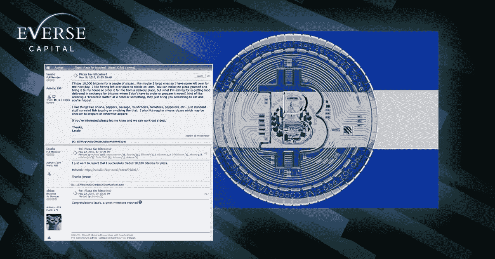
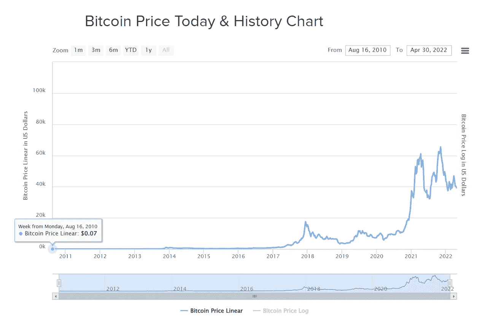
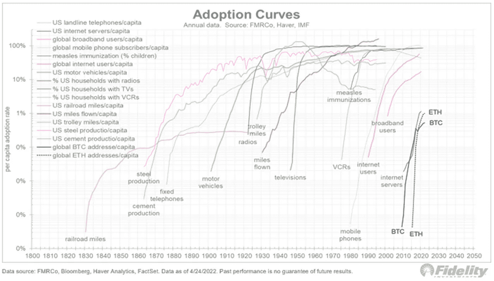
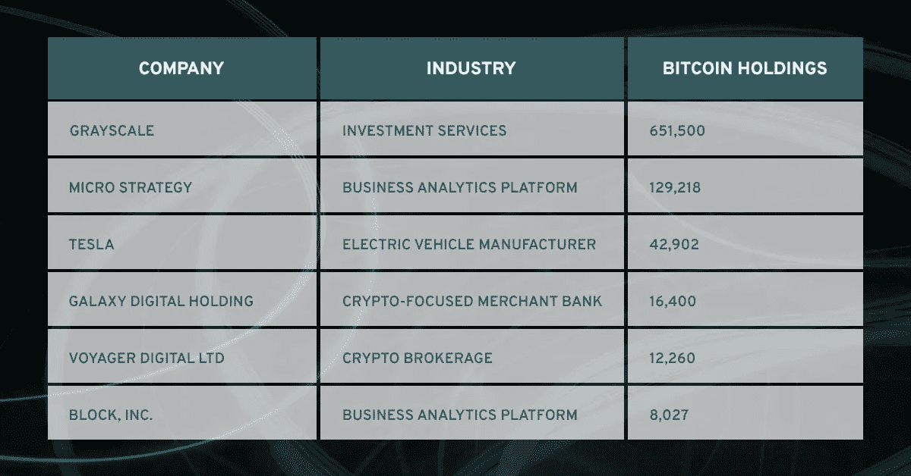
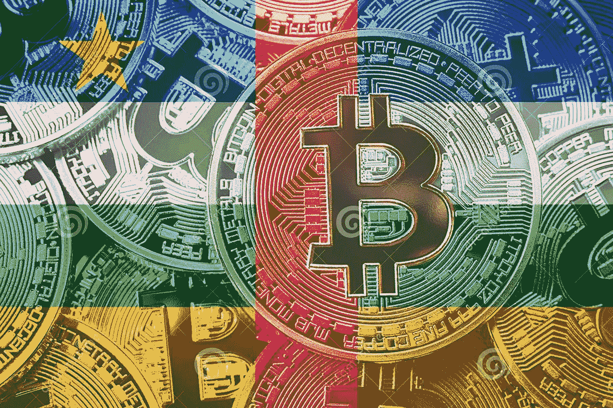
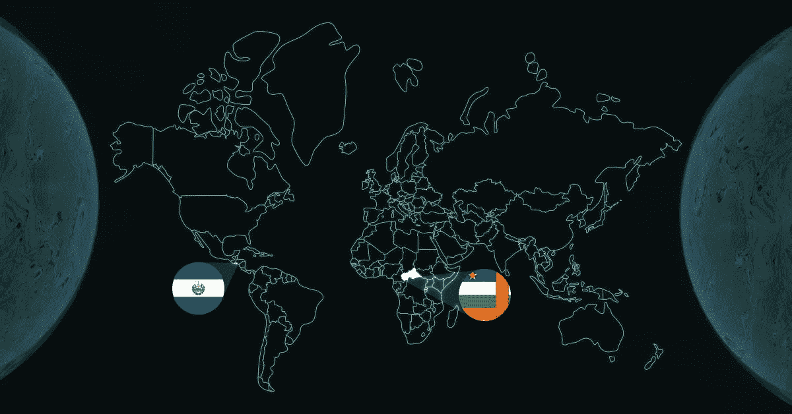

# 比特币征服全球

> 原文：<https://medium.com/coinmonks/bitcoins-conquest-for-global-adoption-4ce3c5916487?source=collection_archive---------32----------------------->

比特币开始了它从一份匿名白皮书到现在快速增长的投资资产的旅程，通过数字化和征服全球采用开创了金融的下一个阶段。

从 ***披萨支付到法定货币*** ，以下是我们对比特币现状的见解:

Bitcoin from purchasing pizza in reddit to legal tender in El Salvador

BTC 已经将**区块链技术**提升到了 1991 年最初概念化的下一个水平。区块链技术提供了一种去中心化和无许可的信息传输，但被广泛用作比特币普及的虚拟货币模式

A history of Blockchain

比特币的主张简单而有价值:

🔹分散的

🔹未经许可

🔹抵制审查

🔹有限供应

这些指标使其市值增长到 7500 亿美元，与“价值储存”和“数字黄金”等说法不相上下

Bitcoin started off at $0.07

但是比特币继续前进。甚至在早期，像微软这样的大公司已经注意到了这一点。2014 年，微软接受了游戏、应用和其他数字内容的加密支付。

此外，根据富达提出的采用曲线，在网络效应和稀缺性的驱动下，BTC 可能会发展成为一个更成熟的双向市场，几乎注定会增长

Image c/o Fidelity’s Adoption Curve

通过比特币产生的*的“世代财富积累”带来了一个相当大的社区，对各个领域产生了影响，例如:*

***政治***

*加密信徒支持对 BTC 有相同愿景的政府候选人，希望加密货币能为社会描绘出一幅更美好的画面。这方面的例子是当选总统尹锡约，赢得 49%的选票，成为第一个亲加密的国家元首当选在韩国*

**

***公司***

*很明显，BTC 只是通过霍德林提供了财务价值，这随后反映了大公司对跳上 BTC 列车的兴趣。支持 BTC 的知名人士如 Michael Saylor、Barry Silbert 和 Elon Musk 的运动为 Crypto 的市场增长做出了贡献，因为他们自己也进行了投资。下表反映了持有比特币的大公司的资产情况:*

**

***用比特币支付的专业人士***

*比特币不仅引起了机构、公司或金融部门的兴趣，还彻底改变了其他领域的支付方式。体育专业人士最近表现出对通过比特币支付的兴趣，如奥德尔·贝克汉姆、克莱·汤普森和亚伦·罗杰斯。*

*富达最近还宣布，他们将向 401(k)投资者提供比特币，这是有史以来第一家这样做的退休工厂*

**

*Professionals whose salaries are partially paid in Bitcoin*

***国家***

*2021 年为 BTC 创造了一个舞台，随着各国认真考虑比特币，由于加密可以提供可访问性、现金流和财富创造的机会，它将进一步推广。ICYMI*

*   *萨尔瓦多采用 BTC 作为法定货币(2021 年 9 月 7 日)*
*   *迪拜批准虚拟资产法(2 月 28 日)*
*   *葡萄牙中央银行授予该国首张加密许可证(4 月 15 日)*
*   *澳大利亚首批比特币交易所交易基金上市(4 月 27 日)*
*   *中非共和国采用 BTC 作为法定货币(4 月 27 日)*
*   *巴西通过监管加密货币的法案(4 月 27 日)*
*   *古巴批准加密货币服务(4 月 28 日)*
*   *高盛向其提供首笔比特币支持的贷款(4 月 29 日)*

**

*Central African Republic adopts BTC as legal tender*

***我们的见解***

*不管价格如何，我们对此事的立场一直是乐观的。比特币的网络效应继续呈指数增长，利用数字网络在全球范围内提供金融服务，我们相信我们只是触及了表面。只需要一点火星就能点燃火焰。坚持积累 BTC 和瓦格米*

**

*Countries accepting BTC as legal tender. The fire has started to light up*

*喜欢我们的见解吗？在我们的官方渠道关注我们*

***推特:**【https://twitter.com/EverseHQ】T4*

***领英:**[https://www.linkedin.com/company/everse-capital/](https://www.linkedin.com/company/everse-capital/)*

*参考资料:*

*[https://finance . Yahoo . com/news/10-major-companies-accept-比特币-190340692 . html #:~:text =微软，像% 20 windows % 20 phone % 20 和%20Xbox](https://finance.yahoo.com/news/10-major-companies-accept-bitcoin-190340692.html#:~:text=Microsoft,like%20Windows%20Phone%20and%20Xbox)*

*[https://www . icaew . com/technical/technology/区块链和加密资产/区块链文章/区块链是什么/历史](https://www.icaew.com/technical/technology/blockchain-and-cryptoassets/blockchain-articles/what-is-blockchain/history)*

*[https://money . CNN . com/2014/12/11/technology/Microsoft-bit coin/index . html](https://money.cnn.com/2014/12/11/technology/microsoft-bitcoin/index.html)*

*[https://www . CNBC . com/2018/03/01/cryptocurrency-候选人-政客-拥抱-比特币. html](https://www.cnbc.com/2018/03/01/cryptocurrency-candidates-politicians-embrace-bitcoin.html)*

*[https://www . business today . in/crypto/story/meet-south-Koreas-new-elected-pro-crypto-president-325592-2022-03-11](https://www.businesstoday.in/crypto/story/meet-south-koreas-newly-elected-pro-crypto-president-325592-2022-03-11)*

* [## 富达向 401(k)投资者提供比特币，这是第一家退休计划提供商…

### 富达投资周二表示，将向投资者提供将比特币存入 401(k)账户的选项，使其成为…

www.cnbc.com](https://www.cnbc.com/2022/04/26/fidelity-offers-401k-investors-access-to-bitcoin-a-retirement-plan-first.html) 

> 加入 Coinmonks [电报频道](https://t.me/coincodecap)和 [Youtube 频道](https://www.youtube.com/c/coinmonks/videos)了解加密交易和投资

# 另外，阅读

*   [ProfitFarmers 回顾](https://coincodecap.com/profitfarmers-review) | [如何使用 Cornix 交易机器人](https://coincodecap.com/cornix-trading-bot)
*   [如何匿名购买比特币](https://coincodecap.com/buy-bitcoin-anonymously) | [比特币现金钱包](https://coincodecap.com/bitcoin-cash-wallets)
*   [瓦济里克斯 NFT 评论](https://coincodecap.com/wazirx-nft-review)|[Bitsgap vs Pionex](https://coincodecap.com/bitsgap-vs-pionex)|[Tangem 评论](https://coincodecap.com/tangem-wallet-review)
*   [如何使用 Solidity 在以太坊上创建 DApp？](https://coincodecap.com/create-a-dapp-on-ethereum-using-solidity)
*   [币安 vs FTX](https://coincodecap.com/binance-vs-ftx) | [最佳(索尔)索拉纳钱包](https://coincodecap.com/solana-wallets)*