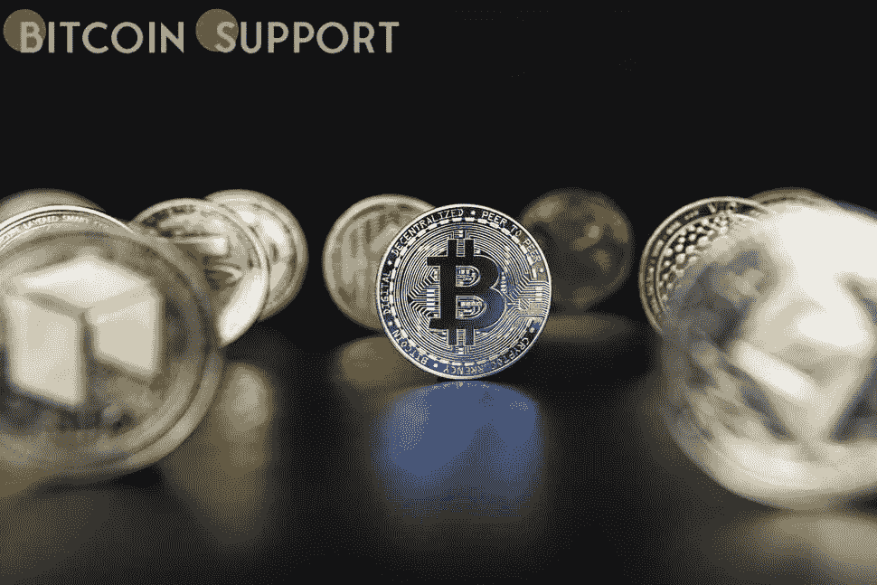
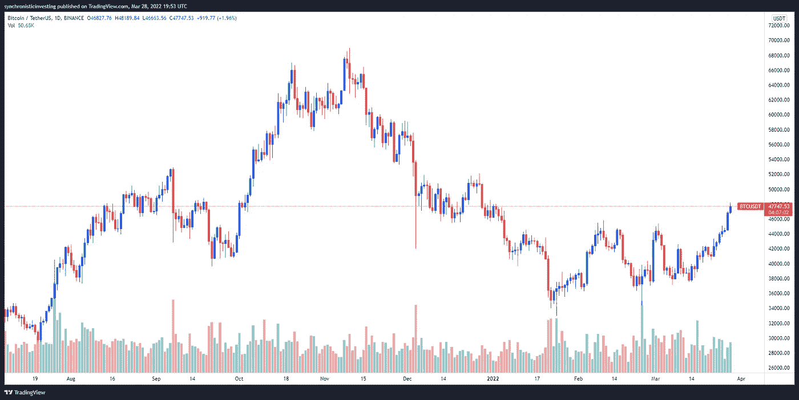
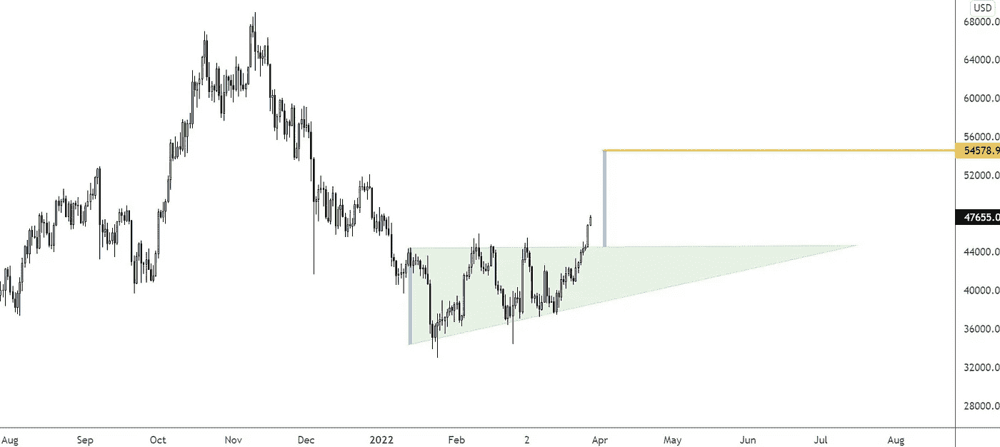
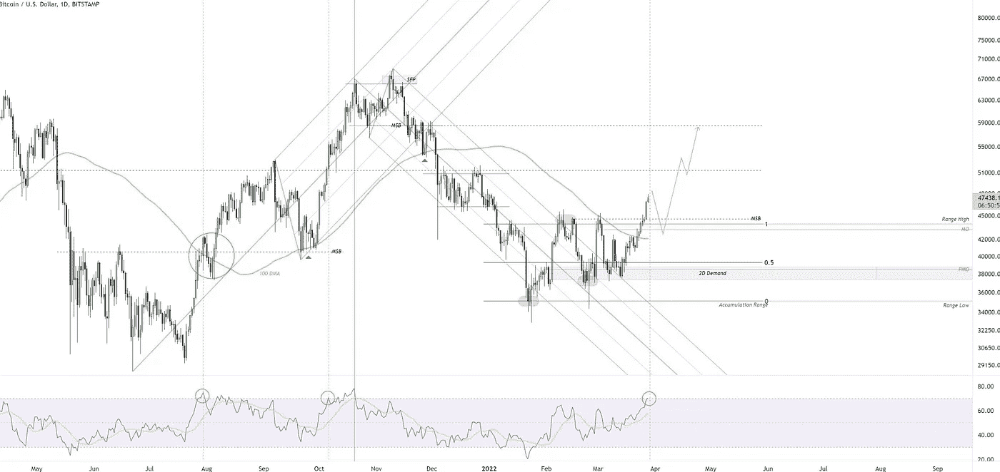
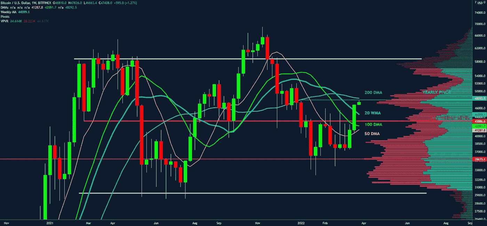

# 分析师们表示，比特币每日收盘价超过 4.8 万美元，为其创下历史新高提供了一条清晰的路径

> 原文：<https://medium.com/coinmonks/bitcoins-daily-closing-above-48k-according-to-analysts-provides-a-clear-path-to-a-new-all-time-5c7b891f138b?source=collection_archive---------92----------------------->

**Visit our website:-** [**https://bitcoinsupports.com/**](https://bitcoinsupports.com/)

据分析师称，比特币价格飙升至 48000 美元以上，这是交易员一直在等待的明确无误的宏观趋势变化，但新的历史高点即将到来吗？

3 月 28 日，随着市场持续一周的暴跌继续，加密货币投资者情绪高涨，比特币(BTC)飙升至 48000 美元，以太交易超过 3400 美元。

根据 Cointelegraph Markets Pro 和 TradingView 的数据，在周一早盘围绕 47，000 美元的支撑短暂停顿后，下午的买盘飙升使 BTC 超过 48，000 美元，多头将 52，000 美元视为下一个目标。

**Visit our website:-** [**https://bitcoinsupports.com/**](https://bitcoinsupports.com/)

以下是一些市场分析师对比特币当前飙升的看法，以及随着乐观叙事继续获得牵引力，接下来可能会发生什么。

**下一站是 52，000 美元**

分析师兼匿名 Twitter 用户“Nunya Bizniz”瞥了一眼 BTC 可能的走向，发布了下图，显示可能会攀升至 54，500 美元以上。

**Visit our website:-** [**https://bitcoinsupports.com/**](https://bitcoinsupports.com/)

Nunya Bizniz 表达自己如下:

**“上升三角形突破的实测移动目标。”你怎么去的？技术专家“Crypto Yoddha”分享了对未来的类似预测，并在下图中强调了“熊市结构的良好突破”。

根据 Crypto Yoddha，

**“要么会有一个公平的回调来测试突破，要么价格会继续上涨到 52，000 美元的同等高点。**

枢轴均线已经反转。市场分析师、匿名 Twitter 用户“filbfilb”对周一的 BTC 价格走势提供了额外的见解，他发布了以下图表，显示“比特币每周收盘表现稳定”，收盘“高于 20 WMA 和 50/100 DMA”。"**

**Visit our website:-** [**https://bitcoinsupports.com/**](https://bitcoinsupports.com/)

“Filbfilb，”说。关键的是，重要的周支撑位/阻力位也被打破。现在仅低于 100 DMA 和年度轴心，以及一个高容量节点。”

**4 年周期是否因突围而延长？加密交易员乔丹·林赛(Jordan Lindsey)分析了 BTC 的长期价格表现，发布了下图，这表明始于 2021 年初的比特币牛市仍在发生，因为周期延长了 4 年。**

**Visit our website:-** [**https://bitcoinsupports.com/**](https://bitcoinsupports.com/)

根据林赛的说法，

**“从来没有一次牛市突破没有消退过。”自 2020 年以来，我们一直处于比特币牛市。周期越来越长。加长好还是新建结构好？“这就是问题所在。”**

目前加密货币的总市值为 2.168 万亿美元，其中比特币占据了 42.1%的市场份额。

**访问我们的网站:-**[**https://bitcoinsupports.com/**](https://bitcoinsupports.com/)

**免责声明:以上为作者观点，不应视为投资建议。读者应该自己做研究。**

> *加入 Coinmonks* [*电报频道*](https://t.me/coincodecap) *和* [*Youtube 频道*](https://www.youtube.com/c/coinmonks/videos) *了解加密交易和投资*

# 另外，阅读

*   [有哪些交易信号？](https://coincodecap.com/trading-signal) | [Bitstamp vs 比特币基地](https://coincodecap.com/bitstamp-coinbase) | [买索拉纳](https://coincodecap.com/buy-solana)
*   [ProfitFarmers 点评](https://coincodecap.com/profitfarmers-review) | [如何使用 Cornix 交易机器人](https://coincodecap.com/cornix-trading-bot)
*   [十大最佳加密货币博客](https://coincodecap.com/best-cryptocurrency-blogs) | [YouHodler 评论](https://coincodecap.com/youhodler-review)
*   [my constant Review](https://coincodecap.com/myconstant-review)|[8 款最佳摇摆交易机器人](https://coincodecap.com/best-swing-trading-bots)
*   [MXC 交易所评论](/coinmonks/mxc-exchange-review-3af0ec1cba8c) | [Pionex vs 币安](https://coincodecap.com/pionex-vs-binance) | [Pionex 套利机器人](https://coincodecap.com/pionex-arbitrage-bot)