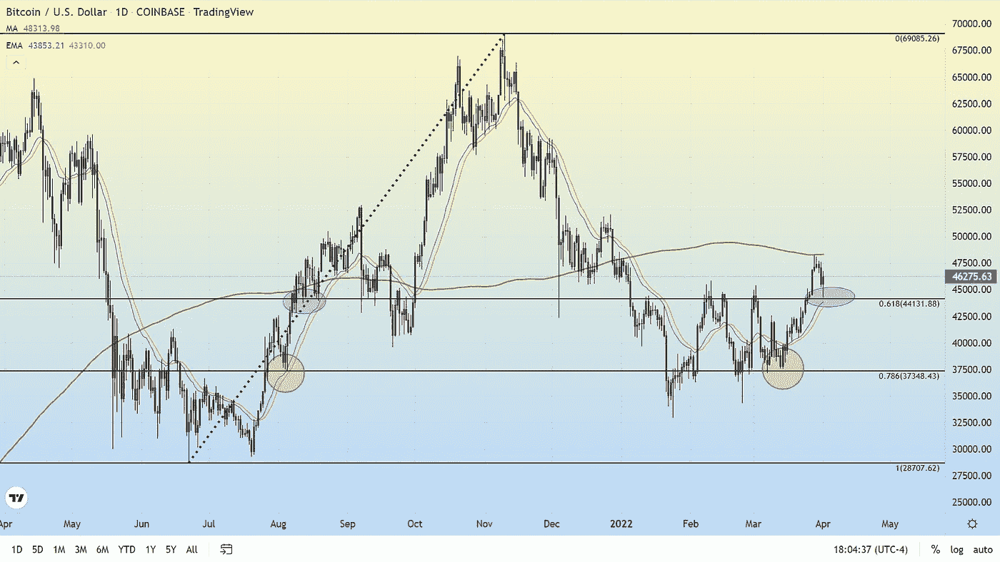

# 比特币积累期的退出再次得到证实

> 原文：<https://medium.com/coinmonks/bitcoins-exit-of-accumulation-period-re-confirmed-79bd6fc2cc21?source=collection_archive---------40----------------------->

比特币当天交易走高，并将形成自触及 200 天移动平均线阻力以来的第一根绿色蜡烛。绿色蜡烛表示当天结束时的收盘价高于当天或时段开始时的开盘价。截至美国东部时间下午 4:30，全球市值最大的加密货币售价约为 46，300 美元。虽然今天的蜡烛线可能会延续过去三天的低高点和低低点，但这是我想关注的低点，因为它重申了看涨情绪仍主导市场。

从去年 6 月的低点到去年 11 月的历史高点，我们的长期斐波纳契回撤线 28，700 美元到 69，000 美元非常准确，为我们提供了观察支点和突破区的关键价格点。78%的回撤水平位于 37，350 美元，在 2 月 28 日至 3 月 13 日的两周内三次成为支撑。在 2022 年 2 月 22 日发表的一篇题为“比特币的三个牢不可破的真相”的文章中，我们指出了比特币的几乎每一次主要上涨(2011 年、2013 年、2017 年)都伴随着等于或大于 78%的回撤。除了 2021 年的牛市之外，这一数字后来只回落到 61.8%的水平。位于 37，350 美元的 78%回撤水平具有很强的历史意义。如果我们回顾 2021 年 7 月底至 8 月初，同样的价格是更高价格的起点(8 月 3 日至 8 月 6 日)，也是之前积累期的终点。四天后，比特币继续在现在的 61.8%回撤线上方运行，价格为 44，131 美元(通过比特币基地绘制)。

那么，今天的低点有什么好看好的呢？今天的盘中低点正好位于 61.8%的回撤点上方。这个价格点一直是三个月的阻力，直到上周末收盘价终于超过了这个关键水平。正是那次突破让我们得出结论，比特币已经结束了积累期，进入了新的反弹模式。公牛队在这个水平上的有效防守再次证实了这个假设。回顾过去一年的交易，两个积累期之间的精确相似性对称性令人吃惊。如果这种情况持续到未来几个月，我们肯定会像上周预测的那样创造一个新的 ATH，并在 2022 年达到 85，000 美元。

对于任何有兴趣阅读我更多文章的人，只需点击这个[链接](https://www.thegoldforecast.com/bitcoin)。

> 加入 Coinmonks [电报频道](https://t.me/coincodecap)和 [Youtube 频道](https://www.youtube.com/c/coinmonks/videos)了解加密交易和投资

# 另外，阅读

*   [SmithBot 评论](https://coincodecap.com/smithbot-review) | [4 款最佳免费开源交易机器人](https://coincodecap.com/free-open-source-trading-bots)
*   [比特币基地僵尸程序](/coinmonks/coinbase-bots-ac6359e897f3) | [AscendEX 审查](/coinmonks/ascendex-review-53e829cf75fa) | [OKEx 交易僵尸程序](/coinmonks/okex-trading-bots-234920f61e60)
*   [如何在印度购买比特币？](/coinmonks/buy-bitcoin-in-india-feb50ddfef94) | [WazirX 审查](/coinmonks/wazirx-review-5c811b074f5b)
*   [CryptoHopper 替代品](/coinmonks/cryptohopper-alternatives-d67287b16d27) | [HitBTC 审查](/coinmonks/hitbtc-review-c5143c5d53c2)
*   [CBET 评论](https://coincodecap.com/cbet-casino-review) | [库科恩 vs 比特币基地](https://coincodecap.com/kucoin-vs-coinbase)
*   [折叠 App 审核](https://coincodecap.com/fold-app-review) | [Kucoin 交易机器人](/coinmonks/kucoin-trading-bot-automate-your-trades-8cf0ca2138e0) | [Probit 审核](https://coincodecap.com/probit-review)