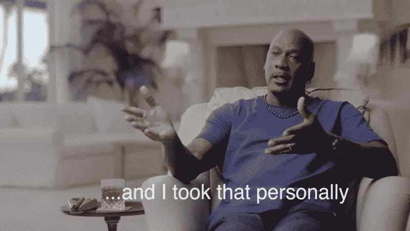
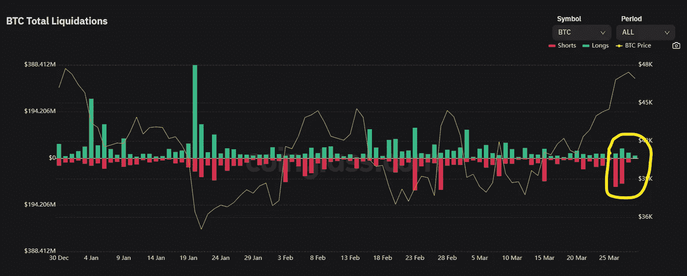
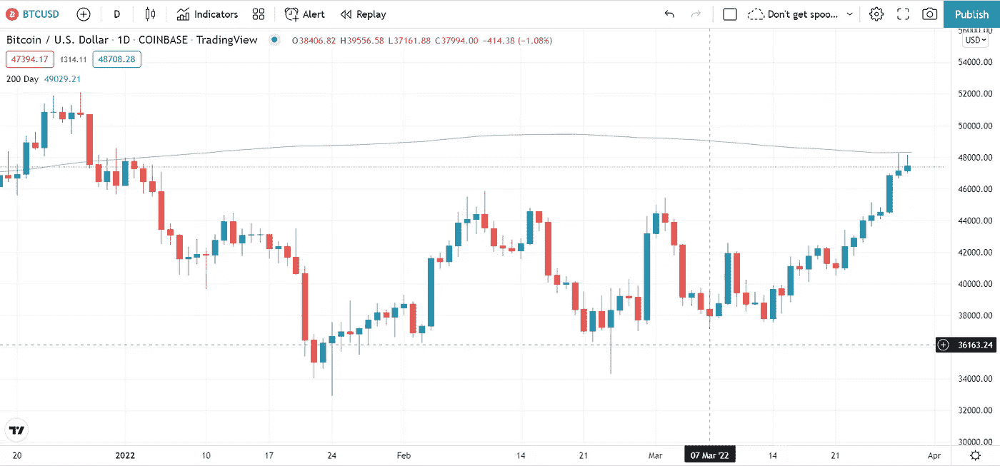

# 比特币要上月球了🌕

> 原文：<https://medium.com/coinmonks/bitcoins-going-to-the-moon-2ab759ce4c5f?source=collection_archive---------39----------------------->

***唯一的问题是什么时候***

以下事实不一定是比特币兑美元汇率在过去八天上涨 16%的原因，但它对更广泛的背景至关重要——请记住，比特币永远只会有 2100 万个:

The miner who gets that block will likely be a 14-year old millionaire who thinks George Harrison was a U.S. president.

🌑🌒🌓🌔🌕🌖🌗🌘🌑

道权把他的学术能力测试放在了他该说的地方。

Terra Labs 的联合创始人一直面临着关于他们的[算法稳定积分](https://twitter.com/terra_money/status/1396780920212922371)的可持续性的问题，这些积分依赖于燃烧他们的本地硬币 LUNA 来保持他们的价值观平衡。批评者认为这类似于庞氏骗局，如果 Terra 与美元挂钩的硬币 UST 的价值远远低于 1.00 美元，它将进入“死亡螺旋”，并带走卢娜。

3 月 11 日，Kwon 在推特上说，Terra 将烧掉 1200 万 LUNA，约合 12 亿美元，以支撑 UST 的储备:

Silly Do Kwon. There are no idiots on Twitter.

但在 3 月 13 日，当 Twitter 用户 Sensei Algod 发出百万美元的挑战，称一年后露娜的价值将会下降时，ed Kwon 和 T7 认为这是针对个人的。

Pictured: not Do Kwon, but someone else willing to make seven-figure bets

令人难以置信的是，第二天早上，另一个秘密推特 degen，[@ gigantic renewals，提出在赌注上加一个额外的零](https://twitter.com/GiganticRebirth/status/1503335929976664065)—[Kwon 也称这个数量级为](https://twitter.com/stablekwon/status/1503352233378811904)。

赌注的条款很简单:要么 LUNA 在 2023 年 3 月 13 日超过 88 美元，要么 Kwon 输掉 1100 万美元。但是这位 30 岁的人没有无缘无故地进入福布斯“30 岁以下 30 人”名单。他有锦囊妙计，或者更确切地说，₿:泰拉公司宣布将收购 100 亿美元的国王加密公司，实际上是将 UST 置于比特币标准之上。

Most people would think it silly to spend $10 billion to win a bet of $11 million, but most people aren’t Do Kwon.

他们已经完成了两笔价值 1.25 亿美元的大单，这让他们很容易就知道哪个钱包是他们的。

如果 Terra 为 BTC 支付的平均价格是 47，619.05 美元，那么 100 亿美元的价值大约是 210，000 枚硬币，或者说是所有硬币的 1%。正如链上分析师 Willy Woo 指出的那样，这并不完全是垄断市场——但这足以摇尾乞怜:

Alpha-whale.

根据 Coinglass 的数据，上周末出现了大量的空头，但在一场史诗般的挤压中，这些空头重新获得了 2.25 亿美元的资金:

“Do Kwon smacked the sh*t out of me!” — most shorts

雪上加霜的是，Kwon 得到了彻头彻尾的 meme:

There is a delicious irony in using Bernie Sanders, too. I used Will Smith/Chris Rock because I’m a hack.

很明显，这不是一场赌博——权有赢的赌注，而且目前看来[卢娜处于历史高点](https://decrypt.co/96286/terras-luna-sets-new-all-time-high-following-135-million-bitcoin-buy)。但是一条活跃的阿尔法鲸扰乱了比特币过去两个月翻腾的波涛汹涌的水域。随着菲什·FOMO 的加入，八支绿色蜡烛将 BTC 推向了 2022 年的高点，洗去了一月份的所有红色。

如果某些交易者可信，卖家会感到害怕:

“Do Kwon” is Korean for “huge balls.”

但不能保证从现在开始会一帆风顺。技术分析显示，BTC 可能会在 200 天移动均线 49，000 美元附近遭遇阻力:

I only barely know what that means, as I take TA about as seriously as horoscopes.

[Natasha Che 还对 crypto 未来几个月的前景做出了悲观预测](https://twitter.com/TaschaLabs/status/1508519299270385665)，这很有说服力。

但没有比 MicroStrategy 首席执行官迈克尔·塞勒(Michael Saylor)更大的比特币长期牛市了。为了不被 Kwon 的滑稽动作所超越，周二，比特币公司 o . g . HODLing 宣布，MicroStrategy 将使用他们已经拥有的比特币史高治·麦克老鸭金库担保的贷款购买超过 2 亿美元的比特币。

塞勒非常确定比特币会上涨，以至于他在借钱购买比特币。无论如何，考虑到当前美元的利率，这可能是明智的，但他在长达一小时的群聊中多次解释了他的想法。如果你没有那样的时间，这里是 TL；DW:

Not a joke: I used to work for a place called “Saylor’s Pizza.” Not the same guy.

此外，[欧盟仍在试图通过后门与密码持有者争论](https://twitter.com/paddi_hansen/status/1507741879563132928)，[加拿大仍在财政上取消抗议者](https://cryptobriefing.com/coinbase-to-monitor-canadian-transactions-above-1000-cad/)，[伊丽莎白·沃伦仍认为她比密码创造者和投资者更了解密码如何运作](https://www.forbes.com/sites/billybambrough/2022/03/17/senator-elizabeth-warren-introduces-a-game-changing-crypto-bill-as-the-price-of-bitcoin-ethereum-bnb-xrp-luna-cardano-solana-and-avalanche-surge/?utm_source=dlvr.it&utm_medium=twitter&sh=5720234f2159)。

这些都无关紧要，或者，如果有什么不同的话，政府试图收紧货币政策实际上可能会加速 Saylor 所说的比特币“大规模外流”。

这种突破可能是一个骗局，一个牛市陷阱，一个亿万富翁独自移动针赢得赌注带来的死猫反弹。

但是长期？2022 年过去？2025?2030?

比特币要上月球了。🌕

🌑🌒🌓🌔🌕🌖🌗🌘🌑

*披露:我拥有 BTC 和露娜(包装好的),但不足以说明问题。*

> 加入 Coinmonks [电报频道](https://t.me/coincodecap)和 [Youtube 频道](https://www.youtube.com/c/coinmonks/videos)了解加密交易和投资

# 另外，阅读

*   [CoinFLEX 评论](https://coincodecap.com/coinflex-review) | [AEX 交易所评论](https://coincodecap.com/aex-exchange-review) | [UPbit 评论](https://coincodecap.com/upbit-review)
*   [十大最佳加密货币博客](https://coincodecap.com/best-cryptocurrency-blogs) | [YouHodler 评论](https://coincodecap.com/youhodler-review)
*   [AscendEx 保证金交易](https://coincodecap.com/ascendex-margin-trading) | [Bitfinex 赌注](https://coincodecap.com/bitfinex-staking)
*   [最好的卡达诺钱包](https://coincodecap.com/best-cardano-wallets) | [Bingbon 副本交易](https://coincodecap.com/bingbon-copy-trading)
*   [印度最佳 P2P 加密交易所](https://coincodecap.com/p2p-crypto-exchanges-in-india) | [柴犬钱包](https://coincodecap.com/baby-shiba-inu-wallets)