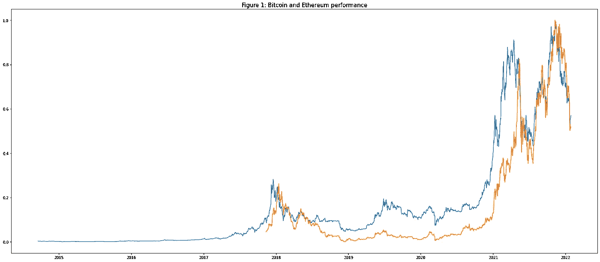
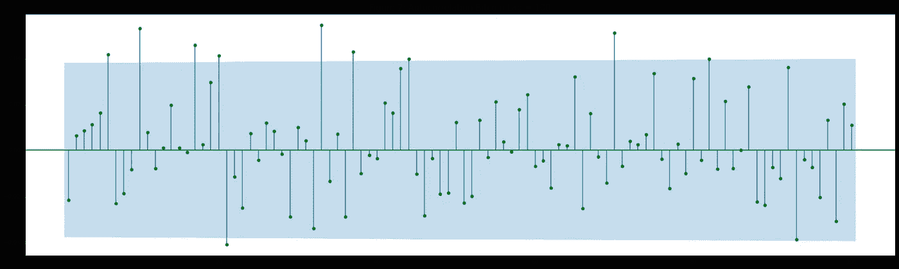
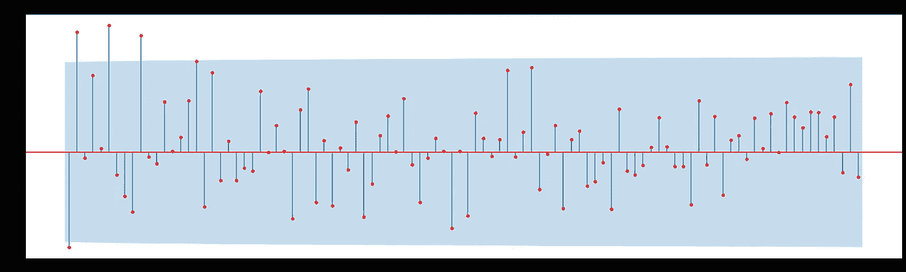
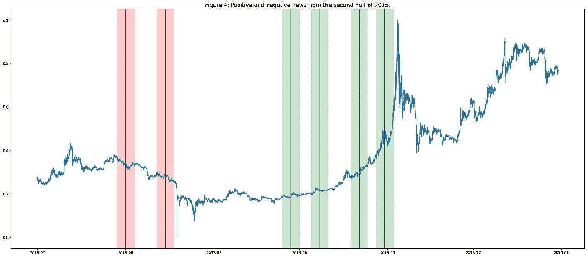
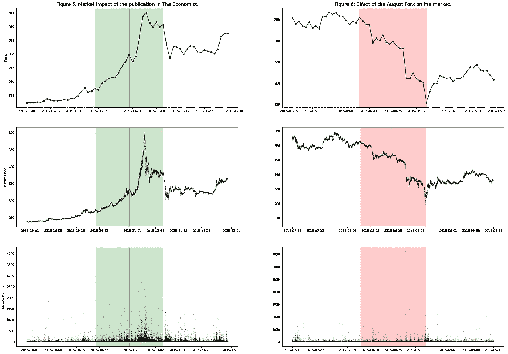
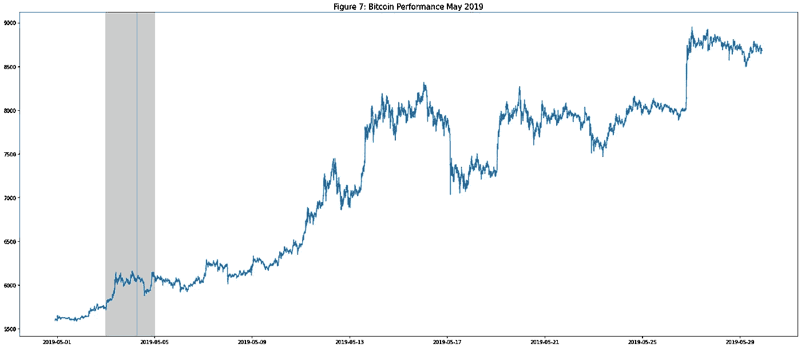

# 比特币的市场效率分析

> 原文：<https://medium.com/coinmonks/bitcoins-market-efficiency-analysis-6b01ac42a2ef?source=collection_archive---------21----------------------->


Photo by [Pierre Borthiry](https://unsplash.com/@peiobty?utm_source=medium&utm_medium=referral) on [Unsplash](https://unsplash.com?utm_source=medium&utm_medium=referral)

近年来，**区块链、NFT 或加密货币等词汇充斥着专业投资网站的头条和新闻**，并日益成为数百万投资者投资组合中的一种投资选择。在很大程度上，这类资产背后的复杂性超出了大部分人的理解，因此，**它们在市场中的表现可能不是因为一系列 aim 原因**(如传统资产的表现)**，而是因为基于投资者非理性的运动导致市场无效率**(因此，它不会收集投资者可获得的所有信息，但它会受到这些信息的非理性行为或操纵的影响)。

## 安德鲁·施莱弗和尤金·法玛研究

经济学教授 Andrei (2000) 对行为金融学的研究发现**投资者决策的非理性导致市场效率低下**。投资者的这种非理性可以从一些事实中得到证明，例如**对突发事件的信仰**或**分散投资的低实践**，以及试图**仅用少量数据来理解整个市场**。

要分析比特币市场的效率程度，我会用 ***法玛(1970)* 对金融市场效率的研究**。在书中，法玛认为市场的效率是由资产价格收集的信息类型决定的。为此，我必须首先将市场效率分析中涉及的信息分为三类:

*   **历史信息:**是过去发生的事情，在数据库或旧出版物中可以找到。
*   **公开信息:**就是当下正在发生的那一个。它刚刚出版，不久将成为历史。
*   **特权信息:**这是投资基金经理手中的信息(在这种情况下是加密资产)，也是法律追究的对象。

根据**有效市场假说**，根据资产价格在其市场表现中收集的信息类型，有三种类型的效率:

*   **弱有效:**我们说，当资产价格收集了资产表现的历史信息时，市场是弱有效的。这样，市场就只能靠公开信息或者特权信息来打了。
*   中等有效:当资产价格收集公共信息时，我们说市场是中等有效的。因此，市场只能被特权信息打败。
*   **强有效:**我们说，当资产价格包含市场上所有可用信息时，市场是强有效的。这样，市场就打不垮了。

*当我们说“市场不能被击败”时，我们的意思是市场将表现为随机行走，无论是进行完全监督的投资还是进行随机投资，高于市场平均水平的回报发生的概率是相同的。*

**在这份出版物中，我将实践不同的测试，以对比法玛在其研究中提出的比特币市场效率假说(*法玛，1970 年*)。为了做到这一点，一系列的分析应用于不同的层面，以开发是否有可能击败市场的历史，公共或特权信息，因为它不像随机行走。**

[**链接到 Kaggle 笔记本**](https://www.kaggle.com/code/ralarellanolopez/bitcoin-s-market-efficiency-analysis/edit/run/86487717) **。如果你喜欢这个帖子，请投票支持我的 Kaggle 笔记本。此外，该链接提供了对不同加密货币行为的深入分析。**

为了执行这一分析，**我重点关注以下** [**目录**](https://www.kaggle.com/tencars/392-crypto-currency-pairs-at-minute-resolution) **中可用的比特币数据，尽管我确实将这些相同的测试应用于其他加密资产以验证结果。**

数据是**比特币——每分钟的美元价格**，收集每分钟的最大值、最小值、开盘价和收盘价，以及交易量。由于这种信息深度，我们可以应用我将要解释的一些测试，但是，我已经加载了其他数据库，只包含每种加密货币的每日信息，这可以大大简化一些分析。

**不同加密货币的数据**存在实质性差异，从它们开始进入市场的日期(比特币是最古老的一种，其他如 Doge 是最近的)到它们的表现。这种情况意味着，正如我们将在下面看到的，**虽然比特币可能具有一定程度的效率，但其他加密货币并没有达到这种程度的效率。**

**然而，比特币和以太坊是按交易量计算的两种主要加密货币，它们的表现非常相似，如图*图 1* 所示。**



# 第一层次:弱效率

正如我已经提到的，弱有效市场包含历史股票表现信息，但可以被公开或内部信息击败。法玛的研究(*法玛，1970* )确立了两种分析弱市场效率的方法:

*   **收益率的自相关性研究:**我们可以说，当一个市场的资产收益率具有等于 0 的自相关性时，该市场是弱有效的，即**上一期的收益率不决定下一期的收益率**。为了分析这一点，我使用了“statsmodels.graphics”包中的 *Brockwell 和 Davis (2013)* 方法。
*   **符号分析:**根据法玛的假设，**历史股价中的正负收益数应该相等**，中位数等于 0，市场才是平均有效的。为了检验收益中值等于 0 的零假设，我使用了 Wilcoxon 检验。

首先，我创建函数`returns_list()`来计算输入列表(每日或每分钟)的回报，然后我使用函数`plot_acf()`来获得不同滞后的自相关图。

为了分析这些图表，我们必须理解**蓝色区域内的那些值意味着，在 95%的置信度下，我们可以拒绝两个时间序列(原始和延迟 X 天)相关的零假设**。Fama 的方法( *Fama，1970* )决定了**我们要关注的关系是收益率的时间序列和单日递延收益率序列之间的关系。** ( *然而，我已经计算了多达 100 个滞后的自相关性*



从*图 2* 、**中可以看出，一天递延比特币收益的自相关性低于显著性水平，因此我们可以说，过去的比特币收益并不能解释未来的比特币收益，因此**(在没有符号测试的情况下)**比特币可能是弱有效的。**

然而，如果我们看看以太坊一天递延收益的自相关(*图 3* )，我们可以看到**我们如何不能以足够的信心拒绝自相关的零假设，因此我们可以说以太坊加密货币不是有效的，因为决定当前价格的是过去的收益，而不是投资者的理性预期。** ( *这种情况也适用于 USDT 和 USDC 的加密货币。*)

为了证实市场确实是弱有效的，Fama 决定应用符号检验。在这种情况下，**我们使用 Wilcoxon 符号秩检验，它允许我们在给定的置信度下拒绝中位数不等于 0 的零假设，因此，资产回报中的正数和负数一样多。**

```
WilcoxonResult(statistic=1634093.0, pvalue=1.3071859564189478e-05)
WilcoxonResult(statistic=551023.0, pvalue=0.01733620328385407)
```

在这种情况下，**在信心水平远高于 99.99%的情况下，我们可以拒绝关于比特币性能的零假设，因此，回报的中位数等于 0，正回报和负回报的数量相等。因此，市场将表现为随机漫步，只能被公共信息或特权信息击败。**

在以太坊的情况下，我们可以得出相同的结论，但置信水平较低(98.3%)，这是由于回报之间存在自相关。尽管如此，**我们还是宣称它的效率很弱。**

# 第二层次:中等效率

要证明一个市场的平均效率程度，你必须**分析它接受媒体刚刚发布的信息的速度**。根据法玛的理论(*法玛，1970* )我们必须研究拆分或加息等公告对资产表现的影响，然而，在比特币等资产的情况下，不存在拆分，但我们可以分析与该资产相关的新闻发布的影响。为此，我将重点关注比特币市场，并分析六条新闻对比特币价格的影响。

我要分析的 6 条新闻发生在 2015 年 8 月到 10 月之间。其中，我们发现正面和负面的新闻。



***负面新闻:***

*   2015 年 8 月 1 日:现已倒闭的加密交易所 Mt Gox 的首席执行官马克·卡佩斯。在日本国内被捕，涉嫌金融诈骗可用 [**此处**](https://www.france24.com/en/20150801-japan-bitcoin-arrest-exchange-theft-allegations-karpeles-france)
*   **2015 年 8 月 15 日:名为比特币 XT 的新叉子(软件更新)发布** [**此处**](https://spectrum.ieee.org/the-bitcoin-for-is-a-coup)

***正面消息:***

*   **2015 年 9 月 28 日:被美国监管机构 CTFC 定义为商品的加密货币** [**此处**](https://www.cftc.gov/sites/default/files/idc/groups/public/@lrenforcementactions/documents/legalpleading/enfcoinfliprorder09172015.pdf)
*   **2015 年 10 月 8 日:新密码交易所 Gemini 上线，FIDC 保险** [**此处**](https://www.coindesk.com/markets/2015/10/01/gemini-exchange-moves-toward-launch-with-twin-nydfs-approvals/)
*   **2015 年 10 月 22 日:欧盟宣布不对比特币征收增值税** [**此处**](https://www.cnbc.com/2015/10/22/bitcoin-now-tax-free-in-europe-after-court-ruling.html)
*   **2015 年 10 月 31 日:比特币文章显示在《经济学人》首页** [**此处**](https://www.economist.com/weeklyedition/2015-10-31)

其中，我将《经济学人》(Economist)封面故事中发表的比特币视为正面，而八月叉(August Fork)视为负面，因为它们是与比特币关系最密切的两种货币，因此将对比特币的表现产生最大影响。



对于提到的两条新闻，**我制作了一个表示两种情况下每日价格演变的图表，另一个显示两条新闻中每分钟价格的图表，以及另一个显示两种情况下交易量影响的图表。**

在根据安德鲁·施莱弗提出的行为金融理论对这两种情况进行评论之前( *Shleifer，经济学教授 Andrei，2000* )，**投资者需要比正面消息更长的时间来接受负面消息**，因为正面消息会立即引起轰动，而负面消息很难被那些拥有被公布信息的资产的人所接受。

因此，如果我们看看《经济学人》封面上关于比特币出版的正面消息，我们可以看到**市场如何花了几天时间来接受信息，每分钟的价格大幅上涨**，正如我们在第二张图表中看到的那样，即使出版后第二天有所调整，**与前几天的平均水平相比，回报率几乎翻了一番**。在每分钟价格的情况下，我们可以看到在发布后的几天内，资产的每分钟价值发生了很大的波动，因为，正如在交易量图中可以看到的，**资产的交易数量随着它在诸如《经济学人》**的封面故事这样的出版物中变得更受欢迎而增加，因此吸引了更多的投资者。

如果我们看看负面消息，我们会看到投资者如何花 2 到 3 天时间接受信息，然后回报大幅下降，随后是价格调整，回报再次大幅下降。如果我们观察每分钟的交易量和价格的演变，我们可以看到在分叉消息发布 3 天后**如何出现大的中断，以及交易量如何在这个缩减的时间序列中增加到前所未有的水平。**

**因此，我们可以说，市场需要 2 到 3 天的时间来假设发布的信息，因此，尽管在这段时间内，拥有更快信息的人可以击败市场，但价格假设发布的消息，因此表现得像随机漫步。因此，根据法玛的假设(*法玛，1970* )，市场只能被特权信息打败。因此，根据法玛的有效市场假说，我们可以声明，比特币市场假设至少是平均效率。**

# 第三层次:强效率

根据 Fama 的研究( *Fama，1970* )，**要分析一个市场的强有效程度，投资于市场资产的投资基金的经理的投资组合表现应该与通常的市场表现进行比较。**这样，**就有可能发现市场上是否存在被管理者利用来操纵资产表现的内幕信息。**

由于比特币的*去中心化*本质，以及关于其表现的信息与年度账目或财务结果无关，而是与投资者的预期有关，我似乎有必要分析一种被称为 ***闪电崩盘*** 的现象。*闪电崩盘*发生在一项资产的交易量出现**瞬间增长，而价格瞬间出现非常急剧的下跌，这只能通过分析股票的秒或分钟回报来观察。**这种情况的发生得益于使用高频机器买卖加密货币。

在这里，由于我有比特币价格每分钟的信息，这允许我知道该分钟的最小值和最大值以及开盘和收盘，我可以知道在任何分钟内是否有**超范围的情况，其中支付了非常低的价格，并将其与每分钟的交易量相关联**，因为这是我所拥有的信息。

从图形上看，在下图这样的蜡烛图上，你可以看到一个*闪电崩盘*像一根**长下影线的蜡烛，随后是交易量大幅增加的情况。**

**类似于*闪电崩盘*的情况允许这些资产的大持有人快速卖出大量加密货币，并自动以低得多的价格买入，以更好地利用收益率的增长，即它允许拥有大量资产并能高频进入市场的投资者操纵收益率，产生类似于 Fama 在共同基金管理公司中呈现的情况。**

**这种情况超出了长期投资者或只关注每日或每小时价格的投资者的理解范围，因为从图中可以看出，从长期来看，价格在其长期趋势中保持不变，这种闪电暴跌对资产整体表现的影响无法评估。**



2019 年 5 月 16 日，比特币在凌晨 5 点左右遭遇了一系列闪电崩盘。**如果我们看看这次闪电崩盘后几天的长期表现(*图 7* )，我们可以看到趋势是如何上升的，尽管它一直相当稳定或下降。因此，从闪电崩盘中获利的投资者，由于他们的交易量，能够以更好的方式利用这种非凡的表现。**

为了分析闪电崩盘，我做了一个图表(*图 8* )，其中你可以看到**5 月 19 日凌晨 3 点到 6 点之间每分钟的价格蜡烛图，也就是闪电崩盘发生的时间。**


**这三个小时内的趋势或多或少是持续向下的，但如果我们分析 4:40 左右的结果，我们会发现一系列蜡烛线有一些拉长的向下阴影，这与亏损交易量的增加有关(即红色交易量)。**

这样，我们可以证明，确实在 2019 年 5 月 16 日，**4:40 左右的卖出量的增加表明，具有高卖出能力的投资者更好地利用了此后上涨趋势中所代表的来自该日期的超常回报** ( *图 7* )。

因此，根据 Fama 的推理( *Fama，1970* )并将闪电崩盘与操纵市场的特权信息联系起来，我们可以证明**比特币市场中有投资者有足够的能力操纵货币的瞬时价格，并能够降低其价格。通过这种方式，他们可以更好地利用短期内资产收益率上升的市场平均水平。然而，**他们不被那些长期投资或只考虑资产每日或每小时价格的投资者注意到**，因此他们可以瞬间操纵市场而不被发现。**

# 市场效率分析的结论[](https://www.kaggle.com/code/ralarellanolopez/bitcoin-s-market-efficiency-analysis#-Conclusion-of-the-market-efficiency-analysis-)

**因此，我们可以证明，尽管比特币市场具有弱效率和中等效率，但它无法通过强效率市场的测试。因此，我们只能针对中等有效市场来检验效率假说，而不能针对强有效市场。**

**作为这一分析的结论，我们可以确定，比特币市场可以通过内幕信息战胜，因为具有足够投资能力和交易量的人可以改变比特币的价格，并产生高于市场平均水平的回报，而投资策略基于历史信息或公开信息分析的人不能战胜市场，因为它正确地假设了资产价格中的这类信息。**

> 加入 Coinmonks [电报频道](https://t.me/coincodecap)和 [Youtube 频道](https://www.youtube.com/c/coinmonks/videos)了解加密交易和投资

# 另外，阅读

*   [3 商业评论](/coinmonks/3commas-review-an-excellent-crypto-trading-bot-2020-1313a58bec92) | [Pionex 评论](https://coincodecap.com/pionex-review-exchange-with-crypto-trading-bot) | [Coinrule 评论](/coinmonks/coinrule-review-2021-a-beginner-friendly-crypto-trading-bot-daf0504848ba)
*   [莱杰 vs n rave](/coinmonks/ledger-vs-ngrave-zero-7e40f0c1d694)|[莱杰 nano s vs x](/coinmonks/ledger-nano-s-vs-x-battery-hardware-price-storage-59a6663fe3b0) | [币安评论](/coinmonks/binance-review-ee10d3bf3b6e)
*   [Bybit Exchange 审查](/coinmonks/bybit-exchange-review-dbd570019b71) | [Bityard 审查](https://coincodecap.com/bityard-reivew) | [Jet-Bot 审查](https://coincodecap.com/jet-bot-review)
*   [3 commas vs crypto hopper](/coinmonks/3commas-vs-pionex-vs-cryptohopper-best-crypto-bot-6a98d2baa203)|[赚取加密利息](/coinmonks/earn-crypto-interest-b10b810fdda3)
*   最好的比特币[硬件钱包](/coinmonks/hardware-wallets-dfa1211730c6) | [BitBox02 回顾](/coinmonks/bitbox02-review-your-swiss-bitcoin-hardware-wallet-c36c88fff29)