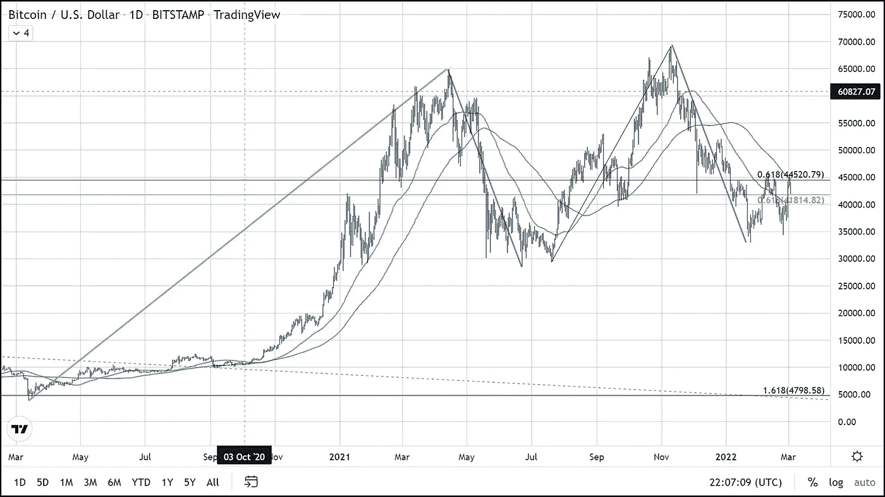

# 比特币最新的斐波那契谐波

> 原文：<https://medium.com/coinmonks/bitcoins-most-recent-fibonacci-harmonic-bb0b403b4581?source=collection_archive---------34----------------------->

如今，比特币的交易价格下跌了约 4.2%，交易金额约为 42，000 美元。目前的市场支配地位为 42.42%。数字命理学家对此很感兴趣。

比特币在两个技术水平之间交易，也是两次上涨超过 60，000 美元的关键回撤点。

技术交易者可能会认识到今天的低点和试探性支撑在 41，800 美元。你必须追溯到 2021 年 1 月，当时这个价格水平是相关的。最近，它再次成为比特币三次未能守住的重要短期水平。每次试图突破当前 61.8%的斐波那契回撤线(~ 44500 美元)都没有成功。

截至美国东部时间下午 5 点，比特币显示出反弹可能发生在旧的 61.8%回撤位 41，800 美元的迹象。如果比特币能够保持在当前 61.8%的回撤位置被拒绝后未能保持的水平，那将非常乐观。相反，如果这一水平失败，进一步下降到 37000 美元是可能的。

BTC 夹在 100 和 50 日均线之间。100 天是阻力，50 天是当前支撑。这意味着移动平均线完全看跌排列。使用的三个主要移动平均线是 50、100 和 200 天。

多头必须守住的最重要区域是 41800 美元。如果比特币跌破该水平，看跌派将获得控制权。

> 加入 Coinmonks [电报频道](https://t.me/coincodecap)和 [Youtube 频道](https://www.youtube.com/c/coinmonks/videos)了解加密交易和投资

# 另外，阅读

*   [3 商业评论](/coinmonks/3commas-review-an-excellent-crypto-trading-bot-2020-1313a58bec92) | [Pionex 评论](https://coincodecap.com/pionex-review-exchange-with-crypto-trading-bot) | [Coinrule 评论](/coinmonks/coinrule-review-2021-a-beginner-friendly-crypto-trading-bot-daf0504848ba)
*   [莱杰 vs n rave](/coinmonks/ledger-vs-ngrave-zero-7e40f0c1d694)|[莱杰 nano s vs x](/coinmonks/ledger-nano-s-vs-x-battery-hardware-price-storage-59a6663fe3b0) | [币安评论](/coinmonks/binance-review-ee10d3bf3b6e)
*   [Bybit Exchange 审查](/coinmonks/bybit-exchange-review-dbd570019b71) | [Bityard 审查](https://coincodecap.com/bityard-reivew) | [Jet-Bot 审查](https://coincodecap.com/jet-bot-review)
*   [3 commas vs Cryptohopper](/coinmonks/3commas-vs-pionex-vs-cryptohopper-best-crypto-bot-6a98d2baa203)|[赚取加密利息](/coinmonks/earn-crypto-interest-b10b810fdda3)
*   最好的比特币[硬件钱包](/coinmonks/hardware-wallets-dfa1211730c6) | [BitBox02 回顾](/coinmonks/bitbox02-review-your-swiss-bitcoin-hardware-wallet-c36c88fff29)
*   [block fi vs Celsius](/coinmonks/blockfi-vs-celsius-vs-hodlnaut-8a1cc8c26630)|[Hodlnaut 审核](/coinmonks/hodlnaut-review-best-way-to-hodl-is-to-earn-interest-on-your-bitcoin-6658a8c19edf) | [KuCoin 审核](https://coincodecap.com/kucoin-review)
*   [Bitsgap 审查](/coinmonks/bitsgap-review-a-crypto-trading-bot-that-makes-easy-money-a5d88a336df2) | [Quadency 审查](/coinmonks/quadency-review-a-crypto-trading-automation-platform-3068eaa374e1) | [Bitbns 审查](/coinmonks/bitbns-review-38256a07e161)
*   [加密复制交易平台](/coinmonks/top-10-crypto-copy-trading-platforms-for-beginners-d0c37c7d698c) | [Coinmama 评论](/coinmonks/coinmama-review-ace5641bde6e)
*   [印度的加密交易所](/coinmonks/bitcoin-exchange-in-india-7f1fe79715c9) | [比特币储蓄账户](/coinmonks/bitcoin-savings-account-e65b13f92451)
*   [OKEx vs KuCoin](https://coincodecap.com/okex-kucoin) | [摄氏替代品](https://coincodecap.com/celsius-alternatives) | [如何购买 VeChain](https://coincodecap.com/buy-vechain)