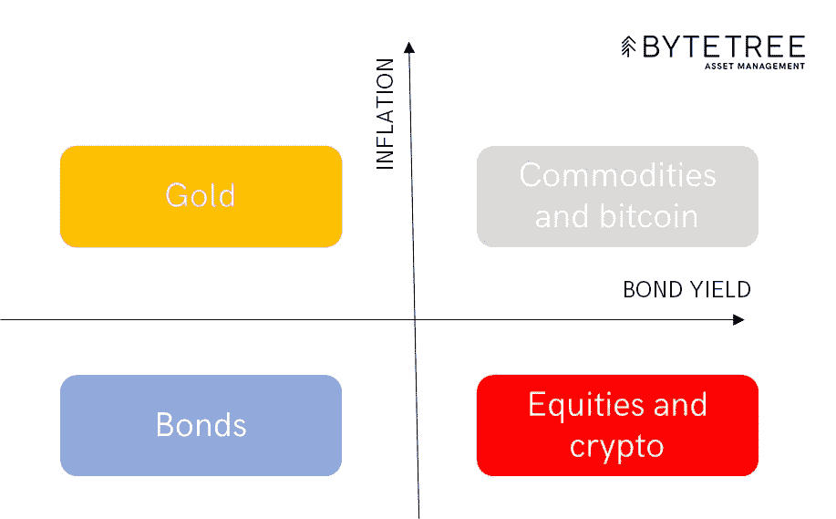
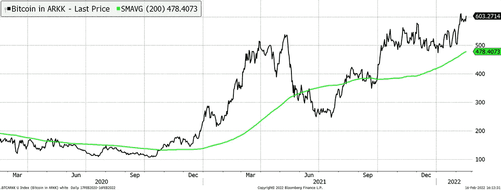

# 比特币在货币地图上的位置看起来不错

> 原文：<https://medium.com/coinmonks/bitcoins-place-on-the-money-map-looks-good-3140cf99040f?source=collection_archive---------17----------------------->

我们祝贺富达成为最新一家在德国发行比特币基金的 ETF 发行商，代码为 FBTC。他们看到未来的客户需求，如果今天没有太多，很快就会有。在长达 40 年的债务繁荣结束时，没有多少资产可以保护你，但比特币是其中之一。

大多数金融机构都没有做好准备，证据就在我们身边。由廉价资金推动的后金融危机大牛市已经结束。

大的资产泡沫很少出现，自从上世纪 90 年代早期跟踪股市以来，我只见过两次:网络泡沫和当前的万物泡沫。当然，一个国家或行业表现出过度的时候很多，但一个适当的泡沫会在地震般的宏观转变之前带来大量的泡沫。没人在听，没准备好的人都输了。

2021 年，流入股票和密码的投资创下纪录，价格飙升。随着梦想中的泡沫破灭，从清洁能源到太空旅行的那些引人注目的新技术已经损失了一半的资金。至少第一次减半已经过去了。

Crypto 在很大程度上也是其中的一部分，像 DOGE，火星的未来资金，已经下跌了 80%。如果你在等待反弹，不要屏住呼吸。然而，区分比特币和加密很重要。DOGE 的价值为零，一些加密项目在计算和金融领域有着巨大的潜力，比特币已经成为一种宏观资产。

我的货币地图努力把资产放在一个基于利率和通货膨胀的简单框架内。债券和股票，又称金融资产，更喜欢低利率和低通胀——所谓的金发女孩情景，自 20 世纪 80 年代初以来一直推动牛市。相比之下，通胀让硬资产表现出色，就像它损害金融资产一样。

# 金钱地图

Source: [ByteTree](https://bytetree.com/)

自 2020 年 5 月以来，仅 10.1%的温和通胀就带来了巨大变化。美国长期债券——一种“无风险”资产——已经从峰值下跌了 32%,孙子辈的债务——100 年奥地利债券——下跌了 45%。

高通胀的影响已经给股市带来下行压力，首先是投机主题(清洁技术、太空等)。)并且正在蔓延。大型科技股面临压力，最不受影响的股票类别一直与大宗商品和其它硬资产相关。

正如一些股票对通胀更为敏感一样，宝洁(Procter and Gamble)或雀巢(Nestle)等其它股票则更像债券。然而，大多数面向国内的成长型公司都生活在右下方。他们不喜欢经济放缓(收益率下降)，也不喜欢通胀上升(定价权和风险对公司估值)。

真正受益于通胀的资产少之又少。黄金是王者，因为它不仅可以抵御通胀，而且无论经济状况如何，它都受到全球的尊重和接受。大宗商品也类似，但只有在经济表现良好的时候——有需求的时候——才会有所表现。

# 货币地图上的比特币

比特币和加密在金钱地图上处于不同的位置。Crypto 的投机性要大得多，也没有声称自己具有防通胀的资质。这完全是技术问题。另一方面，比特币被设计成数字黄金，这是我几年前第一次感兴趣的东西。和许多人一样，我睁大眼睛关注着比特币的发展。

显而易见，比特币的大部分进展都与风险市场条件相吻合，通常债券收益率上升或稳定，通胀也一直上升和稳定。

通货膨胀的敏感性很容易理解，因为比特币的供应有限，未来的生产将继续放缓。简而言之，90%的比特币已经存在了，所以如果事情真的开始了，就不会有太多东西了。

风险凭证也很明显，因为比特币激起了金融市场的动物精神。如果经济正在崩溃，我们会专注于把食物放在餐桌上，而把创造财富留到下一天。

比特币在右上角的盒子里很开心，因为它看起来和闻起来都像一种商品，因为它具有波动性和周期性。大宗商品在繁荣和萧条周期之间反复摇摆，而且在摇摆的时候似乎在微笑。这是意料之中的事，这很好，但我们假设，随着货币购买力下降，大宗商品价格将在很长一段时间内上涨。从这个意义上说，比特币在很大程度上是一种数字商品，其使用案例与金融和互联网相关。

自去年 11 月以来，比特币的价格已经下跌，但随着过度投机的消失，从整体来看，这并不是灾难性的。更令人感兴趣的是，它对高度投机性资产的抵御能力，以及在严峻的市场条件下吸引资本的能力。最近几周，比特币已经看到[内向投资流入](https://terminal.bytetree.com/bitcoin/flows)比特币交易所交易基金，比如富达最近推出的一只。这发生在市场压力时期，令人印象深刻。

# 比特币比 ARKK 更有弹性

Source: Bloomberg. *Bitcoin in ARKK over the past two years.*

自 2009 年推出以来，比特币已经不再年轻。每年它都通过幸存下来证明其怀疑者是错误的。时不时地，它会蹒跚前行，带来数百万投资者。这些人来自尼日利亚和乌克兰，就像他们来自德国或日本一样。比特币是一个真正的全球现象，很多人都很了解它。

# 摘要

债券和股票的大牛市已经结束，这个巨大的资产泡沫正在破裂。那些认识到这一点并以不同方式思考的人将在财务上生存下来。那些没有的人将会看到他们的财富随着长期债券和清洁科技股一起蒸发。

越来越多的证据表明，比特币是一种对通胀敏感的资产，正如越来越明显的是，通胀将持续下去。这意味着比特币是救生艇之一，而不是泰坦尼克号。我们欢迎富达加入欧洲比特币交易所交易基金发行人俱乐部——这是一个让机构投资者站在历史正确一边的优秀组织。

本文由 ByteTree 的联合创始人兼首席投资官查理·莫里斯撰写。这篇文章是从我们的网站上交叉发布的，最初发表于 2022 年 2 月 16 日[。](https://bytetree.com/research/2022/02/bitcoin-on-the-money-map-looks-good/)

访问 [**ByteTree 终端**](https://terminal.bytetree.com/) 获取实时跟踪的**比特币**链上数据。我们还跟踪**以太坊**、**黄金**和**白银**的资金流。

[**订阅**](https://bytetree.com/mailing) 我们的邮件列表，免费每周更新。

> 加入 Coinmonks [电报频道](https://t.me/coincodecap)和 [Youtube 频道](https://www.youtube.com/c/coinmonks/videos)了解加密交易和投资

## 另外，阅读

*   购买 Dogecoin 的 7 种最佳方式
*   如何在 Bitbns 上购买柴犬(SHIB)币？
*   [最佳加密分析或链上数据](https://coincodecap.com/blockchain-analytics) | [Bexplus 评论](https://coincodecap.com/bexplus-review)
*   [NFT 十大市场造币集锦](https://coincodecap.com/nft-marketplaces)
*   [iTop VPN 审查](https://coincodecap.com/itop-vpn-review) | [曼陀罗交易所审查](https://coincodecap.com/mandala-exchange-review)
*   [最佳期货交易信号](https://coincodecap.com/futures-trading-signals) | [流动性交易回顾](https://coincodecap.com/liquid-exchange-review)
*   [最佳加密交易信号电报](/coinmonks/best-crypto-signals-telegram-5785cdbc4b2b) | [MoonXBT 评论](/coinmonks/moonxbt-review-6e4ab26d037)
*   [OKEx 评论](/coinmonks/okex-review-6b369304110f) | [Coinswitch 俱吠罗评论](/coinmonks/coinswitch-kuber-review-1a8dc5c7a739) | [比特币基地收费](/coinmonks/coinbase-fees-831e77d4f2c5)
*   [AscendEX 审查](/coinmonks/ascendex-review-53e829cf75fa) | [OKEx 交易机器人](/coinmonks/okex-trading-bots-234920f61e60) | [OKEx 交易机器人](/coinmonks/okex-trading-bots-234920f61e60)
*   [火币交易 Bot](https://coincodecap.com/huobi-trading-bot) | [如何购买 ADA](https://coincodecap.com/buy-ada-cardano) | [Geco？一次回顾](https://coincodecap.com/geco-one-review)