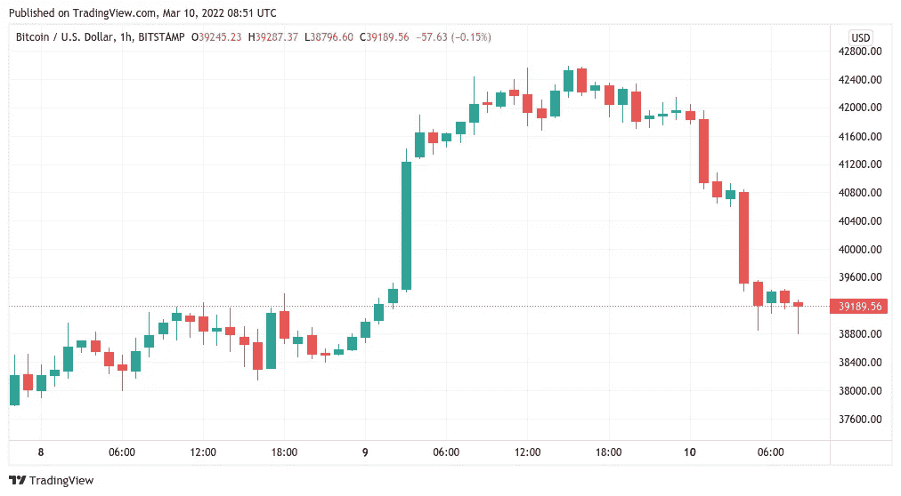
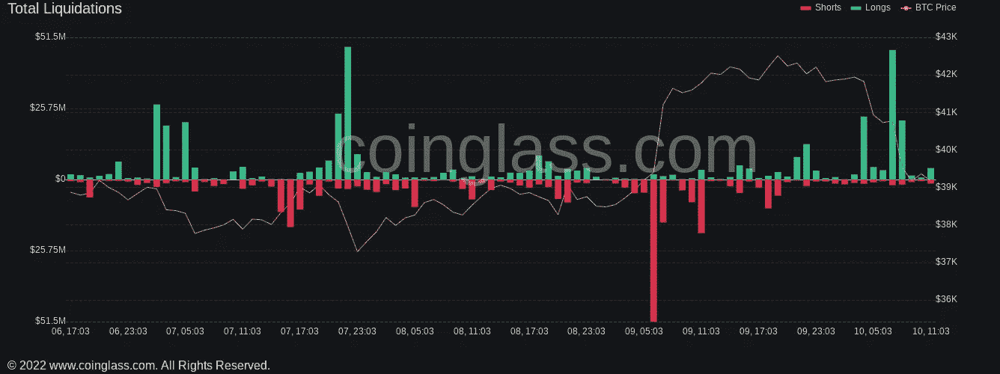
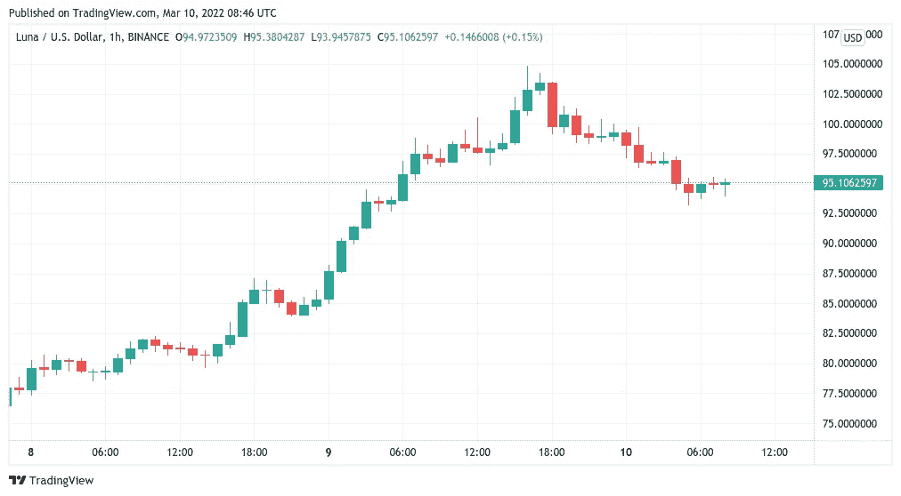

# 比特币的价格跌破 4 万美元，形成了经典的“易货”模式

> 原文：<https://medium.com/coinmonks/bitcoins-price-drops-below-40k-forming-a-classic-bart-pattern-97def5c5bd24?source=collection_archive---------73----------------------->

**Visit our website:-** [**https://bitcoinsupports.com/**](https://bitcoinsupports.com/)

比特币价格上涨伴随着每天超过 2 亿美元的加密清算。

3 月 10 日，在多头第二次未能守住更高水平后，比特币(BTC)以传统形式反转。

**Visit our website:-** [**https://bitcoinsupports.com/**](https://bitcoinsupports.com/)

BTC/美元 1 小时蜡烛图

**巴特重返比特币图表。**

BTC/美元周三隔夜形成经典的“巴特·辛普森”回撤形态，根据 TradingView 数据显示。在盘整之前，该货币对曾成功突破 42，000 美元，但缺乏支撑意味着回到 40，000 美元以下的先前交易区是不可避免的结果。这种“Bart”形态在最近几周多次出现，突显出一个已被锁定在一个交易区间数月的市场所面临的困难。根据分析资源 Coinglass 的数据，那些预计这种上升趋势将持续的人因此感到失望，在撰写本文之前的 24 小时内，交叉加密清算总额达到 2.11 亿美元。

**Visit our website:-** [**https://bitcoinsupports.com/**](https://bitcoinsupports.com/)

“今天早上炒牛了，”人气交易员 Crypto Ed 在推特上写道，他曾预测周三高点的反弹将结束。

“这是 PP 乒乓，不是 PA。”当然，亚洲人总是擅长乒乓球，”他继续说道，指的是亚洲市场时段的“巴特”上下斜坡。与此同时，美国 2 月份消费者价格指数(CPI)数据将于周四公布，预计通胀率将保持在同比 7.9%的高位。

“CPI 统计数据明天出来，FOMC 会议不到一周(3 月 15 日& 16 日)，”交易员兼分析师马修·海兰(Matthew Hyland)周三在推特上写道。附图中突出显示了 BTC/美元需要克服的关键阻力位，以及 36，300 美元至 33，000 美元之间的支撑。比特币的波动性也对加密货币造成了影响，以太网(ETH)下跌 5.1%，至不到 2600 美元。

按市值计算，十大加密货币中的许多也在当天下跌，但此前表现出色的 Terra (LUNA)设法守住了 100 美元附近的高点。

**访问我们的网站:-**[**https://bitcoinsupports.com/**](https://bitcoinsupports.com/)

**免责声明:这些是作者的观点，不应被视为投资建议。读者应该自己做研究。**