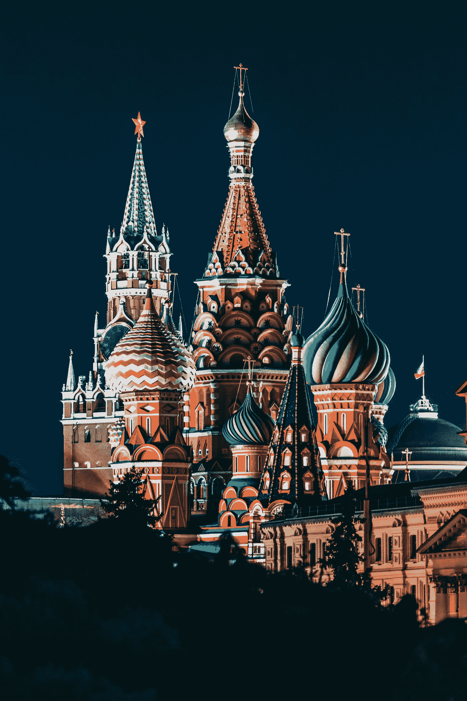

# 比特币的价格解释

> 原文：<https://medium.com/coinmonks/bitcoins-price-explained-e8e9be827e93?source=collection_archive---------18----------------------->

Crypto 的最高硬币是看涨的。原因如下:

## 股市

经过 2 月份的抛售和俄罗斯入侵乌克兰后恐慌情绪的加剧，大盘目前已收复大部分失地。但是这和比特币有什么关系呢？事实证明，很多。

BTC 与美国股市的关联度在今年 1 月达到峰值，系数达到 0.66，为有史以来的最高水平。这种相关性是科技股云集的纳斯达克 100 指数特有的。标准普尔 500 指数也在 3 月 23 日达到峰值，这与标准普尔 500 指数的相关性类似。

正如其他风险资产被抛售一样，特斯拉(持有价值数十亿比特币)等股票正在卷土重来。自首次加息以来，S&P 上涨了 6%，纳斯达克上涨了 8.7%。同样，比特币紧随其后，自去年 12 月 3 月 27 日以来首次几乎突破 50，000 美元大关。

尽管纯粹主义者认为这种加密技术与传统市场不匹配，但美国股票在过去几周的强劲反弹引发了对数字黄金的抢购。

Photo by [Nick Chong](https://unsplash.com/@nick604?utm_source=medium&utm_medium=referral) on [Unsplash](https://unsplash.com?utm_source=medium&utm_medium=referral)

## 美联储

尽管共和党人一直是比特币最直言不讳的支持者，但民主党人最多也只是持抵制态度。但他们预期的“监管”消息比预期的好得多。

[美国财政部长珍妮特·耶伦](https://www.bloomberg.com/news/articles/2022-03-27/bitcoin-struggles-under-45-000-but-some-indicators-signal-gains)表示，“加密有好处，我们认识到支付系统的创新可能是一件健康的事情，”尽管她个人对加密货币总体持保留态度。

美联储目前的消极立场是机构采纳的催化剂。大公司正从边缘崛起，准备收购大公司。如果你在未来几天看到一个调整，可以肯定的是，大量的购买力将会以低价买进。

## 俄罗斯/乌克兰

欧洲的战争表明，我们对货币的依赖让我们变得多么脆弱。被认为是去中心化、无信任、无边界的比特币是一个解决方案。但不仅仅是俄罗斯官员试图逃避制裁，[数百万美元](https://money.usnews.com/investing/cryptocurrency/articles/crypto-and-russia-ukraine-war-what-investors-should-know)正被送往乌克兰政府及其公民，以帮助打这场战争。

Photo by [Nikolay Vorobyev](https://unsplash.com/@nikolayv?utm_source=medium&utm_medium=referral) on [Unsplash](https://unsplash.com?utm_source=medium&utm_medium=referral)

乌克兰最近批准了密码交易所。税收和治理法律正在修订，以允许其公民利用这一优势。然而，俄罗斯的加密能力很紧张，因为它无法使用 SWIFT 转移资金。

制裁阻止了 crypto 向 fiat 的赎回。普京、他的寡头和他的公民可以接受比特币，发送比特币，如果他们愿意，可以用比特币做饭，但除了卢布，他们不能兑换任何东西。

现在已经不值钱了。

> 比特币目前是历史上最热门的价值储存手段。它不在乎你站在哪一边，这就是它的价值所在。

## LFG！

不，不是你想的那样。LFG 指的是露娜基金会卫队，这是区块链领地内的一个组织，致力于支持他们的稳定领地——UST 领地。

Terraform Labs 的创始人兼首席执行官 Do Kwon 最近购买了价值 3B 美元的 BTC，并公开声称 Terra 打算成为除 Satoshi Nakomoto 之外最大的比特币巨鲸。作为参考，迈克尔·塞勒的微观战略目前价值约 150 亿美元。

Terra stablecoin 曾经烧掉了等量的 LUNA(它的治理令牌),以保持通货紧缩和盯住美元，但现在它将烧掉大约相当于 BTC 价值的 60%。

批评的矛头指向了 Terra 和 Do Kwon，即来自[的 Peter Schiff](https://twitter.com/PeterSchiff/status/1509249726948024323) ，他说此举只是给 BTC 的泡沫注入了更多的空气，并暗示在这样做之前宣布一项重大收购是渎职行为。

但随着 LFG 每天购买价值 1.25 亿美元的比特币，购买力只会越来越强。

## 比特币的价格将何去何从？

就像威尔·史密斯在电视直播中扇克里斯·洛克耳光一样不可预测，谁知道呢。

技术分析师表示，47，000 美元对推动 BTC 达到 50，000 美元至关重要。在撰写本文时，在股市图表上出现红色的一天之后，抛售正在进行。它可能会定在 42k 左右，但你真的永远不知道加密。

老鹰们正在盘旋，准备突袭。
如果你正在阅读这篇文章，你可能已经准备好买入或买入更多。

> 加入 Coinmonks [电报频道](https://t.me/coincodecap)和 [Youtube 频道](https://www.youtube.com/c/coinmonks/videos)了解加密交易和投资

# 另外，阅读

*   [有哪些交易信号？](https://coincodecap.com/trading-signal) | [Bitstamp vs 比特币基地](https://coincodecap.com/bitstamp-coinbase) | [买索拉纳](https://coincodecap.com/buy-solana)
*   [ProfitFarmers 回顾](https://coincodecap.com/profitfarmers-review) | [如何使用 Cornix 交易机器人](https://coincodecap.com/cornix-trading-bot)
*   [十大最佳加密货币博客](https://coincodecap.com/best-cryptocurrency-blogs) | [YouHodler 评论](https://coincodecap.com/youhodler-review)
*   [MyConstant Review](https://coincodecap.com/myconstant-review) | [8 款最佳摇摆交易机器人](https://coincodecap.com/best-swing-trading-bots)
*   [MXC 交易所评论](/coinmonks/mxc-exchange-review-3af0ec1cba8c) | [Pionex vs 币安](https://coincodecap.com/pionex-vs-binance) | [Pionex 套利机器人](https://coincodecap.com/pionex-arbitrage-bot)