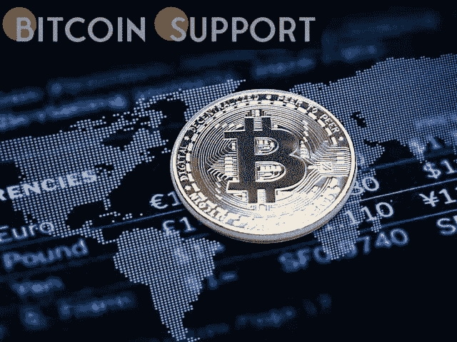
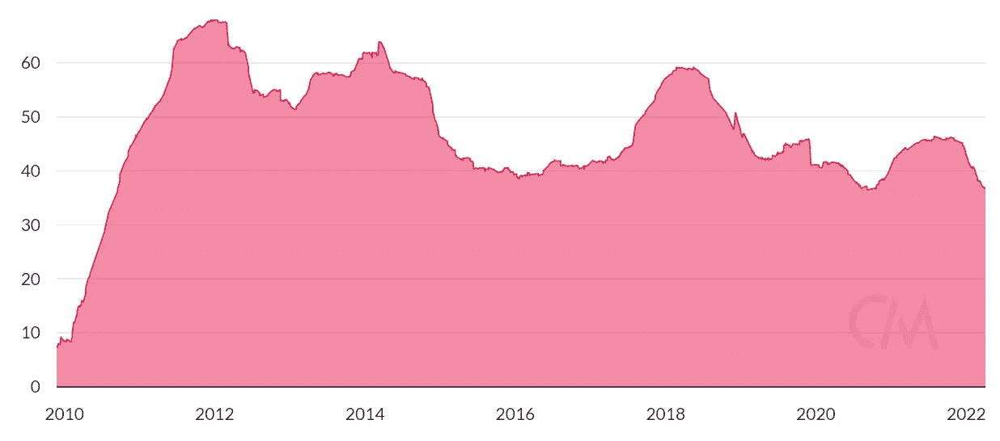
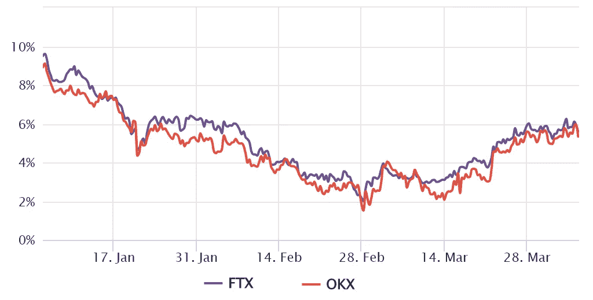
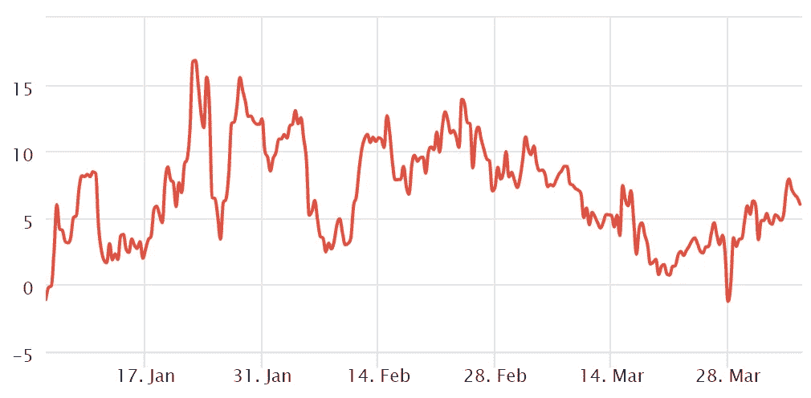

# 尽管比特币的价格已降至 4.35 万美元，但数据和这种加密货币的市场结构表明，它仍然坚挺

> 原文：<https://medium.com/coinmonks/bitcoins-price-has-dropped-to-43-5k-9ee61edad5ad?source=collection_archive---------70----------------------->

**Visit our website:-** [**https://bitcoinsupports.com/**](https://bitcoinsupports.com/)

比特币价格大幅跌至关键支撑位以下，但有证据表明，今天的下跌可能是多头的又一次买入机会。

比特币(BTC)一直无法突破 47000 美元阻力位，尽管今天跌破 44000 美元，但市场结构依然稳健。

2021 年 12 月 3 日，比特币经历了 25.6%的回调，持续了 18 个小时，以 42360 美元的低点收盘。四个月后，价格仍比 2021 年 12 月 2 日的收盘价 56，650 美元低 18%。

这段时间发生了很大的变化，而且有来自行业其他部分的明确证据。商业软件开发公司 MicroStrategy 披露了在 2022 年 2 月 15 日至 4 月 2 日期间购买了 4197 枚比特币。

根据 Glassnode 的数据，流入加拿大比特币交易所交易基金(ETF)的资金也创下历史新高。自今年 1 月以来，这些加拿大投资工具增持了 6594 BTC，使其管理的 BTC 总量达到 69052，创下新高。目的比特币交易所交易基金是一种现货产品，目前拥有 16.8 亿美元的资产。Terra 的 Luna Foundation Guard (LFG)是最近的买家之一，其目标是获得 30 亿美元的比特币，作为 TerraUSD (UST) stablecoin 的储备。

根据 CoinMetrics 的数据，4 月 5 日活跃的 1 年期比特币供应量降至 36.8%，为 2010 年 9 月以来的最低水平。

**Visit our website:-** [**https://bitcoinsupports.com/**](https://bitcoinsupports.com/)

该图描述了“钻石手”硬币持有者在过去一年中如何没有转移他们的硬币。

**交易者在 47000 美元附近不安，据期货市场**

我们来看看比特币的期货和期权市场数据，看看专业交易者，比如鲸鱼和做市商是如何定位的。长期期货合约和当前现货市场水平之间的差异由基差指标来衡量。比特币期货的年溢价应该在 5%到 12%之间，以补偿交易者在合约到期前“锁定”他们的资金两到三个月。5%以下的数字相当悲观，12%以上的数值则极其看涨。

**Visit our website:-** [**https://bitcoinsupports.com/**](https://bitcoinsupports.com/)

前述数据表明，这一指标在 2 月 11 日跌至 5%以下，表明交易者对杠杆多头(多头)押注缺乏需求。在基本利率于 3 月 26 日重新回到“中性”的 5%关口后，人们的情绪发生了变化。尽管如此，根据期货溢价，专业交易者没有表现出信心的迹象。

**下跌风险是期权交易者的担忧**

比特币现在缺乏突破 47000 美元关口水平所需的实力，但交易者可以利用衍生品来衡量专业投资者的情绪。当套利柜台和做市商对上涨或下跌保护要价过高时，25%的 delta 偏差就是一个警示信号。如果那些交易员担心比特币价格下跌，偏斜指标将升至 10%以上。另一方面，广义兴奋度的偏差为负 10%。

**Visit our website:-** [**https://bitcoinsupports.com/**](https://bitcoinsupports.com/)

数据显示，自 3 月 9 日以来，偏斜指标一直在 0%至 8%之间波动。这些期权交易者对下跌保护要价过高，但并不表示焦虑。BTC 期权市场价格意外下跌的风险有所增加。

对于多头来说，从中性到看跌的比特币期货数据呈现了一个耐人寻味的机会。如果 47，000 美元的阻力位被突破，大多数投资者都会感到惊讶。这种情况将产生两个有利的后果:衍生品市场短期紧缩，以及购买者利用期货的更大空间。如果比特币的期货溢价超过 10%，交易者增加多头头寸的成本将大幅提高。由于健全的市场结构，其特点是没有异常买家的杠杆，多头似乎更有准备应对 47，000 美元的价格阻力，这提供了更好的成功前景。

**访问我们的网站获取完整博客:-**[**https://bitcoinsupports . com/bitcoins-price-has-dropped-to-43-5k-but-data-and-the-market-structure-of-the-cryptocurrency-indicate-it-is-still-strong/**](https://bitcoinsupports.com/bitcoins-price-has-dropped-to-43-5k-but-data-and-the-market-structure-of-the-cryptocurrency-indicate-that-it-is-still-strong/)

**免责声明:以上为作者观点，不应视为投资建议。读者应该自己做研究。**

> 加入 Coinmonks [电报频道](https://t.me/coincodecap)和 [Youtube 频道](https://www.youtube.com/c/coinmonks/videos)了解加密交易和投资

# 另外，阅读

*   [如何匿名购买比特币](https://coincodecap.com/buy-bitcoin-anonymously) | [比特币现金钱包](https://coincodecap.com/bitcoin-cash-wallets)
*   [币安 vs FTX](https://coincodecap.com/binance-vs-ftx) | [最佳(SOL)索拉纳钱包](https://coincodecap.com/solana-wallets)
*   [比诺莫评论](https://coincodecap.com/binomo-review) | [斯多葛派 vs 3Commas vs TradeSanta](https://coincodecap.com/stoic-vs-3commas-vs-tradesanta)
*   [Capital.com 评论](https://coincodecap.com/capital-com-review) | [香港的加密借贷平台](https://coincodecap.com/crypto-lending-hong-kong)
*   [如何在 Uniswap 上交换加密？](https://coincodecap.com/swap-crypto-on-uniswap) | [A-Ads 审查](https://coincodecap.com/a-ads-review)