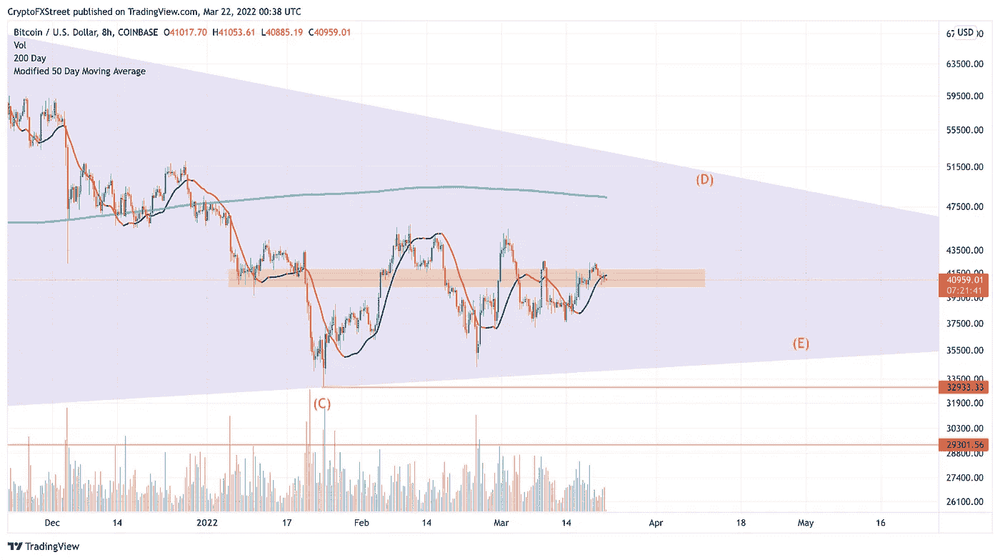

# 随着新的支撑位的形成，比特币的价格目标是 48，000 美元

> 原文：<https://medium.com/coinmonks/bitcoins-price-is-aiming-towards-48-000-as-a-new-support-level-is-formed-f22ce19da13e?source=collection_archive---------61----------------------->

Source photo TradingView.com

本周末，比特币的价格突破了 50 天移动平均线。在低交易量的基础上，BTC 稳定在每枚硬币 41000 美元左右。
如果价格跌破 39100 美元，看涨前提失效。

在撰写本文时，比特币的交易价格为 41000 美元。继本周末的…