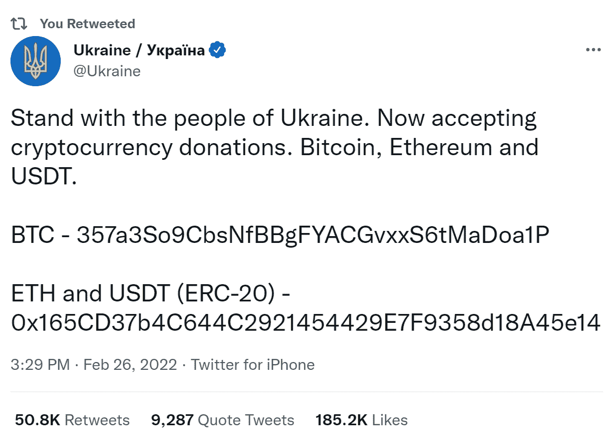
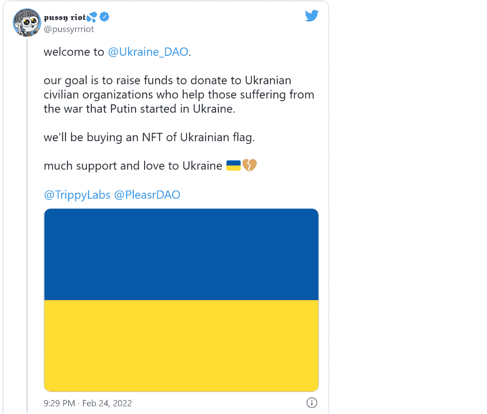
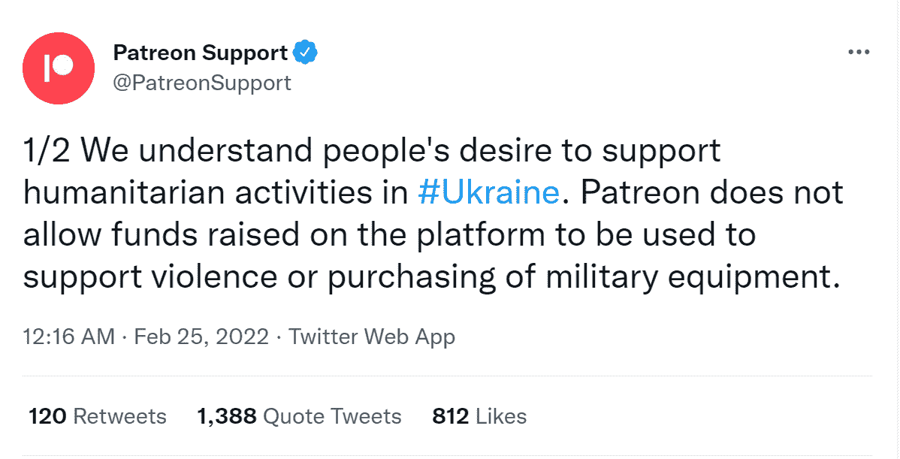
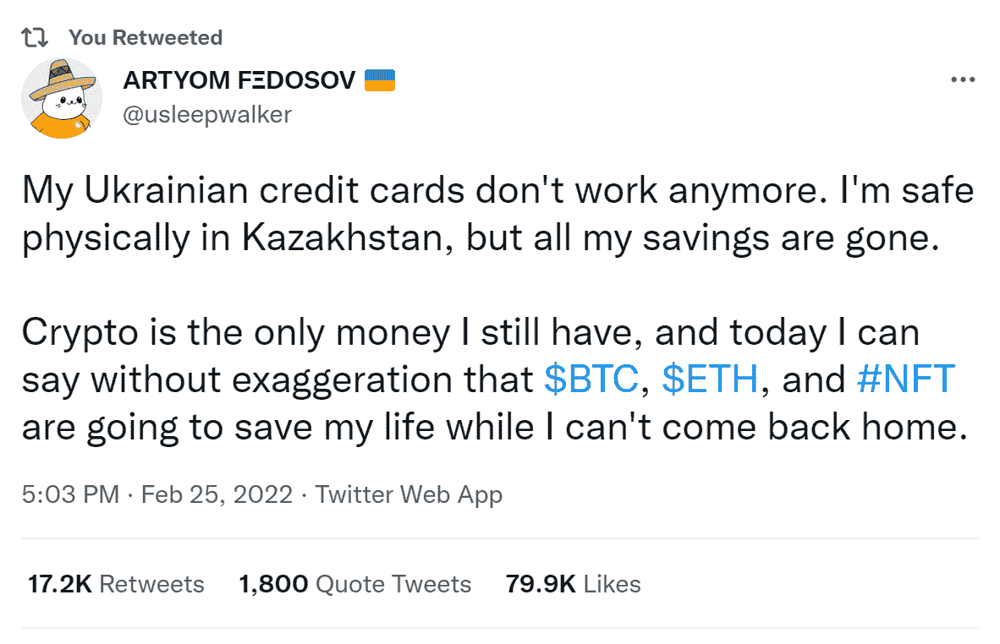
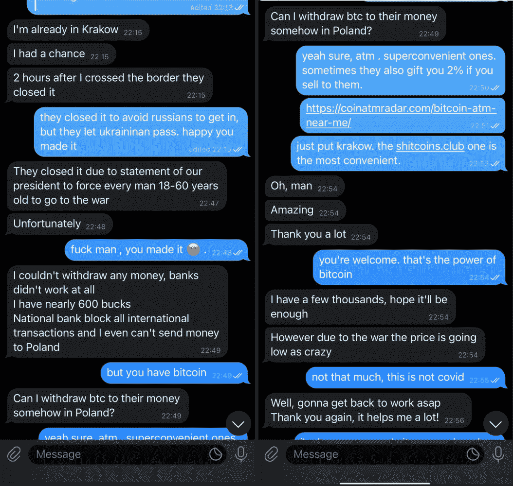
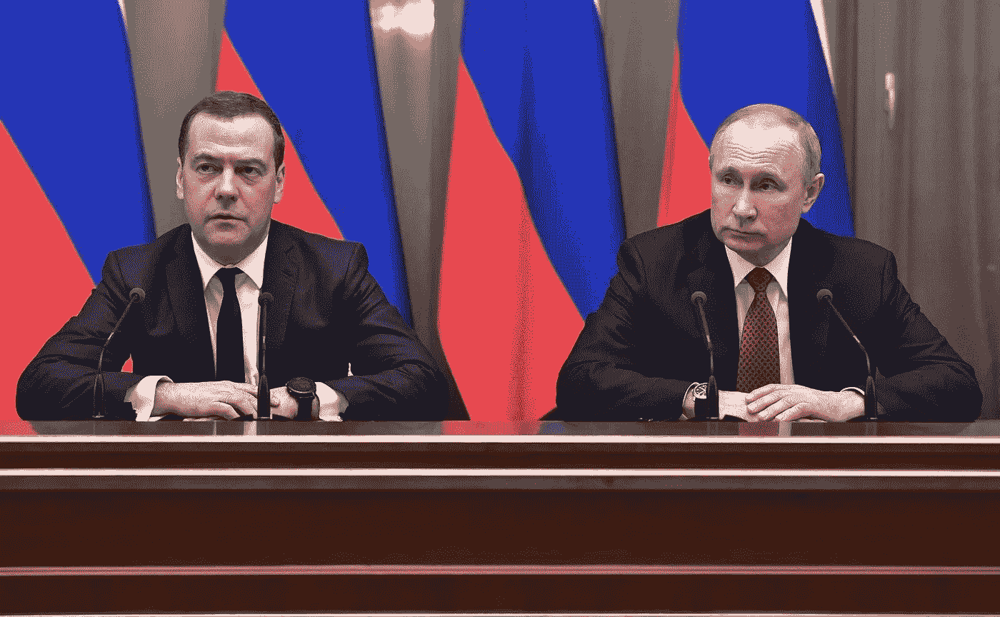
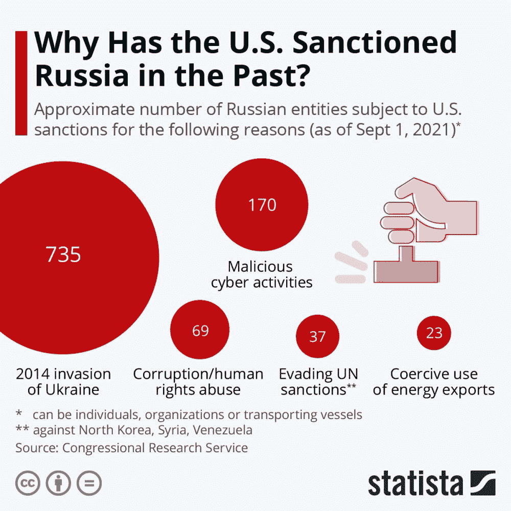
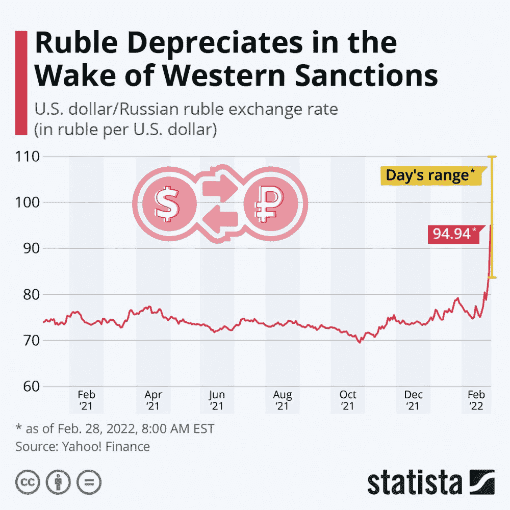

# 比特币在俄乌危机中的角色&普京的致命弱点

> 原文：<https://medium.com/coinmonks/bitcoins-role-in-russian-ukrainian-crisis-putin-s-achilles-heel-63cedb5b5bb4?source=collection_archive---------10----------------------->

Source: kcl.ac.uk

# 介绍

乌克兰正在发生的事情令人心碎。由于乌克兰的激烈反对，俄罗斯士兵无法控制主要城市。国际社会对俄罗斯入侵的抵制越来越强烈，欧盟禁止俄罗斯飞机进入其领空。

在乌克兰与俄罗斯的冲突中，西方没有提供军事士兵来援助乌克兰，乌克兰目前正在独自打这场仗。值得注意的是乌克兰的直接捐助呼吁，这是第一次这样的呼吁。

# 乌克兰的众筹

这种性质的捐赠通常以传统方式进行:通过银行。在精通技术的乌克兰，加密货币已经成为处理这种筹资的快速简便的手段。

*图片来源:推特*

根据伦敦区块链分析公司 Elliptic 的统计数据，乌克兰政府在社交媒体上发布了捐赠比特币和其他数字代币的请求后，已经收到了超过 2200 万美元的加密货币。

乌克兰副总理米哈伊洛费多罗夫在推特上发布了钱包地址。*“与乌克兰人民站在一起。“现在接受加密货币捐赠，”*写道，他也是数字转型部长。

据总部位于伦敦的 Elliptic 统计，截至 2 月 28 日周一格林威治时间 08:50，这些钱包地址已经收到了约 17300 笔捐款，总额达 1280 万美元。

# 分散的自治组织

*图片来源:推特*

为支持乌克兰人，成立了分散自治组织。一个这样的例子是俄罗斯朋克摇滚乐队“Pussy Riot”，他们成立了一个名为 UkraineDAO 的组织，旨在“利用 web3 技术和社区的力量为乌克兰组织筹集资金”，该组织已经筹集了 300 万美元。乌克兰 DAO 的想法来自住在伦敦的乌克兰活动家 Alona Shevchenko。舍甫琴科说，她曾希望乌克兰道不被需要，该地区的紧张局势会降级。

> “我开始联系我的朋友，他们把我和 Pussy Riot 的 Nadya 以及我已经认识的其他 PleasrDAO 人联系起来……这正是 DAO 的作用，利用区块链的力量改变现实世界。”

# 一些传统平台的失败

*图片来源:推特*

艺术家和创意人士的订阅网站 Patreon 已经取消了乌克兰非营利组织“活着回来”的平台，该组织正在发起众筹活动，以帮助该国军队抵御俄罗斯的入侵。

“活着回来”基金会是援助乌克兰军方的最大和最引人注目的援助组织之一。它是由来自基辅的志愿者 Vitaliy Deynega 在 2014 年成立的，他在俄罗斯占领克里米亚后不久开始筹集资金，并向在顿巴斯地区作战的乌克兰士兵提供防弹衣。

据“活着回来”的导演塔拉斯·奇穆特说，帕特里翁是希望捐款的外国人最方便的地方。

乌克兰人的反弹很快。批评者指责该平台切断了对俄罗斯自卫的关键生命线，并质疑它为什么现在做出决定，因为该页面已经在线多年。

# 战时保护财富

*图片来源:推特*

对于许多逃亡的乌克兰人来说，加密货币是一个避风港。截至 2 月 24 日，乌克兰央行已禁止电子现金转账，自动取款机也已关闭。

乌克兰国家银行发表了一份声明，其中包括一系列决定，包括暂停外汇市场、限制提现和禁止从普通银行账户发行外币的命令。

那些选择逃离的人在穿越边境之前去银行取钱——问题是，他们不被允许这样做。全国各地的银行都关闭了自动取款机，并禁止提取现金。当试图逃到外国以避免军事入侵时，这显然是一个巨大的挑战。你将如何支付食物、房租和其他生活必需品？

许多拥有加密货币的人在越过边境进入波兰等邻国后，可以拿走一部分并出售。

*图片来源:推特*

对一些人来说，就像上面的例子一样，比特币实际上就是能够带着足够的钱离开乌克兰，并在短期内度过难关，与一无所有地离开，让自己陷入彻底贫困的区别。

# 俄罗斯呢？

俄罗斯是世界第三大比特币矿商，拥有超过 1700 万俄罗斯人，约占总人口的 12%，拥有加密货币。

俄罗斯央行敦促在 2022 年 1 月初全面禁止所有加密货币的使用、创造和开采，理由是对该国金融系统和生态的威胁。

不久后，在一次政府会议上，普京表示，俄罗斯在比特币开采方面拥有“一定的竞争优势”。

不久后，德米特里·梅德韦杰夫(Dmitry Medvedev)对俄罗斯银行禁止大多数加密活动的决定表示不满，议会提出了一项法案，财政部倡导俄罗斯的加密货币所有权、开采和监管。

# 决定已经做出了

*图片来源:commons.wikimedia.org—Kremlin . ru*

我们认为，普京和他的核心圈子在多年前就达成了一项决定，并制定了一项关于比特币的行动计划。或许最早在 2017 年。这是由于俄罗斯各地庞大的比特币采矿业务，这实际上是一个数十亿美元的行业。要理解为什么会出现这种情况，首先必须了解俄罗斯的体制是如何运作的。任何大公司都必须与政府“结成伙伴关系”,并在任何时候都进行合作；否则，做生意几乎是不可能的。

例子比比皆是，比如 Yevgeny Chichvarkin，他于 2008 年离开俄罗斯，在被腐败当局的付款要求驱逐后，留下了一家价值 10 亿美元的公司 Evroset，拥有 5000 个地点。此外，还有俄罗斯最著名的社交媒体公司 Vkontakte 的创始人帕维尔·杜罗夫、米哈伊尔·霍多尔科夫斯基、弗拉基米尔·古辛斯基以及许多其他人。这不仅仅是俄罗斯商人的情况；这也是拒绝合作的西方公司的一个问题。总部位于伦敦的 Hermitage Capital 和谢尔盖马格尼茨基(Sergei Magnitsky)就是一个例子。他们别无选择，只能逃跑，因为他们都不想参与或支付勒索贿赂。

*俄罗斯典型的比特币矿场。图片来源:bloomberg.com*

当谈到比特币矿工时，他们不仅赚取数十亿美元的采矿利润，还使用俄罗斯的自然资源，上面的论点很明显。俄罗斯政府也很可能是幕后黑手，特别是因为国有石油和天然气巨头俄罗斯天然气工业股份公司(Gazprom)的子公司俄罗斯天然气工业股份公司(Gazpromneft)就是至少自 2020 年以来就参与开采比特币的公司之一。

# 那计划是什么？

我们认为，俄罗斯政府对比特币感兴趣主要是为了获取巨大的经济利益。换句话说，积聚加密货币，增加国家财富，进而增加国家国库及其关键个人的财富，比如普京及其核心圈子。

这也意味着，在适当的时候，俄罗斯可能会与独联体国家组成一个贸易集团，用比特币结算石油或天然气等商品，这将对比特币的价值产生重大影响，有利于俄罗斯国家。

关键是长期战略已经到位。俄罗斯政府绝不会无缘无故支持加密货币和比特币开采，避免制裁也不在其中。

# 制裁呢？

历史表明，俄罗斯非常自给自足，就像苏联 69 年来一样。现代俄罗斯也不例外，在普京掌权的情况下，制裁从未吓退过他。格鲁吉亚战争、吞并克里米亚和入侵乌克兰都是如此。

西方对俄战略基于这样一种假设，即持续的压力将迫使弗拉基米尔·普京总统的政府做出让步，或者可能崩溃。

支撑西方制裁成功的前提是所发生的戏剧性经济衰退会让俄罗斯民众，特别是金融和政治精英反对克里姆林宫。普京将无法克服来自更富裕的大都市地区和该国日益壮大的中产阶级的不断升级的反对。这与事实相去甚远。

*图片来源:statista.com*

民意调查显示，俄罗斯人认为西方的压力和制裁不是针对普京及其亲信，而是针对俄罗斯及其公民。

根据 Statista 的数据，俄罗斯在乌克兰边境附近的军事集结恰逢普京的支持率逐渐上升，目前约有 71%的俄罗斯人支持他，高于 2021 年 8 月的 61%。

事实上，制裁对政府没有直接影响，只是对普通公民有影响。尽管部分俄罗斯机构的 SWIFT 被暂停，但俄罗斯仍能访问持有欧盟或美国俄罗斯护照的俄罗斯寡头持有的欧洲和美国银行账户，其中大多数人没有受到制裁的影响。

# 普京的致命弱点——俄罗斯寡头

普京在乎的是他的钱，也就是寡头的钱。当西方开始谈论追逐寡头的金钱和资产时，普京威胁要发动核战争。

在接受第四频道采访时，金融家、活动家和 Hermitage 资本管理公司的联合创始人比尔·白劳德说:

> “寡头们照看普京的钱，他们是弗拉基米尔·普京的代理人、被提名人和受托人，他们照看他的钱，当我们制裁他们时，我们就制裁了他。”

# 普通俄罗斯人&比特币

【cnbc.com】图片来源:T2

数百万反对军事行动并公开抗议的普通和平俄罗斯人面临着可怕的后果，包括坐牢。许多这样的俄罗斯人因为制裁而遭受了严重的经济后果，包括卢布的崩溃，到目前为止，卢布已经下跌了近 40%。

【statista.com】图片来源:T4

这导致了俄罗斯各地的银行挤兑，许多俄罗斯人不得不转向比特币等加密货币。根据总部位于奥斯陆的加密货币研究机构 Arcane Research 的数据，在全球最大的加密货币交易所之一币安，卢布和加密货币之间的交易量近日大幅增加。据 Arcane 研究主管本迪克·沙伊称，由于卢布“在所有制裁后大幅贬值”，俄罗斯人似乎正“试图摆脱卢布”。

俄罗斯央行将利率从 9.5%上调至 20%以上，以阻止该国货币卢布的贬值。俄罗斯央行将油价突然飙升归咎于“外部经济条件”的“剧烈变化”。

中国最高经济学家和财政部已经命令出口公司出售 80%的外汇储备。

有一点似乎很清楚:在这场重大冲突中，俄罗斯将遭受最大的打击。在未来许多年里，普通俄罗斯人将为弗拉基米尔·普京总统的扩张主义外交政策付出代价。

*免责声明:本文包含的信息仅用于教育目的，并不构成 Wheatstones 的任何形式的建议或推荐，用户在做出(或避免做出)任何投资决定时也不打算依赖这些信息。*

> 加入 Coinmonks [电报频道](https://t.me/coincodecap)和 [Youtube 频道](https://www.youtube.com/c/coinmonks/videos)了解加密交易和投资

# 另外，阅读

*   [比特币基地僵尸程序](/coinmonks/coinbase-bots-ac6359e897f3) | [AscendEX 审查](/coinmonks/ascendex-review-53e829cf75fa) | [OKEx 交易僵尸程序](/coinmonks/okex-trading-bots-234920f61e60)
*   [如何在印度购买比特币？](/coinmonks/buy-bitcoin-in-india-feb50ddfef94) | [WazirX 审查](/coinmonks/wazirx-review-5c811b074f5b)
*   [CryptoHopper 替代品](/coinmonks/cryptohopper-alternatives-d67287b16d27) | [HitBTC 审查](/coinmonks/hitbtc-review-c5143c5d53c2)
*   [CBET 评论](https://coincodecap.com/cbet-casino-review) | [库库恩 vs 比特币基地](https://coincodecap.com/kucoin-vs-coinbase)
*   [折叠 App 审核](https://coincodecap.com/fold-app-review) | [Kucoin 交易机器人](/coinmonks/kucoin-trading-bot-automate-your-trades-8cf0ca2138e0) | [Probit 审核](https://coincodecap.com/probit-review)
*   [如何匿名购买比特币](https://coincodecap.com/buy-bitcoin-anonymously) | [比特币现金钱包](https://coincodecap.com/bitcoin-cash-wallets)
*   [币安 vs FTX](https://coincodecap.com/binance-vs-ftx) | [最佳(索尔)索拉纳钱包](https://coincodecap.com/solana-wallets)
*   [比诺莫评论](https://coincodecap.com/binomo-review) | [斯多葛派 vs 3Commas vs TradeSanta](https://coincodecap.com/stoic-vs-3commas-vs-tradesanta)
*   【Capital.com】|[港加密借贷平台](https://coincodecap.com/crypto-lending-hong-kong)
*   [如何在 Uniswap 上交换加密？](https://coincodecap.com/swap-crypto-on-uniswap) | [A-Ads 评论](https://coincodecap.com/a-ads-review)
*   [WazirX vs CoinDCX vs bit bns](/coinmonks/wazirx-vs-coindcx-vs-bitbns-149f4f19a2f1)|[block fi vs coin loan vs Nexo](/coinmonks/blockfi-vs-coinloan-vs-nexo-cb624635230d)