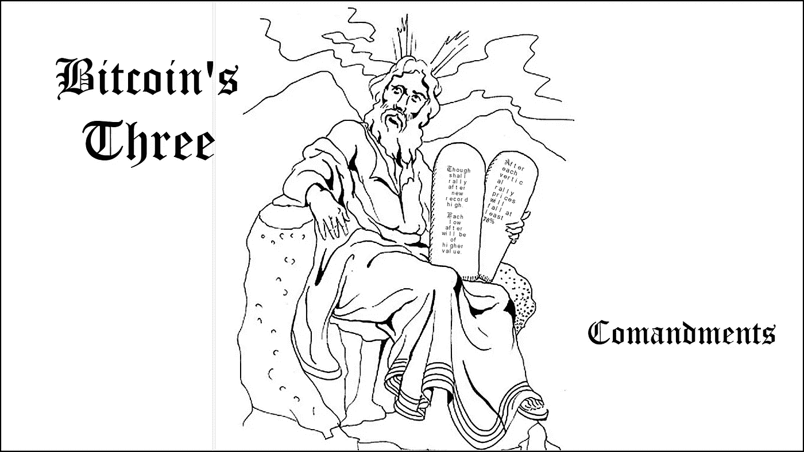
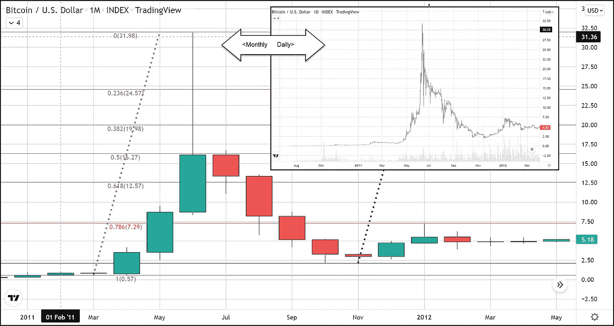
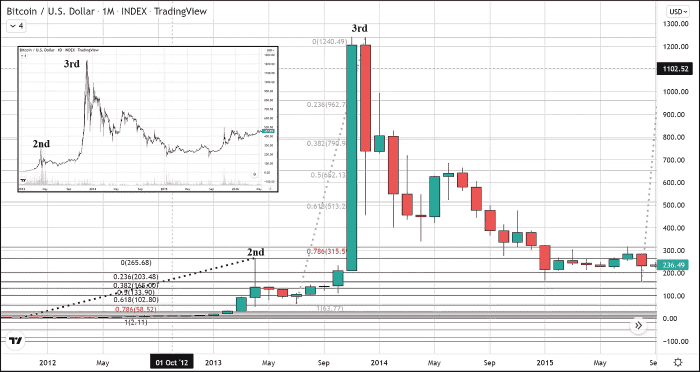
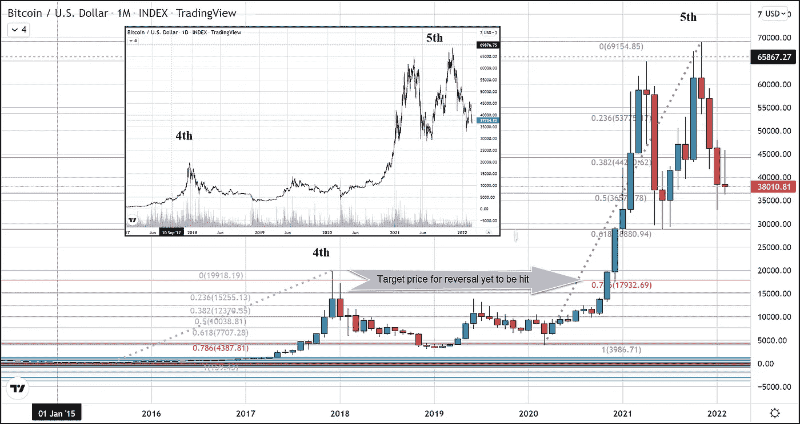

# 比特币的三个牢不可破的事实

> 原文：<https://medium.com/coinmonks/bitcoins-three-unbreakable-truths-aef9d803a9ad?source=collection_archive---------40----------------------->

在上周更大幅度的损失之后，比特币再次确认了其熊市趋势，这一趋势已经持续了三个多月。所以，问题变成了，我们可以在哪里寻找这种趋势完成？

要回答这个问题，我们必须退一步，从比特币诞生以来的长期宏观角度来看待它。毫无疑问，我们可以 100%肯定地说，在所有的抛物线上涨和随后的下跌中，比特币总是能够在每一次事件后形成一个更高的基础。利用这一事实，我们可以在未来几个月期待什么？

**前四个周期**

在迄今为止完成的所有四个抛物线周期中，我将概述定义每个周期的三个不变事实。2010 年 7 月，在任何抛物线运动之前，底部从 0.01 美元开始。第一次抛物线运动发生在 2011 年 4 月，从 0.60 美元攀升至 2011 年 6 月 8 日的 31.90 美元。随后的下跌使比特币跌至 2.00 美元。从那时起，比特币的价格永远不会低于 2.00 美元。

当比特币在 2013 年创下 256 美元的新纪录时，它迅速回调，在大约 63 美元的价位形成底部，同年又创下 1240 美元的新高。接下来的调整持续了一年多，在 2015 年创造了 160 美元的双底。从那时起，价格永远不会低于 160 美元。

下一个惊人的举动是在 2017 年 12 月将比特币带到 20，000 美元的创纪录高位，然后跌至约 3，000 美元的低点。从那时起，比特币的价格将永远不会低于 3000 美元。

这些惊人之举遵循着相同的原则，蕴含着三个牢不可破的真理。这些原则是具体的。如果它们被打破，那么看好比特币的理由也将随之消失。

**三个常数**

在这四个完整的周期中，第一个明显的特征是，价格会在超过前一个顶部后呈抛物线变化。这可以在月蜡烛图上观察到。每次有效地取出最后一个顶部，蜡烛的尺寸就会急剧增加。在我们上面提到的每一个例子中，蜡烛体的大小会增长到前面蜡烛体的两倍或三倍。

第二个常数是，每次新的抛物线运动都会产生一个比前一次更高的低点。这或许是比特币已经并仍将非常看涨的最好证据。

每一次里程碑式的上涨传递的第三个特征是，在这些历史性的上涨之后，价格至少会在上涨的 78%处回调。我用这个常数来对我提出的问题得出结论，“我们在哪里可以找到这种熊市趋势的反转？”基于本文所述的一切，我们不得不相信当前的下跌趋势尚未结束。

**第五次迭代**

我们正处于这些抛物线周期的第五阶段。在 2020 年 12 月，我们的交易超过了之前的历史高点(20，00 美元)，月蜡烛线翻倍，第一条规则已经满足了。然而，最后两个特征表明，比特币仍有可能从目前的市场纪录高位完全回调。为了让这些常数继续保持自比特币进入我们的世界以来的真理，无论是在金融上还是在哲学上，我们希望看到目前已经进行了三个多月的调整能够以不高于 18000 美元也不低于 3000 美元的价格结束。

我没有听到任何人呼吁这些价格，包括我自己。但退一步来看，比特币比任何其他市场都更好地遵循基本规律，这些特性最初吸引我到比特币，我们不得不假设更低的价格即将到来。如果比特币不进入一个全新的阶段，任何其他情况都不会发生，在这个阶段，比特币将失去其看涨的立足点和使其成为今天的魔力。

对于任何有兴趣阅读我更多文章的人，只需点击这个[链接](https://www.thegoldforecast.com/bitcoin)。

> 加入 Coinmonks [电报频道](https://t.me/coincodecap)和 [Youtube 频道](https://www.youtube.com/c/coinmonks/videos)了解加密交易和投资

# 另外，阅读

*   [赢取注册奖金——10 大最佳加密平台](https://coincodecap.com/earn-sign-up-bonus)
*   [Exness 评测](https://coincodecap.com/exness-review)|[moon xbt Vs bit get Vs Bingbon](https://coincodecap.com/bingbon-vs-bitget-vs-moonxbt)
*   [如何开始通过加密贷款赚取被动收入](https://coincodecap.com/passive-income-crypto-lending)
*   [Coldcard 评论](https://coincodecap.com/coldcard-review) | [BOXtradEX 评论](https://coincodecap.com/boxtradex-review)|[uni swap 指南](https://coincodecap.com/uniswap)
*   [比特币基地 vs 瓦济克斯](https://coincodecap.com/coinbase-vs-wazirx) | [波洛涅克斯 vs 比特克斯](https://coincodecap.com/poloniex-vs-bittrex) | [购买流量令牌](https://coincodecap.com/buy-flow-token)
*   [阿联酋 5 大最佳加密交易所](https://coincodecap.com/best-crypto-exchanges-in-uae) | [SimpleSwap 评论](https://coincodecap.com/simpleswap-review)
*   [购买 Dogecoin 的 7 种最佳方式](https://coincodecap.com/ways-to-buy-dogecoin) | [ZebPay 评论](https://coincodecap.com/zebpay-review)
*   [如何在 Bitbns 上购买柴犬(SHIB)币？](https://coincodecap.com/buy-shiba-bitbns)