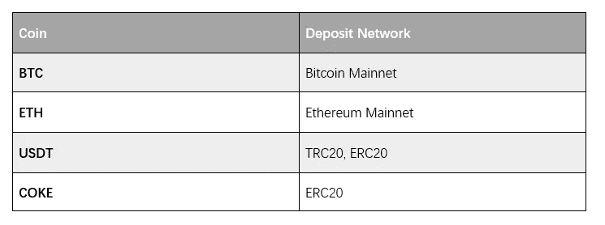
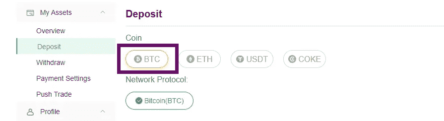
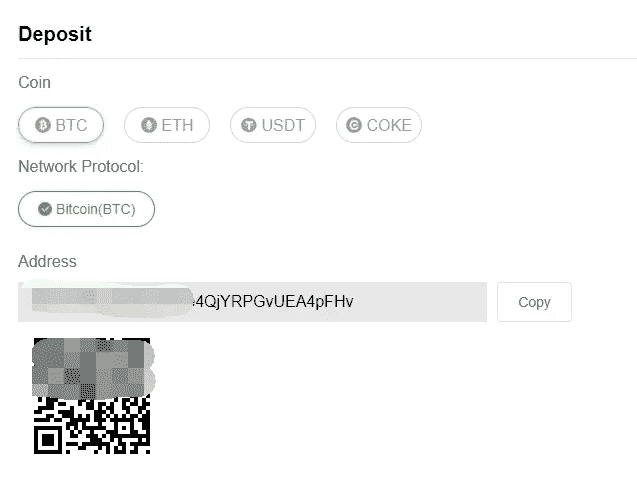
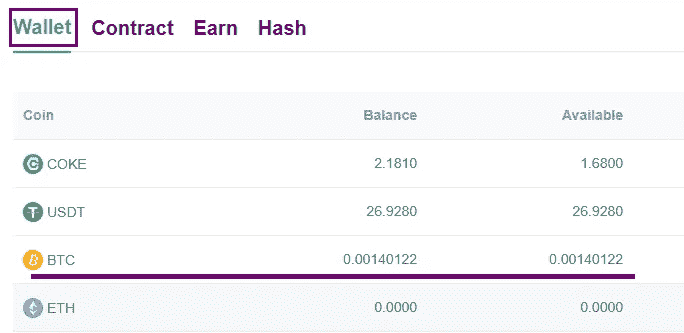

# BitCoke 教程|比特币存款

> 原文：<https://medium.com/coinmonks/bitcoke-tutorial-bitcoin-deposit-796c75d3cbea?source=collection_archive---------64----------------------->

## BitCoke 是 2022 年增长最快的加密交易所之一，在 CoinMarketCap 衍生品市场排名第七。本教程将介绍 BitCoke 存款流程，并根据个人经验提供一些实用建议。

BitCoke 为职业交易员提供了数百种加密货币、众多产品和高级功能。

然而，与币安或 FTX 不同，该平台不直接支持法定存款或法定加密交换。为了使用 BitCoke，你需要从另一个交易所或钱包存入密码。

# 选择硬币进行存款

进入存款界面，点击 [BitCoke 网站](https://www.bitcoke.com/trade/BTCUSD)右上角的“资产”底部，进入“存款”部分。

目前，BitCoke 只接受 4 种硬币的存款，即比特币、以太坊、USDT 及其平台令牌——COKE。此外，网络选项有限:

为了减少费用，强烈推荐 USDT-TRC20 存款。但是为了便于说明，我将使用比特币存款。

Select BTC, the coin I intend to deposit

# 获取存款地址

存款页面会显示比特币地址和二维码。

只需复制地址并粘贴到您将 BTC 转移到 BitCoke 的平台上。

Copy the Bitcoin address to the remitting platform

# 在汇款平台完成转账

按照汇款平台的转账流程完成 BTC 转账。请注意，您应该选择同一个网络——BTC 主网来转移资金。

按如下方式检查**钱包账户**中的存款。

Deposited funds are credited to BitCoke Wallet account

> 加入 Coinmonks [电报频道](https://t.me/coincodecap)和 [Youtube 频道](https://www.youtube.com/c/coinmonks/videos)了解加密交易和投资

# 另外，阅读

*   [3 商业评论](/coinmonks/3commas-review-an-excellent-crypto-trading-bot-2020-1313a58bec92) | [Pionex 评论](https://coincodecap.com/pionex-review-exchange-with-crypto-trading-bot) | [Coinrule 评论](/coinmonks/coinrule-review-2021-a-beginner-friendly-crypto-trading-bot-daf0504848ba)
*   [莱杰 vs Ngrave](/coinmonks/ledger-vs-ngrave-zero-7e40f0c1d694) | [莱杰 nano s vs x](/coinmonks/ledger-nano-s-vs-x-battery-hardware-price-storage-59a6663fe3b0) | [币安评论](/coinmonks/binance-review-ee10d3bf3b6e)
*   [Bybit 交易所评论](/coinmonks/bybit-exchange-review-dbd570019b71) | [Bityard 评论](https://coincodecap.com/bityard-reivew) | [Jet-Bot 评论](https://coincodecap.com/jet-bot-review)
*   [3 commas vs crypto hopper](/coinmonks/3commas-vs-pionex-vs-cryptohopper-best-crypto-bot-6a98d2baa203)|[赚取加密利息](/coinmonks/earn-crypto-interest-b10b810fdda3)
*   最好的比特币[硬件钱包](/coinmonks/hardware-wallets-dfa1211730c6) | [BitBox02 回顾](/coinmonks/bitbox02-review-your-swiss-bitcoin-hardware-wallet-c36c88fff29)