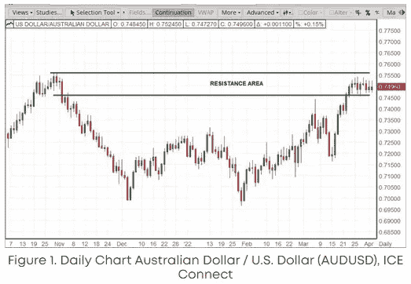

# 交易知识之十

> 原文：<https://medium.com/coinmonks/bites-of-trading-knowledge-10-3992891bad74?source=collection_archive---------58----------------------->

期货合约的名义价值是多少？-

期货合同的名义价值是合同理论上控制的总价值。

合约规模*基础价格=名义价值例如，迷你美元指数期货(SDX)的合约规模为 200 美元 x 指数价值，假设 SDX 价格为 98.000，则期货合约的名义价值为 19，600.00 美元。

**保证金和杠杆有什么区别？-**

保证金是指为控制期货合约而存放在经纪人处的金额。它由期货交易所决定，并可能由经纪人调整，以管理客户的风险。

杠杆率是指与直接购买期货合约的基础产品(相当于期货合约的名义价值)相比，理论上可以用更少的钱来控制 1 份期货合约的能力。

要计算一份期货合约的杠杆作用，用该合约的名义价值除以保证金。上面的 SDX 例子的名义价值为 19，600.00 美元，保证金要求为 380 美元，约等于我们资金杠杆的 51 倍(19，600.00 美元/ $380 = 51)。

**什么是一个点和一个勾？-**

点是小数点左边可能出现的最小价格增量。(举例。9**0**0.000)

分笔成交点是在查看期货合约价格时发生在小数点右侧的价格变动，是市场测量的最小可能价格变动。一个点由记号组成。(举例。90.000)迷你美元指数期货(SDX)的最小价格波动为 0.005 美元，代表一个基点，将从 90.000 移动到 90.005。从 90.000 点上涨到 91.000 点需要 200 个基点。

**企业和个人投资者的风险和机遇** -
金融市场工具管理风险和机遇的一般应用。

对冲投资组合风险

用迷你美元指数期货(SDX)合约对冲现货澳元(AUD)敞口是一种管理投资组合风险的方式，通过采取与基础资产相反的方向头寸作为保护。例如，套期保值者可能计划使用基于内部市场和投资组合分析过程的期货合约来对冲澳元的价格下跌。市场分析可以使用常见的技术分析技术，如支持和阻力，来制定交易决策。在图表(图 1)中，如果预计澳元在接近阻力区时会走软，套期保值者可能会计划在 0.7560 美元或 0.7460 美元的价格水平或低于 0.7560 美元或 0.7460 美元的价格水平使用迷你美元指数期货(SDX)合约进入多头期货头寸，以锁定其基础澳元头寸的价值。

请随时加入我们的˲tradewithufos 社区，我们提供全面的交易课程和交易应用程序。

完成课程设置:
[【www.tradewithufos.com/courses】T2](https://www.tradewithufos.com/courses/)

为所有人免费永久会员:

**传统研究团队**

> **加入 Coinmonks [电报频道](https://t.me/coincodecap)和 [Youtube 频道](https://www.youtube.com/c/coinmonks/videos)了解加密交易和投资**

# **另外，阅读**

*   **[从 WazirX 切换到 CoinDCX 的 5 个理由](https://coincodecap.com/reasons-to-switch-from-wazirx-to-coindcx)**
*   **[联合国硬币评论](https://coincodecap.com/unocoin-review) | [最佳加密赌注硬币](https://coincodecap.com/best-crypto-staking-coins)**
*   **如何使用 MetaMask Wallet 获得 KCC 地址？**
*   **[如何获得自己的。XYZ 领域？](https://coincodecap.com/xyz-domain)**
*   **[最佳加密交换平台](https://coincodecap.com/best-crypto-swap-platforms) | [最佳加密交易所](https://coincodecap.com/crypto-exchange)**
*   **[购买比特币印度](/coinmonks/buy-bitcoin-in-india-feb50ddfef94) | [Pionex 评论](/coinmonks/pionex-review-exchange-with-crypto-trading-bot-1e459d0191ea) | [加密交易机器人](/coinmonks/crypto-trading-bot-c2ffce8acb2a)**