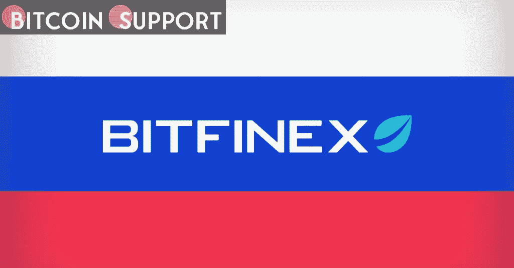

# Bitfinex 拒绝冻结未受制裁的俄罗斯人持有的加密货币

> 原文：<https://medium.com/coinmonks/bitfinex-refuses-to-freeze-cryptocurrency-held-by-russians-who-are-not-sanctioned-cc07571e9444?source=collection_archive---------54----------------------->

**Visit our website:-** [**https://bitcoinsupports.com/**](https://bitcoinsupports.com/)

面对数百家逃离该国的公司，加密社区正在为普通俄罗斯人的权利而斗争，但当局拥有最终决定权。在全球企业因乌克兰军事战争抵制俄罗斯人民的背景下，一些加密货币公司正在为未受制裁的俄罗斯个人的权利挺身而出。

Bitfinex 的一名代表周四告诉 Cointelegraph，全球最大的稳定币供应商 Tether (USDT)的子公司 Bitfinex 不会为了应对全球制裁而随意冻结俄罗斯普通客户的账户。

发言人强调，Bitfinex 已经对被制裁的俄罗斯用户账户采取了适当的措施。这位发言人补充说:“与我们所有的客户账户一样，我们监控可能违反适用的国际制裁的异常活动或行为。”根据 Bitfinex 的说法，由于当前的冲突禁止所有普通俄罗斯人在人类层面上可能是不公正的，因为政府的行为可能不代表个人。

***“我们的观点是，政府的行为不一定代表个人的意愿。除非监管我们的监管机构另有指示，否则我们希望保护所有客户的账户。”发言人拒绝对 Bitfinex 的俄罗斯市场发表评论，只是简单地指出“Bitfinex 服务于俄罗斯消费者。”

在撰写本文时，Bitfinex 的服务条款规定,“受制裁人”是指明确列在任何制裁名单上的任何个人或数字令牌地址，或者由任何个人或个人团体直接或间接拥有 50%或以上的股份。根据法律声明，Bitfinex 上的受制裁者也指受到任何政府批准或根据相关经济制裁受到制裁、限制或罚款的人。根据 CoinGecko 的数据，Bitfinex 成立于 2012 年，是世界上最大的加密货币交易所之一，在撰写本文时，日交易量超过 8 亿美元。总部位于维尔京群岛的 crypto exchange 因成为美国监管诉讼的焦点而闻名，Bitfinex 和 Tether 同意在 2021 年 10 月因违反美国商品交易法而支付 4300 万美元的罚款。面对日益加剧的全球地缘政治紧张局势，Bitfinex 并不是唯一一家希望继续帮助普通俄罗斯人的加密货币交易所。根据 Bittrex 首席合规官米迦勒·卡特的说法，加密交易所致力于遵守制裁义务，同时“尽量减少对守法交易商的干扰”，包括俄罗斯的交易商。总部位于伦敦的加密货币交易所 Exmo 也仍在支持其俄罗斯客户。Exmo 的业务发展主管 Maria Stankevich 表示:“我们不会暂停或封锁普通人的账户。不过，她表示，如果英国金融行为监管局(Financial Conduct Authority)发布制裁普通公民的命令，该交易所将不得不配合。非营利加密政策倡导组织 Coin Center 的执行董事杰里·布里托(Jerry Brito)也在 3 月初敦促全球加密公司继续为受制裁的俄罗斯公民提供服务，他表示:

[https://twitter.com/jerrybrito/status/1500839397385977857](https://twitter.com/jerrybrito/status/1500839397385977857)***

**访问我们的网站:-**[**https://bitcoinsupports.com/**](https://bitcoinsupports.com/)

**免责声明:这些都是作者的观点，不应被视为投资建议。读者应该做自己的研究。**