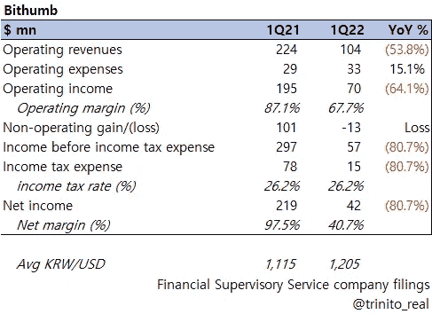
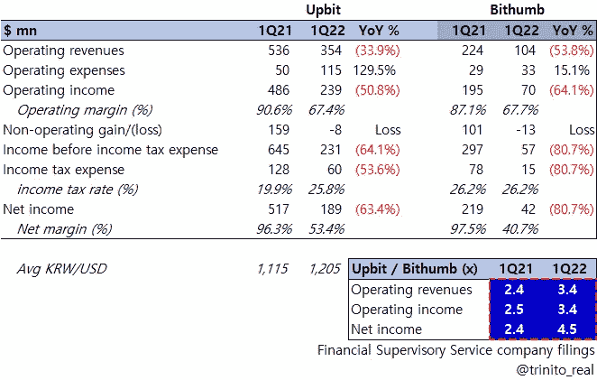
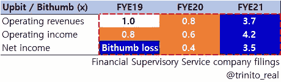
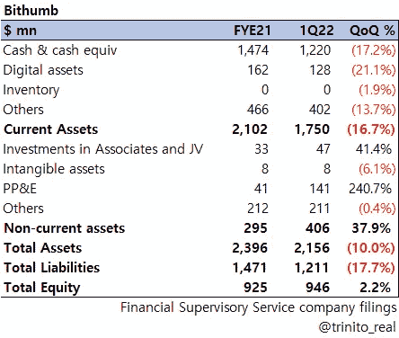
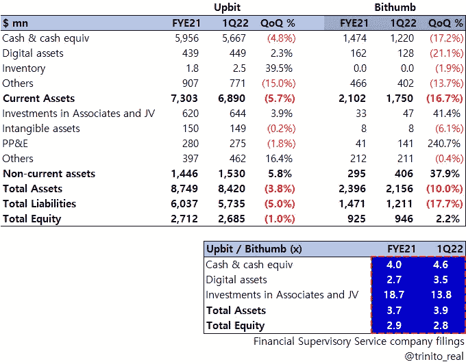
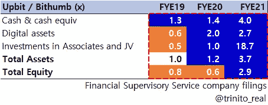
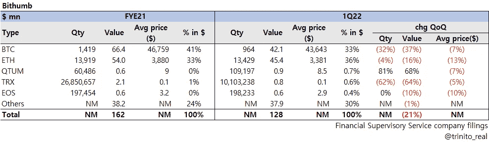
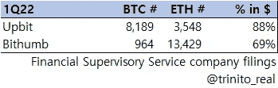
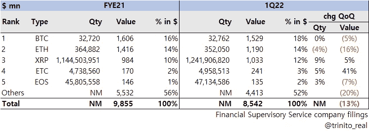

# Bithumb FS 与 Upbit - 1Q22 的比较

> 原文：<https://medium.com/coinmonks/bithumb-fs-comparison-vs-upbit-1q22-616426d1d3e5?source=collection_archive---------37----------------------->

**《Upbit supreme》**

对于我们本季度的最后一个 CEX 金融系列，以下是韩国最大的两家交易所 Bithumb 和 Upbit 的第一季度对比。

## **1)比瑟姆损益表**

**A .利润表**

*   Bithumb 在 2012 年第一季度的顶线下降了 50%以上，明显高于 Upbit 和比特币基地约 35%的水平
*   OPM 的 67.7%与 Upbit 的 67.4%几乎相同，这主要是因为 Bithumb 的 OPEX 仅增长了 15%，而 Upbit 的同比增幅接近 130%

Bithumb 肯定更加保守，增加了额外的招聘和管理费用(考虑到所有者想要出售公司)

*   与其他 CEX 平台的情况一样，由于数字资产估值损失 1130 万美元(上一季度收益近 6000 万美元)，非运营业务出现亏损
*   利润同比下降超过 80%,但仍然实现了盈利

**B .损益表比较与比较**

*   上表基本上显示了杜纳姆(Upbit)和比瑟姆的 1Q21 / 1Q22 是数字
*   值得一提的是，虽然两家公司的年同比跌幅都很大，但就韩元计价的数据而言，Upbit/Bithumb 的利润差距已经扩大[超过 2 倍，目前超过 3 倍](如上表中蓝色部分所示)
*   如果我们回到几年前，在过去的 3 个财年(2019-2021)做同样的练习，我们会得到以下结果:

白色单元格:Upbit = Bithumb
橙色单元格:Upbit < Bithumb
蓝色单元格:Upbit > Bithumb

*   除了底线，Bithumb 在 2019 年和 2020 年的 IS 数据高于 Upbit(在韩国是第一 CEX)，但这种情况在去年发生了戏剧性的逆转，Upbit 现在从上到下至少大 3.5 倍(现在是韩国无争议的第一)；绝对惊艳…

## **1)** **资产负债表**

**a .**资产负债表

*   尽管 Bithumb 的现金及现金等价物季度环比下降 17%(不包括韩元贬值 15.6%)，但仍占总资产的 56%以上
*   非流动资产的激增是土地收购的结果(大约。1.23 亿美元)

**B.** **资产负债表对比与上升**

*   上表基本上显示了 Dunamu (Upbit)和 Bithumb 的 FYE21 / 1Q22 BS 数
*   与 Upbit 相比，Bithumb 在过去两个季度的资产负债表规模较小，现金/总资产/总股本的平均差距目前接近 4 倍(如上表中蓝色部分所示)
*   如果我们回到几年前，在过去的 3 个财年(2019-2021)做同样的练习，我们会得到以下结果:

白色单元格:Upbit = Bithumb
橙色单元格:Upbit < Bithumb
蓝色单元格:Upbit > Bithumb

*   直到 2019 年，Bithumb 在资产负债表上一直是 Upbit 的竞争对手，但截至 2021 年，end Upbit 的现金增加了 4 倍，资产增加了 3.7 倍，账面价值增加了 2.9 倍(再次成为 Upbit 的霸主)

**C.** **比瑟姆的数字资产**

* Please click the image for expanded view *

*   Bithumb 在披露 CEX 拥有的数字资产类型(28 种不同的代币/硬币)方面做得很好；为了简单起见，我们提到了价值最高的 5 个，其余的归入其他类别
*   值得指出的是，Bithumb 在 2012 年第一季度销售了 455 个 BTC，以美元计算，其 ETH 超过了 BTC。该公司基本上出售了除 QTUM 之外的大多数数字资产(为什么呢？)
*   以美元计算，BTC 和瑞士联邦理工学院占比森银行全部数字资产的 69%。

*   从两家公司迄今披露的信息来看，有趣的是 Upbit 持有更多 BTC，而 Bithumb 持有更多 ETH

**D.** **Bithumb 客户的数字资产**

* Please click the image for expanded view *

*   在披露平台上客户的数字资产方面，Bithumb 值得称赞(Upbit 不披露这一点)；公司将客户的数字资产分为 27 种不同的类型(我们刚刚提到了以美元计算的前 5 种，其余的归入其他类型)
*   以下是关键要点:

1) BTC 和 ETH 加在一起“仅”占 30%多一点(与比特币基地的 66%相比，Korea = Altcoin Kingdom？).

2) XRP 是 Bithumb 客户持有的第三大股票，以美元计占总份额的 10%以上；平台上 XRP 的总数量环比增加。

3)如果你将截至 2012 年第一季度 Bithumb 客户的数字资产规模(85 亿美元)与比特币基地的数字资产规模(2460 亿美元)进行比较，它只有后者的 3.5%。在同一季度，Bithumb 的收入占比特币基地的 9%,但仅占客户持有的数字资产的 3.5%(以美元计算)。

由 Trinito 联合创始人 Eric Yoo 撰写，Trinito 投资主管 SungPil Huh 供稿。

# Bithumb #比特币基地# Upbit #比特币#以太坊# Ripple # BTC # ETH # XRP #加密货币#加密资产# CEX #数字资产

## **链接**

关于我们之前在集中交易金融系列 1Q22 中的帖子，请参见下文:
1) [概览:Upbit Q1 2022 年损益表要点](/coinmonks/at-a-glance-upbit-q1-2022-18b1bd8b4717) & [【韩国版本。】](https://trinito.medium.com/%ED%95%9C%EB%88%88%EC%97%90-%EC%82%B4%ED%8E%B4%EB%B3%B4%EA%B8%B0-%EC%97%85%EB%B9%84%ED%8A%B8-1q22-f988b8b48921)
2) [一览:Upbit Q1 2022 年资产负债表亮点](/coinmonks/at-a-glance-upbit-q1-2022-293140213a0f) & [【韩国版。】](https://trinito.medium.com/%ED%95%9C%EB%88%88%EC%97%90-%EC%82%B4%ED%8E%B4%EB%B3%B4%EA%B8%B0-%EC%97%85%EB%B9%84%ED%8A%B8-1q22-588d59e8628c)
3) [Upbit vs 比特币基地对比:1Q22 财务报表](/coinmonks/upbit-vs-coinbase-comparison-1q22-3a4657f01b8e) & [【韩国 Ver。】](https://trinito.medium.com/%EC%97%85%EB%B9%84%ED%8A%B8-vs-%EC%BD%94%EC%9D%B8%EB%B2%A0%EC%9D%B4%EC%8A%A4-%EB%B9%84%EA%B5%90%EB%B6%84%EC%84%9D-1q22-7bdb102c3db0)

**Bithumb 1Q22 季报** [https://dart.fss.or.kr/dsaf001/main.do?rcpNo=20220516002252](https://dart.fss.or.kr/dsaf001/main.do?rcpNo=20220516002252)

**杜纳姆(Upbit)季报 1q 22** [https://dart.fss.or.kr/dsaf001/main.do?rcpNo=20220530000847](https://dart.fss.or.kr/dsaf001/main.do?rcpNo=20220530000847)

**比特币基地季报 1q 22** [https://www . sec . gov/Archives/Edgar/data/0001679788/000167978822000048/coin-20220331 . htm](https://www.sec.gov/Archives/edgar/data/0001679788/000167978822000048/coin-20220331.htm)

> 加入 Coinmonks [电报频道](https://t.me/coincodecap)和 [Youtube 频道](https://www.youtube.com/c/coinmonks/videos)了解加密交易和投资

# 另外，阅读

*   [币安 vs FTX](https://coincodecap.com/binance-vs-ftx) | [最佳(索尔)索拉纳钱包](https://coincodecap.com/solana-wallets)
*   [如何在 Uniswap 上交换加密？](https://coincodecap.com/swap-crypto-on-uniswap) | [A-Ads 评论](https://coincodecap.com/a-ads-review)
*   [加密货币储蓄账户](/coinmonks/cryptocurrency-savings-accounts-be3bc0feffbf) | [YoBit 审核](/coinmonks/yobit-review-175464162c62)
*   [Botsfolio vs nap bots vs Mudrex](/coinmonks/botsfolio-vs-napbots-vs-mudrex-c81344970c02)|[gate . io 交流回顾](/coinmonks/gate-io-exchange-review-61bf87b7078f)
*   [CoinFLEX 评论](https://coincodecap.com/coinflex-review) | [AEX 交易所评论](https://coincodecap.com/aex-exchange-review) | [UPbit 评论](https://coincodecap.com/upbit-review)