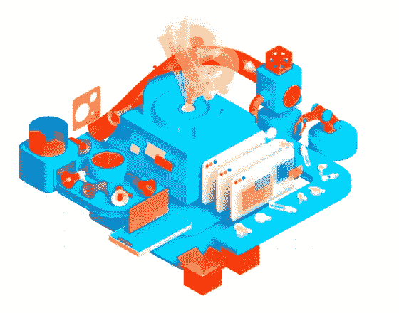
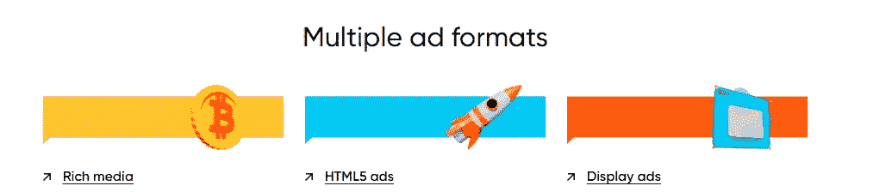
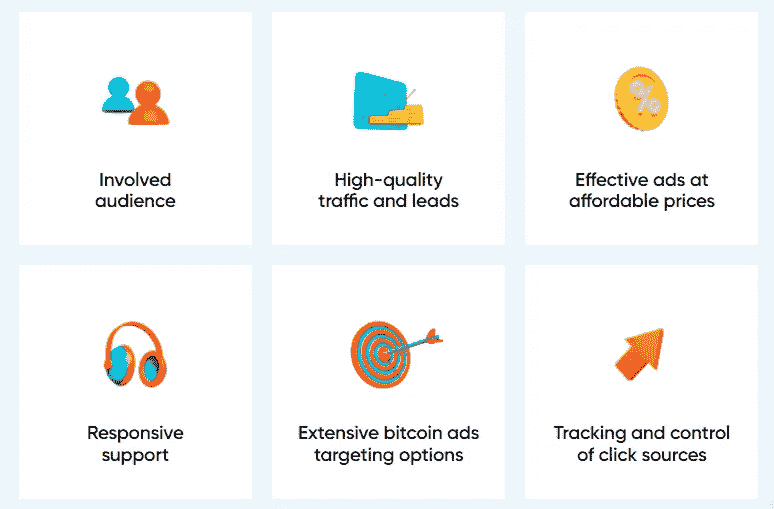
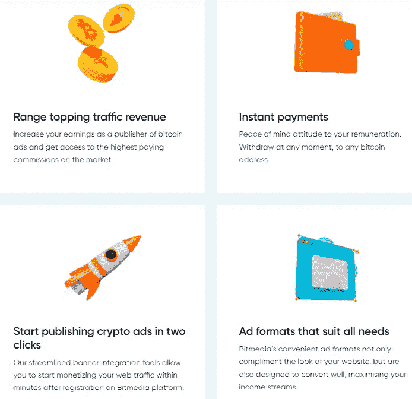

# 比特媒体评论 2022

> 原文：<https://medium.com/coinmonks/bitmedia-review-2022-4d723bfdf646?source=collection_archive---------21----------------------->

最大的加密广告市场

Bitmedia — Greatest Crypto Ad Marketplace

近年来，加密货币的受欢迎程度显著提高。人们越来越多地选择比特币、以太坊和 ripple 等加密货币，而不是其他数字货币，在数字世界中进行在线支付。随着加密货币的大规模流行，包括 Bitmedia.io 在内的众多广告公司开始关注加密利基。

> 如果你是一个寻找最好的加密广告网络的出版商或广告商，你来对地方了，因为今天我们将对 Bitmedia.io 做一个深入的回顾，这将帮助你决定它是否值得。

# 什么是比特媒体？

B [itmedia](https://bitmedia.io?r=b1tmedia) 是一家比特币广告网络，成立于 2015 年，目标是通过为区块链企业提供最合适的加密受众，成为最大的加密广告网络。其目的是使在线广告的买卖更加容易。 [Bitmedia](https://bitmedia.io?r=b1tmedia) 近年来越来越受欢迎，因为它为其出版商和营销人员提供了高水平的服务。

> 这是一个快速增长的比特币广告网络，月浏览量超过 10 亿次，独立访客 2000 万。此外，迄今为止，已经提供了近 20，000 个广告活动。它是为数不多的为广告商和出版商提供完整解决方案的广告网络之一。

# Bitmedia 与其他加密广告网络的区别是什么？

Bitmedia.io 是一个加密货币广告网络，自 2015 年开始运营。它是 Cointraffic、Coinzilla 和其他加密广告网络的完美替代品。

由于它向广告商提供目标受众，它在所有加密广告网络中脱颖而出。在过去的几年里，他们稳步提高并保持了他们的质量，这就是为什么许多广告商和出版商更喜欢 Bitmedia.io 而不是其他广告网络。

[Bitmedia](https://bitmedia.io?r=b1tmedia) 是一家领先的加密广告网络，为其广告商和出版商提供其他网络所缺乏的各种优质功能，如高性能的广告格式、灵活的定价模式、定制的目标定位、高质量的流量等。

# Bitmedia 上的广告格式

Bitmedia 为其广告商和出版商提供了多种广告风格。展示广告、视频广告和富媒体广告都是可用的广告形式。

让我们仔细看看它们。

**展示广告**
在网站或社交媒体平台上，展示广告是获得用户关注的一种方法。这些广告要么是基于文本的，要么是基于图像的，它们鼓励用户点击它们。你可以使用任何大小的横幅，扩大你的消费者群，以增加你的收入。

**视频广告**
视频广告顾名思义，就是利用视频来宣传你的品牌的广告。视频广告是以简单明了的方式让你的观众了解你的公司的最有效的方式之一。

**富媒体广告**
富媒体广告超越了文本广告和显示广告，因为它们包括更复杂的功能，如视频、音乐或其他促使观众参与的组件。您可以使用带有 [Bitmedia](https://bitmedia.io?r=b1tmedia) 的自适应智能横幅，让您的广告对用户更具吸引力。

# Bitmedia 上的广告商

对于广告和出版商来说，Bitmedia.io 可能是最好的平台，因为它为双方提供了完整的解决方案。

[Bitmedia](https://bitmedia.io?r=b1tmedia) 是最大的加密广告网络之一，拥有最大的加密相关受众。如果你想在网上推广你的业务，尤其是利用目标加密受众， [Bitmedia](https://bitmedia.io?r=b1tmedia) 是你做过的最好的决定。

有了 [Bitmedia](https://bitmedia.io?r=b1tmedia) ，你可以不费吹灰之力推广你的公司。此外，您在该平台的投资将获得回报。

在 Bitmedia.io 上做广告的第一步是创建一个账户。验证后，您可以开始构建您公司的活动。为您的活动设置目标选项，以创建符合您需求的活动。现在是时候为你的公司开发广告了。文字和图形广告类型均可从 [Bitmedia](https://bitmedia.io?r=b1tmedia) 获得。制作广告，为它们分配预算，并打开它们。作为一个 [Bitmedia](https://bitmedia.io?r=b1tmedia) 广告主，你只需要做到这一点。

# 对广告主有什么好处？

以下是广告客户的一些众所周知的优势:

有针对性的优质流量
高 CTR(点击率)
支付便利
活动可以快速展开。
业绩跟踪系统
高性价比广告
24/7 支持

# 面向出版商的比特媒体

> 你有博客赚钱的策略吗？已经将博客货币化，但没有看到你想要的结果？想用更好的广告网络赚更多的钱吗？

**如果是**，那么 [Bitmedia](https://bitmedia.io?r=b1tmedia) 就是你唯一想要赚取高额收入的公司。使用 [Bitemdia](https://bitmedia.io?r=b1tmedia) ，您可以增加收入并快速获得收入奖励。

要成为一名 [Bitmedia](https://bitmedia.io?r=b1tmedia) 发布者，你必须首先注册一个账户并填写发布者表格。

只需使用 Bitmedia 提供的多种广告格式在你的网站上添加广告代码。创建一个广告块并在其中放置广告只需要几秒钟。

# 对出版商有什么好处？

以下是 Bitmedia 为其出版商提供的一些显著优势。

高端出版商的投放
各种广告形式
快速支付
支出的支付门槛被设定为最低。
提供 CPC 和 CPM 收入方式，以及 24/7 支持。

# 我会推荐 Bitmedia 吗？

答案将是一个响亮的是！但是为什么呢？作为一个为广告商和出版商提供完整解决方案的加密广告网络，它是那些希望锁定加密受众的人的最佳选择。此外，他们所保持的高质量水平使他们从所有其他加密广告网络中脱颖而出。

因此，如果你一直在寻找最伟大的加密广告网络，Bitmedia.io 是最佳选择，因为它自 2015 年以来一直在运营。

你还在等什么？立即加入 [Bitmedia](https://bitmedia.io?r=b1tmedia) 以免浪费时间。

> *加入 Coinmonks* [*电报频道*](https://t.me/coincodecap) *和* [*Youtube 频道*](https://www.youtube.com/c/coinmonks/videos) *了解加密交易和投资*

# 另外，阅读

*   [Bookmap 评论](https://coincodecap.com/bookmap-review-2021-best-trading-software) | [美国 5 大最佳加密交易所](https://coincodecap.com/crypto-exchange-usa)
*   最佳加密[硬件钱包](/coinmonks/hardware-wallets-dfa1211730c6) | [Bitbns 评论](/coinmonks/bitbns-review-38256a07e161)
*   [新加坡十大最佳密码交易所](https://coincodecap.com/crypto-exchange-in-singapore) | [收购 AXS](https://coincodecap.com/buy-axs-token)
*   [红狗赌场评论](https://coincodecap.com/red-dog-casino-review) | [Swyftx 评论](https://coincodecap.com/swyftx-review) | [CoinGate 评论](https://coincodecap.com/coingate-review)
*   [投资印度的最佳加密软件](https://coincodecap.com/best-crypto-to-invest-in-india-in-2021)|[WazirX P2P](https://coincodecap.com/wazirx-p2p)|[Hi Dollar Review](https://coincodecap.com/hi-dollar-review)
*   [加拿大最好的加密交易机器人](https://coincodecap.com/5-best-crypto-trading-bots-in-canada) | [库币评论](https://coincodecap.com/kucoin-review)