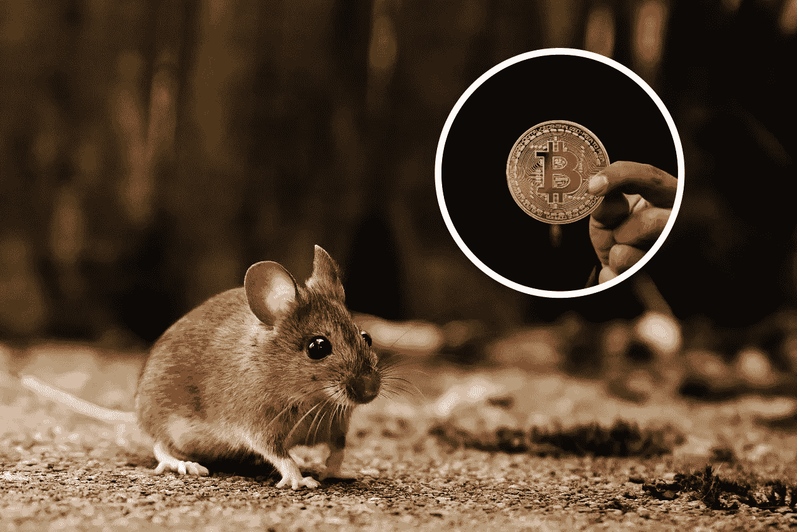
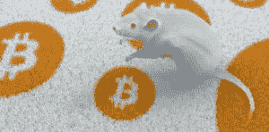
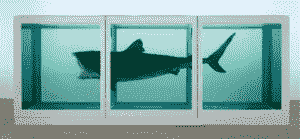

# BitMouseDAO:DAO 是如何修改老鼠 DNA 来存储比特币的

> 原文：<https://medium.com/coinmonks/bitmousedao-how-a-dao-is-modifying-mouse-dna-to-store-bitcoin-12f604e98598?source=collection_archive---------28----------------------->

Image Credit: Pixabay

> *“我们已经把鼠标的价值直接和比特币绑在了一起，它会随着比特币的每日价值而波动。也许十年后它会值 1 亿美元，也可能一文不值。”*

# 那么，什么是刀呢？

去中心化自治组织(DAO)是一个总部位于区块链的在线社区，有着共同的财务目标。近年来，我们已经看到了许多种类，这种情况将继续下去，因为否则无法实现的项目正在构思中。

从 [ConstitutionDAO](https://www.constitutiondao.com/) (购买美国宪法副本的一次势均力敌但毫无悬念的尝试)到 [BlockbusterDAO](https://www.forbes.com/sites/ericmack/2022/01/12/a-new-dao-wants-to-buy-blockbuster-and-it-has-one-key-supporter/) (他们正在寻求将前视频租赁企业的同名产品复活为流媒体服务)，DAO 可以从轻率的人到天才大相径庭。

BitMouseDAO 是区块链的一个新项目,希望使用基因工程病毒将加密货币钱包的密钥编码到实验室老鼠的 DNA 中。但这种科学进步或集体行动是否出了问题？

现在，我们认为没有人看到 BitMouse 的到来(虽然模拟理论家可能不同意)，但它会成功吗？

# 它是如何工作的？

加密货币投资者可以购买 [BitMouse](https://juicebox.money/#/p/bitmousedao) 代币，参与这个项目的社区和治理，并获得一部分利润。在撰写本文时，BitMouseDAO 刚刚筹集了 1ETH，所以这个项目还没有获得太多的关注。这是否会阻止创作者还不确定。

项目投资正通过从最初的比特鼠及其未来后代(在第一只幼鼠出生后的三个月内繁殖)的图像创建的 NFT 得到激励。

显然，为 BitMouseDAO 提出的基因编辑不会“对小鼠本身产生任何影响”，所以从伦理上讲，这不是一个痛苦的过程(特别是相对于实验室小鼠的历史治疗)，但它真的有必要吗？

这项技术有一个不太可能的用例，作为一个实验性的先驱，将密钥或其他敏感信息编码到人类 DNA 中供日常使用，但这似乎不太可能，如果有的话，对采纳者来说会有风险。

这可能就是为什么这一切都被定型为一个“艺术项目”。

Image Credit: BitMouseDAO via Medium

# 生物艺术

除了看起来像是对自然的犯罪，这也不是一个完全独特的想法。 [BitMouseDAO 的网站](https://mirror.xyz/0xBd8609CEe8FdD21C477b4D9d0A66B3F4332aFA74/AlC2O4mYpa6odn64fH1HjjXk36cbOAjaQOQYwKXBMiQ)将 BitMouseDAO 先锋爱德华多·卡奇(Eduardo Kac)的[臭名昭著的夜光兔](https://en.wikipedia.org/wiki/Alba_(rabbit))作为核心影响力。

在过去的几十年里和整个人类历史中，生物材料在艺术中的应用已经出现过多次。BitMouseDAO 的创作者还引用了世界上最富有的在世艺术家之一[达明安·赫斯特](https://www.artshelp.net/its-beautiful-only-problem-is-that-its-dead-on-damien-hirst/#:~:text=Though%20some%20creatures%20died%20before,totaling%20an%20estimated%20913%2C450%20creatures)作为灵感来源。据估计，在他备受争议的职业生涯中，他融合了来自近 100 万种不同生物的元素。

我们就不讨论朱昱的晚餐了——吃人。

Damien Hirst/The Physical Impossibility of Death in the Mind of Someone — Credit: Damien Hirst via Medium

在生物逆转录和密码创新计划中，BitMouse 并不真正代表突破。但是也许它会达到预期的效果，也许我们会在不久的将来看到一个鼠标抢劫工具。谁知道呢？这是老鼠和人类最好的计划。

*执笔人:Caleb Donaldson(投稿人&记者@ CONTX Media)。*

> 加入 Coinmonks [电报频道](https://t.me/coincodecap)和 [Youtube 频道](https://www.youtube.com/c/coinmonks/videos)了解密码交易和投资

# 此外，请阅读

*   [Best Cardano 钱包](https://coincodecap.com/best-cardano-wallets)|[bing bon Copy Trading](https://coincodecap.com/bingbon-copy-trading)
*   [印度最佳 P2P 加密交换机](https://coincodecap.com/p2p-crypto-exchanges-in-india) | [Shiba Inu 钱包](https://coincodecap.com/baby-shiba-inu-wallets)
*   [前 8 名加密会员计划](https://coincodecap.com/crypto-affiliate-programs) | [eToro vs 比特币基地](https://coincodecap.com/etoro-vs-coinbase)
*   [最佳以太坊钱包](https://coincodecap.com/best-ethereum-wallets) | [电报上的加密货币机器人](https://coincodecap.com/telegram-crypto-bots)
*   [交易杠杆代币的最佳交易所](https://coincodecap.com/leveraged-token-exchanges) | [购买 Floki](https://coincodecap.com/buy-floki-inu-token)
*   [3 commas vs . Pionex vs . crypto hopper](https://coincodecap.com/3commas-vs-pionex-vs-cryptohopper)|[Bingbon Review](https://coincodecap.com/bingbon-review)
*   [加密复制交易平台](/coinmonks/top-10-crypto-copy-trading-platforms-for-beginners-d0c37c7d698c) | [如何在 WazirX 上购买比特币](/coinmonks/buy-bitcoin-on-wazirx-2d12b7989af1)
*   [货币评论](https://coincodecap.com/coinloan-review)|[Crypto.com 评论](/coinmonks/crypto-com-review-f143dca1f74c)