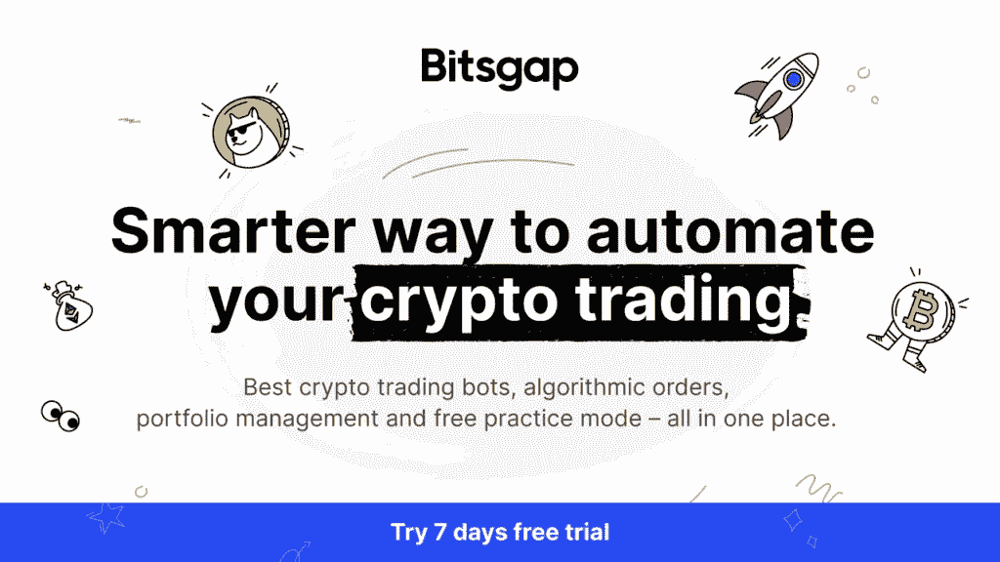
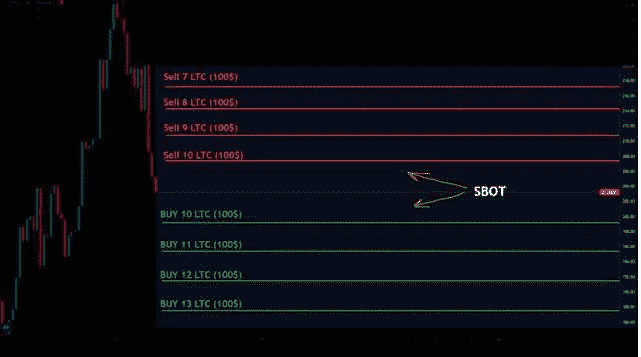
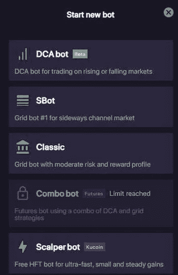

# Bitsgap 评论:放松，让机器人来做繁重的交易工作！

> 原文：<https://medium.com/coinmonks/bitsgap-review-just-relax-and-leave-the-bots-do-the-heavy-work-a2b62143094c?source=collection_archive---------34----------------------->

[**Bitsgap**](https://bitsgap.com/?ref=7c420c38) 是一种加密货币交易服务，提供广泛的服务，帮助交易者充分利用他们的投资。你可以在一个地方找到投资组合管理、信号、演示模式和交易机器人。这使得管理你的加密货币投资组合和有效交易变得更加容易。

虽然 Bitsgap 提供多种服务，但它们都是**最出名的是它们的加密交易机器人**，它们可以在不同的市场条件下 24/7 自主执行交易**，甚至在睡觉**的时候也能自动获利。

我们都知道，数字加密货币的交易令人头疼——它会带来很高的压力，从而降低生活质量。但另一方面，我们也知道，数字加密货币的交易非常有利可图。所以，幸福和赚钱之间总是有一场战争。

就我个人而言，我交易加密货币已经有几年了。在这些年里，我学到了许多图表模式和策略。但我最终意识到，交易加密货币不是我想追求的目标。

交易让我感到焦虑，我经常错过好的交易，因为我想得太多了。此外，虽然我曾经有任何开放的交易，我会卡在整天看手机或笔记本电脑，看看我是否盈利。

我最大的两个敌人是贪婪和情绪。这两者在交易中共同发挥着关键作用，非常难以控制。虽然我很想退出，但我仍然想利用这些年学到的知识，正是在那时，我发现了比特币。

Bitsgap 推出了一种解决方案，可以帮你打理交易部分，让你在享受无压力生活的同时，还能从加密货币中获利。

Bitsgap 通过提供**正确的平衡解决了这个问题，因为交易将由**提供的交易机器人处理。要使用最简单的机器人，你不需要具备交易方面的知识，但我仍然建议你在**演示账户上开始测试不同的机器人之前，先了解交易的基本知识。**

# Bitsgap 提供的不同加密机器人

# Sbot

Bitsgap 提供的最简单、风险也较低的机器人之一是 Sbot，这是一款用于横向渠道市场的 Gridbot。对于不熟悉交易术语的人来说，横向市场是指资产价格在相对狭窄的区间内移动。

Sbot 会自动在渠道底部买入资产，在顶部卖出，从差价中获利。

# 经典机器人

另一个例子是**经典机器人**，它也应用网格策略，但最适合**上升趋势市场。**bits gap 官方知识库部分的描述对其解释如下:

> 使用经典 bot 策略的最佳时机是当你预计市场会出现强劲的**上升趋势**时。在价格上涨时，由于其投资分配逻辑，经典 bot 已被统计证明比其他策略更成功，随着价格上涨，它获得了更好的市场敞口(经典 bot 购买固定数量的硬币，因此增加了上涨时的总投资额)。

由于您正在处理加密货币，因此了解使用交易机器人时涉及的风险非常重要。你选择交易的密码有可能会贬值，所以如果密码的价格下跌超过了密码机器人产生的回报，你仍然会处于净亏损状态。

# 组合机器人

风险最大、回报最高的机器人是组合机器人。这个机器人使你能够利用杠杆进行交易，这意味着你不必拥有基础资产。您还可以做空或做多任何数字资产，这意味着无论市场状况如何，您都可以获利。

请记住，使用杠杆意味着你将面临损失所有投资的高得多的风险。我个人不建议使用杠杆，因为加密货币市场非常不稳定。

您可以通过几个简单的步骤在 Bitsgap 上设置所有加密机器人，如下所示:

1.  **根据自己的风险偏好和市场情况选择 bot** 。
2.  **选择您想要交易的加密对**。
3.  **设置交易范围**——机器人执行指令的范围。
4.  **决定网格级别** —这将影响交易的执行频率，并将取决于您账户上的资金。
5.  设置**止盈，止损，跟涨**就可以开始交易了。
6.  你已经准备好了！

另一个很酷的功能是**回溯测试功能**,它会告诉你在设定的策略回溯时你会赚多少钱。

关于其他机器人的更多信息，我建议你查看 Bitsgap 的 [**官方页面**](https://helpdesk.bitsgap.com/en/collections/2142603-bots)

Bitsgap 的另一个优点是它支持广泛的交易平台，包括币安、Bitfinex、Kucoin 等等。这使得你可以使用这项服务，无论你在哪个交易所交易。

最后，Bitsgap 有一个非常用户友好的界面，让新手和有经验的交易者都能轻松使用。

如果你正在寻找一个全面的交易服务，可以帮助你把你的交易提高到一个新的水平，那么我强烈推荐给 Bitsgap

它允许你将交易机器人与其他服务无缝结合。这极大地增强了平台的价值定位，使其成为每天使用所有这些服务的业余和专业交易者的绝佳选择。

[**你要加入密码交易的 bot 革命吗？**](https://bitsgap.com/?ref=7c420c38)

*原载于 2022 年 5 月 19 日 https://cryptoenthusiast.net**[*。*](https://cryptoenthusiast.net/bitsgap-review-a-comprehensive-trading-service-for-cryptocurrency-traders/)*

> *加入 Coinmonks [电报频道](https://t.me/coincodecap)和 [Youtube 频道](https://www.youtube.com/c/coinmonks/videos)了解加密交易和投资*

# *另外，阅读*

*   *[WazirX vs coin dcx vs bit bns](/coinmonks/wazirx-vs-coindcx-vs-bitbns-149f4f19a2f1)|[block fi vs coin loan vs Nexo](/coinmonks/blockfi-vs-coinloan-vs-nexo-cb624635230d)*
*   *[本地比特币评论](/coinmonks/localbitcoins-review-6cc001c6ed56) | [加密货币储蓄账户](https://coincodecap.com/cryptocurrency-savings-accounts)*
*   *什么是融资融券交易*
*   *[维护卡审核](https://coincodecap.com/uphold-card-review) | [信任钱包 vs 元掩码](https://coincodecap.com/trust-wallet-vs-metamask)*
*   *[Exness 评测](https://coincodecap.com/exness-review)|[moon xbt Vs bit get Vs Bingbon](https://coincodecap.com/bingbon-vs-bitget-vs-moonxbt)*
*   *[如何开始通过加密贷款赚取被动收入](https://coincodecap.com/passive-income-crypto-lending)*
*   *[BigONE 交易所点评](/coinmonks/bigone-exchange-review-64705d85a1d4) | [电网交易 Bot](https://coincodecap.com/grid-trading)*