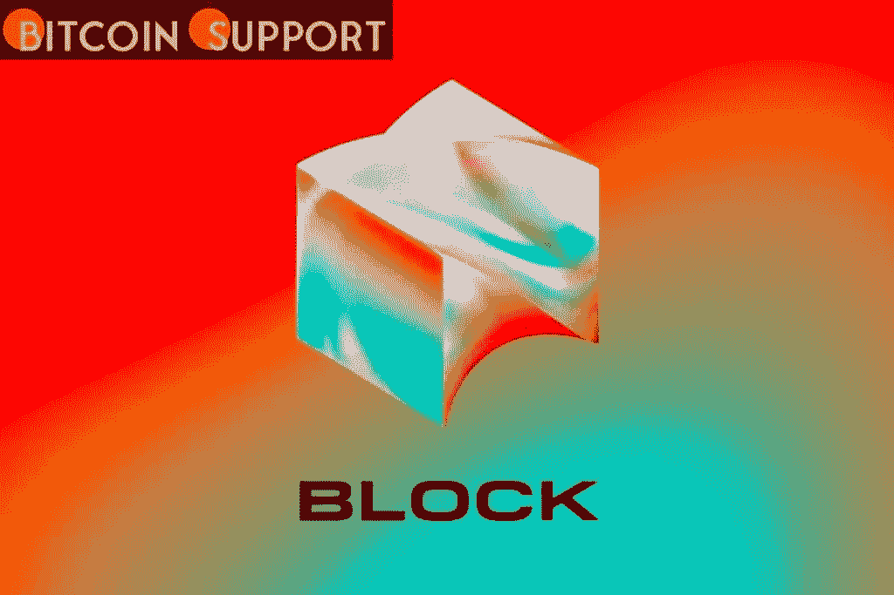

# Block 在第四季度的毛利达到 11.8 亿美元，同比增长 47%

> 原文：<https://medium.com/coinmonks/block-earns-1-18-billion-in-q4-gross-profit-up-47-percent-year-over-year-217b013779ed?source=collection_archive---------70----------------------->

**Visit our website:-** [**https://bitcoinsupports.com/**](https://bitcoinsupports.com/)

Block 在 2021 年的毛利总额为 44.2 亿美元，同比增长 62%；然而，净利润只有 7700 万美元。加密友好型数字支付软件公司 Block，Inc .(原名 Square)报告第四季度总收入为 11.8 亿美元，比 2020 年同期增长 47%。

比特币马克西(Bitcoin maxi)领导的公司，经过 290 亿美元的收购后，杰克·多西现在拥有各种公司实体，包括 Cash App、Square 和新收购的 buy now pay later (BNPL)公司 Afterpay。

Block 于 2 月 24 日发布了 2021 年第四季度报告，显示 Cash App 和 Square 的毛利大幅增长，每家公司分别盈利 5.18 亿美元和 6.57 亿美元，同比增长 37%和 54%。

2021 年，该公司的总毛利为 44.2 亿美元，比上一年增长了 62%。应该对这些统计数据持保留态度，因为 Block 第四季度扣除费用后的净利润仅为 7700 万美元(2021 年全年为 1.66 亿美元)，这意味着运营成本很高。

Cash App 的 Cash Card 和 Square 的卖家生态系统被认为是第四季度增长的重要驱动力，Cash Card 在 12 月的活跃用户超过 1300 万，38%的卖家使用四种或更多 Square 商业产品。布洛克还强调了 2022 年离职后薪酬安排的重要性，称这将使公司在今年大幅扩展其能力和产品。据该公司称，

“我们于 1 月 31 日完成了对全球“现在购买，以后支付”(BNPL)平台 Afterpay 的收购。我们相信，在我们为消费者和商家创造有吸引力的金融产品和服务时，通过加强我们生态系统之间的联系，这次收购将促进 Block 对 Square 和 Cash 应用程序的战略雄心。”Block 最近一直在扩大其加密足迹，1 月中旬，Cash 应用程序集成了 Lightning 网络以加快 BTC 转账速度，多尔西证实，Block 正在推出开源比特币采矿设备。据了解，多尔西在 11 月从 Twitter 辞职后，主要专注于扩大该区块的加密活动。

**访问我们的网站:-**[**https://bitcoinsupports.com/**](https://bitcoinsupports.com/)

**免责声明:以上为作者观点，不应视为投资建议。读者应该自己做研究。**

> *加入 Coinmonks* [*电报频道*](https://t.me/coincodecap) *和* [*Youtube 频道*](https://www.youtube.com/c/coinmonks/videos) *了解加密交易和投资*

# 另外，阅读

*   [Bookmap 评论](https://coincodecap.com/bookmap-review-2021-best-trading-software) | [美国 5 大最佳加密交易所](https://coincodecap.com/crypto-exchange-usa)
*   最佳加密[硬件钱包](/coinmonks/hardware-wallets-dfa1211730c6) | [Bitbns 评论](/coinmonks/bitbns-review-38256a07e161)
*   [新加坡十大最佳加密交易所](https://coincodecap.com/crypto-exchange-in-singapore) | [购买 AXS](https://coincodecap.com/buy-axs-token)
*   [红狗赌场评论](https://coincodecap.com/red-dog-casino-review) | [Swyftx 评论](https://coincodecap.com/swyftx-review) | [CoinGate 评论](https://coincodecap.com/coingate-review)
*   [投资印度的最佳密码](https://coincodecap.com/best-crypto-to-invest-in-india-in-2021)|[WazirX P2P](https://coincodecap.com/wazirx-p2p)|[Hi Dollar Review](https://coincodecap.com/hi-dollar-review)
*   [加拿大最佳加密交易机器人](https://coincodecap.com/5-best-crypto-trading-bots-in-canada) | [库币评论](https://coincodecap.com/kucoin-review)
*   [用于 Huobi 的加密交易信号](https://coincodecap.com/huobi-crypto-trading-signals) | [HitBTC 审查](/coinmonks/hitbtc-review-c5143c5d53c2)
*   [如何在 FTX 交易所交易期货](https://coincodecap.com/ftx-futures-trading) | [OKEx vs 币安](https://coincodecap.com/okex-vs-binance)
*   [OKEx vs KuCoin](https://coincodecap.com/okex-kucoin) | [摄氏替代度](https://coincodecap.com/celsius-alternatives) | [如何购买 VeChain](https://coincodecap.com/buy-vechain)