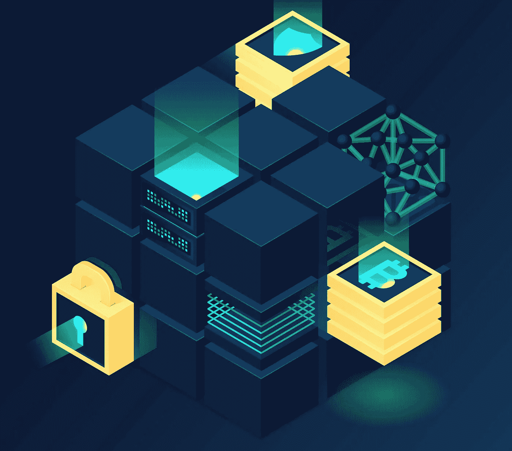

# 块解释

> 原文：<https://medium.com/coinmonks/block-explanation-e0170e9db2c1?source=collection_archive---------7----------------------->

Block explanation

# 什么是街区？

区块是与比特币社区相关的事实被完整记录的地方的档案。一个区块存档一些或所有最近的比特币交易，这些交易现在尚未进入任何先前的区块。因此，块就像分类账或档案簿的网页。每次“完成”一个区块时，它都会提供一条通往区块链中的下一个区块的路径。因此，数据块是文件的永久保存地，一旦写入，就不能更改或删除。

*   块可以被理解为链条中的一环。它拥有之前交易的组成部分或所有信息。
*   区块链社区是由成千上万个街区组成的，处于一个不断变化的国家。
*   一个块显然是不可能被破解的。如果它曾经是可能的，它将会像一个金融机构抢劫犯一样获得柜台，现在不仅仅是拿走现金，而是银行的所有文件。
*   比特币矿工可以解决复杂的数学方程，并因他们在发现解决方案方面的努力而获得 BTC 或比特币。

# 积木是如何工作的

比特币社区见证了大量的交易活动。维护这些交易的文件有助于客户了解过去支付了什么，以及得到了谁的帮助。在给定时间长度的某个阶段进行的交易被记录到一个称为块的文件中，这是区块链网络的基础。

一个块代表“现在”,并携带有关其过去和未来的统计数据。每完成一个街区，它就变成前一个街区的一部分，并为区块链的新街区开路。执行块是以前交易的永久报告，新交易记录在现代交易中。

这样，整机循环工作，统计数据完全存储。每个区块包括一些或所有当前交易的数据，以及对之前区块的引用，加上比特币的点对点验证系统，消费者显然不可能篡改事先记录的交易数据。

# 比特币挖矿的区块

每一个街区都有数学上的麻烦。作为一种竞赛技术的一部分，矿工们不断地处理和记录交易。为了赢得比特币，他们竞相“完成尖端区块”。当获胜的挖掘者有能力清除它时，该回复与不同的挖掘节点共享，并且被验证。矿工每解决一个问题，就会有一个新铸造的 10 BTC 比特币外币图像奖励给矿工，并进入流通。

后续区块中的第一个报告是一个交易，该交易奖励完成前一区块的获胜矿工新铸造的 BTC。由于除了答案之外，新的区块不能提交给社区，因此数学争论的问题决定了新比特币的问世价格。基于通常需要大约 10 分钟来解决问题的现实，每 10 分钟就有大约 10 个新的比特币被铸造出来。

# 块的示例

通过类比，将日常银行交易评估为比特币网络上的交易是可行的。区块链就像金融机构交易的文件，而块可能是金融机构 ATM 在您使用机器后打印出来的单笔交易确认书。在区块链网络中，字符块构成了一个“分类账”,就像自动取款机或金融机构将你的交易归档一样。

区块链虽然文件链作为一个替代他们所有的客户。这相当于一家银行，然而，区块链相对于正规银行机构给予了更大程度的隐私保护。[阅读更多](https://cryptoworldfinace.blogspot.com/2021/12/block-explanation.html)。

> 加入 Coinmonks [电报频道](https://t.me/coincodecap)和 [Youtube 频道](https://www.youtube.com/c/coinmonks/videos)了解加密交易和投资

## 也阅读

 [## 杠杆代币[多头代币]终极指南

### 杠杆化令牌是具有杠杆化风险敞口的 ERC20 令牌，不考虑保证金、要求、管理…

medium.com](/coinmonks/leveraged-token-3f5257808b22)  [## 最佳加密交易所| 2021 年十大加密货币交易所

### 编辑描述

blog.coincodecap.com](https://blog.coincodecap.com/crypto-exchange)  [## 2021 年最佳加密交换平台| CoinCodeCap

### 编辑描述

blog.coincodecap.com](https://blog.coincodecap.com/best-swap-platforms)  [## 2021 年最佳加密借贷平台| 6 大比特币借贷平台

### 获得比特币和其他加密货币的最佳贷款利率

medium.com](/coinmonks/top-5-crypto-lending-platforms-in-2020-that-you-need-to-know-a1b675cec3fa)  [## 2021 年 6 大最佳硬件钱包|顶级加密硬件钱包[更新]

### 最好的加密货币硬件钱包是绝对必要的。我们将在 NGRAVE、Ledger Nano X 和…

medium.com](/coinmonks/the-best-cryptocurrency-hardware-wallets-of-2020-e28b1c124069)  [## 2021 年最佳免费加密交易机器人

### 2021 年币安、比特币基地、库币和其他密码交易所的最佳密码交易机器人。四进制，位间隙…

medium.com](/coinmonks/crypto-trading-bot-c2ffce8acb2a)