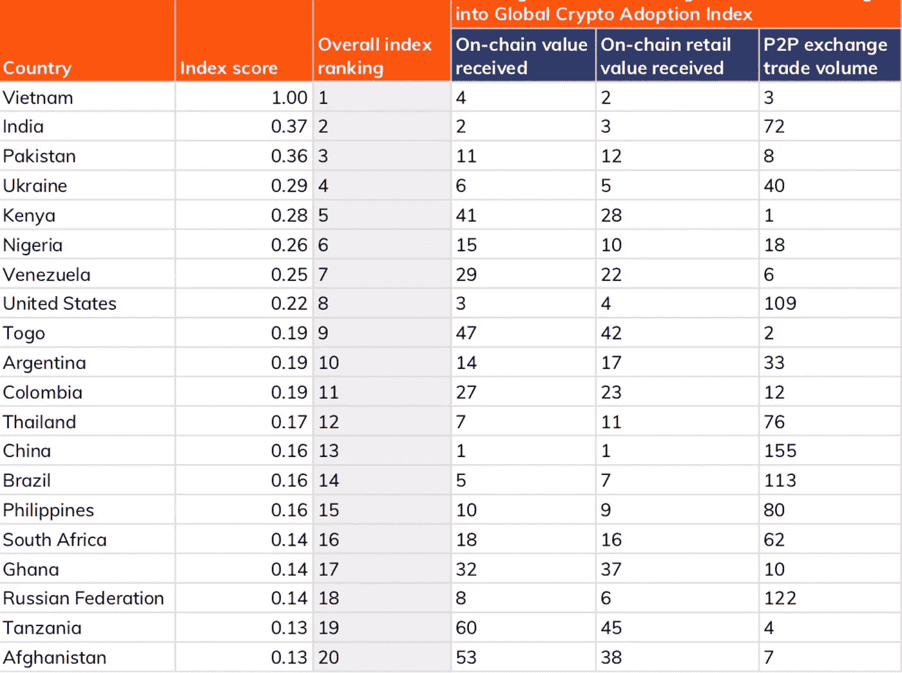

# 区块链的采用即将到来

> 原文：<https://medium.com/coinmonks/blockchain-adoption-is-upon-us-b6048ffee54?source=collection_archive---------61----------------------->

[https://www.pexels.com/@thisisengineering/](https://www.pexels.com/@thisisengineering/)

随着时间的推移，我们继续见证企业和管理机构进入区块链/web3 空间。区块链地区对专业技术的需求比以往任何时候都高；分析师、工程师和开发人员很少见，所以那些能够填补这个职位的人会得到很好的补偿。比特币点燃了加密货币生态系统的火花，并已发展成为一场可怕的大火；我们将获得全球认可。

**是什么推动了区块链的采用？**

在过去的十年里，我们见证了区块链社区的重大创新和整合。加密货币席卷了金融界，并在经济中引入了点对点(p2p)交易(比特币先于 Cashapp、Apple Pay、Samsung Pay 和 PayPal，后者于 2015 年引入了 p2p 服务。)随着更多总部位于区块链的项目开始解决我们全球经济中的其它障碍，机构的兴趣开始上升。根据 [Crunchbase](https://news.crunchbase.com/news/cryptocurrency-experts-say-these-4-factors-are-driving-change-in-the-industry/) 的说法，四个关键因素在区块链技术的采用中发挥着作用:

主流采用

价格波动

监管压力

超越比特币

**主流采用**

随着特定领域的大玩家开始整合到 web3 中，竞争对手会想要跟上潮流。早在 2020 年，Visa 就首次推出了与 Defi 相关的加密货币卡，从那以后，万事达也批准了他们自己的卡，最近，与比特币基地达成了一项 [NFT 支付协议](https://www.cnbc.com/2022/01/18/mastercard-strikes-nft-payments-deal-with-coinbase-amid-wave-of-crypto-partnerships.html)。Visa 报告称，2022 年第一季度的交易额为 25 亿美元，因此更多的竞争对手可能会乘此浪潮，这将为数字货币提供更多的渠道。

**价格波动**

从散户新手的角度来看，价格波动可能看起来相当诱人。当你第一次开始投资时，你主要关注的是百分比变化，看到资产在两天内上涨超过 50%会引发投资者的 FOMO(害怕错过)。正如 Dogecoin 和柴犬等其他迷因币一样，看到其他人赚取巨额利润很快就抓住了其他人的注意力，他们认为这些人在寻找免费的钱。虽然波动性是那些寻求日内交易的人要考虑的事情，但如果你不小心你的退出策略，进入一个不可预测的市场可能是危险的。

**监管压力**

如前一段所述，密码市场非常不稳定。这在很大程度上是由于生态系统不受监管的性质。在没有许可的环境下，加密货币市场被毫无价值的代币和项目所迷惑，这些代币和项目主要是为了骗取天真的投资者的资金。在没有任何标准和应急措施的情况下，储户不会倾向于涉足这个生态系统。建立一些法规将把市场扩大到更多的机构投资者和公司，他们会觉得向客户提供数字货币更安全。

**超越比特币**

随着比特币成为霸主，大多数投机者将加密视为另一种价值储存手段。虽然它可以这样使用，但像以太坊这样的分布式分类帐使开发人员能够构建基础设施，展示区块链技术的所有能力。以太的框架提供了对举办区块链所带来的障碍的洞察力，从那时起，竞争对手开始利用替代基础设施提供创新和革命性的功能。从金融部门到医疗保健，再到物联网操作系统，等等，潜力是无穷无尽的。

**全球采用指数**

[https://blog.chainalysis.com/reports/2021-global-crypto-adoption-index/](https://blog.chainalysis.com/reports/2021-global-crypto-adoption-index/)

根据 [Chainanalysis](https://blog.chainalysis.com/reports/2021-global-crypto-adoption-index/) 的数据，全球采用率激增 880%，p2p 平台是加密货币使用激增的催化剂。看上面的图表，我们可以通过衡量每个省的总链上价值、零售价值和交易量来评估加密采用率排名前 20 位的国家。一个国家的总分是这样计算的:根据这三个指标对每个国家进行排名，然后取每个国家在这些指标中排名的平均值，并在 0-1 的范围内对最终数字进行现代化处理；一个国家的得分越高，他们的排名就越高。我们将进一步详细讨论每个指标:

**收到链上加密值**

这一指标衡量一个国家的整体加密货币活动，根据每个公民的平均财富，活动更重要的国家更受青睐。一个国家的[购买力平价(PPP)](https://www.investopedia.com/updates/purchasing-power-parity-ppp/) 将一个国家的货币价值与另一个国家的货币价值在特定商品(在这种情况下是加密资产)方面进行比较。Chainanalysis 衡量一个国家的购买力平价所获得的总价值，这给了我们一个比率，一个国家的比率越高，排名就越高。如果拥有同等价值的链上加密货币，购买力平价较低的国家将排在购买力平价较高的国家之前，因为前者比后者拥有更多与数字资产相关的整体财富。

**连锁零售价值转移**

Chainanalysis 根据个人交易量衡量零售交易活动，并将其与该国每个公民的平均财富进行比较。任何密码价值低于 10，000 美元的交易都被视为零售交易。

**P2P 交易所交易量**

这一指标侧重于公民将更大一部分个人资金投入 p2p 加密货币交易的国家。计算总量时，再除以一个国家的购买力平价，在交易量相等的情况下，购买力较低者的排名高于购买力较高者。所有这些指标都在决定一个国家的总体指数得分方面发挥作用，从而影响排名。

**底线**

加密货币远未消亡，进展可能没有投机者希望的那么快，但它仍在继续前进。政府和企业继续对区块链支持的经济抱有信心，其中许多都是有影响力的参与者，以身作则。Builtin 编译了一个广泛的区块链用例及应用列表，可以在[这里](https://builtin.com/blockchain/blockchain-applications)找到。

> 加入 Coinmonks [电报频道](https://t.me/coincodecap)和 [Youtube 频道](https://www.youtube.com/c/coinmonks/videos)了解加密交易和投资

# 另外，阅读

*   [百无聊赖的猿游艇俱乐部(BAYC)评论](https://coincodecap.com/bored-ape-yacht-club-bayc-review)
*   [5 款最佳加密交易终端](https://coincodecap.com/crypto-trading-terminals) | [最佳 DeFi 应用](https://coincodecap.com/best-defi-apps)
*   [在美国如何使用 BitMEX？](https://coincodecap.com/use-bitmex-in-usa) | [BitMEX 评论](https://coincodecap.com/bitmex-review)
*   [最佳期货交易信号](https://coincodecap.com/futures-trading-signals) | [流动性交易回顾](https://coincodecap.com/liquid-exchange-review)
*   [南非的加密交易所](https://coincodecap.com/crypto-exchanges-in-south-africa) | [BitMEX 加密信号](https://coincodecap.com/bitmex-crypto-signals)