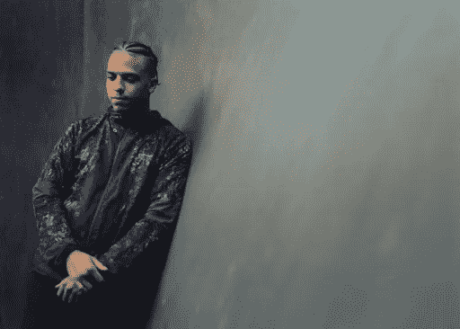
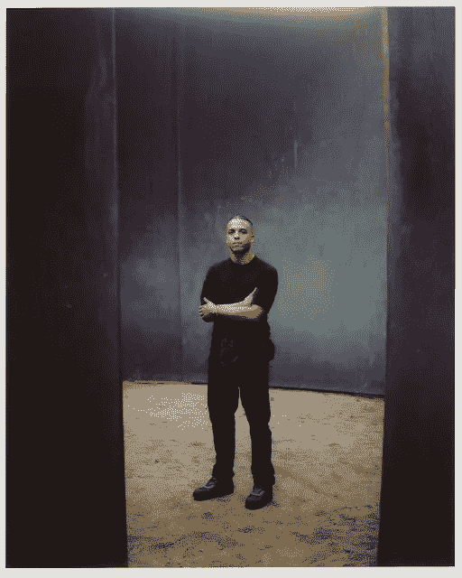
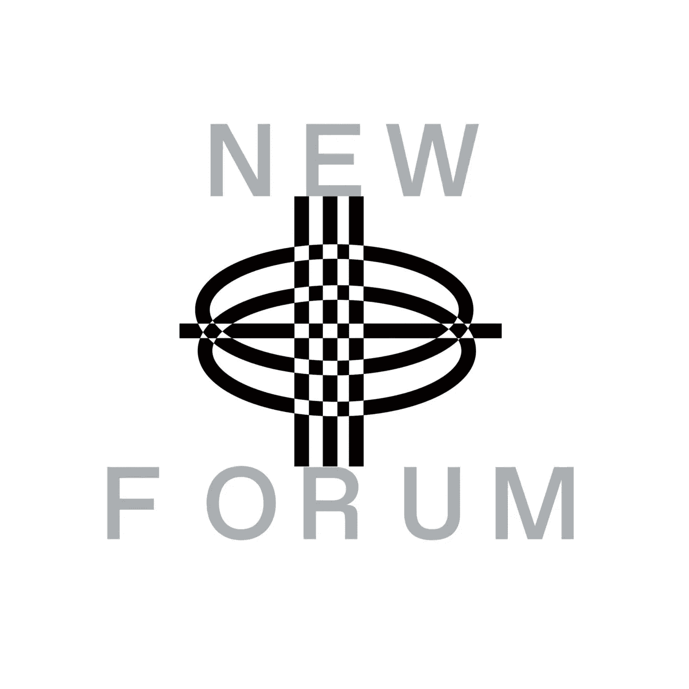

# 区块链和智能合约为设计师和创作者赋能

> 原文：<https://medium.com/coinmonks/blockchain-and-smart-contract-empowers-designers-creators-88655a2aa32f?source=collection_archive---------45----------------------->

在《新论坛》的这一集里，我们有一位超级酷又有创造力的设计师，杰里米·卡尔。他是一位经验丰富的设计师，在时尚行业工作超过十年，擅长设计、概念研究和艺术指导。他的重点是技术服装，有着不同的背景，与耐克、迈瑞、万斯、路易威登等品牌合作。杰里米还创作了他的服装刀，名为 HibiscusDAO，他在他的完整采访中剖析了这一点。

我们的社区很想知道杰里米是如何开始他的时尚生涯，并作为一名设计师创造出如此独特的风格？杰里米大约 15 年前从零售业起家。他与零售业内的人建立了联系，不知何故，他发现自己深深地融入了 Tumblr 等论坛社区。后来，他创办了一家科技运动服装公司 Tumblr。

> “13 年前，这让我在更多的艺术指导和创作指导方面找到了我的第一份工作。我做了一个传统的技术运动服学徒——你知道，在那里，我喜欢从蒙特利尔的两个老太太那里学习如何手工制作滑雪夹克和防水架子；这有点像我的基本技能……”—杰里米

杰里米分享说，这一切都是因为那些给他力量的人，让他在生命的早期就从事伟大的项目。他开始专注于技术运动装和普通运动装。

> “因为长寿，对我来说，就像不管发生什么事情，天总是会下雨，有些国家总是会很冷，你需要保护自己免受周围环境的影响；所以，让我们确保它既好看又容易穿……”——杰里米

观看他的完整集，听杰里米分享更多关于他的背景:影响，灵感，以及他对运动装和技术服装的兴趣背后的原因。

Jeremy 表示，Web3，Blockchain 为出处提供了工具，这对于作为设计师的他来说，甚至对于在网上建立时尚档案的艺术总监来说，都是令人兴奋的——创造出处的情绪板和博客。

> “我认为我们的方法需要转变；智能合约和区块链的纯度和可靠性，有出处，如果实施，适当的再分配…这些合约是如此错综复杂；经过良好测试的可以是不可改变的……”—Jeremy

Jeremy 分享说，区块链和智能合约允许无限的协作和对创作者的价值。然而，真正的创意是有限的；目前在 Web3 中熟悉区块链的艺术家、设计师。从艺术和设计的角度来看，缺乏多样性、技能和知识促使杰里米积极主动地付出几乎 100%的时间来试图理解和找出如何弥合这一空间差距。

> “如果区块链是为了解放创作者，适当的利润再分配，艺术品的出处？为什么这些数百万，数十亿美元的协议只是在一个使用这些被剥夺权利的社区的奴隶劳动力的特许经营中做三美元的 t 恤？…”—杰里米

观看完整集，听 Jeremy 在 Web3 中讨论他作为设计师的旅程和经历，时尚的可持续性，以及区块链和智能合同如何影响时尚产业在生产、再分配和工艺方面的发展。

[加入社区](https://twitter.com/newforum_nco)了解 [@jeremykarl](https://www.instagram.com/jeremykarl/) 并发现 web3 社区中的其他创作者！

跟着杰里米·卡尔！Instagram: [@jeremykarl](https://www.instagram.com/jeremykarl/) 推特: [@techspec_](https://twitter.com/techspec_) 网站:[jeremykarl.com](https://www.jeremykarl.com/work)

[# web 3](https://www.linkedin.com/feed/hashtag/?keywords=web3&highlightedUpdateUrns=urn%3Ali%3Aactivity%3A6895027524963753984)[# social 3](https://www.linkedin.com/feed/hashtag/?keywords=social3&highlightedUpdateUrns=urn%3Ali%3Aactivity%3A6895027524963753984)[#](https://www.linkedin.com/feed/hashtag/?keywords=crypto&highlightedUpdateUrns=urn%3Ali%3Aactivity%3A6895027524963753984)区块链# smart contracts # daos # nfts # creatoreconomy #社区

爱 x 新论坛

# Twitter @newforum_nco

不和谐[@加入](https://discord.gg/DHepA4WTkN)

# 新论坛

[NEWFORUM](https://newforum.notion.site/newforum/Welcome-to-NEWFORUM-48f9661398ec4ec6a1af37fcc96dc926) 由 [Newcoin Foundation](https://newcoin.org/) 提供支持，专注于促进去中心化社交应用的扩展，也被称为 Social 3.0，形成一个生态系统和一个由远见者、创造者和投资者组成的社区。它为思想者提供了一个安全的交流、传播和分享思想的空间，以确保一个新网络的自觉和道德发展，嵌入关怀、自由和创造力的价值观。✨每周新集！在 [Twitter](https://twitter.com/newforum_nco) 、 [Newlife](https://newlife.io/) 、 [Youtube](https://www.youtube.com/channel/UCWvHyau1nIJBffmaaj6FmbQ) 和 [LinkedIn](https://www.linkedin.com/showcase/newforum/) 上关注我们，了解 web3 的更多信息，认识生态系统！加入生态系统[不和](https://discord.gg/DHepA4WTkN)！

> 加入 Coinmonks [电报频道](https://t.me/coincodecap)和 [Youtube 频道](https://www.youtube.com/c/coinmonks/videos)了解加密交易和投资

# 另外，阅读

*   [最好的卡达诺钱包](https://coincodecap.com/best-cardano-wallets) | [Bingbon 副本交易](https://coincodecap.com/bingbon-copy-trading)
*   [印度最佳 P2P 加密交易所](https://coincodecap.com/p2p-crypto-exchanges-in-india) | [柴犬钱包](https://coincodecap.com/baby-shiba-inu-wallets)
*   [八大加密附属计划](https://coincodecap.com/crypto-affiliate-programs) | [eToro vs 比特币基地](https://coincodecap.com/etoro-vs-coinbase)
*   [最佳以太坊钱包](https://coincodecap.com/best-ethereum-wallets) | [电报上的加密货币机器人](https://coincodecap.com/telegram-crypto-bots)
*   [交易杠杆代币的最佳交易所](https://coincodecap.com/leveraged-token-exchanges) | [购买弗洛基](https://coincodecap.com/buy-floki-inu-token)
*   [3 commas vs Pionex vs Cryptohopper](https://coincodecap.com/3commas-vs-pionex-vs-cryptohopper)|[Bingbon Review](https://coincodecap.com/bingbon-review)