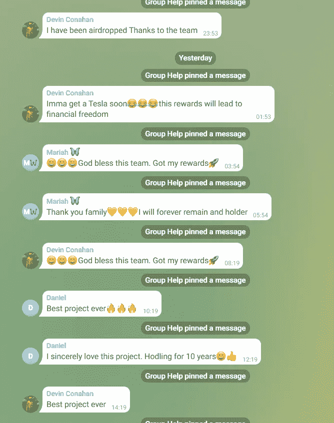

# 区块链和社交 bot 营销和开发

> 原文：<https://medium.com/coinmonks/blockchain-and-social-bot-marketing-and-developing-c6939dca5e1a?source=collection_archive---------16----------------------->

我开发了很多加密货币机器人和社交机器人。

许多客户正在使用这些机器人进行营销和交易。

Get money from cryptocurrency bots and social bot

这些是我的机器人，被很多客户开发和使用

*   电报机器人可以每小时或特定时间向群组发送消息
*   电报和不和谐中的大众 dm 机器人
*   BSC 和 ETH 中的狙击机器人
*   BSC 和 ETH 中的清扫机器人
*   BSC 和 ETH 中的前端运行 bot
*   套利机器人和闪贷套利机器人
*   电报和不和的博比机器人

**电报机器人，可以每小时或特定时间向群组发送消息**

@wonderlandmoney_en

这是我客户的一个小组。

These are messages that the bot made

正如你所看到的，机器人制作了这个消息，这样用户就可以认为这个群体没有死亡。

**群发 dm bot 在电报和不和谐**

这个机器人将所有的用户加入到特殊的组中，并以电报和传真的方式向所有的用户发送消息。

**BSC 和 ETH 中的狙击机器人**

很多人都会知道什么是狙击机器人。

让我简单解释一下。

如果有人购买代币，代币价格就会上涨，如果有人出售代币，代币价格就会下跌。

所以当代币午餐时，很多人会买代币。

所以象征性的价格会提高很多。

如果我先买一个代币，那么我可以用很低的价格买一个代币。

几分钟后我会卖代币。

然后我可以在几分钟内赚很多钱。

这是一个狙击机器人。

**BSC 和 ETH 中的清扫机器人**

我将为我的有一些令牌的钱包共享我的私人密钥。

然后很多人会存埃索或 BNB 来提取代币。

那时我会自动将 ETH 或 BNB 转移到另一个钱包中。

这是一个清扫机器人。

**BSC 和 ETH 中的前端运行 bot**

跑在前面的机器人类似于狙击机器人。

狙击机器人将等到用户为新令牌添加流动性的时候，但在前置运行中，机器人将等待一个大的掉期交易。

因此，在机器人检测到大额掉期交易之前，如果它检测到大额掉期交易，它将进行同样的掉期交易，并以高额汽油费出售交易。

然后机器人会以比用户更便宜的价格购买代币，再以高价卖出。

因为我们在用户购买代币后进行出售交易。

那么机器人在一个街区就能赚很多钱。

**套利机器人和闪贷套利机器人**

想象一下，Uniswap 的价格是 2000 戴，Sushiswap 的价格是 1900 戴。

如果我们在 uniswap 中把 eth 换成 dai，在 Sushiswap 中又把 dai 换成 eth，那么我们将获得利润。

如果我们存越来越多的钱，我们就能获得越来越多的利润。

但不是每个人都有越来越多的就业机会。

但幸运的是，AAVE 提供了让用户借用 eth 的服务。

以我的经验来看，收费大概是 0.6%。

因此，如果用户借 1000 Eth，那么我们应该一次性支付 1006 Eth。

这是一个闪贷套利机器人。

我开发了 ETH 和 BSC 套利和 Flashloan 套利 bot。

正如你所看到的，我开发了许多社交和加密货币机器人。

请跟我来，一旦有人需要开发一个机器人或使用当前我的机器人。

跟我来。
电报:@trust0205
邮件:【smartdevpro001@gmail.com】T2Skype:live:. cid . ffe8d 0454926464 f
Github:[https://github.com/](https://github.com/SmartDev-0205)smart dev-0205

> 加入 Coinmonks [电报频道](https://t.me/coincodecap)和 [Youtube 频道](https://www.youtube.com/c/coinmonks/videos)了解加密交易和投资

# 另外，阅读

*   [最佳以太坊钱包](https://coincodecap.com/best-ethereum-wallets) | [电报上的加密货币机器人](https://coincodecap.com/telegram-crypto-bots)
*   [交易杠杆代币的最佳交易所](https://coincodecap.com/leveraged-token-exchanges) | [购买 Floki](https://coincodecap.com/buy-floki-inu-token)
*   [3Commas 对 Pionex 对 Cryptohopper](https://coincodecap.com/3commas-vs-pionex-vs-cryptohopper) | [Bingbon 评论](https://coincodecap.com/bingbon-review)
*   [加密复制交易平台](/coinmonks/top-10-crypto-copy-trading-platforms-for-beginners-d0c37c7d698c) | [如何在 WazirX 上购买比特币](/coinmonks/buy-bitcoin-on-wazirx-2d12b7989af1)
*   [硬币评论](https://coincodecap.com/coinloan-review)|[Crypto.com 评论](/coinmonks/crypto-com-review-f143dca1f74c)
*   [如何在加拿大购买加密货币？](https://coincodecap.com/how-to-buy-cryptocurrency-in-canada)