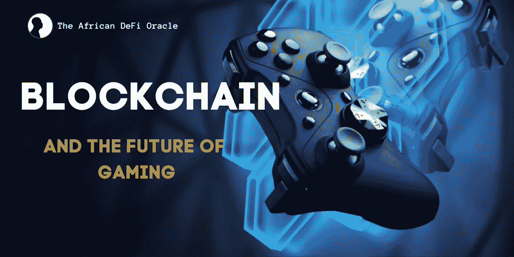

# 区块链和游戏的未来

> 原文：<https://medium.com/coinmonks/blockchain-and-the-future-of-gaming-7f839dbc5e1e?source=collection_archive---------43----------------------->

近年来，区块链技术在其应用领域出现了爆炸式增长，在多个行业引发了一场革命和颠覆。然而，区块链有着广泛的应用，其影响正变得如此普遍，以至于超出了加密货币的范围。

今天，看看这项新技术的出现所带来的好处。区块链技术正在被部署到供应链、医疗保健、金融和交通领域。目前，在线游戏行业也受到影响，因为它现在将区块链纳入其运营。这意味着这项技术将改变未来开发、管理和玩游戏的方式。

## **博彩业概述**

从它卑微的开始，游戏产业已经走了很长的路。为了了解这个行业随着时间的推移取得了多大的进步，回顾过去是至关重要的。如果你曾经在 16 位游戏机上玩过游戏，你会体会到游戏产业发展到现在的程度。

在过去的几年里，博彩业飞速发展。据专家称，到 2025 年，全球视频游戏业务将达到 2688 亿美元的庞大规模。

## **区块链如何与游戏合作**

区块链技术的全部意义在于建立一个分散的系统，在这个系统中没有任何一个权力机构拥有控制权。更确切地说，权力是由用户分享的。在区块链的游戏中，没有中央权威机构控制游戏。另一方面，用户拥有游戏的一部分，例如数字资产和游戏中的对象。

## **区块链给游戏带来的好处**

去中心化、不变性、透明性和更好的安全性都是区块链技术的特征。这些特性改变了这项技术应用的各个领域。那么，区块链是如何影响游戏格局的？

**分权**

一般来说，游戏是集中的系统，所有的资产、历史、数据和游戏币都保留在原来的游戏中。本质上，所有的产权都属于游戏开发商。然而，随着区块链进入博彩业，这种情况正在改变。因为区块链把去中心化带到了台面上，所以特别适用于资产交换。在分散式游戏中，在一个游戏中获得或购买的物品可以在另一个游戏中出售和使用。智能合约就是用来实现这一点的。当满足预定条件时，例如购买资产或实现目标，数字资产的所有权立即移交给玩家。

区块链也使不可变交易成为可能。这意味着玩家的购买和资产所有权信息不能被更改、更新或删除。

**增强的安全性**

区块链技术为游戏行业增加了安全性。区块链使用的数据加密机制，以及它的分散性，使它成为黑客的一个具有挑战性的目标。因此，比特币对游戏供应商和开发商来说更加安全，从而提高了生产率。网络罪犯不可能搞垮分散的区块链网络，因为没有可攻击的服务器。

此外，区块链技术为用户增加了一层额外的保护，因为比特币数字账本记录了所有交易。这通过防止非法数字货币交易，降低了支付重复和黑客攻击的风险。它还降低了退款欺诈的可能性，因为加密交易一旦授权就不可逆转。这有助于防止欺诈、账户操纵和其他非法挪用。

## **游戏内资产的所有权**

随着区块链技术引入游戏领域，传统游戏中的一个关键问题得到了解决。由于参与了区块链游戏，游戏玩家现在对他们获得的数字资产拥有完全的控制权。以前，即使玩家在传统游戏中为他们的数字资产支付了真金白银，如果服务器出现任何问题，他们也将无法访问这些资产。由于传统游戏的集中性质，金钱和游戏资产都将在开发者的控制之下。相比之下，区块链游戏的玩家保留了对其数字资产的完全控制权，允许他们与其他游戏玩家自由交易，兑换真实的金钱，甚至在其他游戏世界中使用它们。

例如，在游戏区块链上，你拥有特定数量的被称为 NFT 的数字资产，就像你在加密货币区块链上拥有一定数量的比特币和以太坊等加密货币一样。这些是游戏物品，但它们和加密货币一样属于你，它们不仅可以转移到钱包里，甚至可以转移到游戏之外。

## **开发商的新视野**

将区块链技术引入游戏行业为全世界的开发者打开了新的可能性。例如，假设你是一个有天赋的开发人员，他有一个关于游戏应用程序的好主意，但是之前没有游戏行业的经验。在获得游戏公司的理想职位之前，你可能需要等待一段时间来实现你的绝妙想法。由于游戏行业的竞争性质，集中式游戏组织重视体验。拥有游戏行业专业知识的申请者通常是最受青睐的候选人。

然而，你可以学习设计一个 DApp 游戏，并且有许多资源可以帮助你开发你自己的 DApp 游戏。各种区块链初创公司都有用于设计区块链游戏的 SDK。织机网络就是这样一个例子。区块链游戏是开源的，可以访问类似游戏的代码进行指导。开源代码还允许您从基础代码开始，因此您可能不必从头开始。

## **结束语**

区块链科技对网络游戏的变革才刚刚开始。我们仍处于这场革命的萌芽阶段。随着时间的推移，我们将最终掌握区块链技术如何彻底改变了游戏产业。然而，有一件事是不可避免的，那就是这项技术将把游戏带到一个全新的水平。

> 加入 Coinmonks [电报频道](https://t.me/coincodecap)和 [Youtube 频道](https://www.youtube.com/c/coinmonks/videos)了解加密交易和投资

# 另外，阅读

*   [OKEx vs KuCoin](https://coincodecap.com/okex-kucoin) | [摄氏替代品](https://coincodecap.com/celsius-alternatives) | [如何购买 VeChain](https://coincodecap.com/buy-vechain)
*   [币安期货交易](https://coincodecap.com/binance-futures-trading)|[3 comas vs Mudrex vs eToro](https://coincodecap.com/mudrex-3commas-etoro)
*   [如何购买 Monero](https://coincodecap.com/buy-monero) | [IDEX 评论](https://coincodecap.com/idex-review) | [BitKan 交易机器人](https://coincodecap.com/bitkan-trading-bot)
*   [CoinDCX 评论](/coinmonks/coindcx-review-8444db3621a2) | [加密保证金交易交易所](https://coincodecap.com/crypto-margin-trading-exchanges)
*   [红狗赌场评论](https://coincodecap.com/red-dog-casino-review) | [Swyftx 评论](https://coincodecap.com/swyftx-review) | [CoinGate 评论](https://coincodecap.com/coingate-review)
*   [Bookmap 点评](https://coincodecap.com/bookmap-review-2021-best-trading-software) | [美国 5 大最佳加密交易所](https://coincodecap.com/crypto-exchange-usa)
*   [如何在 FTX 交易所交易期货](https://coincodecap.com/ftx-futures-trading) | [OKEx vs 币安](https://coincodecap.com/okex-vs-binance)
*   [CoinLoan 评论](https://coincodecap.com/coinloan-review) | [YouHodler 评论](/coinmonks/youhodler-4-easy-ways-to-make-money-98969b9689f2) | [BlockFi 评论](https://coincodecap.com/blockfi-review)
*   [XT.COM 评论](https://coincodecap.com/profittradingapp-for-binance)币安评论 |
*   [SmithBot 评论](https://coincodecap.com/smithbot-review) | [4 款最佳免费开源交易机器人](https://coincodecap.com/free-open-source-trading-bots)
*   [比特币基地僵尸程序](/coinmonks/coinbase-bots-ac6359e897f3) | [AscendEX 审查](/coinmonks/ascendex-review-53e829cf75fa) | [OKEx 交易僵尸程序](/coinmonks/okex-trading-bots-234920f61e60)