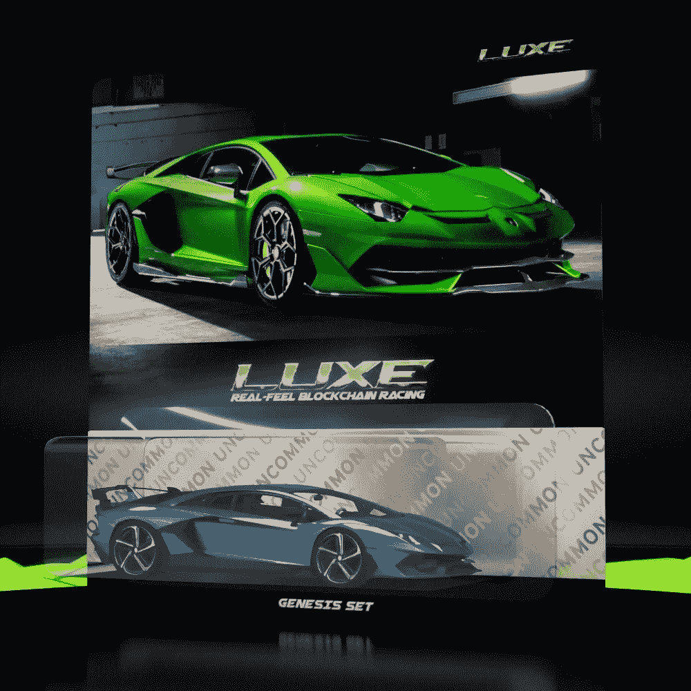
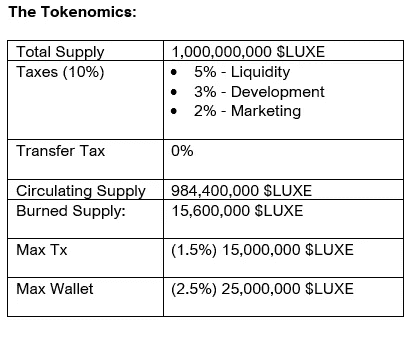
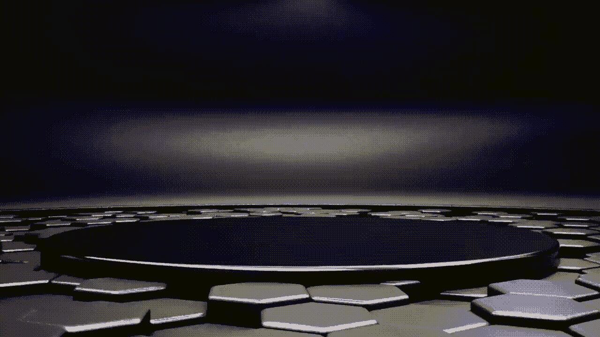
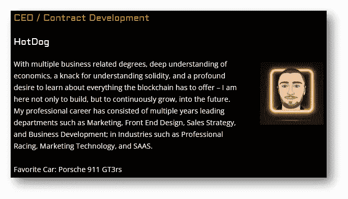
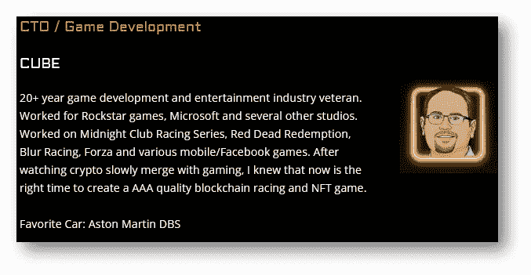
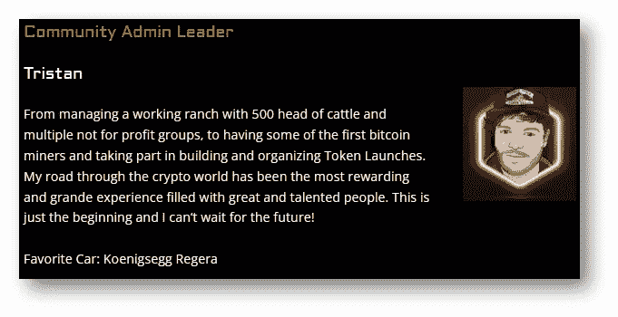
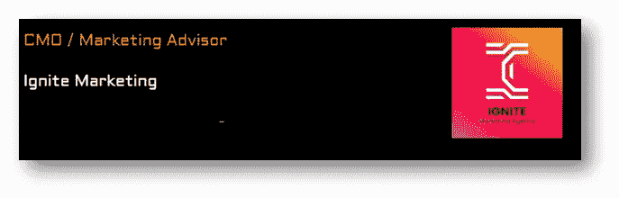

# 区块链和游戏的未来:LuxeMeta 一瞥

> 原文：<https://medium.com/coinmonks/blockchain-and-the-future-of-gaming-a-sneak-peek-at-luxeracing-775cb6d26702?source=collection_archive---------15----------------------->

LuxeRacing — a revolutionary GamiFi-NFT racing experience built on top of blockchain

***区块链将把游戏产业推向新的高度。***

我最近在[的 Cointelegraph](https://cointelegraph.com/news/5-reasons-why-blockchain-based-gaming-economies-are-the-future) 和 [CoinDesk](https://www.coindesk.com/sponsored-content/three-dominant-trends-in-the-future-of-blockchain-gaming/) 上读到了几篇关于几个游戏开发者如何利用区块链构建高端游戏体验的文章。我相信这种趋势不会很快停止——只要区块链技术存在并继续发展。

最有可能的是，玩赚游戏将最受欢迎，因为游戏玩家可以通过游戏中基于价值的进步赢得自己独特的 NFT 或加密货币，然后他们可以选择将其转换为实际货币。

令人欣慰的是，几个 GameFi 项目已经在这个领域站稳了脚跟，有助于提高市场资本。而 [LuxeMeta](https://luxeracing.tech/) 可能会成为密码游戏的下一个巨大成功。

# 一瞥奢华的生态系统

对于一个像 [Luxe](https://luxeracing.tech/) Meta 这样的项目，开发者正在推动数字游戏赛车体验到一个新的水平。这个想法是在众多高质量的数字环境中创造一个真实的赛车游戏。

游戏玩家可以拥有他们的游戏就绪的 NFT 超级跑车，以现实生活中的高速汽车恶魔为模型，包括兰博基尼 Aventador，保时捷 GT3 RS，科尼赛克 Gemara，Ferarri 488 Pista 和 AMG GT。

你可以真切地听到汽车引擎的轰鸣声，感受到汽车内部的美学设计，看到外部零件闪亮的光泽和色彩，并吸入构成汽车内部的有机化合物的宜人气味。

# 令牌效用和令牌组学

$LUXE token 是 LuxeMeta 的定制加密货币，将作为生态系统的主要货币以多种方式使用。具体来说，令牌工具将包括游戏内消费，NFT 定制，和种族投注。

**记号组学:**

$Luxe Token Economics

# 为什么 LuxeMeta 是一个值得关注的项目

# #1 —工作产品

LuxeMeta 为所有游戏玩家提供革命性的 NFT-GameFi 赛车体验。这是同类游戏中的第一款——利用虚幻引擎和区块链技术的虚拟赛车环境。

**下载**[**LuxeMeta Beta**](https://drive.google.com/file/d/1C8D9-kkrkAb-oFguad5zw3mPg2uvHq0P/view)

# #2 —豪华 NFTs

豪华 NFT 是该项目的最令人兴奋的方面之一，尤其是考虑到它带来的效用以及它将如何影响整个游戏体验。

**面向玩家和投资者的奢华 NFT 实用工具:**

***—汽车升级***

有了 NFT，您可以完全定制您的汽车，您可以选择添加性能升级，以保持您的汽车在最佳位置。

***—种族***

NFT 将允许玩家进入真实感受的比赛环境，这将允许他们在众多高质量的虚拟环境中参与各种比赛模式。

***—交易***

既然你拥有它，你可能会想用你的 NFT 换些特别的东西。

***—下注***

想用你的 NFT 赚钱吗？打赌吧。

***—租金***

没有特定 NFT，但想在有限时间内使用它的玩家可以租借它。贷方将通过出租获得被动收入。

**豪华 NFT 预览版:沙滩公寓**

**豪华 NFT 铸币厂**

创世纪造币厂计划于 2022 年 3 月 21 日在官方推特账户上宣布。

根据 LuxeMeta 网站，你可以直接在 [dApp](https://luxeracing.tech/) 上购买 NFTs(待定发布时间:2022 年 3 月 20 日)

除了用 BNB 铸造的限量版 NFT 外，NFT 都是用$LUXE 代币铸造的。

此外，创世纪 NFTs 将有五款游戏就绪的 NFT 超级跑车，模仿兰博基尼 Aventador、保时捷 GT3 RS、科尼赛克 Gemara、Ferarri 488 Pista 和 AMG GT

# #3 —赌注池

您可以通过下注您的$Luxe token 赚取被动收入。赌注池在[TheSphynx.co](https://thesphynx.co/pools/56)开放并直播

**打桩细节如下:**

*   10，000，000 美元的最高赌注
*   至少 30 天锁定
*   人工合成
*   10%的提前支取费用

# #4 —团队

LuxeMeta 团队由专业游戏开发人员和区块链爱好者组成，他们在多个行业拥有丰富的经验。这使得该项目成为精心开发、真正的技术创新和大众市场的产品。

**认识核心团队成员:**

HotDog — CEO/Contract Developer

CUBE — Game Developer

Tristan — Community Admin Leader

CMO — Marketing Advisor

除了核心团队，Luxe 还有许多其他成员努力支持这个项目。

# 最后一点

一般来说，大多数区块链游戏项目刚刚开始获得主流采用，仍然处于早期阶段。即便如此，2022 年对 GameFi 来说也将是重要的一年，特别是随着准备支持和授权新兴 Web3 和 GameFi 项目的去中心化平台的兴起。

该计划旨在将最大数量的传统在线游戏玩家和游戏开发商引入区块链游戏产业。LuxeMeta 可能只是 NFT 游戏化的完美再现，引发了进一步的采用。

要了解更多关于 LuxeMeta 项目的信息，请关注他们的社交网站:

[推特](https://twitter.com/RacingLuxe) | [电报](https://t.me/LuxeRacing) | [不和](https://discord.gg/wCEZjdqM)|[YouTube](https://www.youtube.com/channel/UCeNGmSYaYptJQWg6cshItsQ)|[insta gram](https://www.instagram.com/LuxeRacing/)|[脸书](https://web.facebook.com/LuxeRacing/)

**免责声明:**

该内容的作者这样做只是为了提供信息。其目的不是作为财务、会计或法律建议。鼓励你对任何投资进行自己的研究，风险自负。

> 加入 Coinmonks [电报频道](https://t.me/coincodecap)和 [Youtube 频道](https://www.youtube.com/c/coinmonks/videos)了解加密交易和投资

# 另外，阅读

*   [3 商业评论](/coinmonks/3commas-review-an-excellent-crypto-trading-bot-2020-1313a58bec92) | [Pionex 评论](https://coincodecap.com/pionex-review-exchange-with-crypto-trading-bot) | [Coinrule 评论](/coinmonks/coinrule-review-2021-a-beginner-friendly-crypto-trading-bot-daf0504848ba)
*   [莱杰 vs n rave](/coinmonks/ledger-vs-ngrave-zero-7e40f0c1d694)|[莱杰 nano s vs x](/coinmonks/ledger-nano-s-vs-x-battery-hardware-price-storage-59a6663fe3b0) | [币安评论](/coinmonks/binance-review-ee10d3bf3b6e)
*   [Bybit Exchange 审查](/coinmonks/bybit-exchange-review-dbd570019b71) | [Bityard 审查](https://coincodecap.com/bityard-reivew) | [Jet-Bot 审查](https://coincodecap.com/jet-bot-review)
*   [3 commas vs crypto hopper](/coinmonks/3commas-vs-pionex-vs-cryptohopper-best-crypto-bot-6a98d2baa203)|[赚取加密利息](/coinmonks/earn-crypto-interest-b10b810fdda3)
*   最好的比特币[硬件钱包](/coinmonks/hardware-wallets-dfa1211730c6) | [BitBox02 回顾](/coinmonks/bitbox02-review-your-swiss-bitcoin-hardware-wallet-c36c88fff29)