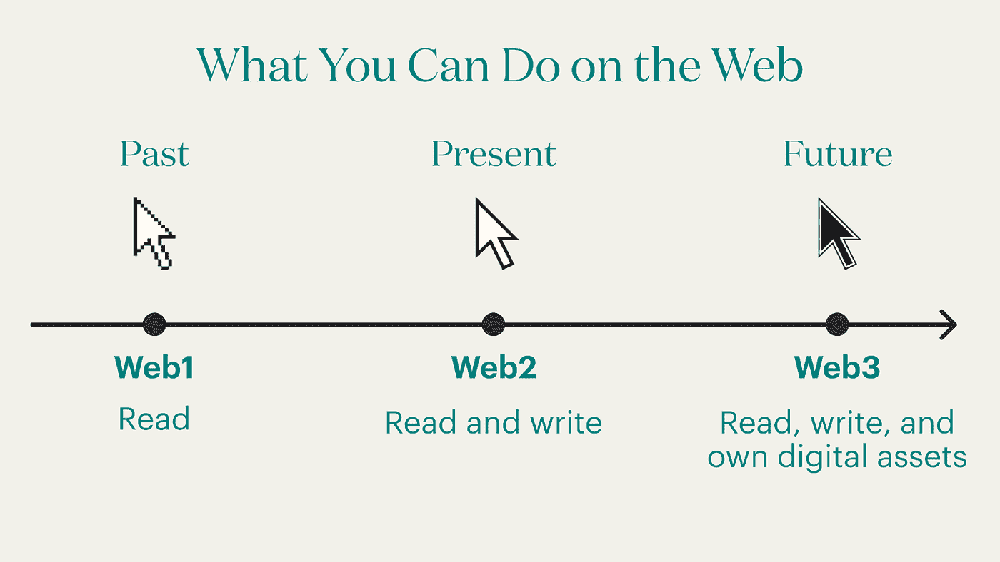

# 区块链和元宇宙是一个警示故事

> 原文：<https://medium.com/coinmonks/blockchain-and-the-metaverse-a-cautionary-tale-f21330aca1da?source=collection_archive---------47----------------------->

# 为什么“元宇宙”对加密技术的采用弊大于利。

*本帖是对《福布斯》杂志* [*肖恩·斯坦·史密斯*](https://www.forbes.com/sites/seansteinsmith/) *的《加密是元宇宙的钥匙》的回应。*

提到区块链，你会得到一种困惑的表情和对你接下来可能说的话充满敌意的猜测。最常见的情况是，人们会将区块链与其最受欢迎的应用(比特币)或元宇宙混为一谈。诸如“加密是元宇宙的关键”之类的文章只会扩大错误信息的差距，因为人们会阅读这些标题，并进一步将区块链与虚拟现实和扩展的数字现实的承诺联系起来。虽然这些都是值得思考的有趣概念，但缺乏能够简明扼要地解释区块链技术的产品倡导者是其采用的最大障碍之一。事实上，尽管我在 2016 年研究了比特币和区块链，作为我工作的一部分，但直到 2021 年，我才明白它可能给世界带来什么。此产品不是元宇宙。

让我们从建立一个基于区块链的互联网开始。区块链和它的潜力让我印象深刻的时刻之一是在看到这张图片之后:

Design: the Skimm | Photo: The Cold Wire

一开始并不直观，所以我列举了一些产品如何通过 web 1–3 转型的例子。让我们简单地谈谈钱，这是区块链最常提到的用例。

在 Web1 上，并没有真正的货币交换。您可以阅读您的银行对账单或指令来完成资金转账，但很大程度上，服务器只有信息，您可以阅读这些信息。这是 web1，读取存储在服务器中的信息。

Web2 允许你在互联网上写作。大多数人对这实际上是如何工作的有误解。他们认为 Venmo 只是把他们的钱寄给他们的朋友，但实际上一个中间人网络正在互动处理和监控你的活动。如果你去 Venmo 并点击发送，实际发生的是你正在向互联网写执行一个动作。一个中间人，比如 Venmo、您的银行、朋友的银行，以及其他潜在的人，然后被 pinged 来执行该动作并传达状态的改变。虽然这看起来不错，但它会产生问题。安全和控制交易的能力在于中间人。虽然一般来说，信任像 Venmo 或 Paypal 这样由美国支持和监管的实体是安全的，但这并不理想。他们可以控制资金流动的速度，并获得敏感数据。当想到中间商可能是掠夺性的或监管较少的其他行业时，或者在某些政府不能总是被信任来监管和控制准入的世界经济中，这个简单的例子可能会变得更加令人担忧。

现在我们来谈谈 Web3。如果你不只是写命令，而是真的拥有交易所，会怎么样？一个完美跟踪交易并奖励公平竞争的系统，保持数字资产的数字化并消除中间商。这是区块链的承诺。您可以拥有自己的数据，并通过区块链总账代表 exchange。政府和中央当局的作用将会减少，互联网将会兑现民主化和权力下放的最初承诺。这就是区块链，这不是一个新世界，这只是我们一直想要的世界。这是通过分散的服务器来实现的，这些服务器在数据无缝地从一个对等点转移到另一个对等点时保证数据的安全。

这是元宇宙吗？不完全是。虽然越来越多的人在网上工作、娱乐和学习，但这并不意味着我们处于元宇宙，也不意味着区块链创造了元宇宙。事实上，为了所有人的利益，我希望区块链能通过加快交易速度、降低科技公司在我们生活中的角色来减少在线时间，尽管这种可能性不大。事实是区块链很无聊，这才是重点。不是第二次生命，也不是新的现实。这只是一种更高效、更安全的网上交易方式。通过区块链与元宇宙并不协调，我们应该停止这样做。“第二人生”旨在取代生命，区块链致力于取代中央数据库。

这是否意味着我们不应该对区块链感到兴奋？一点也不。招聘、金融和艺术等行业将永远改变，因为创作者可以直接接触消费者，交易的完整记录现在将公开。这是一个用户赋权的变革时代，它始于区块链。

> 加入 Coinmonks [电报频道](https://t.me/coincodecap)和 [Youtube 频道](https://www.youtube.com/c/coinmonks/videos)了解加密交易和投资

# 另外，阅读

*   [3 商业评论](/coinmonks/3commas-review-an-excellent-crypto-trading-bot-2020-1313a58bec92) | [Pionex 评论](https://coincodecap.com/pionex-review-exchange-with-crypto-trading-bot) | [Coinrule 评论](/coinmonks/coinrule-review-2021-a-beginner-friendly-crypto-trading-bot-daf0504848ba)
*   [莱杰 vs n rave](/coinmonks/ledger-vs-ngrave-zero-7e40f0c1d694)|[莱杰 nano s vs x](/coinmonks/ledger-nano-s-vs-x-battery-hardware-price-storage-59a6663fe3b0) | [币安评论](/coinmonks/binance-review-ee10d3bf3b6e)
*   [Bybit 交易所评论](/coinmonks/bybit-exchange-review-dbd570019b71) | [Bityard 评论](https://coincodecap.com/bityard-reivew) | [Jet-Bot 评论](https://coincodecap.com/jet-bot-review)
*   [3 commas vs crypto hopper](/coinmonks/3commas-vs-pionex-vs-cryptohopper-best-crypto-bot-6a98d2baa203)|[赚取加密利息](/coinmonks/earn-crypto-interest-b10b810fdda3)
*   最好的比特币[硬件钱包](/coinmonks/hardware-wallets-dfa1211730c6) | [BitBox02 回顾](/coinmonks/bitbox02-review-your-swiss-bitcoin-hardware-wallet-c36c88fff29)
*   [block fi vs Celsius](/coinmonks/blockfi-vs-celsius-vs-hodlnaut-8a1cc8c26630)|[Hodlnaut 审核](/coinmonks/hodlnaut-review-best-way-to-hodl-is-to-earn-interest-on-your-bitcoin-6658a8c19edf) | [KuCoin 审核](https://coincodecap.com/kucoin-review)
*   [Bitsgap 审查](/coinmonks/bitsgap-review-a-crypto-trading-bot-that-makes-easy-money-a5d88a336df2) | [Quadency 审查](/coinmonks/quadency-review-a-crypto-trading-automation-platform-3068eaa374e1) | [Bitbns 审查](/coinmonks/bitbns-review-38256a07e161)
*   [加密复制交易平台](/coinmonks/top-10-crypto-copy-trading-platforms-for-beginners-d0c37c7d698c) | [Coinmama 评论](/coinmonks/coinmama-review-ace5641bde6e)